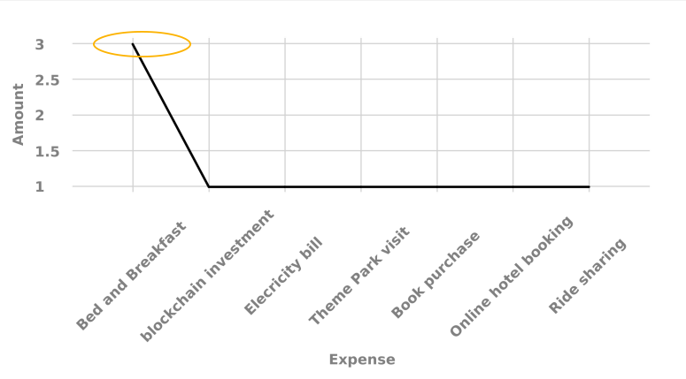

# Interactive Communications에서 차트 사용 {#using-charts-in-interactive-communications}

인터랙티브한 커뮤니케이션의 차트를 사용하면 대량의 정보를 손쉽게 분석하고 이해할 수 있는 시각적 포맷으로 통합할 수 있습니다

차트나 그래프는 데이터를 시각적으로 나타냅니다. 이는 대량의 정보를 이해하기 쉬운 시각적 형식으로 요약하여, 인터랙티브 커뮤니케이션의 수신자가 복잡한 데이터를 보다 시각화, 해석 및 분석할 수 있도록 합니다.

대화형 통신을 만드는 동안 차트를 추가하여 Interactive Communication의 양식 데이터 모델에서 2차원 데이터를 시각적으로 나타낼 수 있습니다. 차트 구성 요소를 사용하면 다음 유형의 차트를 추가하고 구성할 수 있습니다.

* 파이
* 열
* 도넛
* 막대(웹 채널만 해당)
* Line
* 선 및 점
* 점
* 영역

## 대화형 통신에서 차트 추가 및 구성 {#add-and-configure-chart-in-an-interactive-communication}

대화형 통신에 차트를 추가하려면 다음 단계를 완료하십시오.

1. AEM 세로 막대의 구성 요소에서, 다음 대화형 통신 인쇄 또는 웹 채널 중 하나에 차트 구성 요소를 드래그하여 놓습니다.

   * 인쇄 채널:대상 영역 및 이미지 필드
   * 웹 채널:패널 및 대상 영역
   드롭된 차트 구성 요소는 차트에 대한 자리 표시자를 만듭니다.

1. Interactive Communication Editor에서 차트 구성 요소를 탭하고 구성 요소 도구 모음에서 구성( **** configure_icon )을 선택합니다.

   속성 사이드바가 포커스가 있는 차트의 기본 속성과 함께 나타납니다.

   
   **** 그림:인쇄 *채널에서 라인 유형 차트의 기본 속성*

   
   **** 그림:웹 *채널의 라인 유형 차트의 기본 속성*

1. 인쇄 채널 및 웹 채널에 대한 차트의 기본 속성을 구성합니다. 일반적인 속성 외에도 인쇄 및 웹 채널과 차트 유형에 해당하는 속성이 있습니다.

   * **[!UICONTROL 이름]**:차트 개체의 이름입니다. 여기에서 지정하는 차트의 이름은 차트 출력에 표시되지 않지만 규칙을 사용하여 차트를 참조합니다.
   * **[!UICONTROL 차트 유형]**:차트 유형을 지정합니다.파이, 열, 도넛, 선, 선 및 점, 점 또는 영역.
   * **[!UICONTROL 개체 숨기기]**:최종 출력에서 차트를 숨기려면 선택합니다.
   * **[!UICONTROL x축]** 및 **[!UICONTROL y축에]**&#x200B;대해 다음을 지정합니다.

      * **[!UICONTROL 제목]**:대화형 통신에 표시할 X축과 Y축에 대한 제목을 지정합니다.
      * **[!UICONTROL 데이터 모델 개체 *]**:대화형 통신을 생성하는 동안 지정된 양식 데이터 모델에서 차트의 X축과 Y축에 대한 데이터 모델 개체를 찾아 선택합니다. 차트의 X축과 Y축에서 플로팅할 수 있도록 서로 관련이 있는 동일한 상위 데이터 모델 개체의 두 개의 수집/배열 유형 속성을 선택합니다.
      * **[!UICONTROL 함수]**:통계 함수를 사용하여 축에서 값을 계산하려면 X/Y축에 대한 함수를 선택합니다. 함수에 대한 자세한 내용은 차트에 [함수](#usefunction) 사용 및 [예제 2를 참조하십시오.라인 차트에](#applicationsumfrequency)합계 및 평균 함수 적용
   >[!NOTE]
   >
   >인쇄 채널의 경우 X축에서 바인딩하는 데이터 모델 개체는 Number, String 또는 Date 유형이어야 합니다. Y축에서 바인딩하는 데이터 모델 개체는 숫자 유형이어야 합니다. 인쇄 채널에서 오른쪽 범례를 사용하는 것이 좋습니다.

   차트 속성에 대한 자세한 내용은 차트의 [기본 속성을 참조하십시오](#basicpropertiescharts).

1. (인쇄 채널만 해당) 에이전트 설정에서 에이전트가 이 차트를 반드시 사용해야 하는지 여부를 지정합니다. [에이전트가 이 차트 사용 필수] **** 옵션을 선택하지 않으면 에이전트가 에이전트 UI의 [콘텐트] 탭에서 차트에 대한 눈 아이콘을 눌러 차트를 표시하거나 숨길 수 있습니다.

   

1. 속성 사이드바에서 을 누릅니다.

   미리 보기를 통해 차트의 모양과 데이터를 볼 수 있습니다. 필요한 경우 차트의 속성을 다시 구성하려면 돌아갑니다.

1. 대화형 통신에서 다른 변경 작업으로 돌아갑니다.

## 예 1:인쇄 및 웹의 차트 출력 {#chartoutputprintweb}

기본 탭에서 차트 유형, 데이터가 들어 있는 소스 양식 데이터 모델 속성, 차트의 x축 및 y축에 플로팅할 레이블, 차트에서 플로팅할 값을 계산하는 통계적 함수를 정의합니다(선택 사항).

인터랙티브 커뮤니케이션을 사용하여 생성된 신용 카드 명세서의 도움을 받아 기본 속성에 필요한 최소 정보를 자세히 알아보겠습니다. 명세서에서 서로 다른 비용의 양을 설명하는 차트를 생성하려는 경우를 고려하십시오. 인터랙티브 커뮤니케이션의 인쇄 및 웹 출력을 위해 다양한 유형의 차트를 사용하려고 합니다.

이를 수행하려면 다음을 지정해야 합니다.

* **[!UICONTROL 차트]** 유형 - 이 예에서는 인쇄 채널의 열 및 웹 채널의 도넛
* **[!UICONTROL 데이터 모델]** 객체를 차트의 X축 및 Y축에 대한 소스로 사용 - 이 예에서는 X축에 대한 거래 금액 및 Y축에 대한 비용 이름
* **[!UICONTROL X축 및 Y축 제목]** (이 예에서만 인쇄 채널의 열 유형 차트의 경우) - 이 예에서는 X축에 대한 금액($) 및 Y축에 대한 비용
* **[!UICONTROL 레이블]** 방향(이 예제의 인쇄 채널에서만 열 유형 차트) - 이 예 `Tilt Left`

* **[!UICONTROL 비용]** 위에 마우스 포인터를 표시할 도구 설명(웹 채널만 해당) - 이 예에서는 비용 레이블로 `${x}: $ ${y}`[표시됩니다.$ 금액] (예:테마 파크 방문:$315)

 Interactive Communication의 인쇄 출력에 있는 열&#x200B;**차트**&#x200B;그림:대화형 *통신 인쇄 출력에 있는 열 차트*

******A.Y축 - 양식 데이터 모델 속성과 제목 속성이 금액($) B로 설정된 양입니다**.X축의 레이블 방향을 기울기 왼쪽 C **.** X축으로 설정 - 양식 데이터 모델 속성 및 제목 속성이 비용으로 설정된 비용 설명

 인터랙티브한 커뮤니케이션의 웹 출력에 도넛형&#x200B;**차트**&#x200B;그림:인터랙티브 *커뮤니케이션의 웹 출력 도넛 차트*

******A.도넛의 내부 반경 속성은 B로**&#x200B;설정됩니다.범례 표시 속성을 선택하고 범례 위치 속성이 오른쪽 C로 설정되어 **있습니다.** 도구 설명에 마우스 위에 있는 항목의 세부 사항이 표시됩니다. 도구 설명이 ${x}로 설정되어 있습니다.${y}

## 예 2:라인 차트의 합계 및 빈도 함수 적용 {#applicationsumfrequency}

차트에 함수를 적용하면 양식 데이터 모델에서 직접 제공하지 않는 데이터를 플롯할 수 있습니다. 이 예에서는 신용 카드 명세서 예를 사용하여 Sum 및 Frequency 함수를 차트에 적용할 수 있는 방법을 파악했습니다.

 3개의 &quot;Bed and Breakfast&quot; 트랜잭션을&#x200B;**포함한 기능이 없는 라인**&#x200B;차트 그림:&quot; *Bed and Breakfast&quot; 거래 세 개가 있는 기능 없는 라인 차트*

### Sum 함수 {#sum-function}

합계 함수를 적용하여 동일한 데이터 속성의 여러 인스턴스 값을 추가하고 한 번만 표시할 수 있습니다. 예를 들어 다음 그래프에서 Sum 함수는 Y축에 적용하여 3개의 Bed and Breakfast 트랜잭션($99.45, $78 및 $12)의 양을 추가하고 하나의 트랜잭션(US$189.45)만 표시합니다.

Sum 함수는 동일한 데이터 속성의 여러 인스턴스에 대해 합계를 모으고 표시하려는 경우 그래프를 보다 유용하게 만들 수 있습니다.


### 주파수 함수 {#frequency-function}

Frequency 함수는 X축이나 Y축에 있는 값의 수를 다른 축에 반환합니다. Y축(금액/TransAmount)에서 주파수 기능을 적용하면 Bed and Breakfast 트랜잭션과 나머지 거래 유형이 각각 3회 발생했음을 그래프로 표시합니다.



## 차트의 기본 속성 {#basicpropertiescharts}

기본 탭에서 다음 속성을 구성할 수 있습니다.

**이름** 차트 요소의 식별자입니다. 이름은 차트에는 표시되지 않지만 다른 구성 요소, 스크립트 및 SOM 표현식의 요소를 참조할 때 도움이 됩니다.

**제목(인쇄 채널만)** 차트의 제목을 지정합니다.

**차트 유형생성할 차트 유형을** 지정합니다. 사용 가능한 옵션은 파이, 열, 도넛, 막대(웹 채널만 해당), 선, 선 및 점, 영역입니다. 자세한 내용은 예제 1을 참조하십시오.인쇄 및 웹에서 차트 출력

**X축 > 제목** x축에 대한 제목을 지정합니다.

**** X축 > 데이터 모델 개체 앰프;ast;x축에 표시할 양식 데이터 모델 수집 항목의 이름을 지정합니다.

**X축 > 함수** x축에서 값을 계산하는 데 사용할 통계/사용자 지정 함수를 지정합니다. 함수에 대한 자세한 내용은 차트에 함수 사용 및 예제 2를 참조하십시오.라인 차트에 합계 및 평균 함수 적용

**X축 > 레이블** 방향 인쇄 채널의 차트에 있는 레이블의 방향입니다. 레이블의 방향을 [사용자 정의 회전]으로 선택하면 [사용자 정의 회전 각도(도)] 필드가 나타납니다. [사용자 정의 회전 각도(도)] 필드에서 15도 단위로 회전 각도를 선택할 수 있습니다.

**Y축 > 제목** y축의 제목을 지정합니다.

**** Y축 > 데이터 모델 개체 앰프;ast;y축에 표시할 양식 데이터 모델 수집 항목을 지정합니다. 인쇄 채널에서 Y축에 대한 데이터 모델 개체는 Number 유형이어야 합니다.

**Y축 > 함수** Y축에서 값을 계산하는 데 사용할 통계/사용자 지정 함수를 지정합니다. 함수에 대한 자세한 내용은 차트에 함수 사용 및 예제 2를 참조하십시오.라인 차트에 합계 및 평균 함수 적용

**범례** 표시 사용 시 파이 또는 도넛 차트에 대한 범례를 표시합니다.

**범례 위치** 차트에 대한 범례 위치를 지정합니다. 사용 가능한 옵션은 오른쪽, 왼쪽, 위쪽 및 아래입니다.

**높이(인쇄 채널만)** 차트의 픽셀 단위 높이입니다.

**너비(인쇄 채널만)** 차트의 픽셀 단위 폭입니다.

>[!NOTE]
>
>스타일 레이어를 사용하거나 테마를 적용하여 웹 채널에서 차트의 너비를 제어할 수 있습니다.

**도구 설명(웹 채널만)** 웹 채널의 차트에 있는 데이터 포인트에 마우스를 올려 놓을 때 도구 설명이 표시되는 형식을 지정합니다. 기본값은 \${x}(\${y})입니다. 차트 유형에 따라 차트의 포인트, 막대 또는 슬라이스에 마우스를 가리키면 변수 \${x} 및 \${y} 은(는) x축 및 y축에 해당하는 값으로 동적으로 대체되고 도구 설명에 표시됩니다.

도구 설명을 비활성화하려면 도구 설명 필드를 비워 둡니다. 이 옵션은 라인 및 영역 차트에 적용되지 않습니다. 예를 들어 예제 [1을 참조하십시오.인쇄 및 웹에서](#chartoutputprintweb)차트 출력

**CSS 클래스(웹 채널만 해당)** CSS 클래스 필드에서 CSS 클래스의 이름을 지정하여 차트에 사용자 정의 스타일을 적용합니다.

**필수 페이지 나누기(인쇄 채널만)** 차트 앞에 필수 페이지 나누기를 추가하고 새 페이지의 맨 위에 차트를 표시하려면 선택합니다.

**다음 이후에 필수 페이지 나누기(인쇄 채널만)** 차트 뒤에 필수 페이지 나누기를 추가하고 새 페이지의 맨 위에 차트 다음에 나오는 내용을 표시하려면 선택합니다.

**들여쓰기(인쇄 채널만)** 페이지 왼쪽에서 차트의 들여쓰기를 지정합니다.

**차트별 구성** 일반적인 구성 외에도 다음과 같은 차트별 구성을 사용할 수 있습니다.

* **내부 반경**:도넛형 차트에서 차트에서 내부 원의 반경(픽셀 단위)을 지정할 수 있습니다.
* **선 색상**:[선], [선] 및 [점] 및 [영역] 차트에서 차트의 선에 대한 색상의 16진수 값을 지정할 수 있습니다.
* **포인트 색상**:[점] 및 [선] 및 [점] 차트에서 차트의 포인트에 대한 색상의 16진수 값을 지정할 수 있습니다.

* **영역 색상**:영역 차트에서 차트의 선 아래 영역에 대한 색상의 16진수 값을 지정할 수 있습니다.

## 차트에 함수 사용 {#usefunction}

통계적 함수를 사용하여 차트에 플로팅할 소스 데이터의 값을 계산하도록 차트를 구성할 수 있습니다. 차트에 함수를 적용하면 양식 데이터 모델에서 직접 제공하지 않는 데이터를 플롯할 수 있습니다.

차트 구성 요소에는 내장 기능이 포함되어 있지만, 고유한 기능을 작성하여 웹 채널의 차트 구성에서 사용할 수 있도록 만들 수 있습니다.


>[!NOTE]
>
>함수를 사용하여 차트의 X축 또는 Y축에 대한 값을 계산할 수 있습니다.

### 기본 함수 {#default-functions}

차트 구성 요소에서는 기본적으로 다음 기능을 사용할 수 있습니다.

**평균(평균)** X축 또는 Y축에 있는 값의 평균을 다른 축에 반환합니다.

**합계** X축 또는 Y축에 있는 다른 축에 있는 주어진 값에 대한 모든 값의 합계를 반환합니다.

**최대값지정된** 값이 다른 축에 있는 X축 또는 Y축에서 최대값을 반환합니다.

**빈도다른** 축에 지정된 값에 대한 X축 또는 Y축에 있는 값의 수를 반환합니다.

**범위** X축이나 Y축에 있는 값의 최대값과 최소값 간의 차이를 다른 축에 반환합니다.

**중간값이** X축이나 Y축에서 더 높은 값과 낮은 값을 다른 축에 지정하는 값을 반환합니다.

**최소값은** X축이나 Y축에 있는 값의 최소값을 다른 축에 반환합니다.

**모드** X축이나 Y축에 나타나는 값이 다른 축에 있는 지정된 값으로 반환됩니다.

### 웹 채널의 사용자 정의 함수 {#custom-functions-in-web-channel}

차트에 기본 함수를 사용하는 것 외에도 JavaScript™에서 사용자 정의 함수를 작성하여 웹 채널에 대한 차트 구성 요소의 함수 목록에서 사용할 수 있도록 할 수 있습니다.

함수는 배열 또는 값과 범주 이름을 입력으로 가져와서 값을 반환합니다. 예:

```
Multiply(valueArray, category) {
 var val = 1;
 _.each(valueArray, function(value) {
 val = val * value;
 });
 return val;
}
```

사용자 지정 함수를 작성했으면 다음을 수행하여 차트 구성에서 사용할 수 있도록 합니다.

1. 관련 대화형 통신과 연결된 클라이언트 라이브러리에서 사용자 지정 함수를 추가합니다. 자세한 내용은 제출 [작업](/help/forms/using/configuring-submit-actions.md) 구성 및 클라이언트측 라이브러리 [사용을 참조하십시오](/help/sites-developing/clientlibs.md).

1. 함수 드롭다운에 사용자 지정 함수를 표시하려면 CRXDe Lite에서 다음 속성을 사용하여 앱 폴더에 `nt:unstructured` 노드를 만듭니다.

   * 값으로 속성을 `guideComponentType` 추가합니다 `fd/af/reducer`. (mandatory)
   * 사용자 지정 JavaScript™ 함수의 정규화된 이름에 속성을 `value` 추가합니다. (필수) 값을 곱하기 등의 사용자 지정 함수의 이름으로 설정합니다.
   * 함수 드롭다운에 표시되는 사용자 지정 함수의 이름으로 표시할 값과 `jcr:description` 함께 속성을 추가합니다. 예를 들어 곱하기를 **참조하십시오**.
   * 사용자 지정 함수에 대한 간단한 설명이 될 값이 있는 속성을 `qtip` 추가합니다. 함수 드롭다운 목록에서 함수 이름 위에 포인터를 두면 도구 **팁으로** 표시됩니다.

1. 모두 **저장을** 클릭하여 구성을 저장합니다.

이제 이 함수를 차트에서 사용할 수 있습니다.