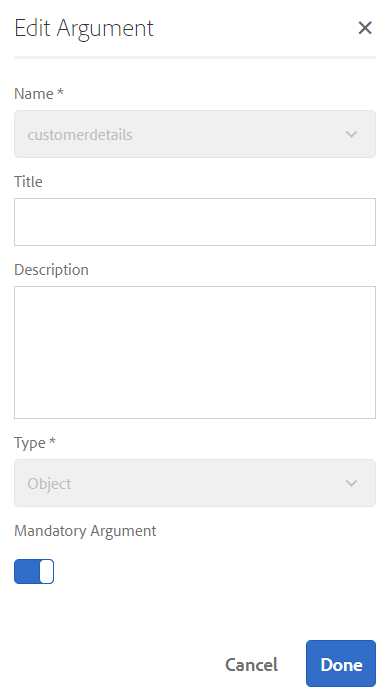
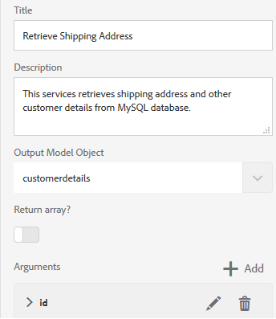

# 자습서: 양식 데이터 모델 만들기  {#tutorial-create-form-data-model}

>[!CAUTION]
>
>AEM 6.4가 확장 지원이 종료되었으며 이 설명서는 더 이상 업데이트되지 않습니다. 자세한 내용은 [기술 지원 기간](https://helpx.adobe.com/kr/support/programs/eol-matrix.html). 지원되는 버전 찾기 [여기](https://experienceleague.adobe.com/docs/).

이 자습서는 [첫 번째 적응형 양식 만들기](/help/forms/using/create-your-first-adaptive-form.md) 시리즈. 전체 자습서 사용 사례를 이해하고, 수행하고, 시연하기 위해 시리즈를 시간 순서대로 따르는 것이 좋습니다.

## 자습서 정보 {#about-the-tutorial}

AEM Forms 데이터 통합 모듈을 사용하여 AEM 사용자 프로필, RESTful 웹 서비스, SOAP 기반 웹 서비스, OData 서비스 및 관계형 데이터베이스와 같은 서로 다른 백엔드 데이터 소스에서 양식 데이터 모델을 만들 수 있습니다. 데이터 모델 개체 및 서비스를 양식 데이터 모델에서 구성하고 적응형 양식과 연결할 수 있습니다. 적응형 양식 필드는 데이터 모델 개체 속성에 바인딩됩니다. 이 서비스를 사용하면 적응형 양식을 미리 채우고 제출된 양식 데이터를 다시 데이터 모델 개체로 쓸 수 있습니다.

양식 데이터 통합 및 양식 데이터 모델에 대한 자세한 내용은 [AEM Forms 데이터 통합](/help/forms/using/data-integration.md).

이 자습서에서는 양식 데이터 모델을 적응형 양식과 준비, 만들기, 구성 및 연결하는 단계를 안내합니다. 이 자습서를 마치면 다음을 수행할 수 있습니다.

* [MySQL 데이터베이스를 데이터 소스로 구성](#config-database)
* [MySQL 데이터베이스를 사용하여 양식 데이터 모델 만들기](#create-fdm)
* [양식 데이터 모델 구성](#config-fdm)
* [양식 데이터 모델 테스트](#test-fdm)

양식 데이터 모델은 다음과 유사합니다.

**A.** 구성된 데이터 소스 **B.** 데이터 소스 스키마 **C.** 사용 가능한 서비스 **D.** 데이터 모델 개체 **E.** 구성된 서비스

## 사전 요구 사항 {#prerequisites}

시작하기 전에 다음을 확인하십시오.

* MySQL 데이터베이스에 샘플 데이터가 있습니다. [첫 번째 적응형 양식 만들기](/help/forms/using/create-your-first-adaptive-form.md)
* 에 설명된 대로 MySQL JDBC 드라이버용 OSGi 번들 [JDBC 데이터베이스 드라이버 번들](/help/sites-developing/jdbc.md#bundling-the-jdbc-database-driver)
* 첫 번째 자습서에 설명된 적응형 양식 [적응형 양식 만들기](/help/forms/using/create-adaptive-form.md)

## 1단계: MySQL 데이터베이스를 데이터 소스로 구성 {#config-database}

양식 데이터 모델을 만들기 위해 다양한 유형의 데이터 소스를 구성할 수 있습니다. 이 자습서에서는 사용자가 구성하고 샘플 데이터로 채운 MySQL 데이터베이스를 구성합니다. 지원되는 다른 데이터 소스 및 구성 방법에 대한 자세한 내용은 [AEM Forms 데이터 통합](/help/forms/using/data-integration.md).

MySQL 데이터베이스를 구성하려면 다음을 수행합니다.

1. MySQL 데이터베이스에 JDBC 드라이버를 OSGi 번들로 설치합니다.

   1. 관리자로 AEM Forms 작성자 인스턴스에 로그인하고 AEM 웹 콘솔 번들로 이동합니다. 기본 URL은 [http://localhost:4502/system/console/bundles](http://localhost:4502/system/console/bundles).

   1. 탭 **설치/업데이트**. An **번들 업로드/설치** 대화 상자가 나타납니다.

   1. 탭 **파일 선택** MySQL JDBC 드라이버 OSGi 번들을 찾아 선택합니다. 선택 **시작 번들** 및 **패키지 새로 고침**, 탭 **설치 또는 업데이트**. MySQL용 Oracle Corporation의 JDBC 드라이버가 활성화되어 있는지 확인합니다. 드라이버가 설치되어 있습니다.

1. MySQL 데이터베이스를 데이터 소스로 구성:

   1. 의 AEM 웹 콘솔로 이동합니다. [http://localhost:4502/system/console/configMgr](http://localhost:4502/system/console/configMgr).
   1. 찾기 **Apache Sling 연결의 풀링된 데이터 소스** 구성. 편집 모드에서 구성을 열려면 탭합니다.
   1. 구성 대화 상자에서 다음 세부 정보를 지정합니다.

      * **데이터 소스 이름:** 이름을 지정할 수 있습니다. 예를 들어 **WeRetailMySQL**.
      * **DataSource 서비스 속성 이름**: DataSource 이름이 포함된 서비스 속성의 이름을 지정합니다. 데이터 소스 인스턴스를 OSGi 서비스로 등록하는 동안 지정됩니다. 예, **datasource.name**.
      * **JDBC 드라이버 클래스**: JDBC 드라이버의 Java 클래스 이름을 지정합니다. MySQL 데이터베이스의 경우 **com.mysql.jdbc.Driver**.
      * **JDBC 연결 URI**: 데이터베이스의 연결 URL을 지정합니다. 포트 3306 및 스키마 웹 소매에서 실행되는 MySQL 데이터베이스의 경우 URL은 다음과 같습니다. `jdbc:mysql://[server]:3306/weretail?autoReconnect=true&useUnicode=true&characterEncoding=utf-8`
      * **사용자 이름:** 데이터베이스의 사용자 이름입니다. 데이터베이스와 연결을 설정하려면 JDBC 드라이버를 활성화해야 합니다.
      * **암호:** 데이터베이스의 암호입니다. 데이터베이스와 연결을 설정하려면 JDBC 드라이버를 활성화해야 합니다.
      * **차입 테스트:** 를 활성화합니다 **차입 시 테스트** 선택 사항입니다.
      * **반환 테스트:** 를 활성화합니다 **반환 테스트** 선택 사항입니다.
      * **유효성 검사 쿼리:** 풀에서 연결을 검증할 SQL SELECT 쿼리를 지정합니다. 쿼리는 하나 이상의 행을 반환해야 합니다. 예, **마지막(&amp;ast) 선택 고객 세부 사항에서**.
      * **트랜잭션 격리**: 값을 로 설정합니다. **READ_COMMITTED**.

      다른 속성을 기본값으로 둡니다. [값](https://tomcat.apache.org/tomcat-7.0-doc/jdbc-pool.html) 탭 **저장**.
   다음과 유사한 구성이 만들어집니다.

   

## 2단계: 양식 데이터 모델 만들기 {#create-fdm}

AEM Forms은 [양식 데이터 모델 만들기](data-integration.md) 구성된 데이터 소스에서 양식 데이터 모델에서 여러 데이터 소스를 사용할 수 있습니다. 사용 사례에서는 구성된 MySQL 데이터 소스를 사용합니다.

양식 데이터 모델을 만들려면 다음을 수행하십시오.

1. AEM 작성자 인스턴스에서 **Forms** >  **데이터 통합** s.
1. 탭 **만들기** >  **양식 데이터 모델**.
1. 양식 데이터 모델 만들기 대화 상자에서 **이름** 참조하십시오. 예, **customer-shipping-billing-details**. 탭 **다음**.
1. 데이터 소스 선택 화면에는 구성된 모든 데이터 소스가 나열됩니다. 선택 **WeRetailMySQL** 데이터 소스 및 탭 **만들기**.

   

다음 **customer-shipping-billing-details** 양식 데이터 모델이 만들어집니다.

## 3단계: 양식 데이터 모델 구성 {#config-fdm}

양식 데이터 모델 구성에는 다음이 포함됩니다.

* 데이터 모델 개체 및 서비스 추가
* 데이터 모델 객체에 대한 읽기 및 쓰기 서비스 구성

양식 데이터 모델을 구성하려면 다음을 수행하십시오.

1. AEM 작성자 인스턴스에서 **Forms > 데이터 통합**. 기본 URL은 [http://localhost:4502/aem/forms.html/content/dam/formsanddocuments-fdm](http://localhost:4502/aem/forms.html/content/dam/formsanddocuments-fdm).
1. 다음 **customer-shipping-billing-details** 이전에 만든 양식 데이터 모델이 여기에 나열됩니다. 편집 모드로 엽니다.

   선택한 데이터 소스 **WeRetailMySQL** 는 양식 데이터 모델에서 구성됩니다.

   

1. We레일MySQL 데이터 소스 트리를 확장합니다. 다음 데이터 모델 개체 및 서비스를 선택합니다 **weretail** >  **customerdetails** 양식 데이터 모델을 위한 스키마:

   * **데이터 모델 개체**:

      * id
      * 이름
      * shippingAddress
      * 도시
      * 상태
      * 우편번호
   * **서비스:**

      * get
      * 업데이트

   탭 **선택 항목 추가** 선택한 데이터 모델 개체 및 서비스를 양식 데이터 모델에 추가하려면

   

   >[!NOTE]
   >
   >JDBC 데이터 소스에 대한 기본 get, 업데이트 및 삽입 서비스는 양식 데이터 모델 과 함께 기본적으로 제공됩니다.

1. 데이터 모델 개체에 대한 읽기 및 쓰기 서비스를 구성합니다.

   1. 을(를) 선택합니다 **customerdetails** 데이터 모델 개체 및 탭 **속성 편집**.
   1. 선택 **get** 를 클릭합니다. 다음 **id** 인수는 customerdetails 데이터 모델 개체의 기본 키로서 자동으로 추가됩니다. 탭  다음과 같이 인수를 구성합니다.

      

   1. 마찬가지로 을 선택합니다 **업데이트** 쓰기 서비스로서의. 다음 **customerdetails** 개체가 자동으로 인수로 추가됩니다. 인수는 다음과 같이 구성됩니다.

      

      추가 및 구성 **id** 인수는 아래와 같습니다.

      

   1. 탭 **완료** 데이터 모델 개체 속성을 저장하려면 그런 다음 **저장** 양식 데이터 모델을 저장합니다.

      다음 **get** 및 **업데이트** 서비스는 데이터 모델 개체의 기본 서비스로 추가됩니다.

      

1. 로 이동합니다. **서비스** 탭 및 구성 **get** 및 **업데이트** 서비스.

   1. 을(를) 선택합니다 **get** 서비스 및 탭 **속성 편집**. 속성 대화 상자가 열립니다.
   1. 속성 편집 대화 상자에서 다음을 지정합니다.

      * **제목**: 서비스의 제목을 지정합니다. 예: 배송 주소를 검색합니다.
      * **설명**: 서비스의 세부 기능이 포함된 설명을 지정합니다. 예:

         이 서비스는 MySQL 데이터베이스에서 배송 주소와 기타 고객 세부 정보를 검색합니다

      * **출력 모델 개체**: 고객 데이터가 포함된 스키마를 선택합니다. 예:

         사용자 정의 스키마
      * **반환 배열**: 비활성화 **반환 배열** 선택 사항입니다.
      * **인수**: 이름이 지정된 인수 선택 **ID**.

      탭 **완료**. MySQL 데이터베이스에서 고객 세부 정보를 검색하는 서비스가 구성되었습니다.

      

   1. 을(를) 선택합니다 **업데이트** 서비스 및 탭 **속성 편집**. 속성 대화 상자가 열립니다.

   1. 속성 편집 대화 상자에서 다음을 지정합니다.

      * **제목**: 서비스의 제목을 지정합니다. 예를 들어 배송 주소를 업데이트합니다.

      * **설명**: 서비스의 세부 기능이 포함된 설명을 지정합니다. 예:

         이 서비스는 MySQL 데이터베이스의 배송 주소 및 관련 필드를 업데이트합니다

      * **입력 모델 개체**: 고객 데이터가 포함된 스키마를 선택합니다. 예:

         사용자 정의 스키마

      * **출력 유형**: 선택 **부울**.
      * **인수**: 이름이 지정된 인수 선택 **ID** 및 **customerdetails**.

      탭 **완료**. 다음 **업데이트** MySQL 데이터베이스에서 고객 세부 정보를 업데이트하는 서비스가 구성되었습니다.

      

양식 데이터 모델의 데이터 모델 개체 및 서비스가 구성됩니다. 이제 양식 데이터 모델을 테스트할 수 있습니다.

## 4단계: 양식 데이터 모델 테스트 {#test-fdm}

데이터 모델 개체 및 서비스를 테스트하여 양식 데이터 모델이 올바르게 구성되어 있는지 확인할 수 있습니다.

테스트를 실행하려면 다음을 수행하십시오.

1. 로 이동합니다. **모델** 탭에서 을 선택합니다 **customerdetails** 데이터 모델 개체 및 탭 **테스트 모델 개체**.
1. 에서 **테스트 모델 / 서비스** 창, 선택 **모델 개체 읽기** 에서 **모델 / 서비스 선택** 드롭다운.
1. 에서 **customerdetails** 섹션에서 **id** 구성된 MySQL 데이터베이스에 있는 인수 및 탭 **테스트**.

   지정된 ID와 연결된 고객 세부 정보를 가져와서 **출력** 섹션을 참조하십시오.

   

1. 마찬가지로 Write 모델 개체 및 서비스를 테스트할 수 있습니다.

   다음 예에서는 업데이트 서비스가 데이터베이스의 7102715 ID에 대한 주소 세부 사항을 성공적으로 업데이트합니다.

   

   이제 ID 7107215에 대해 모델 읽기 서비스를 다시 테스트하는 경우 아래에 표시된 대로 업데이트된 고객 세부 사항을 가져와서 표시합니다.

   
