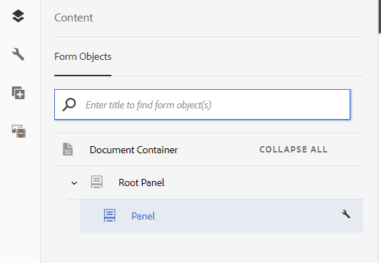
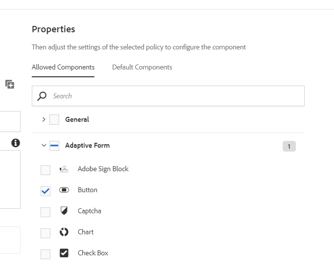

# 자습서: 템플릿 만들기 {#tutorial-create-templates}

>[!CAUTION]
>
>AEM 6.4가 확장 지원이 종료되었으며 이 설명서는 더 이상 업데이트되지 않습니다. 자세한 내용은 [기술 지원 기간](https://helpx.adobe.com/kr/support/programs/eol-matrix.html). 지원되는 버전 찾기 [여기](https://experienceleague.adobe.com/docs/).

대화형 커뮤니케이션용 인쇄 및 웹 템플릿 만들기

이 자습서는 [첫 번째 대화형 통신 만들기](/help/forms/using/create-your-first-interactive-communication.md) 시리즈. 전체 자습서 사용 사례를 이해하고, 수행하고, 시연하기 위해 시리즈를 시간 순서대로 따르는 것이 좋습니다.

대화형 커뮤니케이션을 만들려면 인쇄 및 웹 채널용 AEM 서버에서 사용할 수 있는 템플릿이 있어야 합니다.

인쇄 채널의 템플릿은 Adobe Forms Designer에서 만들고 AEM 서버에 업로드됩니다. 그런 다음 대화형 커뮤니케이션을 만드는 동안 이러한 템플릿을 사용할 수 있습니다.

웹 채널에 대한 템플릿은 AEM에서 만들어집니다. 템플릿 작성자 및 관리자는 웹 템플릿을 만들고, 편집하고, 활성화할 수 있습니다. 만들고 활성화하면 대화형 커뮤니케이션을 만드는 동안 이러한 템플릿을 사용할 수 있습니다.

이 자습서에서는 대화형 커뮤니케이션을 만드는 동안 사용할 수 있도록 인쇄 및 웹 채널용 템플릿을 만드는 단계를 안내합니다. 이 자습서를 마치면 다음을 수행할 수 있습니다.

* Adobe Forms 디자이너를 사용하여 인쇄 채널용 XDP 템플릿 만들기
* AEM Forms 서버에 XDP 템플릿 업로드
* 웹 채널용 템플릿 만들기 및 활성화

## 인쇄 채널용 템플릿 만들기 {#create-template-for-print-channel}

다음 작업을 사용하여 Interactive Communication의 인쇄 채널에 대한 템플릿을 생성 및 관리합니다.

* [Forms 디자이너를 사용하여 XDP 템플릿 만들기](/help/forms/using/create-templates-print-web.md#create-xdp-template-using-forms-designer)
* [AEM Forms 서버에 XDP 템플릿 업로드](/help/forms/using/create-templates-print-web.md#upload-xdp-template-to-the-aem-forms-server)
* [레이아웃 조각용 XDP 템플릿 만들기](/help/forms/using/create-templates-print-web.md#create-xdp-template-for-layout-fragments)

### Forms 디자이너를 사용하여 XDP 템플릿 만들기 {#create-xdp-template-using-forms-designer}

기준 [사용 사례](/help/forms/using/create-your-first-interactive-communication.md) 및 [해부학](/help/forms/using/planning-interactive-communications.md)XDP 템플릿에서 다음 하위 양식을 만듭니다.

* 청구 상세내역: 문서 조각 포함
* 고객 세부 정보: 문서 조각 포함
* 청구 요약: 문서 조각 포함
* 요약: 문서 조각(전하 하위 폼) 및 차트(하위 폼 차트)를 포함합니다
* 항목화된 호출: 표(레이아웃 조각)를 포함합니다
* 지금 지불: 이미지 포함
* 부가 가치 서비스: 이미지 포함

이러한 하위 양식은 XDP 파일을 Forms 서버에 업로드한 후 인쇄 템플릿에서 대상 영역으로 표시됩니다. 문서 조각, 차트, 레이아웃 조각 및 이미지와 같은 모든 엔티티는 대화형 커뮤니케이션을 작성하는 동안 대상 영역에 추가됩니다.

다음 단계를 실행하여 인쇄 채널용 XDP 템플릿을 만듭니다.

1. Forms 디자이너를 열고 을 선택합니다. **파일** > **새로 만들기** > **빈 양식을 사용하고** 탭 **다음**&#x200B;를 누른 다음 탭합니다. **완료** 을 클릭하여 템플릿을 만들 양식을 엽니다.

   다음을 확인합니다. **개체 라이브러리** 및 **개체** 선택 사항이 **창** 메뉴 아래의 제품에서 사용할 수 있습니다.

1. 드래그 앤 드롭 **하위 양식** 구성 요소 **개체 라이브러리** 추가 정보.
1. 하위 폼을 선택하여 **개체** 오른쪽 창의 창.
1. 을(를) 선택합니다 **하위 양식** 탭을 선택하고 **물결** 에서 **컨텐츠** 드롭다운 목록. 하위 양식의 왼쪽 끝점을 드래그하여 길이를 조정합니다.
1. 에서 **바인딩** 탭:

   1. 지정 **청구 상세내역** 에서 **이름** 필드.
   1. 선택 **데이터 바인딩 없음** 에서 **데이터 바인딩** 드롭다운 목록.

   

1. 마찬가지로 루트 하위 폼을 선택하고 **하위 양식** 탭을 선택하고 **물결** 에서 **컨텐츠** 드롭다운 목록. 에서 **바인딩** 탭:

   1. 지정 **텔레카빌** 에서 **이름** 필드.
   1. 선택 **데이터 바인딩 없음** 에서 **데이터 바인딩** 드롭다운 목록.

   

1. 2 - 5단계를 반복하여 다음 하위 양식을 만듭니다.

   * 청구 상세내역
   * 고객 세부 사항
   * 청구 요약
   * 요약 - 다음을 선택합니다. **하위 양식** 탭을 선택하고 **위치** 에서 **컨텐츠** 이 하위 양식의 드롭다운 목록입니다. 에 다음 하위 양식을 삽입합니다. **요약** 하위 폼

      * 요금
      * 차트
   * ItemisedCalls
   * 지금 지불
   * ValueAddedServices

   시간을 절약하기 위해 기존 하위 양식을 복사하여 붙여넣어 새 하위 양식을 만들 수도 있습니다.

   를 **차트** Charge 하위 폼 오른쪽에 있는 하위 폼을 선택한 다음 **차트** 왼쪽 창에서 **레이아웃** 탭하고 다음 값 지정 **AnchorX** 필드. 값은 **너비** 에 대한 필드 **요금** 하위 폼 을(를) 선택합니다 **요금** 하위 폼을 선택하고 **레이아웃** 탭하여 **너비** 필드.

1. 드래그 앤 드롭 **텍스트** 개체 **개체 라이브러리** 을 양식에 입력하고 **가입하려면 XXXX로 전화 걸기** 텍스트 상자에 표시됩니다.
1. 왼쪽 창에서 텍스트 개체를 마우스 오른쪽 단추로 클릭하고 **개체 이름 바꾸기**&#x200B;를 클릭하고 텍스트 객체의 이름을 로 입력합니다. **구독**.

   

1. 선택 **파일** > **다른 이름으로 저장** 로컬 파일 시스템에 파일을 저장하려면 다음을 수행합니다.

   1. 파일을 저장할 위치로 이동하여 이름을 **create_first_ic_print_template**.
   1. 선택 **.xdp** 에서 **다른 형식으로 저장** 드롭다운 목록.
   1. 탭 **저장**.

### AEM Forms 서버에 XDP 템플릿 업로드 {#upload-xdp-template-to-the-aem-forms-server}

Forms 디자이너를 사용하여 XDP 템플릿을 만든 후에는 대화형 커뮤니케이션을 만드는 동안 템플릿을 사용할 수 있도록 AEM Forms 서버에 업로드해야 합니다.

1. 선택 **[!UICONTROL Forms]** > **[!UICONTROL Forms 및 문서]**.
1. 탭 **만들기** > **파일 업로드**.

   탐색 및 선택 **create_first_ic_print_template** 템플릿(XDP) 및 탭 **열기** xdp 템플릿을 AEM Forms 서버로 가져오려면 다음을 수행하십시오.

### 레이아웃 조각용 XDP 템플릿 만들기 {#create-xdp-template-for-layout-fragments}

대화형 커뮤니케이션의 인쇄 채널에 대한 레이아웃 조각을 만들려면 Forms 디자이너를 사용하여 XDP를 만들고 AEM Forms 서버에 업로드합니다.

1. Forms 디자이너를 열고 을 선택합니다. **파일** > **새로 만들기** > **빈 양식을 사용하고** 탭 **다음**&#x200B;를 누른 다음 탭합니다. **완료** 을 클릭하여 템플릿을 만들 양식을 엽니다.

   다음을 확인합니다. **개체 라이브러리** 및 **개체** 선택 사항이 **창** 메뉴 아래의 제품에서 사용할 수 있습니다.

1. 드래그 앤 드롭 **표** 구성 요소 **개체 라이브러리** 추가 정보.
1. 테이블 삽입 대화 상자에서 다음을 수행합니다.

   1. 열 수를 **5개**.
   1. 본문 행 수를 **1**.
   1. 을(를) 선택합니다 **테이블에 머리글 행 포함** 확인란을 선택합니다.
   1. 탭 **확인**.

1. 탭 **+** 왼쪽 창에서 **표** 1을 마우스 오른쪽 버튼으로 클릭 **셀1** 을(를) 선택합니다. **개체 이름 바꾸기** to **날짜**.

   마찬가지로 이름 바꾸기 **셀2**, **셀3**, **셀4**, 및 **셀5** to **시간**, **숫자**, **기간**, 및 **요금** 각각 사용할 수 있습니다.

1. 에서 머리글 텍스트 필드를 클릭합니다. **디자이너 보기** 이름을 로 바꿀 수 있습니다. **시간**, **숫자**, **기간**, 및 **요금**.

   

1. 선택 **행 1** 왼쪽 창에서 **개체** > **바인딩** > **각 데이터 항목에 대해 행 반복**.

   

1. 드래그 앤 드롭 **텍스트 필드** 구성 요소 **개체 라이브러리** 변환 후 **디자이너 보기**.

   

   마찬가지로 드래그 앤 드롭 **텍스트 필드** 구성 요소를 **시간**, **숫자**, **기간**, 및 **요금** 행을 클릭합니다.

1. 선택 **파일** > **다른 이름으로 저장** 로컬 파일 시스템에 파일을 저장하려면 다음을 수행합니다.

   1. 파일을 저장할 위치로 이동하여 이름을 **table_lf**.
   1. 선택 **.xdp** 에서 **다른 형식으로 저장** 드롭다운 목록.
   1. 탭 **저장**.

   Forms 디자이너를 사용하여 레이아웃 조각용 XDP 템플릿을 만들면 다음을 수행해야 합니다 [업로드](/help/forms/using/create-templates-print-web.md#upload-xdp-template-to-the-aem-forms-server) 레이아웃 조각을 만드는 동안 템플릿을 사용할 수 있도록 AEM Forms 서버에 매핑됩니다.

## 웹 채널용 템플릿 만들기 {#create-template-for-web-channel}

다음 작업을 사용하여 Interactive Communication 웹 채널의 템플릿을 생성 및 관리합니다.

* [템플릿용 폴더 만들기](/help/forms/using/create-templates-print-web.md#create-folder-for-templates)
* [템플릿 만들기](/help/forms/using/create-templates-print-web.md#create-the-template)
* [템플릿 활성화](/help/forms/using/create-templates-print-web.md#enable-the-template)
* [대화형 커뮤니케이션에서 단추 활성화](/help/forms/using/create-templates-print-web.md#enabling-buttons-in-interactive-communications)

### 템플릿용 폴더 만들기 {#create-folder-for-templates}

웹 채널 템플릿을 만들려면 만든 템플릿을 저장할 수 있는 폴더를 정의합니다. 해당 폴더 내에 템플릿을 만들면 양식 사용자가 템플릿을 기반으로 대화형 커뮤니케이션의 웹 채널을 만들 수 있도록 템플릿을 활성화합니다.

다음 단계를 실행하여 편집 가능한 템플릿의 폴더를 만듭니다.

1. 탭 **도구**  > **구성 브라우저**.
   * 자세한 내용은 [구성 브라우저 설명서](/help/sites-administering/configurations.md) 추가 정보.
1. Configuration Browser 페이지에서 **만들기**.
1. 에서 **구성 만들기** 대화 상자, 지정 **Create_First_IC_templates** 폴더의 제목으로서 을 선택합니다. **편집 가능한 템플릿**, 탭 **만들기**.

   

   다음 **Create_First_IC_templates** 폴더가 만들어져서 **구성 브라우저** 페이지.

### 템플릿 만들기 {#create-the-template}

기준 [사용 사례](/help/forms/using/create-your-first-interactive-communication.md) 및 [해부학](/help/forms/using/planning-interactive-communications.md)웹 템플릿에서 다음 패널을 만듭니다.

* 청구 상세내역: 문서 조각 포함
* 고객 세부 정보: 문서 조각 포함
* 청구 요약: 문서 조각 포함
* 비용 요약: 문서 조각 및 차트(두 열 레이아웃)를 포함합니다.
* 항목화된 호출: 표 포함
* 지금 지불: 다음 포함 **지금 지불** 단추 및 이미지
* 부가 가치 서비스: 이미지 및 **구독** 버튼을 클릭합니다.

대화형 커뮤니케이션을 만드는 동안 문서 조각, 차트, 표, 이미지 및 단추와 같은 모든 엔티티가 추가됩니다.

다음 단계를 실행하여 **Create_First_IC_templates** 폴더:

1. 을(를) 선택하여 해당 템플릿 폴더로 이동합니다 **도구** > **템플릿** > **Create_First_IC_templates** 폴더를 입력합니다.
1. 탭 **만들기**.
1. 설정 **템플릿 유형 선택** 구성 마법사, 선택 **대화형 통신 - 웹 채널** 탭 **다음**.
1. 설정 **템플릿 세부 정보** 구성 마법사, 지정 **Create_First_IC_Web_Template** 을 템플릿 제목 과 동일하게 변경할 수 있습니다. 선택적 설명을 지정하고 탭합니다 **만들기**.

   Adobe Analytics Mobile Apps 또는 Analytics Premium이 **Create_First_IC_Web_Template** 이 표시됩니다.

1. 탭 **열기** 템플릿 편집기에서 템플릿을 열려면 다음을 수행하십시오.
1. 선택 **초기 컨텐츠** 다음 옆에 있는 드롭다운 목록에서 **미리 보기** 선택 사항입니다.

   

1. 탭 **루트 패널** 그런 다음 **+** 템플릿에 추가할 수 있는 구성 요소 목록을 보려면
1. 선택 **패널** 목록에서 위에 패널을 추가하려면 **루트 패널**.
1. 을(를) 선택합니다 **컨텐츠** 왼쪽 창에서 탭을 클릭합니다. 8단계에서 추가된 새 패널은 **루트 패널** 컨텐츠 트리에서

   

1. 패널을 선택하고 탭합니다  (구성).
1. 속성 창에서 다음을 수행합니다.

   1. 지정 **청구서 세부 사항** 을 입력합니다.
   1. 지정 **청구 상세내역** 제목 필드에서 을 클릭합니다.
   1. 선택 **1** 에서 **열 수** 드롭다운 목록.
   1. 탭  속성을 저장합니다.

   패널 이름이 **청구 상세내역** 컨텐츠 트리에서

1. 템플릿에 다음 속성을 사용하는 패널을 추가하려면 7~11단계를 반복합니다.

   | 이름 | 제목 | 열 수 |
   |---|---|---|
   | customerdetails | 고객 세부 사항 | 1 |
   | 청구 요약 | 청구서 요약 | 1 |
   | 요약 요금 | 비용 요약 | 2 |
   | itemedcalls | 항목화된 호출 | 1 |
   | paynow | 지금 지불 | 2 |
   | vas | 부가 가치 서비스 | 1 |

   다음 이미지는 템플릿에 모든 패널을 추가한 후 컨텐츠 트리를 나타냅니다.

   

### 템플릿 활성화 {#enable-the-template}

웹 템플릿을 만든 후에는 대화형 커뮤니케이션을 만드는 동안 템플릿을 사용할 수 있도록 설정해야 합니다.

다음 단계를 실행하여 웹 템플릿을 활성화합니다.

1. 탭 **도구**  > **템플릿**.
1. 로 이동합니다 **Create_First_IC_Web_Template** 템플릿을 선택하고 탭합니다. **활성화**.
1. 탭 **활성화** 다시 확인합니다.

   템플릿이 활성화되고 해당 상태가 사용으로 표시됩니다. 웹 채널용 대화형 커뮤니케이션을 만드는 동안 이 템플릿을 사용할 수 있습니다.

### 대화형 커뮤니케이션에서 단추 활성화 {#enabling-buttons-in-interactive-communications}

사용 사례를 기반으로 다음을 포함해야 합니다 **지금 지불** 및 **구독** 대화형 커뮤니케이션의 단추(적응형 양식 구성 요소)를 참조하십시오. Interactive Communication에서 이러한 단추를 사용하려면 다음 단계를 실행합니다.

1. 선택 **구조** 다음 옆에 있는 드롭다운 목록에서 **미리 보기** 선택 사항입니다.
1. 을(를) 선택합니다 **문서 컨테이너** 컨텐츠 트리를 사용하는 루트 패널 및 탭 **정책** 을 눌러 Interactive Communication에서 사용할 수 있는 구성 요소를 선택합니다.

   

1. 에서 **허용된 구성 요소** 탭 **속성** 섹션, **단추** 에서 **적응형 양식** 구성 요소.

   

1. 탭  속성을 저장합니다.
