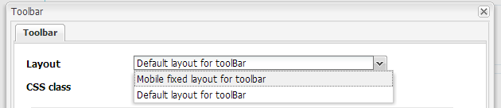

# 사용자 지정 도구 모음 레이아웃 만들기 {#creating-custom-toolbar-layout}

>[!CAUTION]
>
>AEM 6.4가 확장 지원이 종료되었으며 이 설명서는 더 이상 업데이트되지 않습니다. 자세한 내용은 [기술 지원 기간](https://helpx.adobe.com/kr/support/programs/eol-matrix.html). 지원되는 버전 찾기 [여기](https://experienceleague.adobe.com/docs/).

## 도구 모음 레이아웃 {#layout}

적응형 양식을 만들 때 양식의 도구 모음 레이아웃을 지정할 수 있습니다. 도구 모음 레이아웃은 양식에 있는 도구 모음의 명령과 레이아웃을 정의합니다.

도구 모음 레이아웃은 복잡한 JavaScript 및 CSS 코드로 구동되는 클라이언트측 처리에 주로 의존합니다. 이 코드의 제공을 구성하고 최적화하는 것은 복잡한 문제가 될 수 있습니다. 이 문제를 지원하기 위해 AEM에서는 클라이언트 측 코드를 리포지토리에 저장하고, 카테고리로 구성하고, 각 코드 카테고리를 클라이언트에 제공할 시기와 방법을 정의할 수 있는 클라이언트측 라이브러리 폴더를 제공합니다. 그런 다음 클라이언트측 라이브러리 시스템은 최종 웹 페이지에서 올바른 링크를 만들어 올바른 코드를 로드합니다. 자세한 내용은 [AEM에서 클라이언트 측 라이브러리가 작동하는 방식.](/help/sites-developing/clientlibs.md)


**그림:** *도구 모음의 샘플 레이아웃*

적응형 양식은 즉시 사용 가능한 레이아웃 세트를 제공합니다.


**그림:** *즉시 사용 가능한 도구 모음 레이아웃*

또한 사용자 지정 도구 모음 레이아웃을 만들 수 있습니다.

다음 절차에서는 도구 모음에 세 가지 작업이 표시되고 도구 모음의 드롭다운 목록에 다른 작업이 표시되는 사용자 지정 도구 모음을 만드는 절차에 대해 자세히 설명합니다.

첨부된 컨텐츠 패키지에는 아래에 설명된 전체 코드가 들어 있습니다. 컨텐츠 패키지를 설치한 후 를 엽니다. `/content/forms/af/CustomLayoutDemo.html` 사용자 지정 도구 모음 레이아웃 데모를 보려면

CustomToolbarLayoutDemo.zip

[파일 가져오기](assets/customtoolbarlayoutdemo.zip)
데모 사용자 지정 도구 모음 레이아웃

## 사용자 지정 도구 모음 레이아웃을 만들려면 {#layout-1}

1. 사용자 정의 도구 모음 레이아웃을 유지할 폴더를 만듭니다. 예:

   `/apps/customlayout/toolbar`.

   사용자 지정 레이아웃을 만들려면 다음 폴더에서 사용할 수 있는 기본 제공 도구 모음 레이아웃 중 하나를 사용(및 사용자 지정)할 수 있습니다.

   `/libs/fd/af/layouts/toolbar`

   예를 들어, `mobileFixedToolbarLayout` 노드 `/libs/fd/af/layouts/toolbar` 폴더 `/apps/customlayout/toolbar` 폴더를 입력합니다.

   도구 모음 Common.jsp를 `/apps/customlayout/toolbar` 폴더를 입력합니다.

   >[!NOTE]
   >
   >사용자 정의 레이아웃을 유지하기 위해 만드는 폴더는 `apps` 폴더를 입력합니다.

1. 복사된 노드의 이름을 변경합니다. `mobileFixedToolbarLayout`에 대해 `customToolbarLayout.`

   또한 노드에 대한 관련 설명을 제공합니다. 예를 들어 노드의 jcr:description을 로 변경합니다 **도구 모음에 대한 사용자 지정 레이아웃**.

   다음 `guideComponentType` 노드의 속성은 레이아웃 유형을 결정합니다. 이 경우 레이아웃 유형은 도구 모음이므로 도구 모음 레이아웃 선택 드롭다운에 표시됩니다.

   

   관련 설명이 있는 노드

   새 사용자 지정 도구 모음 레이아웃은 **적응형 양식 도구 모음** 대화 상자 구성

   

   사용 가능한 도구 모음 레이아웃 목록

   >[!NOTE]
   >
   >이전 단계에서 업데이트된 설명이 레이아웃 드롭다운 목록에 표시됩니다.

1. 이 사용자 지정 도구 모음 레이아웃을 선택하고 확인을 클릭합니다.

   에 clientlib(javascript 및 css)을 추가합니다. `/etc/customlayout` 노드 및 `customToolbarLayout.jsp`.

   

   customToolbarLayout.css 파일의 경로

   샘플 `customToolbarLayout.jsp`:

   ```php
   <%@include file="/libs/fd/af/components/guidesglobal.jsp" %>
   <cq:includeClientLib categories="customtoolbarlayout" />
   <c:if test="${isEditMode}">
           <cq:includeClientLib categories="customtoolbarlayoutauthor" />
   </c:if>
   <div class="guidetoolbar mobileToolbar mobilecustomToolbar" data-guide-position-class="guide-element-hide">
       <div data-guide-scroll-indicator="true"></div>            
       <%@include file="../toolbarCommon.jsp" %>
   </div>
   ```

   >[!NOTE]
   >
   >레이아웃에 대한 guidetoolbar 클래스를 추가합니다. 도구 모음에 대한 기본 스타일 지정은 guidtoolbar 클래스와 관련하여 정의됩니다.

   샘플 `toolBarCommon.jsp`:

   ```php
   <%@taglib prefix="fn" uri="https://java.sun.com/jsp/jstl/functions"%>
   <%--------------------  
   This code iterates over all the tool bar items using the guideToolbar bean.
   If the number of toolbar items are more than 3, then we create a dropdown menu using bootstrap for other actions present in the toolbar.
   In both desktop and mobile devices, the layout is different.    
   ---------------------------------%>
   
   <c:forEach items="${guideToolbar.items}" var="toolbarItem" varStatus="loop">
       <c:choose>
         <c:when test="${loop.index gt 2}">
      <c:choose>
       <c:when test="${loop.index eq 3}">
                     <div class="btn-group dropdown">   
                       <button type="button" class="btn btn-primary dropdown-toggle label" data-toggle="dropdown">Actions <span class="caret"></span></button>
                       <button type="button" class="btn btn-primary dropdown-toggle icon" data-toggle="dropdown"><span class="glyphicon glyphicon-th-list"></span></button>
             <ul class="dropdown-menu" role="menu">
                           <li>
                               <div id="${toolbarItem.id}_guide-item">
                                 <sling:include path="${toolbarItem.path}" resourceType="${toolbarItem.resourceType}"/>
                              </div>
                           </li>
                           <c:if test="${loop.index eq (fn:length(guideToolbar.items)-1)}">
                                </ul>
                                </div>
                           </c:if>
       </c:when>
       <c:when test="${loop.index eq (fn:length(guideToolbar.items)-1)}">
                          <li>
                                     <div id="${toolbarItem.id}_guide-item">
                                         <sling:include path="${toolbarItem.path}" resourceType="${toolbarItem.resourceType}"/>
                                     </div>
                           </li>
                       </ul>
                     </div>
   
       </c:when>
       <c:otherwise>
         <li>
          <div id="${toolbarItem.id}_guide-item">
           <sling:include path="${toolbarItem.path}" resourceType="${toolbarItem.resourceType}"/>
          </div>
         </li>
       </c:otherwise>
      </c:choose>
         </c:when>
         <c:otherwise>         
     <div id="${toolbarItem.id}_guide-item">
           <sling:include path="${toolbarItem.path}" resourceType="${toolbarItem.resourceType}"/>
        </div>
         </c:otherwise>
    </c:choose>   
   </c:forEach>
   ```

   clientlib 노드 내에 있는 CSS입니다.

   ```css
   .mobilecustomToolbar .dropdown {
       display: inline-block;    
   }
   
   .mobilecustomToolbar .dropdown {
       float: right;   
   }
   
   .mobilecustomToolbar .dropdown > button {
      padding: 6px 12px;  
   }         
   
   .mobilecustomToolbar .dropdown .guideFieldWidget, .mobilecustomToolbar .dropdown .guideFieldWidget button {
       width: 100%;   
   }         
   
   .mobilecustomToolbar .dropdown .caret{
       border-bottom: 6px solid;
       border-right: 6px solid transparent;
       border-left: 6px solid transparent;
    border-top: transparent;                                     
   }
   
   .mobilecustomToolbar .dropdown-menu{
    top: auto;
    bottom: 100%;                            
   }
   
   .mobilecustomToolbar .btn-group {            
    vertical-align: super;            
   }
   
   .mobilecustomToolbar .glyphicon {
    font-size: 24px;
   }
   
   @media (max-width: 767px){                                       
   
    .mobilecustomToolbar .dropdown .guideButton .iconButton-icon {
      display: none;
       }  
   
       .mobilecustomToolbar .dropdown .guideButton .iconButton-label {
      display: inline-block;
       } 
   
       .mobilecustomToolbar .dropdown .guideButton button {
      background-color: #013853;
       }
   
    .mobilecustomToolbar .btn-group {            
     vertical-align: top;            
    }    
   
   }
   ```

>[!NOTE]
>
>이전 단계에서 업데이트된 설명이 레이아웃 드롭다운 목록에 표시됩니다.


**그림:** *사용자 정의 레이아웃 도구 모음의 데스크탑 보기*
