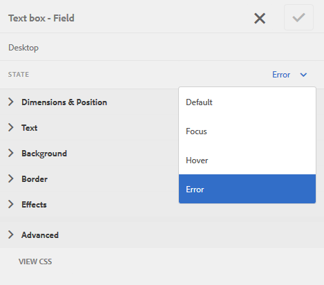

# 적응형 양식 {#customize-layout-and-positioning-of-error-messages-of-an-adaptive-form} 의 레이아웃 및 오류 메시지 위치를 사용자 지정합니다.

적응형 양식의 오류 메시지의 레이아웃 및 위치를 사용자 지정할 수 있습니다. 다음 사용자 지정을 수행할 수 있습니다.

* 해당 CSS 속성을 변경하지 않고 필드의 캡션 위치 및 레이아웃을 사용자 지정합니다
* 인라인 오류 메시지의 위치 사용자 지정
* 동적 도움말 표시기 콘텐츠 사용자 지정
* 해당 CSS 속성을 변경하지 않고 필드 구성 요소(캡션, 위젯, 짧은 설명, 긴 설명 및 도움말 표시기 구성 요소)의 위치를 사용자 지정합니다

## 필드 레이아웃 사용자 지정 {#customize-layout-of-fields}

단일 필드 또는 모든 필드의 레이아웃을 사용자 지정하여 캡션 및 오류 메시지의 위치를 변경할 수 있습니다. 다음 단계를 수행하여 사용자 지정 레이아웃을 필드에 적용합니다.

### 단일 필드 {#customize-layout-of-a-single-field} 레이아웃 사용자 지정

사용자 지정 레이아웃을 단일 필드에 적용하려면 다음 단계를 수행하십시오.

1. **스타일** 모드로 양식을 엽니다. 스타일 모드에서 양식을 열려면 페이지 도구 모음에서  > **스타일**&#x200B;을 누릅니다.
1. 사이드바의 **양식 객체**&#x200B;에서 필드를 선택하고 편집 단추 를 누릅니다.
1. 사용자 지정할 필드의 상태를 선택하고 해당 상태에 대한 스타일을 지정합니다.

   

### {#customize-layout-of-all-the-fields-of-a-form} 양식의 모든 필드의 레이아웃을 사용자 지정합니다.

이제 AEM Forms을 사용하여 테마를 만들어 양식에 적용할 수 있습니다. 테마 편집기를 사용하면 양식 구성 요소의 스타일을 한 위치에 지정할 수 있습니다. 테마를 만들 때 구성 요소 수준에서 스타일을 지정합니다. 주제에 대한 자세한 내용은 [AEM Forms의 테마](/help/forms/using/themes.md)를 참조하십시오.

테마 편집기를 사용하여 양식의 모든 필드 레이아웃을 사용자 지정하는 테마를 만듭니다. 테마를 만든 후 다음 단계를 수행하여 양식에 적용합니다.

1. 편집 모드에서 양식을 엽니다.
1. 편집 모드에서 구성 요소를 선택한 다음  > **적응형 양식 컨테이너**&#x200B;를 탭한 다음 를 탭합니다.
1. 사이드바의 적응형 양식 테마 아래에서 테마 편집기를 사용하여 만든 테마를 선택합니다.

## 사용자 지정 필드 레이아웃 {#create-a-custom-field-layout} 만들기

1. CRXDE Lite를 엽니다. 기본 URL은 `https://[Server]:[Port]/crx/de`.
1. /libs/fd/af/layouts/field 노드(예: defaultFieldLayout)에서 /apps 노드(예: /apps/af-field-layout)로 필드 레이아웃을 복사합니다.
1. 복사된 노드 및 defaultFieldLayout.jsp 파일의 이름을 변경합니다. 예를 들어 errorOnRight.jsp입니다.

1. 복사된 노드의 qtip 및 jcr:description 속성의 값을 변경합니다. 예를 들어, 속성 값을 오른쪽에 있는 오류 로 변경합니다

1. 새 스타일과 동작을 추가하려면 /etc 노드에 클라이언트 라이브러리를 만듭니다.

   예를 들어 /etc/af-field-layout-clientlib 위치에서 node client-library를 만듭니다. af.field.errorOnRight 및 style.less 파일에 다음 코드를 사용하여 categories 속성을 추가합니다.

   ```css
   .widgetErrorWrapper {
   
    height: 38px;
    margin: 5px;
   
    .guideFieldWidget{
    width: 60%;
    float: left; 
    }
   
    .guideFieldError{
    overflow:hidden;
    width:40%; 
    }
   
   }
   ```

1. 모양과 동작을 향상하려면 레이아웃 파일에서 만든 클라이언트 라이브러리를 포함합니다(errorOnRight.jsp).
1. 필드의 편집 대화 상자를 열고 **스타일링** 탭을 선택합니다. **필드 레이아웃 구성** 드롭다운 상자에서 새로 만든 레이아웃을 선택하고 **확인**&#x200B;을 클릭합니다.

ErrorOnRight.zip 패키지에는 필드의 오른쪽에 오류 메시지를 표시하는 코드가 들어 있습니다.

[파일 가져오기](assets/erroronright.zip)
