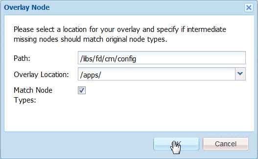

# 텍스트 편집기 사용자 정의 {#customize-text-editor}

>[!CAUTION]
>
>AEM 6.4가 확장 지원이 종료되었으며 이 설명서는 더 이상 업데이트되지 않습니다. 자세한 내용은 [기술 지원 기간](https://helpx.adobe.com/kr/support/programs/eol-matrix.html). 지원되는 버전 찾기 [여기](https://experienceleague.adobe.com/docs/).

## 개요 {#overview}

자산 관리 및 서신 UI 만들기에서 텍스트 편집기를 사용자 지정하여 글꼴 및 글꼴 크기를 더 추가할 수 있습니다. 이러한 글꼴에는 영어 및 영어 이외의 글꼴(예: 일본어, 글꼴)이 포함됩니다.

글꼴 설정에서 다음 내용을 변경하도록 사용자 지정할 수 있습니다.

* 글꼴 패밀리 및 크기
* 높이 및 문자 간격 등의 속성
* 글꼴 패밀리와 크기, 높이, 문자 간격 및 날짜 형식의 기본값
* 글머리 기호 들여쓰기

이를 위해서는 다음을 수행해야 합니다.

1. [CRX에서 tbxeditor-config.xml 파일을 편집하여 글꼴 사용자 정의](#customizefonts)
1. [클라이언트 컴퓨터에 사용자 정의 글꼴 추가](#addcustomfonts)

## CRX에서 tbxeditor-config.xml 파일을 편집하여 글꼴 사용자 정의 {#customizefonts}

tbxeditor-config.xml 파일을 편집하여 글꼴을 사용자 정의하려면 다음을 수행합니다.

1. 이동 `https://[server]:[port]/[ContextPath]/crx/de` 관리자로 로그인합니다.
1. 앱 폴더에서 다음 단계를 사용하여 libs/fd/cm/config에 있는 구성 폴더와 유사한 경로/구조로 config 라는 폴더를 만듭니다.

   1. 다음 경로에서 항목 폴더를 마우스 오른쪽 단추로 클릭하고 를 선택합니다 **오버레이 노드**:

      `/libs/fd/cm/config`

      

   1. 오버레이 노드 대화 상자에 다음 값이 있는지 확인합니다.

      **경로:** /libs/fd/cm/config

      **위치:** /apps/

      **일치 노드 유형:** 선택됨

      

   1. **확인**&#x200B;을 클릭합니다. 폴더 구조가 apps 폴더에 만들어집니다.

   1. 클릭 **모두 저장**.

1. 새로 생성된 구성 폴더에 다음 단계를 사용하여 tbxeditor-config.xml 파일의 복사본을 만듭니다.

   1. libs/fd/cm/config에서 tbxeditor-config.xml 파일을 마우스 오른쪽 단추로 클릭하고 를 선택합니다 **복사**.
   1. 다음 폴더를 마우스 오른쪽 단추로 클릭하고 **붙여넣기:**

      `apps/fd/cm/config`

   1. 붙여넣은 파일의 이름은 기본적으로 입니다 `copy of tbxeditor-config.xml.` 파일 이름을 다음으로 변경합니다. `tbxeditor-config.xml` 을(를) 클릭합니다. **모두 저장**.

1. apps/fd/cm/config에서 tbxeditor-config.xml 파일을 열고 필요한 사항을 변경합니다.

   1. apps/fd/cm/config에서 tbxeditor-config.xml 파일을 두 번 클릭합니다. 파일이 열립니다.

      ```xml
      <editorConfig>
         <bulletIndent>0.25in</bulletIndent>
      
         <defaultDateFormat>DD-MM-YYYY</defaultDateFormat>
      
         <fonts>
            <default>Times New Roman</default>
            <font>_sans</font>
            <font>_serif</font>
            <font>_typewriter</font>
            <font>Arial</font>
            <font>Courier</font>
            <font>Courier New</font>
            <font>Geneva</font>
            <font>Georgia</font>
            <font>Helvetica</font>
            <font>Tahoma</font>
            <font>Times New Roman</font>
            <font>Times</font>
            <font>Verdana</font>
         </fonts>
      
         <fontSizes>
            <default>12</default>
            <fontSize>8</fontSize>
            <fontSize>9</fontSize>
            <fontSize>10</fontSize>
            <fontSize>11</fontSize>
            <fontSize>12</fontSize>
            <fontSize>14</fontSize>
            <fontSize>16</fontSize>
            <fontSize>18</fontSize>
            <fontSize>20</fontSize>
            <fontSize>22</fontSize>
            <fontSize>24</fontSize>
            <fontSize>26</fontSize>
            <fontSize>28</fontSize>
            <fontSize>36</fontSize>
            <fontSize>48</fontSize>
            <fontSize>72</fontSize>
         </fontSizes>
      
         <lineHeights>
            <default>2</default>     
            <lineHeight>2</lineHeight>
            <lineHeight>3</lineHeight>
            <lineHeight>4</lineHeight>
            <lineHeight>5</lineHeight>
            <lineHeight>6</lineHeight>
            <lineHeight>7</lineHeight>
            <lineHeight>8</lineHeight>
            <lineHeight>9</lineHeight>
            <lineHeight>10</lineHeight>
            <lineHeight>11</lineHeight>
            <lineHeight>12</lineHeight>
            <lineHeight>13</lineHeight>
            <lineHeight>14</lineHeight>
            <lineHeight>15</lineHeight>
            <lineHeight>16</lineHeight>
         </lineHeights>
      
         <letterSpacings>
            <default>0</default>
            <letterSpacing>0</letterSpacing>
            <letterSpacing>1</letterSpacing>
            <letterSpacing>2</letterSpacing>
            <letterSpacing>3</letterSpacing>
            <letterSpacing>4</letterSpacing>
            <letterSpacing>5</letterSpacing>
            <letterSpacing>6</letterSpacing>
            <letterSpacing>7</letterSpacing>
            <letterSpacing>8</letterSpacing>
            <letterSpacing>9</letterSpacing>
            <letterSpacing>10</letterSpacing>
            <letterSpacing>11</letterSpacing>
            <letterSpacing>12</letterSpacing>
            <letterSpacing>13</letterSpacing>
            <letterSpacing>14</letterSpacing>
            <letterSpacing>15</letterSpacing>
            <letterSpacing>16</letterSpacing>
         </letterSpacings>
      </editorConfig>
      ```

   1. 글꼴 설정에서 다음을 변경하려면 파일에서 필요한 변경 작업을 수행합니다.

      * 글꼴 패밀리와 크기 추가 또는 제거
      * 높이 및 문자 간격 등의 속성
      * 글꼴 패밀리와 크기, 높이, 문자 간격 및 날짜 형식의 기본값
      * 글머리 기호 들여쓰기

      예를들어 Sazanami Mincho Medium이라는 일본어 글꼴을 추가하려면 XML 파일에 다음 항목을 입력해야 합니다. `<font>Sazanami Mincho Medium</font>`. 또한 이 글꼴을 클라이언트 시스템에 설치하여 글꼴 사용자 지정을 액세스하여 사용할 수 있어야 합니다. 자세한 내용은 [클라이언트 컴퓨터에 사용자 정의 글꼴 추가](#addcustomfonts).

      텍스트의 다양한 측면에 대한 기본값을 변경하고 항목을 제거하여 텍스트 편집기에서 글꼴을 제거할 수도 있습니다.

   1. 클릭 **모두 저장**.


## 클라이언트 컴퓨터에 사용자 정의 글꼴 추가 {#addcustomfonts}

서신 관리 텍스트 편집기에서 글꼴에 액세스하면 서신 관리에 액세스하는 데 사용하는 클라이언트 시스템에 글꼴이 있어야 합니다. 텍스트 편집기에서 사용자 지정 글꼴을 사용하려면 먼저 클라이언트 컴퓨터에 사용자 지정 글꼴을 설치해야 합니다.

글꼴 설치에 대한 자세한 내용은 다음을 참조하십시오.

* [Windows에서 글꼴 설치 또는 제거](https://windows.microsoft.com/en-us/windows-vista/install-or-uninstall-fonts)
* [Mac 기본 사항: 글꼴 책](https://support.apple.com/en-us/HT201749)

## 글꼴 사용자 지정 액세스 {#access-font-customizations}

CRX의 tbxeditor-config.xml 파일에서 글꼴을 변경하고 AEM Forms에 액세스하는 데 사용되는 클라이언트 시스템에 필요한 글꼴을 설치하면 텍스트 편집기에 변경 사항이 표시됩니다.

예를 들어 [CRX에서 tbxeditor-config.xml 파일을 편집하여 글꼴 사용자 정의](#customizefonts) 프로시저는 텍스트 편집기 UI에 다음과 같이 나타납니다.


>[!NOTE]
>
>일본어 텍스트를 보려면 먼저 일본어 문자를 사용하여 텍스트를 입력해야 합니다. 사용자 정의 일본어 글꼴의 응용 프로그램은 특정 방식으로만 텍스트 서식을 지정합니다. 사용자 정의 일본어 글꼴을 적용하면 영어 또는 다른 문자가 일본어 문자로 변경되지 않습니다.
