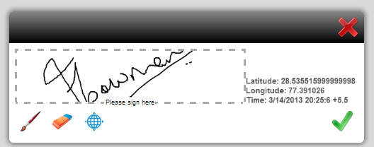

# HTML5 양식 {#designing-form-templates-for-html-forms} 양식 템플릿 디자인

AEM의 HTML5 양식 구성 요소는 XFA 양식 템플릿을 HTML5 형식으로 렌더링합니다. 양식 디자이너는 [Forms Designer](https://www.adobe.com/go/learn_aemforms_designer_63)를 사용하여 양식 템플릿을 디자인하고 HTML5 변환 기능을 사용할 수 있습니다. 이러한 양식 템플릿은 해당 에셋과 함께 AEM 저장소, 파일 시스템에 상주하거나 http를 통해 노출할 수 있습니다. 그러나 Forms Manager를 사용하여 양식을 관리할 계획인 경우 템플릿과 자산은 AEM 저장소에 있어야 합니다.

HTML5 양식은 PDF forms의 비헤이비어와 상당히 일치하지만 두 형식 모두에서 다른 형식에 적용할 수 없는 기능이 있습니다. 예를 들어 Adobe Reader에서 PDF 양식에 바코드를 적용하는 방법은 모바일 양식이나 디지털 서명을 받는 방법도 형식에 따라 다릅니다. 이러한 변형에 대한 자세한 내용은 [HTML5 양식과 PDF forms 간 차이 기능](/help/forms/using/feature-differentiation-html5-forms-pdf-forms.md)을 참조하십시오.

일반적인 XFA 기능은 두 형식 모두에서 작동하는 양식을 디자인하기 위한 다음 모범 사례 및 지침을 참조하십시오.

## HTML5 Forms용 AEM Forms Designer 기능 {#capabilities-in-aem-forms-designer-for-html-forms}

### HTML {#preview-html} 미리 보기

양식 디자이너를 위한 디자인 모드에 HTML 미리 보기 탭이 추가되어 디자인 프로세스 중에 HTML5 형식으로 양식을 미리 볼 수 있습니다. AEM Forms Designer에서 이 기능을 활성화하고 구성하는 방법에 대한 자세한 내용은 [HTML 미리 보기](/help/forms/using/preview-xdp-forms-html.md)를 참조하십시오.

### 스크리블 서명 {#scribble-signature}

HTML5 양식의 주요 대상은 터치 장치입니다. 따라서 AEM Forms Designer에 새로운 자유 서명 컨트롤이 추가됩니다. 양식 템플릿에서 자유 서명 컨트롤을 클릭하거나 드래그하여 놓고 구성할 수 있습니다. HTML5 변환에서 자유롭게 그린 필드로 렌더링되며 터치 장치에서 서명을 자유롭게 쓰는 데 사용할 수 있습니다. 데스크톱 컴퓨터에서는 마우스 컨트롤을 사용하여 자유 필드로 사용할 수 있습니다. 이 기능 사용 방법에 대한 자세한 내용은 [XFA 스크리블 필드](/help/forms/using/scribble-signature.md)를 참조하십시오.

