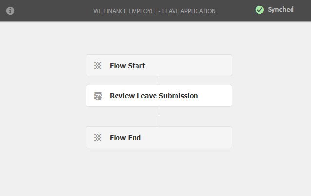

# 직원 셀프 서비스 참조 사이트 연습 {#employee-self-service-reference-site-walkthrough}

## 전제 조건 {#prerequisite}

[AEM Forms 참조 사이트 설정 및 구성](/help/forms/using/setup-reference-sites.md)에 설명된 대로 참조 사이트를 설정합니다.

## 개요 {#overview}

회사 인트라넷에서 일반적으로 호스팅되는 직원 셀프 서비스 시스템은 직원들에게 책상에서 사용할 수 있는 다양한 정보와 서비스를 제공할 수 있습니다. 직원의 고용 세부 정보에 액세스, 휴가 신청 및 비용 보고서 제출과 같은 작업을 수행할 수 있도록 지원하고 권한을 부여합니다. 반면, 기업은 프로세스 효율성을 향상시키고 비용을 절감하면서 직원에게 정보를 제공하고 참여를 유도할 수 있습니다.

직원 셀프 서비스 참조 사이트는 AEM Forms을 활용하여 조직에서 직원 셀프 서비스 시스템을 구현하는 방법을 보여줍니다.

>[!NOTE]
>
>종업원의 셀프 서비스 사용 사례는 We.Finance 참조 사이트와 We.Gov 참조 사이트에서 모두 이용할 수 있다. 이 연습에서 사용되는 예제, 이미지 및 설명은 We.Finance 참조 사이트를 사용합니다. 그러나 We.Gov를 사용하여 이러한 사용 사례를 실행하고 아티팩트를 검토할 수도 있습니다. 이렇게 하려면, 언급된 URL에서 **we-finance**&#x200B;을 **we-gov**&#x200B;로 대체해야 합니다.

## 이해의 상충 설문지 연습 {#conflict-of-interest-questionnaire-walkthrough}

조직에서는 때때로 직원들에게 이해의 상충 설문지를 제출하여 외부 활동이나 조직과의 충돌을 일으킬 수 있는 종업원의 개인적인 관계를 확인하도록 요청합니다.

사라의 조직의 규정 준수 부서는 직원들에게 이해의 상충 설문지를 제출하라고 요청했다.

### 사라는 이해의 상충 질문 {#sarah-submits-the-conflict-of-interest-questionnaire}

사라는 조직의 포털에 가서 로그인하고 직원을 클릭하여 직원 대시보드에 액세스합니다. 그녀는 직원 대시보드에서 이해의 상충 설문지를 찾고 **[!UICONTROL 적용]**&#x200B;을 클릭합니다.

**homeFigure:** *조직 포털*

**dashboard그림:** *직원 대시보드*

Sarah는 [다음] 단추를 사용하여 양식을 탐색하고 [소개] 및 [정의] 섹션을 읽어 봅니다. 그녀는 질문 섹션의 질문에 응답합니다. 마침내, 그녀는 서명하고 설문지를 제출한다.

조직 포털 및 설문지는 반응형 모바일 친화적입니다. 다음 워크플로우에서는 Sarah가 모바일 장치에서 탐색하고 설문지를 제출하는 방법을 보여줍니다.

**사용 방법**

조직 포털 및 직원 대시보드는 AEM Sites 페이지입니다. 대시보드에는 이해의 상충 질서와 같은 여러 셀프 서비스 옵션이 나열됩니다. 적용 단추는 적응형 양식에 연결됩니다.

적응형 양식에서는 규칙을 사용하여 [질문] 탭에 제공된 답변을 기반으로 정보를 표시합니다. 또한 양식은 선언 탭에서 서명하기 위해 스크리블 구성 요소를 사용합니다. 적응형 양식을 `https://[authorHost]:[authorPort]/editor.html/content/forms/af/we-finance/employee/self-service/conflict-of-interest.html`에서 검토합니다.

**직접 보기**

`https://[publishHost]:[publishPort]/content/we-finance/global/en/self-service-forms.html`으로 이동하여 `srose/srose`을(를) 사용하여 Sarah의 사용자 이름/암호로 로그인합니다. 대시보드에 액세스하려면 **[!UICONTROL 직원]**&#x200B;을 클릭한 다음 이해의 상충 질문서에서 **[!UICONTROL 적용]**&#x200B;을 클릭합니다. 설문지를 검토하고 제출합니다.

### Gloria는 이해의 상충 질문 제출 {#gloria-reviews-and-approves-the-conflict-of-interest-questionnaire-submission} 검토 및 승인

사라가 제출한 이해의 상충 설문지는 글로리아 리오스에 검토를 위해 할당된다. Gloria는 조직에서 특별 감사 책임자로 일한다. 글로리아는 AEM 받은 편지함에 로그인해서 그녀에게 할당된 일을 검토한다. 그녀는 사라가 제출한 설문지를 승인하고 그 일을 완성한다.

**받은 편지함그림:** *Gloria의 받은 편지함*

**approvedFigure:** *작업 열기*

**사용 방법**

이해의 상충 질문의 제출 작업은 승인을 위해 Gloria의 받은 편지함에 작업을 만드는 워크플로우를 트리거합니다. `https://[authorHost]:[authorPort]/editor.html/conf/global/settings/workflow/models/we-finance/employee/self-service/we-finance-employee-conflict-of-interest.html`에서 Forms Workflow 검토

**직접 보기**

`https://[publishHost]:[publishPort]/content/we-finance/global/en/login.html?resource=/aem/inbox.html`으로 이동하여 Gloria Rios의 사용자 이름/암호로 `grios/password`을(를) 사용하여 로그인합니다. 이해의 상충 질문서를 위해 생성된 태스크를 열고 승인합니다.

## 회사 카드 응용 프로그램 연습 {#corporate-card-application-walkthrough}

사라는 출장을 많이 다니기 때문에 출장 중에 회사 신용카드로 청구서를 지불해야 한다. 그녀는 조직의 직원 포털을 통해 법인 카드를 신청한다.

### Sarah는 법인 카드 신청서 {#sarah-submits-the-corporate-card-application}를 제출한다.

Sarah는 조직의 포털에 가서 로그인하고 **[!UICONTROL Employee]**&#x200B;를 클릭하여 직원 대시보드에 액세스합니다. 직원 대시보드에서 법인 카드 애플리케이션을 찾아 **[!UICONTROL 적용]**&#x200B;을 클릭합니다.

**그림:** *조직 포털*

**그림:** *직원 대시보드*

그녀는 법인 카드 응용 프로그램에서 **[!UICONTROL 적용]**&#x200B;을 클릭합니다. 단일 페이지 애플리케이션이 열립니다. 모든 세부 사항을 채우고 **[!UICONTROL 적용]**&#x200B;을 클릭하여 애플리케이션을 제출합니다.

**사용 방법**

조직 포털 및 직원 대시보드는 AEM Sites 페이지입니다. 대시보드에는 법인 카드 응용 프로그램과 같은 여러 셀프 서비스 옵션이 나열됩니다. 응용 프로그램의 [적용] 단추가 응용 양식에 연결되어 있습니다.

법인 카드 응용 프로그램에 대한 적응형 양식은 간단하고, 한 페이지로 구성된 응답형 양식입니다. 텍스트, 전화, 숫자 상자 및 숫자 스테퍼와 같은 기본적인 적응형 양식 구성 요소를 사용합니다. 적응형 양식을 검토합니다.\
`https://[authorHost]:[authorPort]/editor.html/content/forms/af/we-finance/employee/self-service/corporate-card.html`.

**직접 보기**

`https://[publishHost]:[publishPort]/content/we-finance/global/en/self-service-forms.html`으로 이동하여 `srose/srose`을(를) 사용하여 Sarah의 사용자 이름/암호로 로그인합니다. 대시보드에 액세스하려면 **[!UICONTROL 직원]**&#x200B;을 클릭한 다음 회사 카드 응용 프로그램에서 **[!UICONTROL 적용]**&#x200B;을 클릭합니다. 세부사항을 작성하고 신청서를 제출합니다.

### Gloria는 법인 카드 신청서 {#gloria-reviews-and-approves-the-corporate-card-application} 검토 및 승인

사라가 제출한 법인 카드 신청서는 글로리아 리오스에 검토를 위해 배정되었다. 글로리아는 AEM 받은 편지함에 로그인해서 그녀에게 할당된 일을 검토한다. 그녀는 사라가 제출한 지원서를 승인하고 그 일을 완성한다.

**받은 편지함 그림:** *Gloria의 받은 편지함*

**승인그림:** *작업 열기*

**사용 방법**

법인 카드 응용 프로그램의 제출 워크플로우는 승인을 위해 Gloria의 받은 편지함에 작업을 만드는 Forms 워크플로우를 트리거합니다. `https://[authorHost]:[authorPort]/editor.html/conf/global/settings/workflow/models/we-finance/employee/self-service/we-finance-employee-corporate-card.html`에서 Forms Workflow 검토

**직접 보기**

`https://[publishHost]:[publishPort]/content/we-finance/global/en/login.html?resource=/aem/inbox.html`으로 이동하여 Gloria Rios의 사용자 이름/암호로 `grios/password`을(를) 사용하여 로그인합니다. 회사 카드 응용 프로그램에 대해 생성된 작업을 열고 승인합니다.

## 비용 보고서 제출 연습 {#expense-report-submission-walkthrough}

사라는 출장을 가는 동안 시간을 소비하므로, 승인을 위해 지출 보고서를 제출해야 한다. 그녀의 조직의 셀프 서비스 옵션을 통해 지출 보고서를 온라인으로 제출할 수 있다.

### Sarah는 지출 보고서 신청서 {#sarah-submits-the-expense-report-application}를 제출한다.

Sarah는 조직의 포털에 가서 로그인하고 **[!UICONTROL Employee]**&#x200B;를 클릭하여 직원 대시보드에 액세스합니다. 직원 대시보드에서 비용 보고서 애플리케이션을 찾아 **[!UICONTROL 적용]**&#x200B;을 클릭합니다.

**그림:** *조직 포털*

**그림:** *직원 대시보드*

그녀는 지출 보고서 애플리케이션에서 **[!UICONTROL 적용]**&#x200B;을 클릭합니다. 보고서 이름과 보고서 세부 정보 탭이 2개 있는 애플리케이션 양식이 열립니다. 보고서 세부 사항 탭의 **+** 아이콘을 사용하여 한 보고서에서 지출보다 많은 것을 추가할 수 있습니다.

조직 포털 및 애플리케이션은 반응형 솔루션으로 모바일에 적합합니다. 다음 워크플로우는 Sarah가 모바일 장치에 대한 비용 보고서를 탐색하고 제출하는 방법을 보여줍니다.

**사용 방법**

조직 포털 및 직원 대시보드는 AEM Sites 페이지입니다. 대시보드에는 비용 보고서 애플리케이션과 같은 여러 셀프 서비스 옵션이 나열됩니다. 적용 단추는 적응형 양식에 연결됩니다.

적응형 양식의 보고서 이름 및 보고서 세부 사항 탭은 패널 구성 요소입니다. 보고서 세부 사항 패널에는 비용 패널이 있습니다. 보고서에 여러 비용을 추가할 수 있는 반복 가능한 패널입니다. 응용 양식 및 해당 구성을 `https://[authorHost]:[authorPort]/editor.html/content/forms/af/we-finance/employee/expense-report.html`에서 검토합니다.

**직접 보기**

`https://[publishHost]:[publishPort]/content/we-finance/global/en/self-service-forms.html`으로 이동하여 `srose/srose`을(를) 사용하여 Sarah의 사용자 이름/암호로 로그인합니다. 대시보드에 액세스하려면 **[!UICONTROL 직원]**&#x200B;을 클릭한 다음 비용 보고서 응용 프로그램에서 **[!UICONTROL 적용]**&#x200B;을 클릭합니다. 세부사항을 작성하고 신청서를 제출합니다.

### Gloria는 비용 보고서 {#gloria-reviews-and-approves-the-expense-report}을 검토하고 승인합니다.

사라가 제출한 지출 보고서는 글로리아 리오스에 검토를 위해 배정되었다. 글로리아는 AEM 받은 편지함에 로그인해서 그녀에게 할당된 일을 검토한다. 그녀는 사라가 제출한 지원서를 승인하고 그 일을 완성한다.

**inbox그림:** *Gloria의 받은 편지함*

**approved그림:** *작업 열기*

**사용 방법**

비용 보고서 애플리케이션의 제출 워크플로우는 승인을 위해 Gloria의 받은 편지함에 작업을 만드는 Forms 워크플로우를 트리거합니다. `https://[authorHost]:[authorPort]/editor.html/conf/global/settings/workflow/models/we-finance/employee/self-service/we-finance-employee-expense-report-workflow.html`에서 Forms Workflow 검토

**직접 보기**

`https://[publishHost]:[publishPort]/content/we-finance/global/en/login.html?resource=/aem/inbox.html`으로 이동하여 Gloria Rios의 사용자 이름/암호로 `grios/password`을(를) 사용하여 로그인합니다. 비용 보고서 애플리케이션에 대해 생성된 작업을 열고 승인합니다.

## 응용 프로그램 연습 {#leave-application-walkthrough} 유지

사라는 다음 달에 가족 휴가를 계획하고 있고 1주일 휴가를 신청하려고 한다.

### Sarah는 퇴근 응용 프로그램 {#sarah-submits-the-leave-application}을 제출합니다.

Sarah는 조직의 포털에 가서 로그인하고 **[!UICONTROL Employee]**&#x200B;를 클릭하여 직원 대시보드에 액세스합니다. 직원 대시보드에서 애플리케이션을 찾아 **[!UICONTROL 적용]**&#x200B;을 클릭합니다.

**그림:** *조직 포털*

**그림:** *직원 대시보드*

휴가 신청서는 사라의 이름과 직원 ID가 양식에 사전에 입력되어 열립니다. 그것은 또한 그녀의 휴가와 역사를 표시합니다. 그녀는 휴가 세부 사항을 작성하고 승인을 위해 신청서를 제출한다.

조직 포털 및 애플리케이션은 반응형 솔루션으로 모바일에 적합합니다. 다음 워크플로우에서는 Sarah가 모바일 장치에서 응용 프로그램을 탐색하고 제출하는 방법을 보여 줍니다.

**사용 방법**

조직 포털 및 직원 대시보드는 AEM Sites 페이지입니다. 대시보드에는 애플리케이션을 종료하는 등 여러 셀프 서비스 옵션이 표시됩니다. 적용 단추는 적응형 양식에 연결됩니다.

leave 애플리케이션에 대한 적응형 양식은 직원이 양식 데이터 모델을 기반으로 합니다. [균형 유지] 섹션에서 왼쪽 균형 테이블은 `getLeavesOf` 양식 데이터 모델 서비스를 사용하여 채워집니다. 시작 및 종료 날짜 필드는 날짜 값이 현재 날짜 이후인지 확인하는 규칙을 사용합니다. 종료 기간은 `calcBusinessDays` 함수를 사용하여 계산됩니다.

다음 위치에서 적응형 양식 및 양식 데이터 모델을 검토할 수 있습니다.

`https://[authorHost]:[authorPort]/editor.html/content/forms/af/we-finance/employee/self-service/leave-application.html`

`https://[authorHost]:[authorPort]/aem/fdm/editor.html/content/dam/formsanddocuments-fdm/db`

**직접 보기**

`https://[publishHost]:[publishPort]/content/we-finance/global/en/self-service-forms.html`으로 이동하여 `srose/srose`을(를) 사용하여 Sarah의 사용자 이름/암호로 로그인합니다. 대시보드에 액세스하려면 **[!UICONTROL 직원]**&#x200B;을 클릭한 다음 애플리케이션 퇴장에서 **[!UICONTROL 적용]**&#x200B;을 클릭합니다. 세부사항을 작성하고 신청서를 제출합니다.

### Gloria는 휴가 신청서 {#gloria-reviews-and-approves-the-leave-application}을 검토하고 승인합니다.

사라가 제출한 휴가 신청서는 글로리아 리오스에 검토를 위해 배정되었다. 글로리아는 AEM 받은 편지함에 로그인해서 그녀에게 할당된 일을 검토한다. 그녀는 사라가 제출한 지원서를 승인하고 그 일을 완성한다.

**떠넘기기:** *Gloria의 받은 편지함*

**approvedFigure:** *작업 열기*

**사용 방법**

leave 애플리케이션의 제출 워크플로우는 승인을 위해 Gloria의 받은 편지함에 작업을 만드는 Forms 워크플로우를 트리거합니다. `https://[authorHost]:[authorPort]/editor.html/conf/global/settings/workflow/models/we-finance/employee/self-service/we-finance-employee-leave-application.html`에서 Forms Workflow 검토

**직접 보기**

`https://[publishHost]:[publishPort]/content/we-finance/global/en/login.html?resource=/aem/inbox.html`으로 이동하여 Gloria Rios의 사용자 이름/암호로 `grios/password`을(를) 사용하여 로그인합니다. 애플리케이션을 종료하기 위해 만든 작업을 열고 승인합니다.
