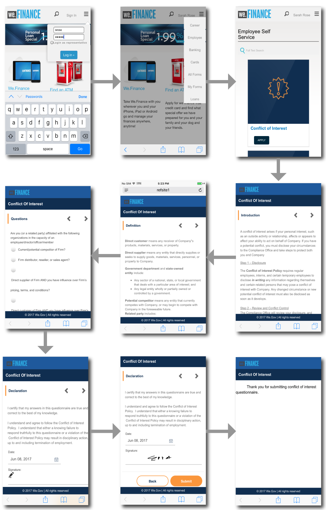
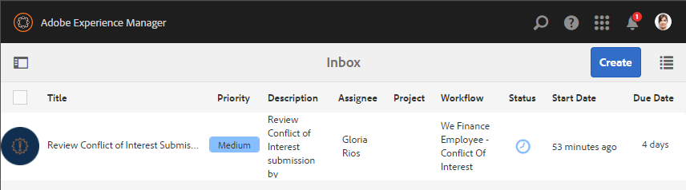

# 직원 셀프 서비스 참조 사이트 안내 {#employee-self-service-reference-site-walkthrough}

>[!CAUTION]
>
>AEM 6.4가 확장 지원이 종료되었으며 이 설명서는 더 이상 업데이트되지 않습니다. 자세한 내용은 [기술 지원 기간](https://helpx.adobe.com/kr/support/programs/eol-matrix.html). 지원되는 버전 찾기 [여기](https://experienceleague.adobe.com/docs/).

## 전제 조건 {#prerequisite}

에 설명된 대로 참조 사이트를 설정합니다. [AEM Forms 참조 사이트 설정 및 구성](/help/forms/using/setup-reference-sites.md).

## 개요 {#overview}

일반적으로 회사 인트라넷에서 호스팅되는 직원 셀프 서비스 시스템은 직원들이 자신의 책상에서 사용할 수 있는 다양한 정보와 서비스에 액세스할 수 있도록 합니다. 직원의 고용 세부 정보 액세스, 휴가 신청, 비용 보고서 제출과 같은 작업을 수행할 수 있도록 권한을 부여하고 이를 통해 직원에게 권한을 부여합니다. 반면, Oracle Data Workbench는 조직의 프로세스 효율성을 향상시키고 비용을 절감하는 동시에 직원들이 정보를 얻고 작업을 수행할 수 있도록 지원합니다.

직원 셀프 서비스 참조 사이트에서는 AEM Forms을 활용하여 조직에서 직원 셀프 서비스 시스템을 구현하는 방법을 소개합니다.

>[!NOTE]
>
>직원 셀프 서비스 사용 사례는 We.Finance 및 We.Gov 참조 사이트 모두에서 사용할 수 있습니다. 연습에서 사용되는 예제, 이미지 및 설명은 We.Finance 참조 사이트를 사용합니다. 그러나 이러한 사용 사례를 실행하고 We.Gov를 사용하여 아티팩트를 검토할 수도 있습니다. 이렇게 하려면 을 바꿔야 합니다 **금융** with **we-gov** 를 반환합니다.

## 이해 질문 충돌 연습 {#conflict-of-interest-questionnaire-walkthrough}

조직에서는 수시로 직원들에게 이해 상충을 위한 설문지 제출을 요청하여 외부 활동이나 해당 조직과 상충될 수 있는 사원의 개인 관계를 파악합니다.

사라의 조직의 규정 준수 부서는 직원들에게 이해관계의 충돌 설문지를 제출하라고 요청했다.

### 사라가 이해상충증 설문지를 제출하다 {#sarah-submits-the-conflict-of-interest-questionnaire}

Sarah는 조직의 포털에 가서 로그인하고 Employee를 클릭하여 직원 대시보드에 액세스합니다. 직원 대시보드에서 관심의 상충을 찾아 클릭 **[!UICONTROL 적용]**.

**그림:** *조직 포털*

**그림:** *직원 대시보드*

Sarah는 다음 단추를 사용하여 양식을 탐색하고 소개 및 정의 섹션을 읽습니다. 질문 섹션의 질문에 응답합니다. 마침내 그녀는 서명하고 설문지를 제출한다.

조직 포털 및 설문 조사 는 응답적이며 모바일에 적합합니다. 다음 워크플로우는 Sarah가 모바일 장치에서 탐색하고 문서를 제출하는 방법을 보여줍니다.

**작동 방법**

조직 포털 및 직원 대시보드는 AEM Sites 페이지입니다. 대시보드에는 관심 충돌 설문 조사와 같은 몇 가지 셀프 서비스 옵션이 나열됩니다. 적용 단추가 적응형 양식에 연결되어 있습니다.

적응형 양식은 규칙을 사용하여 질문 탭에 제공된 질문에 따라 정보를 표시합니다. 또한 양식에서는 선언 탭에서 서명하기 위해 스크리블 구성 요소를 사용합니다. 에서 적응형 양식을 검토합니다 `https://[authorHost]:[authorPort]/editor.html/content/forms/af/we-finance/employee/self-service/conflict-of-interest.html`.

**직접 보세요**

이동 `https://[publishHost]:[publishPort]/content/we-finance/global/en/self-service-forms.html` 다음을 사용하여 로그인합니다. `srose/srose` Sarah의 사용자 이름/암호. 클릭 **[!UICONTROL 직원]** 대시보드에 액세스하려면 를(를) 클릭하고 **[!UICONTROL 적용]** 관심사상의 충돌 설문 조사를 검토하고 제출합니다.

### 글로리아, 이자 설문지 제출 검토 및 승인 {#gloria-reviews-and-approves-the-conflict-of-interest-questionnaire-submission}

사라가 제출한 이해관계 갈등에 관한 설문지는 글로리아 리오스에 검토를 의뢰한다. Gloria는 조직에서 준수 장교로 일한다. 글로리아는 AEM 받은 편지함에 로그인해서 그녀에게 할당된 일을 검토합니다. 그녀는 사라가 제출한 설문지를 승인하고 그 임무를 완성한다.

**그림:** *글로리아의 받은 편지함*

**그림:** *작업 열기*

**작동 방법**

Conflict of Interest 질문서에서 제출 작업은 승인을 위해 Gloria의 받은 편지함에서 작업을 생성하는 워크플로우를 트리거합니다. 에서 Forms Workflow을 검토합니다 `https://[authorHost]:[authorPort]/editor.html/conf/global/settings/workflow/models/we-finance/employee/self-service/we-finance-employee-conflict-of-interest.html`

**직접 보세요**

이동 `https://[publishHost]:[publishPort]/content/we-finance/global/en/login.html?resource=/aem/inbox.html` 다음을 사용하여 로그인합니다. `grios/password` Gloria Rios의 사용자 이름/암호. 관심 영역 충돌에 대해 생성된 작업을 열고 승인합니다.

## 법인 카드 어플리케이션 연습 {#corporate-card-application-walkthrough}

사라가 출장을 많이 다니기 때문에 이사하는 동안 회사 신용카드로 청구해야 한다. 그녀는 회사의 직원 포털을 통해 법인카드를 신청한다.

### 사라는 법인 카드 신청서를 제출한다 {#sarah-submits-the-corporate-card-application}

Sarah가 조직의 포털로 이동하여 로그인하고 클릭합니다. **[!UICONTROL 직원]** 사원 대시보드에 액세스하려면 직원 대시보드에서 회사 카드 애플리케이션을 찾아 클릭 **[!UICONTROL 적용]**.

**그림:** *조직 포털*

**그림:** *직원 대시보드*

그녀는 클릭한다 **[!UICONTROL 적용]** 사용. 단일 페이지 애플리케이션이 열립니다. 그녀는 모든 세부 사항들과 클릭들을 채웁니다 **[!UICONTROL 적용]** 을 눌러 애플리케이션을 제출합니다.

**작동 방법**

조직 포털 및 직원 대시보드는 AEM Sites 페이지입니다. 대시보드에는 회사 카드 애플리케이션과 같은 여러 가지 셀프 서비스 옵션이 나열됩니다. 응용 프로그램의 적용 단추가 적응형 양식에 연결되어 있습니다.

기업 카드 애플리케이션을 위한 적응형 양식은 간단하고 단일 페이지 응답형 적응형 양식입니다. 텍스트, 전화, 숫자 상자 및 숫자 스텝퍼와 같은 기본적인 적응형 양식 구성 요소를 사용합니다. 다음 위치에서 적응형 양식을 검토합니다.\
`https://[authorHost]:[authorPort]/editor.html/content/forms/af/we-finance/employee/self-service/corporate-card.html`.

**직접 보세요**

이동 `https://[publishHost]:[publishPort]/content/we-finance/global/en/self-service-forms.html` 다음을 사용하여 로그인합니다. `srose/srose` Sarah의 사용자 이름/암호. 클릭 **[!UICONTROL 직원]** 대시보드에 액세스하려면 를(를) 클릭하고 **[!UICONTROL 적용]** 사용. 세부 사항을 입력하고 신청서를 제출하십시오.

### 글로리아는 회사 카드 신청서를 검토하고 승인합니다 {#gloria-reviews-and-approves-the-corporate-card-application}

사라가 제출한 법인 카드 신청서는 글로리아 리오스에게 검토를 의뢰한다. 글로리아는 AEM 받은 편지함에 로그인해서 그녀에게 할당된 일을 검토합니다. 그녀는 사라가 제출한 신청서를 승인하고 그 일을 완성했다.

**그림:** *글로리아의 받은 편지함*

**그림:** *작업 열기*

**작동 방법**

회사 카드 애플리케이션의 제출 워크플로우는 승인을 위해 Gloria의 받은 편지함에서 작업을 만드는 Forms 워크플로우를 트리거합니다. 에서 Forms Workflow을 검토합니다 `https://[authorHost]:[authorPort]/editor.html/conf/global/settings/workflow/models/we-finance/employee/self-service/we-finance-employee-corporate-card.html`

**직접 보세요**

이동 `https://[publishHost]:[publishPort]/content/we-finance/global/en/login.html?resource=/aem/inbox.html` 다음을 사용하여 로그인합니다. `grios/password` Gloria Rios의 사용자 이름/암호. 회사 카드 응용 프로그램에 대해 만든 작업을 열고 승인합니다.

## 경비 보고서 제출 연습 {#expense-report-submission-walkthrough}

사라는 출장 중에 소비하므로, 승인을 위해 경비 보고서를 제출해야 한다. 조직에서 셀프서비스 옵션을 사용하면 비용 보고서를 온라인으로 제출할 수 있습니다.

### Sarah는 경비 보고서 신청서를 제출한다 {#sarah-submits-the-expense-report-application}

Sarah가 조직의 포털로 이동하여 로그인하고 클릭합니다. **[!UICONTROL 직원]** 사원 대시보드에 액세스하려면 직원 대시보드에서 경비 보고서 애플리케이션을 찾은 다음 **[!UICONTROL 적용]**.

**그림:** *조직 포털*

**그림:** *직원 대시보드*

그녀는 클릭한다 **[!UICONTROL 적용]** 비용 보고서 응용 프로그램에서 사용할 수 있습니다. 두 개의 탭, 즉 보고서 이름과 보고서 세부 사항이 있는 애플리케이션 양식이 열립니다. 다음 **+** 보고서 세부 정보 탭의 아이콘을 사용하여 한 보고서에 둘 이상의 비용을 추가할 수 있습니다.

조직 포털 및 애플리케이션은 응답성이 뛰어나고 모바일 친화적입니다. 다음 워크플로우는 Sarah가 모바일 장치에서 탐색하고 경비 보고서를 제출하는 방법을 보여줍니다.

**작동 방법**

조직 포털 및 직원 대시보드는 AEM Sites 페이지입니다. 대시보드에는 경비 보고서 애플리케이션과 같은 여러 가지 셀프 서비스 옵션이 나열됩니다. 적용 단추가 적응형 양식에 연결되어 있습니다.

적응형 양식의 보고서 이름 및 보고서 세부 사항 탭은 패널 구성 요소입니다. 보고서 세부 정보 패널에는 비용 패널이 포함되어 있습니다. 보고서에서 여러 비용을 추가할 수 있는 반복 가능한 패널입니다. 에서 적응형 양식 및 해당 구성을 검토합니다 `https://[authorHost]:[authorPort]/editor.html/content/forms/af/we-finance/employee/expense-report.html`.

**직접 보세요**

이동 `https://[publishHost]:[publishPort]/content/we-finance/global/en/self-service-forms.html` 다음을 사용하여 로그인합니다. `srose/srose` Sarah의 사용자 이름/암호. 클릭 **[!UICONTROL 직원]** 대시보드에 액세스하려면 를(를) 클릭하고 **[!UICONTROL 적용]** 비용 보고서 응용 프로그램에서 사용할 수 있습니다. 세부사항을 입력하고 신청서를 제출하세요.

### 글로리아는 경비 보고서를 검토하고 승인한다 {#gloria-reviews-and-approves-the-expense-report}

사라가 제출한 경비 보고서는 글로리아 리오스에게 검토를 의뢰한다. 글로리아는 AEM 받은 편지함에 로그인해서 그녀에게 할당된 일을 검토합니다. 그녀는 사라가 제출한 신청서를 승인하고 그 일을 완성했다.

**그림:** *글로리아의 받은 편지함*

**그림:** *작업 열기*

**작동 방법**

비용 보고서 응용 프로그램의 제출 워크플로우는 승인을 위해 Gloria의 받은 편지함에서 작업을 생성하는 Forms 워크플로우를 트리거합니다. 에서 Forms Workflow을 검토합니다 `https://[authorHost]:[authorPort]/editor.html/conf/global/settings/workflow/models/we-finance/employee/self-service/we-finance-employee-expense-report-workflow.html`

**직접 보세요**

이동 `https://[publishHost]:[publishPort]/content/we-finance/global/en/login.html?resource=/aem/inbox.html` 다음을 사용하여 로그인합니다. `grios/password` Gloria Rios의 사용자 이름/암호. 경비 보고서 응용 프로그램에 대해 생성된 작업을 열고 승인합니다.

## 응용 프로그램 연습 종료 {#leave-application-walkthrough}

사라는 다음 달에 가족 휴가를 계획하고 있고 1주일 휴가를 회사에 신청하려고 한다.

### 사라가 휴가 신청서를 제출한다 {#sarah-submits-the-leave-application}

Sarah가 조직의 포털로 이동하여 로그인하고 클릭합니다. **[!UICONTROL 직원]** 사원 대시보드에 액세스하려면 직원 대시보드에서 애플리케이션을 찾아 클릭 **[!UICONTROL 적용]**.

**그림:** *조직 포털*

**그림:** *직원 대시보드*

Sarah의 이름과 직원 ID가 양식에 미리 입력되어 있는 Leave Application이 열립니다. 여기에는 그녀의 휴가 잔고와 이력도 표시됩니다. 그녀는 휴가 세부사항을 작성하고 승인을 위한 신청서를 제출한다.

조직 포털 및 애플리케이션은 응답성이 뛰어나고 모바일 친화적입니다. 다음 워크플로우는 Sarah가 모바일 장치에서 애플리케이션을 탐색하고 제출하는 방법을 보여줍니다.

**작동 방법**

조직 포털 및 직원 대시보드는 AEM Sites 페이지입니다. 대시보드에는 애플리케이션을 종료와 같은 몇 가지 셀프 서비스 옵션이 나열됩니다. 적용 단추가 적응형 양식에 연결되어 있습니다.

Leave 애플리케이션에 대한 적응형 양식은 Employee Form Data Model을 기반으로 합니다. Leave Balance 섹션에서 Leave Balance 테이블은 `getLeavesOf` 양식 데이터 모델 서비스입니다. 시작 및 종료 날짜 필드는 규칙을 사용하여 날짜 값이 현재 날짜 이후인지 확인합니다. 휴가 기간은 `calcBusinessDays` 함수 위에 있어야 합니다.

다음 위치에서 적응형 양식 및 양식 데이터 모델을 검토할 수 있습니다.

`https://[authorHost]:[authorPort]/editor.html/content/forms/af/we-finance/employee/self-service/leave-application.html`

`https://[authorHost]:[authorPort]/aem/fdm/editor.html/content/dam/formsanddocuments-fdm/db`

**직접 보세요**

이동 `https://[publishHost]:[publishPort]/content/we-finance/global/en/self-service-forms.html` 다음을 사용하여 로그인합니다. `srose/srose` Sarah의 사용자 이름/암호. 클릭 **[!UICONTROL 직원]** 대시보드에 액세스하려면 를(를) 클릭하고 **[!UICONTROL 적용]** 애플리케이션을 종료하십시오. 세부사항을 입력하고 신청서를 제출하세요.

### 글로리아는 휴가 신청을 검토하고 승인합니다 {#gloria-reviews-and-approves-the-leave-application}

사라가 제출한 휴가 신청은 글로리아 리오스에 검토를 의뢰했다. 글로리아는 AEM 받은 편지함에 로그인해서 그녀에게 할당된 일을 검토합니다. 그녀는 사라가 제출한 신청서를 승인하고 그 일을 완성했다.

**그림:** *글로리아의 받은 편지함*

**그림:** *작업 열기*

**작동 방법**

Leave 애플리케이션의 제출 워크플로우는 승인을 위해 Gloria의 받은 편지함에서 작업을 만드는 Forms 워크플로우를 트리거합니다. 에서 Forms Workflow을 검토합니다 `https://[authorHost]:[authorPort]/editor.html/conf/global/settings/workflow/models/we-finance/employee/self-service/we-finance-employee-leave-application.html`

**직접 보세요**

이동 `https://[publishHost]:[publishPort]/content/we-finance/global/en/login.html?resource=/aem/inbox.html` 다음을 사용하여 로그인합니다. `grios/password` Gloria Rios의 사용자 이름/암호. 애플리케이션을 종료하기 위해 만든 작업을 열고 승인합니다.
