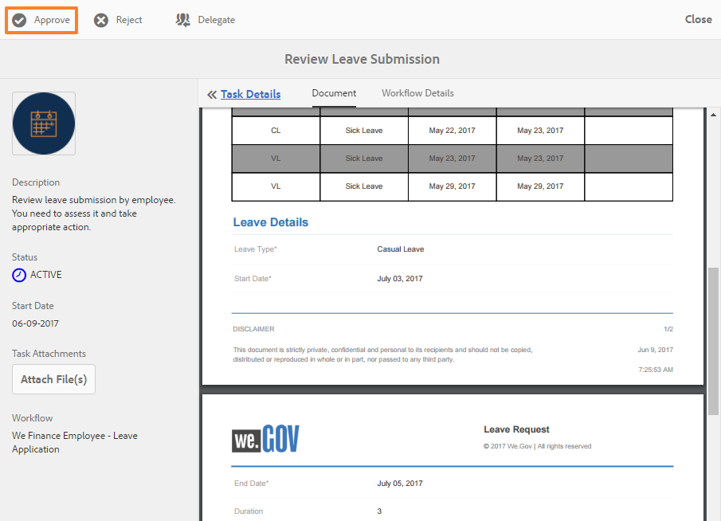

# 직원 셀프 서비스 참조 사이트 연습 {#employee-self-service-reference-site-walkthrough}

## 전제 조건 {#prerequisite}

AEM Forms 참조 사이트 설정 [및 구성에 설명된 대로 참조 사이트를 설정합니다](/help/forms/using/setup-reference-sites.md).

## 개요 {#overview}

회사 인트라넷에서 일반적으로 호스팅되는 직원 셀프 서비스 시스템은 직원들에게 책상에서 사용할 수 있는 다양한 정보와 서비스를 제공할 수 있습니다. 또한 직원의 고용 세부 정보에 액세스, 휴가 신청, 지출 보고서 제출과 같은 작업을 수행할 수 있는 권한을 제공하고 철저하게 관리할 수 있습니다. 또한 조직은 프로세스 효율성을 향상시키고 비용을 절감하면서 직원의 정보를 얻고 참여를 유도할 수 있습니다.

직원 셀프 서비스 참조 사이트는 AEM Forms을 활용하여 조직에서 직원 셀프 서비스 시스템을 구현하는 방법을 보여줍니다.

>[!NOTE]
>
>직원 셀프 서비스 사용 사례는 We.Finance 및 We.Gov 참조 사이트에서 모두 사용할 수 있습니다. 연습에서 사용되는 예제, 이미지 및 설명은 We.Finance 참조 사이트를 사용합니다. 그러나 이러한 사용 사례를 실행하고 We.Gov를 사용하여 결함을 검토할 수도 있습니다. 그렇게 하려면, **we-finance** 를 언급된 URL에서 **we-gov** 로 대체해야 합니다.

## 이해 설문지 충돌 연습 {#conflict-of-interest-questionnaire-walkthrough}

조직은 때때로 직원에게 자신의 조직과 충돌할 수 있는 외부 활동이나 직원의 개인 관계를 파악하기 위한 이해 상충 설문지 제출을 요청합니다.

사라의 조직의 규정 준수 부서는 직원들에게 이해의 상충 설문지를 제출하라고 요청했다.

### 사라는 이해의 상충 설문지를 제출한다 {#sarah-submits-the-conflict-of-interest-questionnaire}

사라는 조직의 포털에 가서 로그인하고 직원을 클릭하여 직원 대시보드에 액세스합니다. 직원 대시보드에서 이해의 상충 질문서를 찾은 다음 적용을 **[!UICONTROL 클릭합니다]**.

**그림:** *조직 포털*

**그림:** *직원 대시보드*

Sarah는 [다음] 단추를 사용하여 양식을 탐색하고 [소개] 및 [정의] 섹션을 읽어 봅니다. 그녀는 질문 섹션의 질문에 응답합니다. 마침내, 그녀는 서명하고 설문지를 제출한다.

조직 포털 및 설문조사는 응답성이 높고 모바일에 적합합니다. 다음 워크플로우는 Sarah가 모바일 장치에서 탐색하여 설문 조사를 제출하는 방법을 보여줍니다.

**작동 방식**

조직 포털 및 직원 대시보드는 AEM Sites 페이지입니다. 대시보드에는 이해의 상충 질서와 같은 여러 가지 셀프 서비스 옵션이 나열됩니다. 적용 단추는 적응형 양식에 연결됩니다.

적응형 양식에서는 규칙을 사용하여 [질문] 탭에 제공된 답변을 기반으로 정보를 표시합니다. 또한 양식에서 [선언] 탭에서 서명할 때 문지가능 구성 요소를 사용합니다. 적응형 양식을 검토합니다 `https://[authorHost]:[authorPort]/editor.html/content/forms/af/we-finance/employee/self-service/conflict-of-interest.html`.

**직접 보기**

Sarah `https://[publishHost]:[publishPort]/content/we-finance/global/en/self-service-forms.html` 의 사용자 이름/암호 `srose/srose` 로 이동하여 로그인합니다. 직원 **[!UICONTROL 을]** 클릭하여 대시보드에 액세스한 다음, 이해의 상충 질문 **[!UICONTROL 에]** 적용을 클릭합니다. 설문지를 검토하고 제출합니다.

### Gloria는 이해의 상충 설문지 제출 승인 {#gloria-reviews-and-approves-the-conflict-of-interest-questionnaire-submission}

사라가 제출한 이해의 상충 설문지는 글로리아 리오스 씨에게 검토를 위해 배정되었다. Gloria는 조직의 규정 준수 감사관으로 일한다. 글로리아는 AEM 받은 편지함에 로그인해서 그녀에게 할당된 일을 검토합니다. 그녀는 사라가 제출한 설문지를 승인하고 그 일을 완성한다.

**그림:** *글로리아 받은 편지함*

**figure:** *작업 열기*

**작동 방식**

이해의 상충 질문의 제출 작업은 승인을 위해 Gloria의 받은 편지함에 작업을 만드는 워크플로우를 트리거합니다. Forms Workflow 검토 위치 `https://[authorHost]:[authorPort]/editor.html/conf/global/settings/workflow/models/we-finance/employee/self-service/we-finance-employee-conflict-of-interest.html`

**직접 보기**

Gloria Rios `https://[publishHost]:[publishPort]/content/we-finance/global/en/login.html?resource=/aem/inbox.html` 의 사용자 이름/암호 `grios/password` 로 이동하여 로그인합니다. 이해의 상충 질문서를 위해 생성된 작업을 열고 승인합니다.

## 법인 카드 응용 프로그램 연습 {#corporate-card-application-walkthrough}

사라는 출장을 많이 다니기 때문에 출장 중에 회사 신용카드로 청구해야 한다. 그녀는 조직의 직원 포털을 통해 법인 카드를 신청한다.

### 사라는 법인 카드 신청서를 제출한다 {#sarah-submits-the-corporate-card-application}

Sarah는 조직의 포털에 가서 로그인하고 **[!UICONTROL Employee]** 를 클릭하여 직원 대시보드에 액세스합니다. 직원 대시보드에서 법인 카드 애플리케이션을 찾아 적용을 **[!UICONTROL 클릭합니다]**.

**그림:** *조직 포털*

**그림:** *직원 대시보드*

그녀는 법인 카드 **[!UICONTROL 신청서]** 를 클릭한다. 단일 페이지 애플리케이션이 열립니다. 모든 세부 사항을 기입하고 **[!UICONTROL 적용을]** 클릭하여 신청서를 제출합니다.

**작동 방식**

조직 포털 및 직원 대시보드는 AEM Sites 페이지입니다. 대시보드에는 법인 카드 응용 프로그램과 같은 여러 가지 셀프 서비스 옵션이 나열됩니다. 응용 프로그램의 [적용] 단추가 응용 양식에 연결되어 있습니다.

기업 카드 애플리케이션에 대한 적응형 양식은 간단하고 1페이지의 응답형 적응형 양식입니다. 텍스트, 전화, 숫자 상자 및 숫자 스테퍼와 같은 기본적인 적응형 양식 구성 요소를 사용합니다. 적응형 양식을 검토합니다.\
`https://[authorHost]:[authorPort]/editor.html/content/forms/af/we-finance/employee/self-service/corporate-card.html`.

**직접 보기**

Sarah `https://[publishHost]:[publishPort]/content/we-finance/global/en/self-service-forms.html` 의 사용자 이름/암호 `srose/srose` 로 이동하여 로그인합니다. 직원 **[!UICONTROL 을]** 클릭하여 대시보드에 액세스한 다음 법인 카드 애플리케이션에서 **[!UICONTROL 적용을]** 클릭합니다. 세부사항을 작성하고 신청서를 제출합니다.

### 글로리아, 법인 카드 신청서 검토 및 승인 {#gloria-reviews-and-approves-the-corporate-card-application}

사라가 제출한 법인 카드 신청서는 글로리아 리오스 씨에게 검토를 위해 배정되었다. 글로리아는 AEM 받은 편지함에 로그인해서 그녀에게 할당된 일을 검토합니다. 그녀는 사라가 제출한 지원서를 승인하고 그 일을 완성했다.

**그림:** *글로리아 받은 편지함*

**그림:** *작업 열기*

**작동 방식**

법인 카드 응용 프로그램의 제출 워크플로우는 승인을 위해 Gloria의 받은 편지함에 작업을 만드는 Forms 워크플로우를 트리거합니다. Forms Workflow 검토 위치 `https://[authorHost]:[authorPort]/editor.html/conf/global/settings/workflow/models/we-finance/employee/self-service/we-finance-employee-corporate-card.html`

**직접 보기**

Gloria Rios `https://[publishHost]:[publishPort]/content/we-finance/global/en/login.html?resource=/aem/inbox.html` 의 사용자 이름/암호 `grios/password` 로 이동하여 로그인합니다. 법인 카드 응용 프로그램에 대해 생성된 작업을 열고 승인합니다.

## 지출 보고서 제출 연습 {#expense-report-submission-walkthrough}

사라는 출장 중에 소비하므로, 승인을 위해 지출 보고서를 제출해야 한다. 그녀의 조직의 셀프 서비스 옵션을 통해 그녀는 지출 보고서를 온라인으로 제출할 수 있다.

### 사라는 지출 보고서 신청서를 제출한다 {#sarah-submits-the-expense-report-application}

Sarah는 조직의 포털에 가서 로그인하고 **[!UICONTROL Employee]** 를 클릭하여 직원 대시보드에 액세스합니다. 직원 대시보드에서 지출 보고서 애플리케이션을 찾아 적용을 **[!UICONTROL 클릭합니다]**.

**그림:** *조직 포털*

**그림:** *직원 대시보드*

그녀는 지출 보고서 **[!UICONTROL 신청서]** 적용을 클릭한다. 응용 프로그램 양식이 열리고 두 개의 탭, 즉 보고서 이름과 보고서 세부 정보가 있습니다. 보고서 세부 사항 탭의 **+** 아이콘을 사용하면 한 보고서에서 더 많은 비용을 추가할 수 있습니다.

조직 포털 및 애플리케이션은 응답성이 뛰어나고 모바일에 적합합니다. 다음 워크플로우는 Sarah가 모바일 장치에 대한 지출 보고서를 탐색하고 제출하는 방법을 보여줍니다.

**작동 방식**

조직 포털 및 직원 대시보드는 AEM Sites 페이지입니다. 대시보드에는 경비 보고서 애플리케이션과 같은 여러 가지 셀프 서비스 옵션이 나열됩니다. 적용 단추는 적응형 양식에 연결됩니다.

응용 양식의 보고서 이름 및 보고서 세부 사항 탭은 패널 구성 요소입니다. 보고서 세부 사항 패널에는 비용 패널이 있습니다. 보고서에서 여러 비용을 추가할 수 있는 반복 가능한 패널입니다. 응용 양식 및 해당 구성을 에서 검토합니다 `https://[authorHost]:[authorPort]/editor.html/content/forms/af/we-finance/employee/expense-report.html`.

**직접 보기**

Sarah `https://[publishHost]:[publishPort]/content/we-finance/global/en/self-service-forms.html` 의 사용자 이름/암호 `srose/srose` 로 이동하여 로그인합니다. 직원 **[!UICONTROL 을]** 클릭하여 대시보드에 액세스한 다음 비용 보고서 **[!UICONTROL 애플리케이션에서]** 적용을 클릭합니다. 세부사항을 작성하고 신청서를 제출합니다.

### 글로리아, 지출 보고서 검토 및 승인 {#gloria-reviews-and-approves-the-expense-report}

사라가 제출한 지출 보고서는 글로리아 리오스에 검토를 위해 배정되었다. 글로리아는 AEM 받은 편지함에 로그인해서 그녀에게 할당된 일을 검토합니다. 그녀는 사라가 제출한 지원서를 승인하고 그 일을 완성했다.

**그림:** *글로리아 받은 편지함*

**그림:** *작업 열기*

**작동 방식**

비용 보고서 애플리케이션의 제출 워크플로우는 승인을 위해 Gloria의 받은 편지함에 작업을 만드는 Forms 워크플로우를 트리거합니다. Forms Workflow 검토 위치 `https://[authorHost]:[authorPort]/editor.html/conf/global/settings/workflow/models/we-finance/employee/self-service/we-finance-employee-expense-report-workflow.html`

**직접 보기**

Gloria Rios `https://[publishHost]:[publishPort]/content/we-finance/global/en/login.html?resource=/aem/inbox.html` 의 사용자 이름/암호 `grios/password` 로 이동하여 로그인합니다. 지출 보고서 애플리케이션에 대해 생성된 작업을 열고 승인합니다.

## 애플리케이션 연습 종료 {#leave-application-walkthrough}

사라는 다음 달에 가족 휴가를 계획하고 있고 일 주 휴가를 신청하려고 한다.

### 사라는 휴가 신청서를 제출한다 {#sarah-submits-the-leave-application}

Sarah는 조직의 포털에 가서 로그인하고 **[!UICONTROL Employee]** 를 클릭하여 직원 대시보드에 액세스합니다. 직원 대시보드에서 휴가 신청서를 찾아 적용을 **[!UICONTROL 클릭합니다]**.

**그림:** *조직 포털*

**그림:** *직원 대시보드*

출발 신청서는 사라의 이름과 직원 ID가 양식에 미리 입력되어 있습니다. 휴가와 내역도 모두 표시돼 있다. 그녀는 휴가 세부 사항을 작성하고 승인을 위해 신청서를 제출한다.

조직 포털 및 애플리케이션은 응답성이 뛰어나고 모바일에 적합합니다. 다음 워크플로우는 Sarah가 모바일 장치에서 응용 프로그램을 탐색하고 제출하는 방법을 보여줍니다.

**작동 방식**

조직 포털 및 직원 대시보드는 AEM Sites 페이지입니다. 대시보드에는 leave 응용 프로그램과 같은 여러 셀프 서비스 옵션이 나열됩니다. 적용 단추는 적응형 양식에 연결됩니다.

leave 애플리케이션에 대한 적응형 양식은 직원 휴가 양식 데이터 모델을 기반으로 합니다. 왼쪽 균형 섹션에서 왼쪽 균형 테이블은 `getLeavesOf` 양식 데이터 모델 서비스를 사용하여 채워집니다. 시작 및 종료 날짜 필드는 날짜 값이 현재 날짜 이후인지 확인하는 규칙을 사용합니다. 종료 기간은 함수를 사용하여 `calcBusinessDays` 계산됩니다.

다음 위치에서 적응형 양식과 양식 데이터 모델을 검토할 수 있습니다.

`https://[authorHost]:[authorPort]/editor.html/content/forms/af/we-finance/employee/self-service/leave-application.html`

`https://[authorHost]:[authorPort]/aem/fdm/editor.html/content/dam/formsanddocuments-fdm/db`

**직접 보기**

Sarah `https://[publishHost]:[publishPort]/content/we-finance/global/en/self-service-forms.html` 의 사용자 이름/암호 `srose/srose` 로 이동하여 로그인합니다. 직원을 **[!UICONTROL 클릭하여]** 대시보드에 액세스한 다음 애플리케이션 **[!UICONTROL 에서 적용]** 을 클릭합니다. 세부사항을 작성하고 신청서를 제출합니다.

### 글로리아는 휴가 신청을 검토하고 승인한다 {#gloria-reviews-and-approves-the-leave-application}

사라가 제출한 휴가 신청서는 글로리아 리오스에 검토를 위해 배정되었다. 글로리아는 AEM 받은 편지함에 로그인해서 그녀에게 할당된 일을 검토합니다. 그녀는 사라가 제출한 지원서를 승인하고 그 일을 완성했다.

**그림:** *글로리아 받은 편지함*

**그림:** *작업 열기*

**작동 방식**

왼쪽 응용 프로그램의 제출 워크플로우는 승인을 위해 Gloria의 받은 편지함에 작업을 만드는 Forms 워크플로우를 트리거합니다. Forms Workflow 검토 위치 `https://[authorHost]:[authorPort]/editor.html/conf/global/settings/workflow/models/we-finance/employee/self-service/we-finance-employee-leave-application.html`

**직접 보기**

Gloria Rios `https://[publishHost]:[publishPort]/content/we-finance/global/en/login.html?resource=/aem/inbox.html` 의 사용자 이름/암호 `grios/password` 로 이동하여 로그인합니다. 애플리케이션을 종료하기 위해 만든 작업을 열고 승인합니다.
