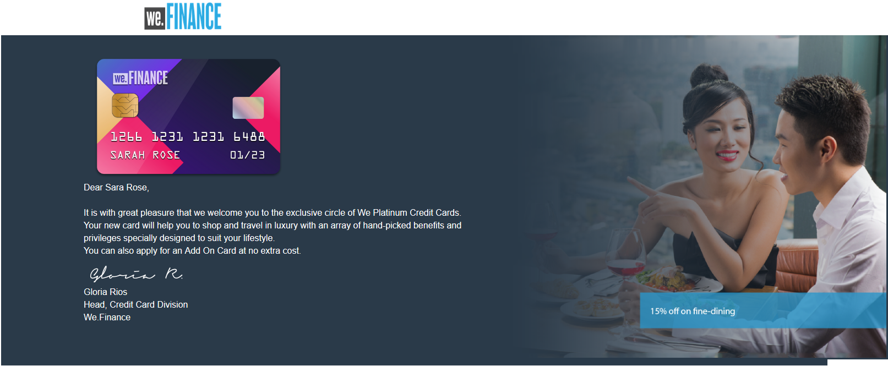
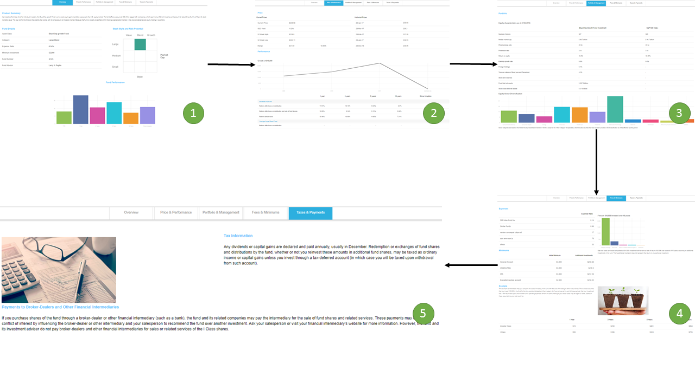
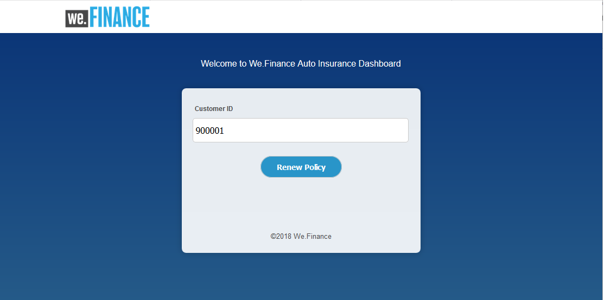

# We.Finance 참조 사이트 안내 {#we-finance-reference-site-walkthrough}

## 전제 조건 {#pre-requisites}

[AEM Forms 참조 사이트 설정 및 구성](/help/forms/using/setup-reference-sites.md)에 설명된 대로 참조 사이트를 설정합니다.

## We.Finance 참조 사이트 시나리오 {#we-finance-reference-site-scenarios}

We.Finance는 금융 서비스 도메인의 선도적인 조직으로, 다양한 고객 프로필 요구 사항에 맞게 포괄적이고 개인화된 금융 솔루션을 제공합니다. 그들은 신용 카드, 주택 담보 대출, 주택 보험 서비스를 제공한다.

고객의 목표는 선호하는 장치에서 기존 및 잠재 고객에게 도달하고, 서비스의 이점을 설명하고, 서비스 등록을 지원하는 것입니다. 게다가, 그들은 고객들이 흥미를 느낄 수 있는 애드온 카드들과 같은 더 많은 금융 상품들을 기대하고 있습니다.

We.Finance 사용 사례에 대한 자세한 연습을 살펴보고 금융 조직에서 AEM Forms을 통해 목표를 달성하는 방법을 알아봅니다. 다음 연습은 다음과 같습니다.

* [신용 카드 신청 안내](#credit-card-application-walkthrough)
* [주택 담보 대출 신청 연습](#home-mortgage-application-walkthrough)
* [Microsoft Dynamics를 사용한 홈 모기지 응용 프로그램 연습](#home-mortgage-application-walkthrough-with-microsoft-dynamics)
* [주택 보험 신청 안내](#home-insurance-application-walkthrough)
* [재산 관리 연습](#wealthmanagementwalkthrough)
* [자동 보험 적용 연습](#autoinsuranceapplicationwalkthrough)

## 신용 카드 신청 연습 {#credit-card-application-walkthrough}

We.Finance 신용 카드 애플리케이션 시나리오에는 다음 가상 사용자가 포함됩니다.

* We.Finance 고객 Sarah Rose
* We.Finance, 신용 카드 및 모기지 책임자 Gloria Rios

다음 인포그래픽은 신용 카드 애플리케이션의 단계별 워크플로우를 보여줍니다.

AEM Forms이 We.Finance에서 목표를 달성하는 데 어떻게 도움이 되었는지 자세히 알아보려면 참조 사이트 시나리오를 자세히 살펴보십시오.

### Sarah는 We.Finance로부터 뉴스레터를 받고 신용 카드 {#sarah-receives-a-newsletter-from-we-finance-and-applies-for-a-credit-card}를 신청한다

사라 로즈는 기존 We.Finance 고객입니다. 그녀는 We.Finance로부터 새로운 신용카드에 대한 뉴스레터를 제공받는다. 그녀는 그 제안이 재미있다고 생각하고 신용카드로 신청하기로 결정했다. 뉴스레터에서 지금 적용 단추를 클릭하면 We.Finance 포털의 신용 카드 애플리케이션으로 이동합니다.

#### 작동 방법 {#how-it-works}

Sarah에 전송된 뉴스레터는 지정된 이메일 ID로 이메일을 트리거하는 사용자 지정 구현입니다. 이메일의 지금 적용 단추는 게시 인스턴스의 적응형 양식인 신용 카드 애플리케이션에 연결됩니다.

#### 직접 {#see-it-yourself} 보기

게시 인스턴스에서 다음 URL을 열어 뉴스레터 이메일을 트리거합니다. Newsletter를 수신할 유효한 이메일 계정으로 `[emailID]`을 바꾸십시오. 뉴스레터를 열고 **[!UICONTROL 지금 적용]**&#x200B;을 클릭하여 신용 카드 애플리케이션으로 이동합니다.

`https://[publishServer]:[publsihPort]/content/campaigns/we-finance/start.html?app=cc&email=[emailID]&givenName=Sarah&familyName=Rose`

### Sarah는 오퍼가 흥미로울 수 있음을 발견하여 {#sarah-finds-the-offer-interesting-and-chooses-to-apply} 적용을 선택합니다.

Sarah는 신용카드를 신청하기로 결정하고 이메일에서 **[!UICONTROL 지금 적용]** 단추를 탭합니다. We.Finance 포털에서 Sarah가 신용카드 신청서를 제출한다. 애플리케이션 양식은 카드 레이아웃을 사용하여 섹션으로 구성됩니다.

Sarah는 사용 가능한 옵션에서 신용 카드를 선택하고 **[!UICONTROL 계속]**&#x200B;을 클릭합니다.

개인 정보 페이지에서, 사라는 자신의 사회 보장 번호를 제공하면서, 그녀는 자신의 자격 증명으로 로그인하라는 메시지를 받습니다.

사라는 기존 We.Finance 고객입니다. 그녀는 자신의 We.Finance 계정 자격 증명으로 로그인하고 그녀의 개인 세부 사항이 자동으로 이 형식으로 채워진다. 사라는 계속해서 지원서를 작성하는데, 그것은 그녀가 참석해야 하는 회의에 대한 미리 알림 메시지가 나타날 때입니다. 응용 프로그램 양식에서 **[!UICONTROL 내 진행률]**&#x200B;을 저장합니다. 이 대화 상자는 사라가 지금까지 입력한 모든 정보를 저장해 두었고, 그녀가 나중에 완료할 수 있도록 초안 애플리케이션에 대한 링크가 있는 이메일을 받고 싶은지를 확인하는 대화 상자가 나타납니다.

Sarah가 **[!UICONTROL 메일 보내기]**&#x200B;를 클릭합니다. 그녀는 신용카드 신청서를 재개할 수 있는 링크가 포함된 이메일을 수신한다.

<!--Theses sections used to be an accordion until converted to straight Markdown. When accordions are enabled, revert-->

### Sarah가 모바일 장치 {#a-sarah-access}에서 신용 카드 애플리케이션에 액세스합니다

Sarah가 모바일 장치에서 신용 카드 애플리케이션에 액세스하는 경우, 응답형 애플리케이션은 모바일 장치에 최적화된 보기에서 열립니다. 이 보기에서는 응용 프로그램 양식이 한 번에 하나의 섹션으로 렌더링됩니다. 이를 통해 Sarah는 애플리케이션을 탐색할 때 정보를 보고 점진적으로 제공할 수 있습니다.

### 작동 방법 {#a-how-it-works}

**[!UICONTROL 지금 적용]** 버튼은 Sarah를 신용 카드 애플리케이션으로 보냅니다. 응용 프로그램은 적응형 양식이며 `https://[host]:[Port]/editor.html/content/forms/af/we-finance/cc-app.html`의 작성 인스턴스에서 검토할 수 있습니다.

적응형 양식에서 검토할 수 있는 주요 기능 중 일부는 다음과 같습니다.

* XSD 스키마를 기반으로 합니다.
* 레이아웃에 대한 We.Finance 테마 A와 스타일링을 위해 We.Finance 템플릿을 사용하여 빌드되었습니다. 또한 모바일 탐색을 위해 양식 헤더 레이아웃에서 패널 제목 없이 레이아웃 을 사용합니다. 모바일 장치에서 열리면 점진적 모바일 레이아웃이 표시됩니다. `https://[host]:[Port]/libs/wcm/core/content/sites/templates.html/conf/we-finance`에서 템플릿을 검토하고 `https://[host]:[Port]/editor.html/content/dam/formsanddocuments-themes/we-finance/we-finance-theme-a/jcr:content`에서 테마를 검토할 수 있습니다.
* 여기에는 로그인한 사용자의 사용자 세부 사항을 미리 채우기 위해 양식 데이터 모델 서비스를 호출하는 적응형 양식 규칙이 포함됩니다. 또한 이 서비스는 양식에 제공된 사회 보장 번호나 이메일 주소별로 정보를 미리 채우기 위한 서비스를 호출합니다. `https://[host]:[Port]/aem/forms.html/content/dam/formsanddocuments-fdm`에서 양식 데이터 모델 및 해당 서비스를 검토할 수 있습니다.
* 다양한 적응형 양식 구성 요소를 사용하여 입력 및 사용자 응답에 맞게 조정됩니다. 또한 HTML5 입력 유형을 지원하는 이메일과 같은 구성 요소를 사용합니다.
* 서명 단계 구성 요소를 사용하여 완료된 양식을 표시하고 양식에 전자 서명을 허용합니다.
* 내 진행률 저장 단추는 사용자의 고유 ID를 생성하고 부분적으로 채워진 응용 프로그램을 AEM 저장소의 노드에 초안으로 저장합니다. 또한 초안 응용 프로그램이 포함된 노드에 대한 링크가 포함된 이메일을 보낼 수 있는 권한을 찾는 대화 상자가 표시됩니다. 확인 대화 상자의 메일 보내기 단추는 초안이 포함된 노드에 대한 링크가 있는 이메일을 트리거합니다.
* AEM 호출 워크플로우 제출 작업을 사용하여 신용 카드 승인 워크플로우를 트리거합니다. `https://[host]:[Port]/editor.html/conf/global/settings/workflow/models/we-finance-credit-card-workflow.html`에서 이 양식에 사용된 워크플로우를 검토할 수 있습니다

스키마, 구성 요소, 규칙, 양식 데이터 모델, 양식 워크플로우 및 양식 작성에 사용되는 제출 작업을 이해하려면 양식을 검토하는 것이 좋습니다.

신용 카드 애플리케이션 적응형 양식에 사용되는 기능에 대한 자세한 내용은 다음 설명서를 참조하십시오.

* [적응형 양식 작성 소개](/help/forms/using/introduction-forms-authoring.md)
* [XML 스키마를 사용하여 적응형 양식 만들기](/help/forms/using/adaptive-form-xml-schema-form-model.md)
* [규칙 편집기](/help/forms/using/rule-editor.md)
* [테마](/help/forms/using/themes.md)
* [데이터 통합](/help/forms/using/data-integration.md)
* [적응형 양식에서 Adobe Sign 사용](/help/forms/using/working-with-adobe-sign.md)
* [OSGi의 Forms 중심 워크플로우](/help/forms/using/aem-forms-workflow.md)

### 직접 {#a-see-it-yourself} 보기

Sarah Rose로 로그인하면 신용 카드 애플리케이션에서 **[!UICONTROL 지금 적용]** 단추를 클릭합니다. 일부 세부 사항을 입력하고 다양한 적응형 양식 구성 요소를 탐색한 다음 **[!UICONTROL 내 진행률 저장]** 을 클릭하여 초안 응용 프로그램에 연결되는 **[!UICONTROL 다시 시작]** 단추가 있는 이메일을 수신합니다. 이메일을 받을 애플리케이션 양식에 이메일 ID를 지정해야 합니다.

다음 위치에서 사용할 수 있는 We.Finance 테마를 검토합니다.

`https://<host>:<AuthorPort>/editor.html/content/dam/formsanddocuments-themes/we-Finance/we-Finance-Theme-A/jcr:content`

We.Finance 템플릿을 검토할 수 있는 위치:

`https://<host>:<AuthorPort>/editor.html/conf/we-finance/settings/wcm/templates/we-finance-template/structure.html`

### Sarah가 다시 시작하고 응용 프로그램 {#sarah-resumes-and-submits-the-application} 제출

Sarah는 나중에 돌아와서 We.Finance에서 이메일을 찾습니다. Jan은 전자 메일에 있는 **[!UICONTROL 다시 시작]** 단추를 클릭하면 신용 카드 초안 애플리케이션으로 이동합니다. 그녀가 이전에 작성한 정보는 미리 채워져 있다. 나머지 지원서를 작성하고 서명하고 제출합니다.

또는 We.Finance 홈 페이지의 **[!UICONTROL My Forms]** 아래에 있는 초안 애플리케이션에 액세스할 수 있습니다.

#### 작동 방법 {#how-it-works-1}

전자 메일의 [다시 시작] 단추는 Sarah가 초안 응용 프로그램을 포함하는 노드로 리디렉션합니다.

#### 직접 {#see-it-yourself-1} 보기

애플리케이션 양식을 채우는 동안 지정한 이메일 ID에서 초안 애플리케이션에 대한 링크가 포함된 이메일을 수신해야 합니다. 계속 진행해서 지원서의 나머지 부분을 기입하고 제출하십시오.

### We.Finance가 응용 프로그램 {#approving-the-application}을 수신하고 승인합니다.

We.Finance는 Sarah가 제출한 신용카드 신청서를 받는다. 일은 글로리아 리오스에 맡긴다. 그녀는 AEM 받은 편지함에서 그 일을 검토하고 승인한다.

#### 작동 방법 {#how-it-works-2}

Sarah가 신용카드 신청서를 작성하고 제출하면, Gloria의 AEM 받은 편지함에서 Forms Workflow 트리거과 작업이 만들어집니다.

OSGi의 AEM Forms에서는 적응형 양식 기반 워크플로우를 구축할 수 있는 양식 중심의 워크플로우를 제공합니다. 이러한 워크플로우는 검토 및 승인, 비즈니스 프로세스 흐름, 문서 서비스 시작, Adobe Sign 서명 워크플로우와 통합 등에 사용할 수 있습니다. 자세한 내용은 OSGi](/help/forms/using/aem-forms-workflow.md)의 [Forms 중심의 워크플로우를 참조하십시오.

다음 이미지는 신용 카드 애플리케이션을 처리하고 애플리케이션의 PDF 출력을 생성하는 AEM 워크플로우를 나타냅니다.

#### 직접 {#see-it-yourself-2} 보기

https://&lt;*hostname*>:&lt;*PublishPort*>/content/we-finance/global/en.html에서 we.finance 사이트에 대한 AEM 받은 편지함에 액세스할 수 있습니다. 페이지에서 **[!UICONTROL 로그인]**&#x200B;을 탭하고, **[!UICONTROL 대리인]**&#x200B;으로 로그인 확인란을 선택하고, Gloria Rios의 사용자 이름/암호로 `grios/password`를 사용하여 AEM 받은 편지함에 로그인하고, 신용 카드 애플리케이션을 승인합니다. 양식 중심의 워크플로우 작업에 AEM 받은 편지함을 사용하는 방법에 대한 자세한 내용은 [AEM 받은 편지함에서 Forms 응용 프로그램 및 작업 관리](/help/forms/using/manage-applications-inbox.md)를 참조하십시오.

이 신청서를 승인하면, Sarah는 환영 키트가 포함된 이메일을 받게 된다.

### Sarah는 시작 키트를 수신하고 추가 기능 카드 {#sarah-receives-the-welcome-kit-and-applies-for-an-add-on-card}를 신청합니다.

새라의 신용카드 지원서가 승인됨에 따라, 그녀는 환영 키트에 대한 링크가 있는 이메일을 수신한다. 그녀는 신용 카드 계좌 정보를 포함하는 환영 키트를 엽니다. 시작 키트는 사라를 위한 개인화된 홍보 오퍼도 표시합니다. 그녀가 아래로 스크롤할 때, 시작 키트에는 추가 기능 카드에 적용하기 위한 포함 양식이 포함되어 있습니다. Sarah는 시작 키트 내에서 필요한 세부 사항을 빠르게 기입하고 추가 기능 카드를 신청합니다. 추가 기능 카드 애플리케이션에 대한 확인 대화 상자가 나타납니다.

환영 키트는 Sarah를 위한 개인화이며 Sarah와 관련된 정보를 보여줍니다. PDF 버전의 시작 키트를 다운로드할 수 있는 옵션을 제공합니다.

환영 키트에는 We.Finance 포털을 방문하지 않고도 Sarah가 환영 키트 내에서 추가 기능 카드를 신청하기 위해 작성하고 제출할 수 있는 다른 응용 프로그램 양식이 포함되어 있습니다.

#### 작동 방법 {#how-it-works-3}

시작 키트는 `cq-we-finance-content-pkg.zip` 패키지에 포함된 대화형 통신입니다. 시작 키트에서 신용 카드의 이점을 소개하는 데스크탑 버전의 대화형 카드는 문서 조각의 기본 카드 레이아웃을 사용하여 생성된 사용자 지정 레이아웃입니다.

추가 기능 카드 애플리케이션은 시작 키트 대화형 커뮤니케이션에 포함된 적응형 양식입니다.

#### 직접 {#see-it-yourself-3} 보기

이전 단계에서 받은 이메일에서 **[!UICONTROL 다시 시작]** 단추를 클릭합니다. 초안 응용 프로그램이 열립니다. 모든 세부 사항을 기입하고 신청서를 제출하십시오. 그러면 환영 키트를 받으실 수 있습니다 환영 키트를 검토합니다.

다음 URL에서 시작 키트를 볼 수도 있습니다.

https://&lt;*host*:&lt;*port*>/content/aemforms-refsite/doclink.html?document=/content/forms/af/we-finance/creditcard/creditformatcomekit&amp;customerId=197&amp;channel=web

작성자 및 게시 인스턴스에서 액세스할 수 있습니다.

### Sarah가 신용카드 명세서 {#sarah-receives-a-credit-card-statement}를 받았습니다.

사라가 신용카드를 사용하기 시작하면서, 그녀는 We.Finance로부터 그녀의 신용카드 명세서를 포함하는 또 다른 이메일을 받는다. 다음 이미지는 모바일의 신용카드 명세서에 대한 링크가 있는 이메일을 보여줍니다.

Sarah가 이메일에서 명세서 보기를 클릭하여 신용 카드 명세서를 봅니다. 그 문장은 상호작용 통신이다. 웹 및 인쇄(PDF) 버전이 모두 포함되어 있습니다. 이 명령문은 Forms 데이터 모델과 통합되어 있으며 고객 고유의 데이터를 데이터베이스에서 검색합니다. 대화형 문은 다음과 같은 다양한 요소를 구성합니다.

* 명세서 요약
* 자세한 경비 보고서
* 그래픽 비용 분석
* 명세서 내에서 만기 금액에 대한 지급을 수행하는 선택 사항
* 결제 영수증 다운로드

사라는 오프라인 보관을 위해 포털에 가거나 그녀의 이메일을 통해 신용카드 명세서의 PDF 버전을 검색할 필요가 없다. 그녀는 단지 다운로드 문을 클릭해서 그 진술의 PDF 버전을 다운로드한다.

자세한 문은 응답형 테이블에 배치됩니다. 또한 명세서 내에서 일부 또는 전체 기한 금액을 지급할 수 있는 옵션을 제공합니다.

사라는 진술서에서 결제를 예약한다. Sarah는 또한 연액 지불 옵션을 사용하여 결제를 동일한 부분으로 나눌 수 있습니다.

#### 작동 방법 {#how-it-works-4}

신용카드 명세서는 대화형 커뮤니케이션입니다. 명세서에 있는 자세한 비용 테이블은 응답형 테이블입니다. 비용 분석에 대한 그래픽은 차트 구성요소로서 비용 테이블을 읽고 원형 차트를 생성합니다.

#### 직접 {#see-it-yourself-4} 보기

다음 URL에서 대화형 신용 카드 명세서를 검토할 수 있습니다.

https://&lt;*hostname*:&lt;*port*>/content/aemforms-refsite/doclink.html?document=/content/forms/af/we-finance/credit-card/credit-card-statement&amp;customerId=197&amp;channel=web

작성자 및 게시 인스턴스에서 액세스할 수 있습니다.

신용 카드 명세서에는 명세서 끝에 프로모션 오퍼가 표시됩니다. Adobe Target과 AEM Forms Interactive Communication을 통합하여 특정 고객 세그먼트를 기반으로 프로모션 타겟팅된 오퍼를 제공할 수 있습니다. 사용자 지정 및 타깃팅된 오퍼에 Adobe Target을 사용하도록 대화형 커뮤니케이션을 구성하려면 [타깃팅된 경험 만들기](/help/forms/using/experience-targeting-forms.md)를 참조하십시오.

### We.Finance는 신용 카드 응용 프로그램 {#we-finance-analyzes-the-performance-of-the-credit-card-application} 의 성능을 분석합니다.

We.Finance는 때때로 신용카드 신청서의 실적을 검토하여 고객이 직면하고 있는 모든 문제를 확인합니다. 이 분석을 사용하여 사용자 경험을 향상하고 양식의 포기 비율을 줄여 전환을 향상하기 위해 신용 카드 애플리케이션에서 필요한 변경 사항에 대한 올바른 결정을 내릴 수 있습니다. 또한 AEM Forms과 Adobe Analytics의 통합을 활용하여 분석할 수 있습니다. 다음 이미지는 분석 대시보드를 나타냅니다.

Analytics 대시보드를 해석하는 방법에 대한 자세한 내용은 [AEM Forms Analytics 보고서 보기 및 이해](/help/forms/using/view-understand-aem-forms-analytics-reports.md)를 참조하십시오.

#### 작동 방법 {#how-it-works-5}

신용 카드 신청 양식에 대한 성능 지표는 Adobe Analytics을 사용하여 추적됩니다. Adobe Analytics 구성 및 보고서 보기에 대한 자세한 내용은 [양식 및 문서에 대한 분석 구성](/help/forms/using/configure-analytics-forms-documents.md)을 참조하십시오.

#### 직접 {#see-it-yourself-br} 보기

Analytics 보고서를 보고 살펴보려면 참조 사이트에서 신용 카드 애플리케이션에 대한 시드 데이터를 제공하고 있습니다. 시드 데이터를 사용하기 전에 [Analytics 구성](/help/forms/using/setup-reference-sites.md#configureanalytics)을 참조하십시오. 시드 데이터로 보고서를 보려면 작성자 인스턴스에서 다음 단계를 수행하십시오.

1. https://&lt;*hostname*>의 **[!UICONTROL Forms 및 문서]** UI로 이동합니다.&lt;*AuthorPort*>/aem/forms.html/content/dam/formsanddocuments.

1. **[!UICONTROL We.Finance]** 폴더를 열려면 클릭합니다.
1. **[!UICONTROL 신용 카드 지원]** 적응형 양식을 선택한 다음 도구 모음에서 **[!UICONTROL Analytics 사용]**&#x200B;을 클릭합니다.

1. 적응형 양식을 다시 선택하고 도구 모음에서 **[!UICONTROL Analytics 보고서]** 를 클릭하여 보고서를 생성합니다. 처음에는 빈 보고서가 표시됩니다.

시드 데이터로 분석 보고서를 생성하려면:

1. CRXDE Lite의 주소 브라우저에서 다음을 입력합니다.`/apps/we-finance/demo-artifacts/analyticsTestData/Credit card Analytics Test Data`
1. 테스트 데이터는 왼쪽 디렉토리 구조에서 선택됩니다.
1. 선택한 파일을 두 번 클릭하여 오른쪽 패널에서 해당 컨텐츠를 엽니다.
1. 시드 데이터 파일의 모든 컨텐츠를 복사합니다.
1. CRXDE에서 다음 위치로 이동합니다.`/content/dam/formsanddocuments/we-finance/cc-app/jcr:content/analyticsdatanode/lastsevendays`
1. **[!UICONTROL 속성]** 아래의 **[!UICONTROL analyticsdata]** 필드에서 시드 데이터 파일의 복사한 콘텐츠를 붙여넣습니다.

1. **신용 카드 신청** 적응형 양식을 선택하고 도구 모음에서 **[!UICONTROL Analytics 보고서]** 를 클릭하여 시드 데이터가 있는 보고서를 생성합니다.

**신용 카드 신청 A/B 테스트**

We.Finance에서는 신용 카드 애플리케이션의 성능을 분석하고 지속적으로 개선하는 것 외에도 A/B 테스트를 만들기 위해 AEM Forms과 Target의 통합을 활용합니다. 따라서 양식 완료 및 제출 측면에서 신용 카드 애플리케이션 양식의 다양한 경험을 제공하고 전환율이 향상된 경험을 식별할 수 있습니다.

AEM Forms 서버에서 Target을 구성하려면 [AEM Forms에서 Target 설정 및 통합 을 참조하십시오](/help/forms/using/ab-testing-adaptive-forms.md#set%20up%20and%20integrate%20target%20in%20aem%20forms).

We.Finance 신용 카드 신청 양식에 대한 A/B 테스트 생성을 경험하려면 다음 단계를 수행하십시오.

1. https://&lt;*hostname*>의 **[!UICONTROL Forms 및 문서]**:&lt;*AuthorPort*>/aem/forms.html/content/dam/formsanddocuments로 이동합니다.

1. **[!UICONTROL We.Finance]** 폴더를 열려면 클릭합니다.
1. **[!UICONTROL 신용 카드 신청]** 적응형 양식을 선택합니다.
1. 도구 모음에서 **[!UICONTROL 자세히]**&#x200B;를 클릭하고 **[!UICONTROL Configure A/B Testing]**&#x200B;을 선택합니다. A/B 테스트 구성 페이지가 열립니다.

1. **[!UICONTROL 활동 이름]**&#x200B;을 지정합니다.
1. 대상 드롭다운 목록에서 양식의 다른 경험을 제공할 대상을 선택합니다. 예를 들어 **Chrome**&#x200B;을 사용하는 방문자.
1. 경험 A 및 B에 대한 **[!UICONTROL 경험 배포]** 필드에서 백분율로 전체 대상 간 경험 분포를 결정합니다. 예를 들어, 경험 A와 B에 대해 40, 60을 각각 지정하는 경우 경험 A는 대상자의 40%에게 제공되고, 나머지 60%에는 경험 B가 표시됩니다.
1. **구성**&#x200B;을 클릭합니다. A/B 테스트 만들기를 확인하는 대화 상자가 나타납니다.
1. **완료**&#x200B;를 클릭합니다.
1. **신용 카드 신청** 양식을 선택하고 **편집**&#x200B;을 클릭합니다. 경험 중 하나를 여는 선택 사항을 제공합니다. **경험 B**&#x200B;을 클릭합니다. 양식이 편집 모드로 열립니다.

1. 기본 경험 A와 다른 경험을 만들려면 원하는 대로 양식을 수정합니다.
1. Forms 및 문서 UI로 이동하여 양식을 선택하고 **더 보기**&#x200B;를 클릭한 다음 **A/B 테스트 시작**&#x200B;을 선택합니다.

1. 이제 다음 url을 사용하여 chrome 브라우저에서 양식을 여러 번 엽니다.

   `https://[hostname]:[port]/content/dam/formsanddocuments/we-finance/cc-app/jcr:content?wcmmode=disabled`

   >[!NOTE]
   >
   >다음에 양식을 열기 전에 브라우저의 쿠키 지속성 중에서 이름이 **mbox**&#x200B;인 쿠키를 제거합니다. 양식의 경험 A와 B가 임의로 표시됩니다.

1. 양식을 선택하고 **더 보기**&#x200B;를 클릭한 다음 **A/B 테스트 보고서**&#x200B;를 클릭합니다. 테스트를 시작했기 때문에 보고서에서 많은 데이터를 찾을 수 없습니다. 이제 A/B 테스트 보고서가 어떻게 표시되는지 확인하기 위해 몇 가지 시드 데이터를 제공하겠습니다.

1. CRXDE Lite을 열고 다음 파일을 백업합니다./libs/fd/fmaddon/gui/components/admin/targetreport/clientlibs/targetreport/js/targetreport.js
1. 위에 언급된 파일에서 함수 `onReportLoadSuccess`의 정의를 다음 파일의 함수 정의로 바꿉니다./apps/we-finance/demo-artifacts/targetreport.js

   **참고:**  이러한 변경 사항은 데모 용도로만 사용됩니다. 이 절차를 완료한 후 파일 내용을 복원해야 합니다.

1. 생성한 보고서를 새로 고치면 다음과 같은 항목이 표시됩니다. 보고 대시보드를 검토합니다.

A/B 테스트를 종료하려면 보고 대시보드에서 **End A/B test** 단추를 클릭하십시오. 이때 경험을 선언하라는 대화 상자가 표시됩니다. 우승자를 선택하고 확인을 클릭하여 A/B 테스트를 종료합니다.

경험 A를 승자로 선택하면 A/B 테스트가 종료되고 앞으로 진행되면 Chrome의 모든 대상을 포함한 Experience A만 제공됩니다.

## 주택 담보 대출 신청 연습 {#home-mortgage-application-walkthrough}

We.Finance 홈 모기지 시나리오는 다음과 같은 개인입니다.

* We.Finance 고객 Sarah Rose
* We.Finance, 신용 카드 및 모기지 책임자 Gloria Rios
* John Doe, We.Finance 고객 지원 담당자

다음 인포그래픽에는 주택 담보 대출 애플리케이션의 단계별 워크플로우가 나와 있습니다.

이제 참조 사이트 시나리오의 단계를 자세히 살펴보고 AEM Forms이 We.Finance에서 목표를 달성하는 데 어떻게 도움이 되었는지 알아봅니다.

### Sarah는 We.Finance 웹 사이트를 방문하여 주택 담보 대출 {#sarah-visits-we-finance-website-and-applies-for-home-mortgage} 신청을 합니다.

사라 로즈는 집을 사고 주택 담보 대출 계획을 찾을 계획이다. 그녀는 We.Finance 고객이며, 따라서 We.Finance 포털을 방문하여 주택 담보 대출 상품을 탐색합니다. 그녀는 대출 섹션으로 가서 포털에서 모기지 계산기를 찾습니다. 그녀는 세부 사항을 입력하고 모기지 계획을 반환하는 내 모기지 계산 을 클릭합니다.

 
**그림:** *모기지 계산기*

**그림:** *모기지 계산기 결과*

#### 작동 방법 {#how-it-works-6}

대출 페이지의 주택 담보 대출 계산기는 AEM Sites 페이지에 포함된 적응형 양식입니다. `https://[authorHost]:[authorPort]/editor.html/content/we-finance/global/en/loan-landing-page.html`의 편집 모드에서 대출 페이지를 검토할 수 있습니다.

적응형 양식인 내장 모기지 계산기는 규칙을 사용하여 계산기 필드에 제공된 대출 세부 사항을 기반으로 EMI 금액을 계산합니다. `https://[authorHost]:[authorPort]/editor.html/content/forms/af/we-finance/hm-calc.html`에서 적응형 양식을 검토할 수 있습니다.

#### 직접 {#see-it-yourself-5} 보기

`https://<publishHost>:<publishPort>/content/we-finance/global/en.html`에 있는 We.Finance 포털로 이동하여 **[!UICONTROL Loans]**&#x200B;를 클릭합니다. 모기지 계산기에 세부 사항을 제공하고 결과를 확인합니다.

### Sarah는 오퍼가 흥미로울 수 있음을 발견하여 {#sarah-finds-the-offer-interesting-and-chooses-to-apply-1} 적용을 선택합니다.

Sarah는 주택 담보 대출 신청을 선택하고 주택 담보 대출 계산기 결과 **[!UICONTROL 지금 적용]**&#x200B;을 클릭한다. 그것은 주택 담보 대출 신청을 엽니다.

Sarah가 모바일 장치에서 홈 모기지 애플리케이션에 액세스하는 경우, 모바일 장치에서 볼 수 있도록 최적화된 보기에서 애플리케이션 양식이 열립니다. 이 보기에서 애플리케이션 양식은 한 번에 하나의 섹션을 렌더링합니다. 이를 통해 Sarah는 애플리케이션 양식을 탐색할 때 정보를 보고 점진적으로 제공할 수 있습니다.

다음 이미지는 Sarah가 모바일 장치에서 주택 담보 대출 신청서를 탐색할 때 워크플로를 보여줍니다.

Sarah가 바탕 화면에서 **지금 적용**&#x200B;을 클릭하면, 담보 신청 양식이 다음과 같이 열립니다. 모기지 계산기에 나온 Sarah의 정보는 신청서 양식에 미리 입력되어 있다. Sarah가 나머지 세부 정보를 입력하고 **계속**&#x200B;을 클릭합니다.

Sarah가 모기지 계산기에 채워진 정보를 토대로, 그녀는 몇 가지 모기지 계획을 제시받는다. 그녀는 자신의 요구 사항에 맞는 계획을 선택하고 계속해서 지원서를 작성한다. 그녀는 마침내 서명하고 신청서를 제출한다.

제출된 신청서는 승인을 위해 We.Finance에 갑니다.

#### 작동 방법 {#how-it-works-7}

**지금 적용** 버튼은 Sarah를 주택 담보 대출 신청으로 보냅니다. 응용 프로그램은 적응형 양식이며 `https://[host]:[Port]/editor.html/content/forms/af/we-finance/hm-app.html`의 작성 인스턴스에서 검토할 수 있습니다.

적응형 양식에서 검토할 수 있는 주요 기능 중 일부는 다음과 같습니다.

* XSD 스키마 `homeMortgageApplication.xsd`을 기반으로 합니다.
* 레이아웃에 대한 We.Finance 테마 B와 스타일링을 위해 We.Finance 템플릿을 사용하여 빌드되었습니다. 또한 모바일 탐색을 위해 양식 헤더 레이아웃에서 패널 제목 없이 레이아웃 을 사용합니다. 모바일 장치에서 열리면 점진적 모바일 레이아웃이 표시됩니다. AEM 작성자 인스턴스의 다음 위치에서 적응형 양식에 사용된 템플릿 및 테마를 검토할 수 있습니다.

   * `https://[host]:[Port]/libs/wcm/core/content/sites/templates.html/conf/we-finance`
   * `https://[host]:[Port]/editor.html/content/dam/formsanddocuments-themes/we-finance/we-finance-theme-b/jcr:content`

* 첫 번째 탭인 시작됨은 사용자 선택에 따라 옵션을 표시하는 동적 모기지 계산기입니다. 예를 들어, 필드와 값은 구매 및 재재무 옵션에 대해 다릅니다. 이 기능은 표시 숨기기 규칙을 사용하여 수행됩니다. 또한 계속을 누르고 계획 탭이 초기화되면 양식 데이터 모델에 구성된 웹 서비스를 호출하여 담보 계획을 가져오고 표시합니다. `https://[host]:[Port]/aem/forms.html/content/dam/formsanddocuments-fdm`에서 양식 데이터 모델 및 구성된 서비스를 검토할 수 있습니다.
* 다양한 적응형 양식 구성 요소를 사용하여 입력 및 사용자 응답에 맞게 조정됩니다. 또한 HTML5 입력 유형을 지원하는 이메일과 같은 구성 요소를 사용합니다.
* 서명 단계 구성 요소를 사용하여 완료된 양식을 표시하고 양식에 전자 서명을 허용합니다.
* Invoke AEM Workflow 제출 작업을 사용하여 We Finance Home Mortgage AEM 워크플로우를 트리거합니다. `https://[host]:[Port]/editor.html/conf/global/settings/workflow/models/we-finance-home-mortgage-workflow.html`에서 이 양식에 사용된 워크플로우를 검토할 수 있습니다

스키마, 구성 요소, 규칙, 양식 데이터 모델, 양식 워크플로우 및 양식 작성에 사용되는 제출 작업을 이해하려면 양식을 검토하는 것이 좋습니다.

또한, 주택 담보 대출 애플리케이션 적응형 양식에 사용되는 기능에 대한 자세한 내용은 다음 설명서를 참조하십시오.

* [적응형 양식 작성 소개](/help/forms/using/introduction-forms-authoring.md)
* [XML 스키마를 사용하여 적응형 양식 만들기](/help/forms/using/adaptive-form-xml-schema-form-model.md)
* [규칙 편집기](/help/forms/using/rule-editor.md)
* [테마](/help/forms/using/themes.md)
* [데이터 통합](/help/forms/using/data-integration.md)
* [적응형 양식에서 Adobe Sign 사용](/help/forms/using/working-with-adobe-sign.md)
* [OSGi의 Forms 중심 워크플로우](/help/forms/using/aem-forms-workflow.md)

#### 직접 {#see-it-yourself-6} 보기

`https://[server]:[port]/content/we-finance/global/en/all-forms.html`(으)로 이동하고 홈 모빌리티 응용 프로그램에서 **지금 적용** 단추를 클릭합니다. 시작 탭의 세부 사항을 입력하고 다른 옵션을 시도한 다음 응용 프로그램을 제출합니다.

받은 편지함에서 확인 메일을 받을 애플리케이션에 유효한 이메일 ID를 지정했는지 확인합니다.

### We.Finance가 응용 프로그램 {#approving_the_application-1}을 수신합니다.

We.Finance는 Sarah가 제출한 모기지 신청서를 받는다. 신청서를 승인하거나 거부하는 일은 글로리아 리오스에 배정되었다. 그녀는 그 신청서를 검토했고 사라의 정부 신분증이 없어졌다는 것을 발견했습니다.

Gloria는 작업을 시작하고 Need More Info를 클릭하고 누락된 정부 ID에 대한 의견을 제시합니다.

이제 We.Finance의 고객 지원 담당자인 John Doe에게 작업이 지정됩니다. 그는 그 일을 열어 글로리아의 의견을 검토합니다. 그는 사라와 연락하여 신분증 사본을 보내달라고 했다. 그는 사라의 신분증을 받은 후, 그것을 작업에 첨부하고 재평가를 위한 신청서를 제출한다.

그 일은 글로리아에게 다시 배정되었다. 그녀는 첨부한 ID를 검토하고 신청서를 승인한다.

#### 작동 방법 {#how-it-works-8}

사라가 주택 담보 대출 신청서를 작성하고 제출하면, Forms Workflow이 트리거되고 글로리아의 AEM 받은 편지함에 작업이 만들어집니다. Gloria가 신청서와 추가 정보 요청을 검토함에 따라, 그 작업은 John Doe에게 배정됩니다. John Doe가 ID를 첨부하고 신청서를 다시 제출하면 Gloria에게 할당됩니다. 이것은 모기지 애플리케이션과 연관된 AEM Workflow에서 정의됩니다.

OSGi의 AEM Forms에서는 적응형 양식 기반 워크플로우를 구축할 수 있는 양식 중심의 워크플로우를 제공합니다. 이러한 워크플로우는 검토 및 승인, 비즈니스 프로세스 흐름, 문서 서비스 시작, Adobe Sign 서명 워크플로우와 통합 등에 사용할 수 있습니다. 자세한 내용은 OSGi](/help/forms/using/aem-forms-workflow.md)의 [Forms 중심의 워크플로우를 참조하십시오.

다음 이미지는 모기지 애플리케이션과 연관된 AEM 워크플로우를 나타냅니다.

#### 직접 {#see-it-yourself-7} 보기

https://&lt;***hostname***:&lt;***AuthorPort***>/content/we-finance/global/en/login.html?resource=/aem/inbox.html에서 AEM 받은 편지함에 액세스할 수 있습니다. Gloria Rios의 사용자 이름/암호로 `grios/password` 를 사용하여 AEM 받은 편지함에 로그인하고 John Doe의 `jdoe/jdoe` 홈 모기지 애플리케이션 워크플로우를 탐색합니다.

양식 중심의 워크플로우 작업에 AEM 받은 편지함을 사용하는 방법에 대한 자세한 내용은 [AEM 받은 편지함에서 Forms 응용 프로그램 및 작업 관리](/help/forms/using/manage-applications-inbox.md)를 참조하십시오.

### Sarah는 {#sarah-receives-the-welcome-kit} 시작 키트를 받았습니다.

새라의 담보 대출 신청이 승인됨에 따라, 그녀는 환영 키트에 대한 링크가 포함된 이메일을 수신한다. 그녀는 새라를 위한 개인화된 홍보 오퍼를 표시하는 회전판이 포함된 환영 키트를 엽니다.

환영 키트는 Sarah를 위한 개인화이며 Sarah와 관련된 정보를 보여줍니다. PDF 버전의 시작 키트를 다운로드할 수 있는 옵션을 제공합니다. 맨 아래에 있는 화살표 단추를 사용하면 Sarah가 아래로 스크롤하여 시작 키트의 다른 섹션을 탐색할 수 있습니다.

#### 작동 방법 {#how-it-works-9}

시작 키트는 `cq-we-finance-content-pkg.zip` 패키지에 포함된 대화형 통신입니다. 시작 키트의 프로모션 오퍼는 Adobe Target 서버에서 제공됩니다. 오퍼가 사용자 지정되고 특정 고객 세그먼트에 대해 타깃팅됩니다. 시작 키트는 여성 고객의 대상 세그먼트에 대해 사전 구성된 Adobe Target 서버에서 제공합니다.

시작 키트의 데스크탑 버전에 있는 대화형 카드는 문서 조각의 기본 카드 레이아웃을 사용하여 생성된 사용자 지정 레이아웃을 사용합니다.

#### 직접 {#see-it-yourself-8} 보기

모기지 애플리케이션을 채울 때 이메일 ID를 제공한 경우 시작 키트에 대한 링크가 포함된 이메일을 수신해야 합니다. 받은 편지함을 확인하고 시작 키트를 검토합니다.

다음 URL의 AEM 게시 인스턴스에서 볼 수 있습니다.

`https://[host]:[port]/content/forms/af/we-finance/mortgage-loan-welcome-kit.html`

### Sarah가 계정 명세서 {#sarah-receives-an-account-statement}를 받았습니다.

사라가 대출을 받고 할부로 지불하기 시작하면, 그녀는 We.Finance로부터 그녀의 월별 계정명세서를 포함하는 또 다른 이메일을 받는다.

Sarah가 전자 메일에서 명세서 보기 를 클릭하여 모기지 계정 명세서를 봅니다. 대화형 문은 다음과 같은 다양한 요소를 구성합니다.

* 명세서 요약
* 명세서 세부 정보

다음 이미지는 Desktop에서 계정 문의 다른 부분을 보여 줍니다.

상세 문은 응답형 테이블에 나열되며 명세서 내에서 일부 또는 전체 기한 금액을 지불할 수 있는 옵션을 제공합니다.

#### 작동 방법 {#how-it-works-10}

모기지 진술은 상호간의 대화이다. JSON 일괄 처리 프로세스를 사용하여 생성됩니다. 명세서에 있는 자세한 비용 테이블은 응답형 테이블입니다.

#### 직접 {#see-it-yourself-9} 보기

다음 URL에서 대화형 모기지 계정 명세서를 검토할 수 있습니다.

https://&lt;*hostname*:&lt;*port*>/content/forms/af/we-finance/mortgage-account-statement.html?wcmmode=disabled

작성자 및 게시 인스턴스에서 액세스할 수 있습니다.

### We.Finance는 모기지 응용 프로그램 {#we-finance-analyzes-the-performance-of-the-mortgage-application}의 성능을 분석합니다.

We.Finance는 때때로 고객들이 직면하고 있는 모든 문제를 확인하기 위해 그들의 담보 대출 신청 성과를 검토합니다. 이들은 이 분석을 사용하여 사용자의 경험을 향상하고 양식의 포기율을 줄이며 전환을 향상시키기 위해 모기지 애플리케이션에 필요한 변경 사항에 대한 현명한 결정을 내릴 수 있습니다. 또한 AEM Forms과 Adobe Analytics의 통합을 활용하여 분석할 수 있습니다. 다음 이미지는 분석 대시보드를 나타냅니다.

Analytics 대시보드를 해석하는 방법에 대한 자세한 내용은 [AEM Forms Analytics 보고서 보기 및 이해](/help/forms/using/view-understand-aem-forms-analytics-reports.md)를 참조하십시오.

#### 작동 방법 {#how-it-works-11}

모기지 애플리케이션 양식의 성능 지표는 Adobe Analytics을 사용하여 추적됩니다. Adobe Analytics 구성 및 보고서 보기에 대한 자세한 내용은 [양식 및 문서에 대한 분석 구성](/help/forms/using/configure-analytics-forms-documents.md)을 참조하십시오.

#### 직접 {#see-it-yourself-br-1} 보기

분석 보고서를 보고 탐색하기 위해 Adobe에서는 참조 사이트에서 모기지 애플리케이션에 대한 시드 데이터를 제공합니다. 시드 데이터를 사용하기 전에 [Analytics 구성](/help/forms/using/setup-reference-sites.md#configureanalytics)을 참조하십시오. 시드 데이터로 보고서를 보려면 작성자 인스턴스에서 다음 단계를 수행하십시오.

1. https://&lt;*hostname*>의 **Forms 및 문서** UI로 이동합니다.&lt;*AuthorPort*>/aem/forms.html/content/dam/formsanddocuments.

1. **we-finance** 폴더를 열려면 클릭합니다.
1. **[!UICONTROL Application for Home Auditor]** 적응형 양식을 선택한 다음 도구 모음에서 **[!UICONTROL Analytics 사용]**&#x200B;을 클릭합니다.

1. 양식을 다시 선택하고 도구 모음에서 **[!UICONTROL Analytics Report]** 를 클릭하여 보고서를 생성합니다. 처음에는 빈 보고서가 표시됩니다.

시드 데이터로 분석 보고서를 생성하려면:

1. CRXDE Lite의 주소 브라우저에서 다음을 입력합니다.`/apps/we-finance/demo-artifacts/analyticsTestData/HomeMortgageAnalyticsTestData`
1. 테스트 데이터는 왼쪽 디렉토리 구조에서 선택됩니다.
1. 선택한 파일을 두 번 클릭하여 오른쪽 패널에서 해당 컨텐츠를 엽니다.
1. 시드 데이터 파일의 모든 컨텐츠를 복사합니다.
1. CRXDE에서 다음 위치로 이동합니다.`/content/dam/formsanddocuments/we-finance/hm-app/jcr:content/analyticsdatanode/lastsevendays`
1. 속성 아래의 분석 데이터 필드에서 시드 데이터 파일의 복사한 콘텐츠를 붙여넣습니다.
1. 이제 주택 담보 대출 신청 양식에 대한 분석 보고서를 다시 생성합니다. 시드 데이터가 있는 보고서가 표시됩니다.

**담보 대출 신청 A/B 테스트**

We.Finance에서는 모기지 애플리케이션의 성능을 분석하고 지속적으로 개선하는 것 외에도 A/B 테스트를 만들기 위해 AEM Forms과 Target의 통합을 활용합니다. 양식 작성자는 다른 애플리케이션 양식 경험을 제공하고 양식 완료 및 제출 측면에서 전환율이 향상된 경험을 식별할 수 있습니다.

AEM Forms 서버에서 Target을 구성하려면 [AEM Forms에서 Target 설정 및 통합 을 참조하십시오](/help/forms/using/ab-testing-adaptive-forms.md#set%20up%20and%20integrate%20target%20in%20aem%20forms).

작성 인스턴스에서 다음 단계를 수행하여 We.Finance 모기지 애플리케이션 양식에 대한 A/B 테스트 생성을 경험합니다.

1. https://&lt;*hostname*>의 **Forms 및 문서**:&lt;*AuthorPort*>/aem/forms.html/content/dam/formsanddocuments로 이동합니다.

1. **We.Finance** 폴더를 열려면 클릭합니다.
1. **Application for Home Auditor** 적응형 양식을 선택합니다.
1. 도구 모음에서 **자세히**&#x200B;를 클릭하고 **Configure A/B Testing**&#x200B;을 선택합니다. A/B 테스트 구성 페이지가 열립니다.

1. **활동 이름**&#x200B;을 지정합니다.
1. 대상 드롭다운 목록에서 양식의 다른 경험을 제공할 대상을 선택합니다. 예를 들어 **Chrome**&#x200B;을 사용하는 방문자.
1. 경험 A 및 B에 대한 **경험 배포** 필드에서 백분율로 전체 대상 간 경험 분포를 결정합니다. 예를 들어, 경험 A와 B에 대해 40, 60을 각각 지정하는 경우 경험 A는 대상자의 40%에게 제공되고, 나머지 60%에는 경험 B가 표시됩니다.
1. **구성**&#x200B;을 클릭합니다. A/B 테스트 만들기를 확인하는 대화 상자가 나타납니다.
1. **완료**&#x200B;를 클릭합니다.
1. **Application for Home Auditor** 적응형 양식을 선택하고 **편집**&#x200B;을 클릭합니다. 경험 중 하나를 여는 선택 사항을 제공합니다. **경험 B**&#x200B;을 클릭합니다. 양식이 편집 모드로 열립니다.

1. 기본 경험 A와 다른 경험을 만들려면 원하는 대로 양식을 수정합니다.
1. Forms 및 문서 UI로 이동하여 양식을 선택하고 **더 보기**&#x200B;를 클릭한 다음 **A/B 테스트 시작**&#x200B;을 선택합니다.

1. 이제 다음 url을 사용하여 chrome 브라우저에서 양식을 여러 번 엽니다.

   `https://[hostname]:[port]/content/dam/formsanddocuments/we-finance/hm-app/jcr:content?wcmmode=disabled`

   >[!NOTE]
   >
   >다음에 양식을 열기 전에 브라우저의 쿠키 지속성 중에서 이름이 **mbox**&#x200B;인 쿠키를 제거합니다. 양식의 경험 A와 B가 임의로 표시됩니다.

1. 양식을 선택하고 **더 보기**&#x200B;를 클릭한 다음 **A/B 테스트 보고서**&#x200B;를 클릭합니다. 테스트를 시작했기 때문에 보고서에서 많은 데이터를 찾을 수 없습니다. 이제 A/B 테스트 보고서가 어떻게 표시되는지 확인하기 위해 몇 가지 시드 데이터를 제공하겠습니다.

1. CRXDE Lite을 열고 다음 파일을 백업합니다./libs/fd/fmaddon/gui/components/admin/targetreport/clientlibs/targetreport/js/targetreport.js
1. 위에 언급된 파일에서 `onReportLoadSuccess` 함수의 정의를 다음 파일의 함수 정의로 바꿉니다./apps/we-finance/demo-artifacts/targetreport.js

   >[!NOTE]
   >
   >이러한 변경 사항은 데모 용도로만 사용됩니다. 이 절차를 완료한 후 파일 내용을 복원해야 합니다.

1. 생성한 보고서를 새로 고치면 다음과 같은 항목이 표시됩니다. 보고 대시보드를 검토합니다.

A/B 테스트를 종료하려면 보고 대시보드에서 **End A/B test** 단추를 클릭하십시오. 이때 경험을 선언하라는 대화 상자가 표시됩니다. 우승자를 선택하고 확인을 클릭하여 A/B 테스트를 종료합니다.

경험 A를 승자로 선택하면 A/B 테스트가 종료되고 앞으로 진행되면 Chrome의 모든 대상을 포함한 Experience A만 제공됩니다.

## Microsoft Dynamics {#home-mortgage-application-walkthrough-with-microsoft-dynamics}에 대한 홈 모기지 응용 프로그램 연습

Microsoft Dynamics를 사용한 We.Finance 홈 모기지 시나리오에는 다음과 같은 개인들이 포함됩니다.

* We.Finance 고객 Sarah Rose
* We.Finance Microsoft Dynamics 인스턴스의 관리자

Microsoft Dynamics와의 홈 모기지 응용 프로그램 연습에서는 We.Finance 고객이 참조 사이트에서 데이터 통합을 위해 Microsoft Dynamics를 사용할 때 사이트를 사용하여 홈 모기지를 적용하는 방법을 보여줍니다. 이 연습은 Microsoft Dynamics에서 받는 사용자가 입력한 데이터로 끝납니다. 이 시나리오를 계속 진행하려면 We.Finance 참조 사이트](/help/forms/using/ms-dynamics-configuration-home-mortgage.md)의 홈 모기지 워크플로우에 대한 [Microsoft Dynamics 365 구성을 완료해야 합니다.

### Sarah는 We.Finance 웹 사이트를 방문하여 주택 담보 대출 {#sarah-visits-we-finance-website-and-applies-for-home-mortgage-1} 신청을 합니다.

사라 로즈는 집을 사고 주택 담보 대출 계획을 찾을 계획이다. 그녀는 We.Finance 고객이며, 따라서 We.Finance 포털을 방문하여 주택 담보 대출 상품을 탐색합니다. 그녀는 대출 섹션으로 가서 포털에서 모기지 계산기를 찾습니다. 그녀는 세부 사항을 입력하고 모기지 계획을 반환하는 내 모기지 계산 을 클릭합니다.

 
**그림:** *모기지 계산기*

**그림:** *모기지 계산기 결과*

#### 작동 방법 {#how-it-works-12}

대출 페이지의 주택 담보 대출 계산기는 AEM Sites 페이지에 포함된 적응형 양식입니다. `https://[authorHost]:[authorPort]/editor.html/content/we-finance/global/en/loan-landing-page.html`의 편집 모드에서 대출 페이지를 검토할 수 있습니다.

적응형 양식인 내장 모기지 계산기는 규칙을 사용하여 계산기 필드에 제공된 대출 세부 사항을 기반으로 EMI 금액을 계산합니다. `https://[authorHost]:[authorPort]/editor.html/content/forms/af/we-finance/ms-dynamics/home-mortgage-calculator.html`에서 적응형 양식을 검토할 수 있습니다.

#### 직접 {#see-it-yourself-10} 보기

`https://<publishHost>:<publishPort>/content/we-finance/global/en.html`에 있는 We.Finance 포털로 이동하여 **[!UICONTROL Loans]**&#x200B;를 클릭합니다. 모기지 계산기에 세부 사항을 제공하고 결과를 확인합니다.

### Sarah는 오퍼가 흥미로울 수 있음을 발견하여 {#sarah-finds-the-offer-interesting-and-chooses-to-apply-2} 적용을 선택합니다.

Sarah는 주택 담보 대출 신청을 선택하고 주택 담보 대출 계산기 결과 **[!UICONTROL 지금 적용]**&#x200B;을 클릭한다. 그것은 주택 담보 대출 신청을 엽니다.

Sarah가 모바일 장치에서 홈 모기지 애플리케이션에 액세스하는 경우, 모바일 장치에서 볼 수 있도록 최적화된 보기에서 애플리케이션 양식이 열립니다. 이 보기에서 애플리케이션 양식은 한 번에 하나의 섹션을 렌더링합니다. 이를 통해 Sarah는 애플리케이션 양식을 탐색할 때 정보를 보고 점진적으로 제공할 수 있습니다.

다음 이미지는 Sarah가 모바일 장치에서 주택 담보 대출 신청서를 탐색할 때 워크플로를 보여줍니다.

Sarah가 바탕 화면에서 **지금 적용**&#x200B;을 클릭하면, 담보 신청 양식이 다음과 같이 열립니다. 모기지 계산기에 나온 Sarah의 정보는 신청서 양식에 미리 입력되어 있다. Sarah가 나머지 세부 정보를 입력하고 **계속**&#x200B;을 클릭합니다.

Sarah가 모기지 계산기에 채워진 정보를 토대로, 그녀는 몇 가지 모기지 계획을 제시받는다. 그녀는 자신의 요구 사항에 맞는 계획을 선택하고 계속해서 지원서를 작성한다. 그녀는 마침내 서명하고 신청서를 제출한다.

제출된 신청서는 승인을 위해 We.Finance에 갑니다.

#### 작동 방법 {#how-it-works-13}

**지금 적용** 버튼은 Sarah를 주택 담보 대출 신청으로 보냅니다. 응용 프로그램은 적응형 양식이며 `https://[host]:[Port]/editor.html/content/forms/af/we-finance/ms-dynamics/application-for-home-mortgage.html`의 작성 인스턴스에서 검토할 수 있습니다.

적응형 양식에서 검토할 수 있는 주요 기능 중 일부는 다음과 같습니다.

* XSD 스키마 `homeMortgageApplication.xsd`을 기반으로 합니다.
* 레이아웃에 대한 We.Finance 테마 B와 스타일링을 위해 We.Finance 템플릿을 사용하여 빌드되었습니다. 또한 모바일 탐색을 위해 양식 헤더 레이아웃에서 패널 제목 없이 레이아웃 을 사용합니다. 모바일 장치에서 열리면 점진적 모바일 레이아웃이 표시됩니다. AEM 작성자 인스턴스의 다음 위치에서 적응형 양식에 사용된 템플릿 및 테마를 검토할 수 있습니다.

   * `https://[host]:[Port]/libs/wcm/core/content/sites/templates.html/conf/we-finance`
   * `https://[host]:[Port]/editor.html/content/dam/formsanddocuments-themes/we-finance/we-finance-theme-b/jcr:content`

* 첫 번째 탭인 시작됨은 사용자 선택에 따라 옵션을 표시하는 동적 모기지 계산기입니다. 예를 들어, 필드와 값은 구매 및 재재무 옵션에 대해 다릅니다. 이 기능은 표시 숨기기 규칙을 사용하여 수행됩니다. 또한 계속을 누르고 계획 탭이 초기화되면 양식 데이터 모델에 구성된 웹 서비스를 호출하여 담보 계획을 가져오고 표시합니다. `https://[host]:[Port]/aem/forms.html/content/dam/formsanddocuments-fdm`에서 양식 데이터 모델 및 구성된 서비스를 검토할 수 있습니다.
* 다양한 적응형 양식 구성 요소를 사용하여 입력 및 사용자 응답에 맞게 조정됩니다. 또한 HTML5 입력 유형을 지원하는 이메일과 같은 구성 요소를 사용합니다.
* 서명 단계 구성 요소를 사용하여 완료된 양식을 표시하고 양식에 전자 서명을 허용합니다.

스키마, 구성 요소, 규칙, 양식 데이터 모델, 양식 워크플로우 및 양식 작성에 사용되는 제출 작업을 이해하려면 양식을 검토하는 것이 좋습니다.

### 관리자는 Microsoft Dynamics 인스턴스 {#the-administrator-views-the-submitted-data-in-the-microsoft-dynamics-instance}에서 제출된 데이터를 봅니다

We.Finance는 Microsoft Dynamics 인스턴스에서 Sarah가 제출한 모기지 신청서를 받습니다. 관리자는 리드 열의 항목을 눌러 사라 로즈에 대해 작성된 리드 레코드로 이동합니다.

## 주택 보험 적용 연습 {#home-insurance-application-walkthrough}

We.Finance 홈 보험 시나리오는 다음과 같은 개인입니다.

* We.Finance 고객 Sarah Rose
* We.Finance, 신용 카드 및 모기지 책임자 Gloria Rios
* We.Finance 보험 담당자 Frank De Costa

다음 인포그래픽은 홈 보험 애플리케이션 시나리오의 단계별 워크플로우를 설명합니다.

이제 참조 사이트 시나리오의 단계를 자세히 살펴보고 AEM Forms이 We.Finance에서 목표를 달성하는 데 어떻게 도움이 되었는지 알아봅니다.

### Sarah는 We.Finance로부터 뉴스레터를 받고 주택 보험 {#sarah-receives-a-newsletter-from-we-finance-and-applies-for-home-insurance} 지원을 신청한다.

사라 로즈는 We.Finance의 주택 담보 대출 고객이며 주택 보험 거래를 찾고 있다. 그녀는 We.Finance 포털을 방문하여 주택 보험 계획을 조사한다. We.Finance는 그녀를 기존 고객으로 식별하고 이메일에 타겟팅된 뉴스레터를 보냅니다. 그 뉴스레터에는 가보험 상품이 포함되어 있다.

#### 작동 방법 {#how-it-works-14}

Sarah에 전송된 뉴스레터는 지정된 이메일 ID로 이메일을 트리거하는 사용자 지정 구현입니다. 뉴스레터의 지금 적용 단추는 게시 인스턴스의 적응형 양식인 홈 보험 애플리케이션에 연결됩니다.

#### 직접 {#see-it-yourself-11} 보기

다음 URL을 열어 뉴스레터 이메일을 트리거합니다. Newsletter를 수신할 유효한 이메일 계정으로 `[emailID]`을 바꾸십시오. 뉴스레터를 열고 **[!UICONTROL 지금 적용]**&#x200B;을 클릭하여 홈 보험 애플리케이션으로 이동합니다.

`https://[authorServer]:[authorPort]/content/campaigns/we-finance/start.html?app=ins&email=[emailID]&givenName=Sarah&familyName=Rose`

### Sarah는 주택 보험 제안서가 흥미로워 {#sarah-finds-the-home-insurance-offer-interesting-and-chooses-to-apply} 적용을 선택합니다.

사라는 뉴스레터에 있는 집 보험 플랜을 좋아해서 신청하기로 결정했다. 뉴스레터에서 지금 적용 을 클릭하면 We.Finance 포털에서 홈 보험 애플리케이션을 엽니다. 애플리케이션 양식은 카드 레이아웃을 사용하여 섹션으로 구성됩니다.

개인 정보 페이지에서, 사라는 자신의 사회 보장 번호를 제공하면서, 그녀는 자신의 자격 증명으로 로그인하라는 메시지를 받습니다.

사라는 기존 We.Finance 고객입니다. 그녀는 자신의 We.Finance 계정 자격 증명으로 로그인하고 그녀의 개인 세부 사항이 자동으로 이 형식으로 채워진다. 그녀는 계속해서 지원서를 작성하고 제출한다.

만약 사라가 모바일 장치에 신청서를 제출한다면, 그녀는 다음 화면을 살펴보곤 했다.

#### 작동 방법 {#how-it-works-15}

뉴스레터의 **지금 적용** 단추를 사용하면 Sarah가 We.Finance 포털의 홈 보험 애플리케이션에 연결됩니다. 응용 프로그램은 적응형 양식이며, 이 양식은 `https://[host]:[Port]/editor.html/content/forms/af/we-finance/insurance/application-for-insurance.html`의 작성 인스턴스에서 검토할 수 있습니다.

적응형 양식에서 검토할 수 있는 주요 기능 중 일부는 다음과 같습니다.

* XSD 스키마 `insurance.xsd`을 기반으로 합니다.
* 스타일링을 위해 보험 테마를 사용하여 빌드되고 모바일 탐색에 사용할 양식 헤더 레이아웃에서 패널 제목 없이 레이아웃을 사용합니다. 모바일 장치에서 열리면 점진적 모바일 레이아웃이 표시됩니다. `https://[host]:[Port]/libs/wcm/core/content/sites/templates.html/conf/we-finance`에서 템플릿을 검토하고 `https://[host]:[Port]/editor.html/content/dam/formsanddocuments-themes/we-finance/insurance/jcr:content`에서 테마를 검토할 수 있습니다.

* 여기에는 로그인한 사용자의 사용자 세부 사항을 미리 채우기 위해 양식 데이터 모델 서비스를 호출하는 적응형 양식 규칙이 포함됩니다. 또한 이 서비스는 양식에 제공된 사회 보장 번호나 이메일 주소별로 정보를 미리 채우기 위한 서비스를 호출합니다. `https://[host]:[Port]/aem/forms.html/content/dam/formsanddocuments-fdm`에서 양식 데이터 모델 및 해당 서비스를 검토할 수 있습니다.
* 다양한 적응형 양식 구성 요소를 사용하여 입력 및 사용자 응답에 맞게 조정됩니다. 또한 HTML5 입력 유형을 지원하는 이메일과 같은 구성 요소를 사용합니다.
* 내 진행률 저장 단추는 사용자의 고유 ID를 생성하고 부분적으로 채워진 응용 프로그램을 AEM 저장소의 노드에 초안으로 저장합니다. 또한 초안 응용 프로그램이 포함된 노드에 대한 링크가 포함된 이메일을 보낼 수 있는 권한을 찾는 대화 상자가 표시됩니다. 확인 대화 상자의 메일 보내기 단추는 초안이 포함된 노드에 대한 링크가 있는 이메일을 트리거합니다.
* AEM Invoke Workflow 제출 조치를 사용하여 가정 보험 승인 워크플로우를 트리거합니다. `https://[host]:[Port]/editor.html/conf/global/settings/workflow/models/we-finance-insurance-workflow.html`에서 이 양식에 사용된 워크플로우를 검토할 수 있습니다

스키마, 구성 요소, 규칙, 양식 데이터 모델, 양식 워크플로우 및 양식 작성에 사용되는 제출 작업을 이해하려면 양식을 검토하는 것이 좋습니다.

또한, 홈 보험 애플리케이션 적응형 양식에 사용되는 기능에 대한 자세한 내용은 다음 설명서를 참조하십시오.

* [적응형 양식 작성 소개](/help/forms/using/introduction-forms-authoring.md)
* [XML 스키마를 사용하여 적응형 양식 만들기](/help/forms/using/adaptive-form-xml-schema-form-model.md)
* [규칙 편집기](/help/forms/using/rule-editor.md)
* [테마](/help/forms/using/themes.md)
* [데이터 통합](/help/forms/using/data-integration.md)
* [적응형 양식에서 Adobe Sign 사용](/help/forms/using/working-with-adobe-sign.md)
* [OSGi의 Forms 중심 워크플로우](/help/forms/using/aem-forms-workflow.md)

#### 직접 {#see-it-yourself-12} 보기

이메일에 받은 뉴스레터에서 **지금 적용** 단추를 클릭합니다. 또는 `https://[publishHost]:[publishPort]/content/we-finance/global/en/all-forms.html` 로 이동하여 보험 애플리케이션에서 **[!UICONTROL 적용]**&#x200B;을 클릭합니다. Social Security Number 필드에 `123456789` 을 지정합니다. 메시지가 표시되면 사용자 이름/암호로 `srose/srose` 을 사용하여 로그인합니다.

세부 사항을 입력하고 다양한 적응형 양식 구성 요소를 탐색한 다음 애플리케이션을 제출합니다. `https://[authorHost]:[authorPort]/editor.html/content/forms/af/we-finance/insurance/application-for-insurance.html`에서 적응형 양식을 검토할 수 있습니다.

### We.Finance가 응용 프로그램을 승인하고 계약이 {#we-finance-approves-the-application-and-a-contract-is-signed} 서명됩니다.

We.Finance는 Sarah가 제출한 주택 보험 신청서를 받는다. 일은 글로리아 리오스에 맡긴다. 그녀는 AEM 받은 편지함에서 그 신청서를 검토하고 승인한다.

Gloria가 Sarah의 집 보험 신청을 승인함에 따라, Frank De Costa의 AEM Inbox에서 임무가 생성됩니다. 프랭크는 그 일을 검토한다. 그는 새라를 위한 가정보험 계약을 준비하고, 그 계약을 그녀의 신청서에 첨부하고, 그 계약을 서명하기 위해 사라에게 보냈다. 에이전트 UI에 아래에 표시되는 계약은 대화형 커뮤니케이션의 인쇄 버전입니다.

사라가 서명을 하기 위해 주택보험 계약 링크가 포함된 이메일을 받는다. 사라가 계약을 검토하고 서명합니다.

#### 작동 방법 {#how-it-works-16}

사라가 홈 보험 신청서를 제출하면, Forms Workflow이 트리거되고 글로리아 AEM의 받은 편지함에 작업이 만들어집니다. 글로리아가 신청서를 검토하고 승인하면서, 작업은 프랭크 드 코스타에게 배정되었다. 한 개인에서 다른 개인으로의 태스크 플로우는 보험 애플리케이션과 연관된 AEM Workflow에서 정의됩니다. 워크플로우에 대한 자세한 내용은 OSGi](/help/forms/using/aem-forms-workflow.md)의 Forms 중심 워크플로우를 참조하십시오.[

다음 이미지는 보험 애플리케이션과 연관된 AEM 워크플로우를 나타냅니다.

Frank는 가정 보험 계약 작성을 위해 서신 관리를 이용한다. 계약 PDF를 다운로드하고 Sarah의 애플리케이션에 첨부한 다음 계약 보내기를 클릭합니다. 그 워크플로우는 서명을 하기 위한 주택 보험 계약 때문에 사라에게 메일을 트리거한다.

#### 직접 {#see-it-yourself-13} 보기

다음을 수행합니다.

1. AEM 받은 편지함 `https://[publishHost]:[publishPort]/content/we-finance/global/en/login.html?resource=/aem/inbox.html`으로 이동한 다음, 글로리아 사용자의 사용자 이름 암호로 `grios/grios`로 로그인합니다. 사라의 주택 보험 신청을 승인하다.

1. 다음으로, Frank의 사용자에 대한 사용자 이름 암호로 `fdcosta/password`을 사용하여 AEM 받은 편지함에 로그인합니다. 작업을 봅니다.
1. 이제 `https://[authorHost]:[authorPort]/aem/forms.html/content/dam/formsanddocuments/we-finance/insurance`으로 이동하여 HomeInsuranceWelcomeKit의 편지 템플릿을 미리 봅니다.
1. 데이터 패널에서 정보를 지정합니다. **[!UICONTROL 미리 보기]**&#x200B;를 클릭한 다음 PDF를 로컬 파일 시스템에 다운로드합니다. PDF 파일이 contract.pdf 파일 이름으로 저장되었는지 확인합니다.
1. Frank의 AEM 받은 편지함으로 이동하여 작업을 열고 다운로드한 계약 PDF를 첨부한 다음 **[!UICONTROL 계약 보내기]**&#x200B;를 클릭합니다.
1. 계약이 있는 전자 메일을 열고 문서에 서명합니다.

### Sarah는 {#sarah-receives-a-welcome-kit} 시작 키트를 받았습니다.

사라가 주택 보험 계약에 서명하면서, 그녀는 정책 세부 사항이 포함된 이메일을 받는다.

곧, 그녀는 We.Finance로부터 그녀의 보험 정책에 대한 환영 키트와 함께 또 다른 이메일을 받는다. 환영 키트에서 사라는 정책 서류와 보기 진술에 액세스할 수 있다.

#### 직접 {#see-it-yourself-14} 보기

애플리케이션에서 이메일 ID를 지정한 경우 시작 키트에 대한 링크가 포함된 이메일을 수신하게 됩니다. **[!UICONTROL 내 시작 키트]**&#x200B;를 클릭하여 시작 키트를 엽니다.

## 재산 관리 설명서 연습 {#wealth-management-prospectus-walkthrough}

We.Finance 자산 관리 시나리오는 다음과 같은 모습입니다.

* We.Finance 고객 Sarah Rose

재산 관리 연습에서는 We.Finance 고객이 이 사이트를 사용하여 뮤추얼 펀드 블루 칩 성장 펀드에 대해 배울 수 있는 방법을 보여줍니다. 참조 사이트는 대화형 커뮤니케이션을 사용하여 펀드에 대한 정보를 표시합니다. 이 정보는 웹 및 PDF 형식 모두에서 사용할 수 있습니다. 이 연습은 고객이 PDF 버전의 정보를 동생에게 이메일로 보내는 것으로 끝납니다.

다음 이미지는 재산 관리 연습의 워크플로우를 표시합니다.

### Sarah는 We.Finance 웹 사이트를 방문하여 블루칩 성장 기금 설명서를 엽니다 {#sarah-visits-we-finance-website-and-opens-the-blue-chip-growth-fund-prospectus}

사라 로즈는 뮤추얼 펀드에 투자할 계획이다. 그녀는 기존 We.Finance 고객이며 따라서 We.Finance 포털을 방문하여 사용 가능한 뮤추얼 펀드를 탐색합니다. 그녀는 부 관리 부서로 가서 금융 블루 칩 성장 펀드 페이지를 엽니다. 이 페이지에는 현재 및 과거 가격, 월별 실적, 섹터별 분산, 비용, 수수료, 세금 및 기금에 대한 자세한 정보가 포함된 설명서를 찾을 수 있는 링크가 포함되어 있습니다.

#### 작동 방법 {#how-it-works-17}

블루칩 성장 펀드 설명서는 대화형 커뮤니케이션이다. 텍스트, 이미지, 차트 및 표 구성 요소(문서 조각)를 사용하여 제품 요약, 스톡 스타일, 펀드 성과, 자금 세부 사항 및 기타 관련 정보를 표시합니다. https://[authorHost]:[ authorPort]/editor.html/content/forms/af/we-finance/wealth-management/wealth-management/channels/web.html에서 편집 모드에서 대화형 커뮤니케이션을 검토할 수 있습니다.

차트와 테이블은 양식 데이터 모델에서 데이터를 검색합니다. 양식 데이터 모델은 이 연습에서 데이터베이스인 구성된 데이터 소스에 연결하여 펀드에 관련된 정보를 검색합니다. https://[authorHost]:[authorPort]/aem/fdm/editor.html/content/dam/formsanddocuments-fdm/we-finance/fortune-management에서 양식 데이터 모델을 검토할 수 있습니다.

#### 직접 {#see-it-yourself-15} 보기

We.Finance 포털의 https://[publishHost]:[publishPort]/wefinance로 이동하고, 자산 관리를 탭하고, 자산 클래스별로 자금을 확장하고 We.Finance 블루칩 성장 기금을 탭합니다. We.Finance Blue Chip Growth Fund Programming Program 설명서가 열립니다.

### 사라가 {#sarah-explores-the-blue-chip-growth-fund-prospectus-to-learn-about-the-fund} 자금에 대해 알기 위해 블루 칩 성장 펀드 설명서를 탐구합니다.

Sarah는 현재 및 과거 가격, 역사적 가치, 역사적 성장, S&amp;P 500 지수와 비교한 설명서의 개요, 가격 및 실적, Portfolio 관리, 요금 및 최소값, 세금 및 세금 및 지급 탭을 탐구하고, 섹터별 다양화, 자금 관리 인력 및 펀드 관련 비용을 알아봅니다. 관련 정보는 서로 다른 탭으로 구분됩니다. 그 설명서는 대화형 통신이다. 대화형 커뮤니케이션에는 반응형 디자인이 있습니다. 화면 크기에 상관없이 대화형 커뮤니케이션을 열 수 있으며 대화형 커뮤니케이션은 기본 장치에 맞게 디자인을 리플로우합니다.

#### 작동 방법 {#how-it-works-18}

Blue Chip Growth Fund 대화형 커뮤니케이션은 상위 및 하위 패널을 사용하여 관련 정보를 다른 부분으로 분리합니다. 상위 패널은 모든 하위 패널을 탭으로 구성합니다.

상위 탭의 레이아웃은 모든 하위 패널을 탭으로 변환하도록 맨 위의 탭으로 설정됩니다. https://[authorHost]:[ authorPort]/editor.html/content/forms/af/we-finance/wealth-management/wealth-management/channels/web.html에서 편집 모드에서 대화형 커뮤니케이션의 패널을 검토할 수 있습니다.

#### 직접 {#see-it-yourself-16} 보기

Blue Chip Growth Fund 대화형 커뮤니케이션( https://[publishHost]:[ publishPort]/content/forms/af/we-finance/wealth-management/wealth-management/channels/web.html?wcmmode=disabled)로 이동합니다. 모든 탭을 탐색합니다.

### Sarah가 PDF 버전의 Blue Chip Growth Fund 페이지 {#sarah-views-and-emails-the-pdf-version-of-the-blue-chip-growth-fund-page}를 보고 이메일로 보냅니다.

사라는 주말에 시골로 여행을 간다. 박 대통령은 형인 이상득 의원과 블루칩 성장 펀드에 대해 논의할 예정이다. 오빠는 은행에서 일하면서 경제관련 의사결정을 돕는 사람이다. 사라가 오프라인 읽기를 위해 랩탑에서 블루칩 성장 펀드 페이지의 PDF 버전 복사본을 다운로드한다. 그녀는 또한 그녀의 남동생에게 PDF 버전 사본을 이메일로 보냅니다.

#### 작동 방법 {#how-it-works-19}

블루칩 성장 펀드 설명서는 대화형 커뮤니케이션이다. 웹 및 PDF 채널이 있습니다. 대화형 커뮤니케이션은 AEM Workflows와 통합되어 이메일을 통해 PDF 버전을 전송합니다. https://[authorHost]:[ authorPort]/editor.html/conf/global/settings/workflow/models/wealthmanagement.html에서 워크플로우 모델을 검토할 수 있습니다.

#### 직접 {#see-it-yourself-17} 보기

PDF 버전을 다운로드하려면 Blue Chip Growth Fund 대화형 통신 https://[publishHost]:[ publishPort]/content/forms/af/we-finance/wealth-management/wealth-management/channels/web.html으로 이동하여 PDF 다운로드를 탭하십시오.

이메일에 PDF를 보내려면 Blue Chip Growth Fund 대화형 통신 https://[publishHost]:[ publishPort]/content/forms/af/we-finance/wealth-management/wealth-management/channels/web.html으로 이동하여 EMAIL PDF를 탭합니다. **전체 이름** 및 **전자 메일 주소**&#x200B;를 지정합니다. **이메일 보내기**&#x200B;를 클릭합니다.

## 자동 보험 적용 연습 {#auto-insurance-application-walkthrough}

We.Finance 자동 보험 적용 시나리오는 다음과 같은 모습입니다.

* We.Finance 고객 Sarah Rose
* Conrad Simms, We.Finance 보험 담당자

사라 로즈는 기존 We.Finance 고객이며, 자동차 보험 정책을 구매했습니다. 이제 그녀의 보험 보험 증권 갱신의 시기가 되었습니다. We.Finance 보험사 Conrad Simms가 Sarah에게 그녀의 정책 갱신에 대한 알림 메시지를 보냅니다. 미리 알림 전자 메일에는 정책 갱신 세부 사항이 포함된 PDF와 대화형 커뮤니케이션의 웹 버전에 대한 링크가 포함되어 있습니다. 대화형 커뮤니케이션에는 모바일 친화적이고 반응형 디자인이 있습니다. 어떤 장치에서든 대화형 커뮤니케이션을 열 수 있으며 대화형 커뮤니케이션은 기본 장치의 화면 크기에 맞게 리플로우됩니다. 전자 메일에 첨부된 대화형 커뮤니케이션의 PDF 버전은 오프라인 읽기에 유용합니다.

Sarah는 이메일에 제공된 지침을 따르며 프로세스를 성공적으로 다시 보고합니다. 다음 이미지는 자동 보험 적용 연습의 워크플로우를 표시합니다. 

### Conrad가 We.Finance에서 보험 증권 갱신 통신을 보냅니다. {#conrad-sends-an-insurance-policy-renewal-communication-from-we-finance}

Conrad는 AEM 인스턴스에 로그인하고, Sarah의 **고객 ID**&#x200B;를 지정하는 자동 보험 대시보드를 열고 **정책 갱신**&#x200B;을 클릭합니다. **에이전트 UI**&#x200B;가 이미 채워진 Sarah Rose의 정책 세부 정보로 열립니다. Conrad에서 Sarah의 전자 메일 주소를 지정하고 **Submit**&#x200B;을 클릭합니다. Sarah는 **자동 보험 갱신**&#x200B;이라는 제목으로 이메일을 받았습니다.

#### 작동 방법 {#how-it-works-20}

보험 갱신 통신은 상호작용 통신이다. Conrad Simms는 Agent UI를 사용하여 Sarah에게 보험 갱신 정책 커뮤니케이션을 보냅니다. 이 통신에는 대화형 커뮤니케이션의 웹 채널에 대한 인쇄(PDF)와 링크가 포함됩니다. 대화형 커뮤니케이션은 AEM Workflow를 사용하여 이메일을 전송합니다. https://[authorHost]:[ authorPort]/editor.html/conf/global/settings/workflow/models/we-finance-auto-insurance-renewal.html에서 워크플로우를 볼 수 있습니다.

#### 직접 {#see-it-yourself-18} 보기

**We.Finance 자동 보험 대시보드**&#x200B;에 Conrad Simms(csimms/password)로 로그인합니다. URL은 https://[publishhost]:[publishport]/content/we-finance/global/en/login.html?resource=/content/we-finance/ccdashboard.html 입니다. **고객 ID**&#x200B;를 지정합니다. 사라 로즈의 고객 ID는 900001. **정책 갱신**&#x200B;을 클릭합니다. 대화형 커뮤니케이션이 에이전트 UI에서 열립니다. 에이전트 UI에 정책 문서가 첨부된 전자 메일을 보낼 올바른 전자 메일 주소를 입력하고 **제출**&#x200B;을 클릭합니다. 제출이 시작됨이라는 메시지가 화면에 표시되고 몇 초 내에 제출됨 이라는 메시지가 표시됩니다. 제목 **자동 보험 갱신**&#x200B;이 포함된 이메일이 지정된 이메일 주소로 전송됩니다. 사라 로즈가 제공하는 정책은 프리미엄 정책이다.

자동 보험 연습에는 또 다른 고객인 앨리슨 존스도 포함되어 있습니다. Alison Jones의 고객 ID는 900002. Alison Jones에게 대화형 커뮤니케이션을 보내면 표준 정책이 전송됩니다. 표준 정책과 프리미엄 정책의 차이점은 다음과 같습니다.

* 프리미엄 정책에는 배너 이미지가 있으며, 표준 정책에는 주소 블록 아래에 텍스트만 있습니다.
* 표준 정책은 프리미엄 정책보다 비용이 덜 듭니다.
* 이 프리미엄 정책은 도난방지 보상금이 있고, 표준 정책은 현명한 승차감을 갖는다

두 정책 모두 동일한 대화형 커뮤니케이션을 사용합니다. 정책의 섹션은 정책 유형 조건에 따라 변경되거나 숨겨집니다. `https://[authorHost]: [authorPort]/aem/formdetails.html/content/dam/formsanddocuments/we-finance/autoinsurance/auto-insurance-renewal`에서 직접 자동 보험 갱신 대화형 커뮤니케이션에 액세스하여 검토할 수 있습니다

**Microsoft Dynamics를 데이터 소스로 사용**

참조 사이트는 또한 Microsoft Dynamics를 양식 데이터 모델의 데이터 소스로 사용하는 대화형 커뮤니케이션을 제공합니다. 다음 단계를 수행하여 자동 보험 연습을 위한 대화형 커뮤니케이션을 구성합니다.

1. https://[author]:[port]/crx/de에 관리자로 로그인합니다.
1. `/apps/we-finance/components/ccrui/ccrui.jsp`파일을 엽니다.
1. `FormFieldRequestParameter`의 값을 `/content/dam/formsanddocuments/we-finance/autoinsurance/auto-insurance-renewal-dynamics`로 설정합니다.
1. **모두 저장**&#x200B;을 누릅니다. 참조 사이트는 MS Dynamics를 데이터 소스로 사용하는 대화형 커뮤니케이션을 사용하도록 구성되어 있습니다.

이제 **We.Finance 자동 보험 대시보드**&#x200B;에 Conrad Simms/password로 로그인합니다. URL은 https://[publishhost]:[publishport]/content/we-finance/global/en/login.html?resource=/content/we-finance/ccdashboard.html 입니다. **고객 ID**&#x200B;를 지정합니다. 사라 로즈의 고객 ID는 900001. **정책 갱신**&#x200B;을 클릭합니다. 대화형 커뮤니케이션이 에이전트 UI에서 열립니다. 에이전트 UI에 정책 문서가 첨부된 전자 메일을 보낼 올바른 전자 메일 주소를 입력하고 **제출**&#x200B;을 클릭합니다. 제출이 시작됨이라는 메시지가 화면에 표시되고 몇 초 내에 제출됨 이라는 메시지가 표시됩니다. **자동 보험 갱신**&#x200B;이라는 제목이 있는 이메일이 지정된 이메일 주소로 전송됩니다.

>[!NOTE]
>
>Microsoft Dynamics를 데이터 소스로 사용하는 대화형 커뮤니케이션을 사용하는 경우 Sarah로 보낸 전자 메일의 링크는 Microsoft Dynamics를 사용하지 않는 대화형 커뮤니케이션을 가리킵니다. 문제를 해결하려면 이메일 템플릿의 링크를 수동으로 변경합니다.

### Sarah는 We.Finance로부터 보험 증권 갱신 커뮤니케이션을 받고 {#sarah-receives-an-insurance-policy-renewal-communication-from-we-finance-and-decides-to-renew}을 갱신하기로 결정했다

사라가 We.Finance로부터 그녀의 자동차 보험 정책이 곧 만료된다는 것을 알려주는 첨부 파일이 있는 이메일을 받는다. 첨부물은 그녀의 자동차 보험 정책 갱신 세부 사항의 인쇄 버전이다.

Sarah는 **지금 갱신**&#x200B;을 클릭하고, 자신의 자동 보험 서신의 웹 버전으로 이동됩니다. 이 편지 외에, 사라는 그녀의 정책이 만료되기 위해 몇 일이 남았다는 것을 알았다. 이 페이지에서는 Sarah에게 정책 번호, 지불 금액, 할인 오퍼와 충성도 보상과 같은 기타 정보와 같은 보험 정책 세부 사항에 대한 개요를 제공합니다. 사라가 정책 하단에 있는 **지금 갱신**&#x200B;을 다시 클릭합니다.

#### 작동 방법 {#how-it-works-21}

자동 보험 서신의 웹 및 인쇄 출력은 대화형 커뮤니케이션의 다중 채널 기능을 사용하여 작성됩니다. 이메일의 **지금 갱신** 단추가 게시 인스턴스의 대화형 커뮤니케이션인 자동 보험 갱신 애플리케이션에 연결되어 있습니다.

#### 직접 {#see-it-yourself-19} 보기

PDF가 첨부된 이메일을 받았어야 합니다. PDF는 자동 보험 증서의 인쇄 버전입니다. **지금 갱신**&#x200B;을 클릭하여 정책의 웹 버전에 연결합니다. 개인 정보 및 정책 세부 사항을 확인하고 **지금 갱신**&#x200B;을 클릭합니다. 지불을 위해 적응형 양식으로 이동합니다.

이메일의 **지금 갱신** 단추를 사용하면 Sarah가 정책의 웹 버전으로 이동됩니다. 다음 URL을 방문할 수 있습니다.

https://[publishServer]:[publishPort]/content/document.html?schema=fdm&amp;documentId=/content/forms/af/we-finance/autoinsurance/auto-insurance-renewal/channels/web.html&amp;customerId=900001

자동 보험 갱신의 상세 요약을 확인하고 페이지 하단에 있는 **지금 갱신**&#x200B;을 클릭할 수 있습니다.

### Sarah가 결제 페이지를 열고 결제를 수행하고 {#sarah-opens-the-payment-page-and-makes-the-payment-and-completes-the-process} 프로세스를 완료합니다

Sarah가 대화형 커뮤니케이션의 웹 버전에서 **지금 갱신**&#x200B;을 클릭하면 결제 페이지가 열립니다. Sarah는 자신의 정책 번호와 만료 날짜를 다시 자신의 기록과 확인합니다. 페이지 오른쪽에서는 총 금액에 대해 10% 할인해 준 갱신 지불 요지를 확인합니다. Sarah는 신용 카드 세부 사항을 입력하고 **결제**&#x200B;를 클릭합니다.

#### 작동 방법 {#how-it-works-22}

지금 갱신 단추가 사라를 결제 페이지로 안내합니다. 결제 페이지는 적응형 양식입니다. Sarah가 신용 카드 세부 사항을 입력하고 **제출**&#x200B;을 클릭합니다. 그녀의 신용 카드 결제가 처리되고 적응형 양식에 구성된 감사 메시지가 화면에 표시됩니다.

#### 직접 {#see-it-yourself-20} 보기

**지금 갱신**&#x200B;을 클릭하여 결제 페이지에 도달합니다. 신용 카드 정보를 입력하고 **결제 만들기를 클릭합니다.** 다음 위치에서 작성 인스턴스의 결제 페이지에 연결할 수 있습니다.

https://[authorServer]:[authorPort]/content/document.html?documentId=/content/forms/af/we-finance/credit-card/ccbillpayment.html&amp;schema=fdm&amp;customerId=900001

결제 만들기 단추를 클릭하면 감사 메시지가 표시됩니다.
