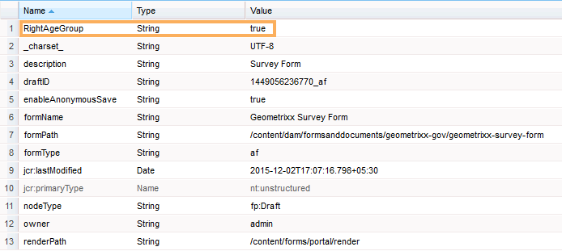

# 양식 제출 메타데이터에 사용자 데이터의 정보 추가 {#adding-information-from-user-data-to-form-submission-metadata}

양식의 요소에 입력된 값을 사용하여 초안 또는 양식 제출의 메타데이터 필드를 계산할 수 있습니다. 메타데이터를 사용하면 사용자 데이터를 기반으로 컨텐츠를 필터링할 수 있습니다. 예를 들어 사용자가 양식의 이름 필드에 John Doe를 입력합니다. 이 정보를 사용하여 JD라는 이니셜로 이 제출을 분류할 수 있는 메타데이터를 계산할 수 있습니다.

사용자가 입력한 값으로 메타데이터 필드를 계산하려면 메타데이터에 양식 요소를 추가합니다. 사용자가 해당 요소에 값을 입력할 때 스크립트는 값을 사용하여 정보를 계산합니다. 이 정보는 메타데이터에 추가됩니다. 요소를 메타데이터 필드로 추가할 때 해당 요소에 대한 키를 제공합니다. 키는 메타데이터의 필드로 추가되고 계산된 정보가 메타데이터에 대해 기록됩니다.

예를 들어, 한 의료 보험 회사가 한 양식을 게시합니다. 이 양식에서 필드는 최종 사용자의 기간을 캡처합니다. 고객은 여러 사용자가 양식을 제출한 후 특정 연령 범위에서 모든 제출을 확인하려고 합니다. 증가하는 양식 수로 인해 복잡해지는 모든 데이터를 분석하는 대신 추가 메타데이터를 사용하면 고객에게 도움이 됩니다. 양식 작성자는 검색을 쉽게 할 수 있도록 최종 사용자가 채운 속성/데이터를 최상위 수준에 저장할 수 있도록 구성할 수 있습니다. 추가 메타데이터는 작성자가 구성한 대로 메타데이터 노드의 최상위 수준에 저장된 사용자 채우기 정보입니다.

이메일 ID와 전화 번호를 캡처하는 양식의 다른 예를 생각해 보십시오. 사용자가 이 양식을 익명으로 방문하고 양식을 포기하면 작성자는 양식을 구성하여 이메일 ID와 전화 번호를 자동 저장할 수 있습니다. 이 양식은 자동으로 저장되며 전화 번호와 이메일 ID는 초안의 메타데이터 노드에 저장됩니다. 이 구성의 사용 사례는 리드 관리 대시보드입니다.

## 메타데이터에 양식 요소 추가 {#adding-form-elements-to-metadata}

다음 단계를 수행하여 메타데이터에 요소를 추가합니다.

1. 편집 모드에서 응용 양식을 엽니다.

   편집 모드에서 양식을 열려면 양식 관리자에서 양식을 선택하고 **열기를 누릅니다**.

1. 편집 모드에서 구성 요소를 선택하고  > **응용 양식 컨테이너를**&#x200B;누른 다음 누릅니다.
1. 세로 막대에서 **메타데이터를 클릭합니다**.
1. 메타데이터 섹션에서 추가를 **클릭합니다**.
1. 메타데이터 탭의 값 필드를 사용하여 스크립트를 추가합니다. 추가하는 스크립트는 양식의 요소에서 데이터를 수집하고 메타데이터에 제공되는 값을 계산합니다.

   예를 들어 입력한 나이가 21보다 큰 경우 **true** 가 메타데이터에 로그인하고, 21보다 작은 경우 **false** 가 기록됩니다. 메타데이터 탭에서 다음 스크립트를 입력합니다.

   `(agebox.value >= 21) ? true : false`

   
   **그림:** *메타데이터 탭에 입력된 스크립트*

1. **확인**&#x200B;을 클릭합니다.

사용자가 메타데이터 필드로 선택한 요소에 데이터를 입력하면 메타데이터에 계산된 정보가 기록됩니다. 메타데이터를 저장하도록 구성된 저장소에서 메타데이터를 볼 수 있습니다.

## 업데이트된 양식 제출 메타데이터 보기: {#seeing-updated-form-nbsp-submission-metadata}

위의 예를 들어 메타데이터는 CRX 저장소에 저장됩니다. 메타데이터는 다음과 같습니다.

메타데이터에 확인란 요소를 추가하면 선택한 값이 쉼표로 구분된 문자열로 저장됩니다. 예를 들어 양식에 확인란 구성 요소를 추가하고 이름을 로 지정합니다 `checkbox1`. 확인란 구성 요소 속성에서 값 0, 1 및 2에 대한 운전 라이센스, 사회 보장 번호 및 Passport 항목을 추가합니다.

적응형 양식 컨테이너를 선택하고 양식 속성에서 양식을 저장하고 게시할 메타데이터 키 `cb1` 를 `checkbox1.value`추가합니다. 고객이 양식을 작성하면 확인란 필드에서 Passport 및 Social Security Number 옵션을 선택합니다. 값 1과 2는 제출 메타데이터의 cb1 필드에 1, 2로 저장됩니다.

>[!NOTE]
>
>위의 예는 학습 목적으로만 제공됩니다. AEM Forms 구현에 구성된 대로 올바른 위치에서 메타데이터를 찾을 수 있는지 확인합니다.

