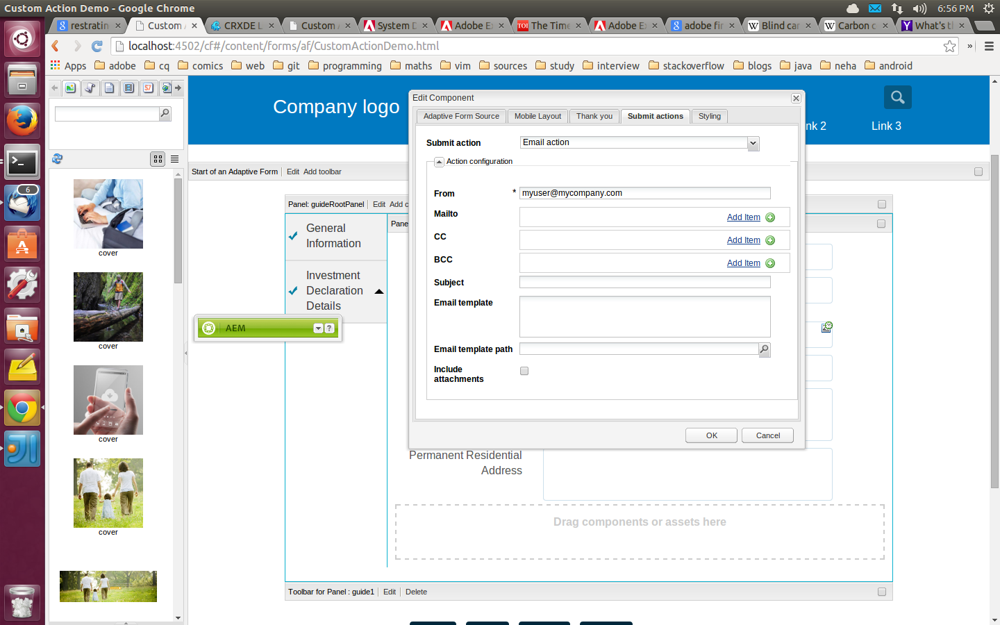

# 이메일을 통해 양식 제출 확인 보내기 {#sending-a-form-submission-acknowledgement-via-email}

>[!CAUTION]
>
>AEM 6.4가 확장 지원이 종료되었으며 이 설명서는 더 이상 업데이트되지 않습니다. 자세한 내용은 [기술 지원 기간](https://helpx.adobe.com/kr/support/programs/eol-matrix.html). 지원되는 버전 찾기 [여기](https://experienceleague.adobe.com/docs/).

## 적응형 양식 데이터 제출 {#adaptive-form-data-submission}

적응형 양식은 여러 가지 기본 제공 [작업 제출](/help/forms/using/configuring-submit-actions.md) 다른 종단점에 양식 데이터를 제출하는 워크플로우입니다.

예: **이메일 작업** 제출 작업은 적응형 양식을 성공적으로 제출할 때 이메일을 전송합니다. 양식 데이터와 이메일의 PDF을 보내도록 구성할 수도 있습니다.

이 문서에서는 적응형 양식에서 이메일 작업을 활성화하는 단계 및 제공하는 다양한 구성에 대해 자세히 설명합니다.

>[!NOTE]
>
>를 사용할 수도 있습니다 **이메일 PDF 작업** 완료된 양식을 PDF 첨부 파일로 전자 메일로 보내기 이 작업에 사용할 수 있는 구성 옵션은 전자 메일 작업에 사용할 수 있는 옵션과 동일합니다. 이메일 PDF 작업은 XFA 기반 적응형 양식에만 사용할 수 있습니다

## 이메일 작업 {#email-action}

전자 메일 작업을 사용하면 작성자는 적응형 양식을 성공적으로 제출할 때 하나 이상의 수신자에게 전자 메일을 자동으로 보낼 수 있습니다.

>[!NOTE]
>
>전자 메일 작업을 사용하려면 다음에 설명된 대로 AEM 메일 서비스를 구성해야 합니다. [메일 서비스 구성](/help/sites-administering/notification.md#configuring-the-mail-service).

### 적응형 양식에서 이메일 작업 활성화 {#enabling-email-action-on-an-adaptive-form}

1. 편집 모드에서 적응형 양식을 엽니다.

1. 클릭 **편집** 다음 **적응형 양식 시작** 도구 모음

   구성 요소 편집 대화 상자가 열립니다.

   

1. 을(를) 선택합니다 **작업 제출** 탭을 선택하고 **이메일 작업** 제출 작업 드롭다운 목록에서 작업을 수행합니다.

   탭에는 현재 양식에 대한 이메일 작업을 구성하는 옵션이 표시됩니다.

   

1. 메일, CC 및 BCC 필드에 올바른 이메일 ID를 지정합니다.

   제목 및 이메일 템플릿 필드에서 전자 메일의 제목과 본문을 각각 지정합니다.

   필드에 변수 자리 표시자를 지정할 수도 있습니다. 이 경우 최종 사용자가 양식을 성공적으로 제출할 때 필드 값이 처리됩니다. 자세한 내용은 [적응형 양식 필드 이름을 사용하여 전자 메일 콘텐츠를 동적으로 만들기](/help/forms/using/form-submission-receipt-via-email.md#p-using-adaptive-form-field-names-to-dynamically-create-email-content-p).

   양식에 첨부 파일이 포함되어 있고 전자 메일에 이러한 파일을 첨부하려는 경우 첨부 파일 포함 을 선택합니다.

   >[!NOTE]
   >
   >을(를) 선택하는 경우 **이메일 PDF 작업**&#x200B;첨부 파일 포함 옵션을 선택해야 합니다.

1. 클릭 **확인** 변경 사항을 저장하려면 을 클릭합니다.

### 적응형 양식 필드 이름을 사용하여 전자 메일 콘텐츠를 동적으로 만들기 {#using-adaptive-form-field-names-to-dynamically-create-email-content}

적응형 양식의 필드 이름은 사용자가 양식을 제출한 후 해당 필드의 값으로 대체되는 자리 표시자라고 합니다.

전자 메일 작업 탭에서 작업을 수행할 때 처리되는 자리 표시자를 사용할 수 있습니다. 이것은 사용자가 양식을 제출할 때 이메일의 헤더(예: Mailto, CC, BCC, 주체)가 생성됨을 의미합니다.

자리 표시자를 정의하려면 `${<field name>}` 작업 제출 탭의 필드에서 을 클릭합니다.

예를 들어 양식에 가 포함되어 있으면 **이메일 주소** 필드, 이름이 지정됨 `email_addr`의 경우, 사용자의 이메일 ID를 캡처하기 위해 메일, 참조 또는 숨은 참조 필드에 다음을 지정할 수 있습니다.

`${email_addr}`

사용자가 양식을 제출하면 이메일이 `email_addr` 필드의 값을 지정합니다.

>[!NOTE]
>
>에서 필드 이름을 찾을 수 있습니다 **편집** 대화 상자를 엽니다.

변수 자리 표시자는 **제목** 및 **이메일 템플릿** 필드.

예:

`Hi ${first_name} ${last_name},`

`Your form has been received by our department. It usually takes ten business days to process the request.`

`Regards`

`Administrator`

>[!NOTE]
>
>반복 가능한 패널의 필드는 변수 자리 표시자로 사용할 수 없습니다.
