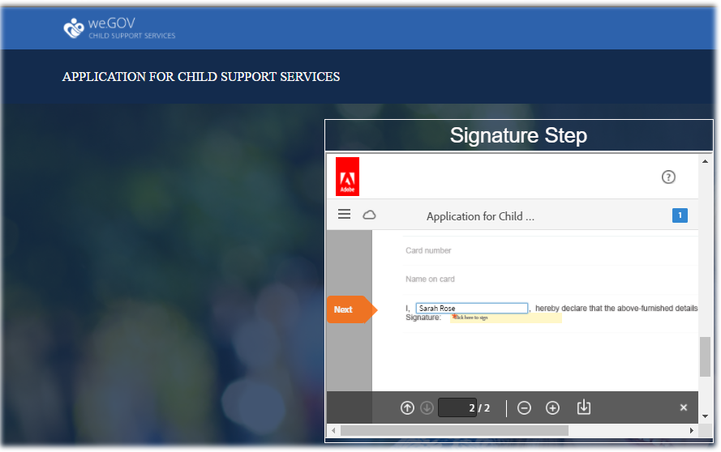

# We.Gov 참조 사이트 연습 {#we-gov-reference-site-walkthrough}

## 필수 조건 {#pre-requisite}

AEM Forms 참조 사이트 설정 및 [구성에 설명된 대로 We.Gov 참조 사이트를](/help/forms/using/setup-reference-sites.md)설정합니다.

## 참조 사이트 시나리오 {#reference-site-scenario}

We.Gov는 입양 부모가 아이를 입양할 경우 아동 지원에 등록할 수 있도록 하는 주립 운영 조직입니다. 사이트는 다음을 관리합니다.

* 신청자의 자격 조건, 양부모
* 신청자의 개인 및 전문 세부 사항(양육비 지원 자격이 있는 경우)
* 입양된 아동의 개인 정보

   지원자는 두 명 이상의 하위 항목에 대한 세부 정보를 제공할 수 있습니다.
* 신청자가 양육비 혜택을 받을 수 있는 신청자의 은행 계좌 상세내역
* 애플리케이션 비용 복구
* 애플리케이션 평가
* 응용 프로그램 승인
* 신청자에 대한 자동화된 커뮤니케이션

신청서를 제출하고 요금이 지불되면 신청자는 제출된 신청서를 확인한 이메일을 조직으로부터 받게 됩니다.

We.Gov 조직은 신청서를 받습니다. 이 조직은 애플리케이션을 평가하고 정품인 신청서를 승인합니다.

신청이 승인되면 신청자는 We.Gov 사이트로부터 이메일을 받습니다. 이메일의 **문서** 보기 옵션은 신청자의 등록 상세내역이 있는 문서에 연결됩니다.

아래 인포그래픽은 We.Gov 참조 사이트 시나리오의 단계별 작업 과정을 보여줍니다.

The scenario includes the following personas:

* 양부모 사라 로즈는 양육비 지원을 요청한다
* Joe, 입양된 아이
* Gloria Rios, We.Gov 승인 부서의 책임자
* 애플리케이션 평가를 담당하는 현장 에이전트인 Conard Sims

## 사라는 자격 확인을 시작합니다 {#sarah-initiates-her-eligibility-check}

신청자는 아동 지원 혜택을 요청할 자격 조건을 확인할 수 있습니다. 이 사이트를 통해 사용자는 자신의 애플리케이션이 혜택을 받을 수 있는지 여부를 확인할 수 있습니다. 양부모인 사라는 그것에 대한 예비 신청자이다. 자격 양식은 We.Gov 사이트의 자식 지원 서비스 응용 프로그램의 일부입니다. 자격 조건을 확인하기 위해 Sarah는 We. **[!UICONTROL Gov]** 웹 사이트에서 아동 지원을 클릭합니다. 하위 지원 페이지에서 Sarah는 자격 **[!UICONTROL 확인을 클릭합니다]**.

위의 방법 외에도 Sarah는 홈 페이지에서 **[!UICONTROL 시작하기를]** 클릭할 수 있습니다. Sarah는 모든 응용 프로그램 페이지로 이동되며, 여기에서 Application under Child Support Services **[!UICONTROL 를 클릭할 수 있습니다]**. 사라는 그 후 자격 확인 절차에 참가한다.

[자녀 지원 자격 확인] 페이지에서 Sarah에게 자녀의 지원 혜택에 대한 자격 조건을 확인하는 질문 세트가 제공됩니다. 질문들을 통해, 그녀는 다음과 같은 질문을 받는다.

* 그녀가 그 아이의 양육부 부모라면
* 그녀와 아이가 GX 상태로 살면
* 아동과 아동의 교육 연령 그룹.

Sarah는 이러한 질문에 대답하며, 그녀의 자격 조건은 검증되었습니다. 그녀의 답변은 그녀가 아동 지원을 받을 자격이 있는지를 결정한다.

사라는 그녀가 아동 지원을 받을 자격이 있다는 소식을 받았고, 지원료는 25달러이다.

### 작동 방식 {#how-it-works}

규칙 편집기를 사용하여 만든 자격 조건을 통해 Sarah의 자격 증명이 확인됩니다. 규칙 편집기를 사용하면 지원자가 신청 양식을 채우기 전에 충족되는 조건을 지정할 수 있습니다. 지원자인 사라가 모든 자격 조건을 충족하면 지원서를 제출한다.

자격 검사는 하위 지원 응용 프로그램 응용 양식의 일부입니다. 이 규칙은 다음 경우에 자격 조건을 검증합니다.

* 신청자는 양육부・모이다
* 신청자와 아이는 GX에 머무른다
* 지원자는 아이를 주로 보살피는 일을 한다
* 지원 서비스를 받는 어린이의 나이는 16세 미만입니다.

### 직접 보기 {#see-it-yourself}

In your browser, open `https://<hostname>:<PublishPort>/content/we-gov/en.html`. We.Gov 사이트에서 하위 지원을 클릭합니다. 하위 지원 페이지에서 자격 확인을 클릭합니다.

규칙을 보려면:

1. 작성 인스턴스에서 양식을 편집 모드로 엽니다. URL: `https://<hostname>:<AuthorPort>/editor.html/content/forms/af/we-gov/child-support/css.html`.
1. Select a component and click .

   양식에 적용된 모든 규칙이 나열된 규칙 편집기가 열립니다.

1. 왼쪽 패널에서 규칙을 `passMsg` 클릭하고 자격 조건 확인 `failMsg` 방법을 확인합니다.

## 사라가 양육비 지원을 신청하기 시작한다 {#sarah-starts-her-application-for-child-support}

Sarah **[!UICONTROL 는]** 그녀의 자녀 지원 자격 조건을 알고 난 후 [응용 프로그램 시작]을 클릭합니다.\
Sarah는 [자식 지원 서비스 응용 프로그램] 페이지에서 다음 섹션에 세부 정보를 제공합니다.

* **[!UICONTROL 신청자]**&#x200B;정보:사라가 이 섹션에 자세한 내용을 알려주도록 하자.

* **[!UICONTROL 하위 정보]**:Sarah가 아동 정보를 제공하자, 그는 지원 서비스를 받고 있다.

* **[!UICONTROL 지불]**:Sarah가 We.Gov가 매달 지원 보상을 예치할 수 있는 은행 세부 사항을 제공하도록 합시다.

* **[!UICONTROL 요금 지불]**:사라가 신청비를 지불하기 위해 신용카드 세부 사항을 제공하도록 하자.

기본적으로 Sarah는 지원자 **[!UICONTROL 정보 섹션으로]** 이동합니다.

Sarah는 언제든지 Return later **[!UICONTROL 를 클릭하고]** Application으로 다시 시작할 수 있습니다. 나중에 **[!UICONTROL 컴을 클릭하면]**&#x200B;진행 상태가 초안으로 저장되고 초안을 이메일로 보낼 수 있는 옵션이 표시됩니다.

[이메일 보내기] **[!UICONTROL 를]**&#x200B;클릭하면 양식 초안의 링크가 포함된 이메일을 수신하게 됩니다.

We.Gov 사이트의 하위 지원 양식에서는 적응형 양식을 사용합니다. 이메일에 있는 링크를 통해 모바일 디바이스에서 양식을 작성할 수 있습니다.

>[!NOTE]
>
>이메일 재개 워크플로우는 로그인한 사용자에게만 작동합니다. 참조 사이트 시나리오에서 사용자 Sarah Rose가 추가되었는지 확인합니다. Sarah의 로그인 자격 증명이 `srose/password`있습니다.

Sarah는 어떤 섹션에서든 세부 사항을 제공할 수 있지만, 모든 섹션에 필요한 정보를 제공한 후에만 지원비를 받습니다. 유료 결제 없이 애플리케이션이 완전하지 않으며 별표로 표시된 필드가 필요합니다.

### <strong>사라는 자신의 정보를</strong> 제공한다 {#strong-sarah-provides-her-information-strong}

Sarah가 **[!UICONTROL 응용 프로그램]**&#x200B;시작을 클릭하면, Application For Child Support Services 페이지의 Applicant Information 섹션으로 이동합니다. &quot;지원자 정보&quot;에서 사라는 탭들을 탐색하고 지원서에 대한 개인 정보를 제공합니다. Next **[!UICONTROL 를]** 클릭하여 탭을 탐색합니다.

지원자 정보에서 다음 탭에서 세부 정보를 제공해야 합니다.

* **[!UICONTROL 기본 정보]**

&quot;기본 정보&quot;에서 사라는 신분증과 개인 정보를 제공한다. 사라의 개인 정보에는 이름, 이메일 ID, 그리고 사회 보장 번호가 포함됩니다.

* **[!UICONTROL 관계]**

   Sarah는 Relationship에서 그녀의 결혼 상태에 대한 정보를 입력한다.

* **[!UICONTROL 추가 정보]**

   추가 정보 아래에서, 사라는 신분증 번호, 생년월일, 그리고 현재 주소와 전화 번호를 입력합니다.

### Sarah는 아동 정보를 제공한다 {#sarah-provides-child-information}

사라가 자신의 개인 정보를 제공하고 **[!UICONTROL 다음을]**&#x200B;클릭하면, 그녀는 아동 정보 섹션으로 이동합니다.

하위 정보 섹션에서 다음 세부 사항을 제공합니다.

* 아동 지원 서비스를 요청할 하위 수
* 자녀의 이름, 사회 보장 번호, 생년월일 및 생년월일

사라가 둘 이상의 아이를 선택한다면, 그녀는 채울 것과 같은 세부사항을 가진 여분의 양식을 얻게 된다.\
사라는 그녀의 싱글 아이인 조를 선택하고 그의 이름을 입력합니다.

### Sarah가 결제 정보를 제공합니다 {#sarah-provides-payment-information}

Sarah가 입양된 자녀(또는 아동)에 대한 정보를 제공하고 **[!UICONTROL Next]**(다음)를 클릭하면 **[!UICONTROL Payment Information]** 섹션으로 이동합니다.

지급 정보 섹션에서, 그녀는 자녀 지원 혜택을 받을 수 있는 은행 계좌 상세내역을 제공합니다.\
그녀는 10자리 은행 계좌 번호를 입력한다.

## 사라는 응시료를 내고 서류에 사인을 한다 {#sarah-pays-the-application-fee-and-signs-the-form}

사라가 지원서의 조건에 동의하면, 신청비는 25달러이다. 지원금은 그녀의 신청을 처리하는 데 필요하다.\
사라는 신용카드 세부 사항을 입력하고 지금 지불을 **[!UICONTROL 클릭합니다]**. 비용을 지불하면 서명 필드에 PDF 버전의 애플리케이션이 나타납니다.

Sarah는 입력, 그리기, 직접 쓰기, 서명 이미지 삽입, 모바일 터치스크린 중 하나를 선택하여 서명을 그릴 수 있습니다. Sarah가 이름을 입력하고 [클릭하여 서명]을 클릭합니다.

그녀의 지원서는 We.Gov 사이트에 제출되었습니다.

### <strong>Sarah가 확인 이메일을</strong> 받았다 {#strong-sarah-receives-an-acknowledgement-email-strong}

Sarah가 응시료를 지불한 후, 그녀는 We.Gov 사이트로부터 승인 이메일을 받습니다.\
We.Gov는 신청서를 처리하고, Sarah는 그녀의 신청이 승인되면 매월 보상을 받을 것이라고 통보받았다.

### 작동 방식 {#how-it-works-1}

하위 지원 애플리케이션은 상단 탭, 마법사, 아코디언 등 패널 레이아웃의 조합을 사용하여 경험을 만듭니다. We.Gov 자식 템플릿이라는 양식 템플릿을 사용합니다.

신청자는 여러 섹션으로 이동하여 양식의 다양한 구성 요소를 채울 수 있습니다. 신청자가 양식을 작성하고 제출하고 약관에 동의하며 비용을 지불하면 사용자 정의 워크플로우가 시작됩니다. 사용자 지정 워크플로우는 애플리케이션 제출을 승인하는 지원자에게 자동화된 이메일을 보냅니다. 신청서는 확인 및 승인을 위해 해당 기관의 관계부로 보내진다.

양식의 레이아웃은 Gov Child Support Service 테마에 지정됩니다. 스타일링에는 구성 요소 스타일, 페이지 배경, 구성 요소의 오류 상태 서식 및 글꼴 스타일이 포함되어 있습니다.

자격 검사는 양식에 지정된 규칙을 사용합니다. 아래에 지정된 유효성 검사를 사용합니다.

`SHOW passMsgWHEN (Does the child live in the state of GX? is equal to Yes) AND (Do you live in the state of GX? is equal to Yes) AND ( (Who has the main day-to-day care of the child? is equal to You) AND (Are you: is equal to The custodial parent) ) AND (Is the child you are applying for: is equal to Under 16 years) ELSE Hide`

`HIDE failMsg WHEN (Does the child lives in the state of GX? is equal to Yes) AND ( (Do you live in the state of GX? is equal to Yes) AND (Who has the main day-to-day care of the child? is equal to You) ) AND (Is the child you are applying for: is equal to Under 16 years) AND (Are you: is equal to The custodial parent) ELSE Show`

### 직접 보기 {#see-it-yourself-1}

브라우저에서 필요한 정보를 열고 `https://<hostname>:<PublishPort>/content/forms/af/we-gov/child-support/css.html` 채웁니다. 필요한 정보를 입력한 후 신청서를 제출하고 요금을 지불하고 문서에 서명하면 확인 이메일을 받게 됩니다.

We.Gov 하위 템플릿을 참조하십시오. `https://<hostname>:<AuthorPort>/editor.html/conf/we-gov/settings/wcm/templates/we-gov-child-template/structure.html`

테마는 여기에서 확인하십시오. `https://<hostname>:<AuthorPort>/editor.html/content/dam/formsanddocuments-themes/we-gov/we-gov-theme-A/jcr:content`

모든 규칙을 보려면 다음 단계를 수행하십시오.

1. 작성 모드에서 양식을 엽니다.

   URL: `https://<hostname>:<AuthorPort>/editor.html/content/forms/af/we-gov/child-support/css.html`

1. 구성 요소를 선택하고 탭합니다. 위에 나열된 규칙을 포함하여 모든 규칙이 규칙 편집기에 나열됩니다.

## 글로리아는 지원서를 받고 있다 {#gloria-receives-the-application}

We.Gov의 승인 책임자인 Gloria는 제출된 신청서를 보거나 승인하거나 거부할 수 있습니다. AEM Inbox를 사용하면 제출된 모든 애플리케이션을 한 곳에서 볼 수 있습니다.

### 작동 방식 {#how-it-works-2}

Sarah가 하위 지원 신청서를 작성하고 제출하면 PDF 또는 Document of Record가 작성되어 Gloria Rios의 받은 편지함으로 전송됩니다. Gloria는 제출된 신청서를 볼 수 있으며, 수락하거나 거부할 수 있습니다.

### 직접 보기 {#see-it-yourself-2}

페이지 열기 `https://<hostname***>:<PublishPort>/content/we-gov/en.html`. 페이지에서 로그인을 탭하고 ****, **[!UICONTROL 대리인으로]** 로그인 확인란을 선택하고, Gloria Rios의 사용자 이름/암호로 격자/암호를 사용하여 AEM 받은 편지함에 로그인합니다. 하위 지원 응용 프로그램이 나타납니다. 양식 중심의 워크플로우 작업에 AEM 받은 편지함을 사용하는 방법에 대한 자세한 내용은 AEM 받은 편지함에서 [양식 애플리케이션 및 작업 관리를 참조하십시오](/help/forms/using/manage-applications-inbox.md).

Gloria는 애플리케이션 대시보드에서 애플리케이션을 보거나 승인하거나 거부할 수 있습니다.

### 작동 방식 {#how-it-works-3}

We.Gov의 승인 책임자인 Gloria는 AEM 받은 편지함을 엽니다. 그녀는 자신의 업무 목록에서 검토 작업을 보게 된다. 그녀는 검토 작업을 열고 본다.

그녀는 새라가 업로드한 서류와 함께 새라가 입력한 세부 사항이 포함된 양식의 PDF를 봅니다.\
글로리아는 그 신청을 승인하거나 거부할 수 있다. 그러나 Gloria는 **[!UICONTROL Assessment Required를]** 클릭하여 애플리케이션을 평가합니다.

Sarah의 응용 프로그램은 AEM 작업 과정의 시작점입니다. 하위 지원 응용 프로그램 양식이 제출되면 AEM 워크플로우를 시작합니다. AEM 워크플로우는 AEM 받은 편지함에 표시되는 Gloria에 대한 작업을 만듭니다. Gloria가 온사이트 평가를 요청하면 필드 에이전트에 대해 새 작업이 만들어집니다.

### 직접 보기 {#see-it-yourself-3}

구성이 완료되면 AEM 워크플로우가 양식 전송 직후 시작됩니다. Gloria의 자격 증명을 사용하여 받은 편지함에 로그인합니다.

https://&lt;***hostname***>:&lt;PublishPort>***/content/we-gov/en.html의 받은 편지함에***&#x200B;액세스합니다. 페이지에서 로그인을 탭하고 **** Gloria의 **[!UICONTROL 기본 자격 증명을]** 사용하여대리인으로 로그인 확인란을 선택합니다.

* 사용자 이름:그림자
* 암호:암호

AEM 받은 편지함에서 Sarah의 응용 프로그램이 검토 작업으로 추가됩니다. 작업을 선택하고 [평가 필수] **를** 클릭하여 다음 단계로 진행합니다.

### Conard, 평가 작업 {#conard-assessment-task}

Gloria가 평가 **[!UICONTROL 필수를 클릭하면]** Conard가 AEM 받은 편지함에서 검토 작업을 받습니다. 작업은 워크플로우 모델에 정의된 AEM 워크플로우의 다음 단계입니다. 그는 검토 작업을 보고 그것을 엽니다.

Conard는 아래와 같이 지원자 평가 작업을 받습니다.

하위 지원 평가는 작업과 연관된 양식입니다. 그는 Sarah의 세부 사항들과 지원 서류(업무 세부 사항 첨부)를 받는다. Conard는 장치의 필드에 있는 평가 양식을 채우고 평가를 위해 제출합니다.

코나드는 사라가 제공한 모든 세부 사항을 확인하고, 사라는 그 평가에 서명한다. AEM Forms에서 위치 및 타임스탬프를 가져와 서명에 추가할 수 있습니다.

Conard **[!UICONTROL 를 클릭하여 재평가를]**&#x200B;위해 제출을 선택하면 AEM 워크플로우가 평가를 We.Gov 조직에 제출합니다.

### 작동 방식 {#how-it-works-4}

Gloria가 평가를 요청하면 AEM 워크플로우의 다음 단계가 시작되고 평가 작업이 Standard의 받은 편지함에 추가됩니다. Conard는 현장 근무자의 모습.

Conard는 Sarah의 자리를 방문하고, Sarah가 제공한 정보가 진짜인지 확인하고, 평가 양식을 작성한다. Conard는 Sarah가 작성한 전체 양식의 PDF에 액세스할 수 있습니다.

### 직접 보기 {#see-it-yourself-4}

태블릿에서 AEM 받은 편지함을 열고 Standard의 자격 증명을 사용하여 로그인합니다.

Conard의 기본 자격 증명은 다음과 같습니다.

* 사용자 이름:csimms
* 암호:암호

받은 편지함에 새 평가 요청 작업이 추가되어 표시됩니다. 완료된 평가를 제출하고 다음 단계로 진행합니다.

### Gloria는 평가를 검토하고 신청서를 승인합니다 {#gloria-reviews-the-assessment-and-approves-the-application}

코나드가 평가를 제출한 후 글로리아는 리뷰 작업을 받은 편지함에 보게 된다. 리뷰를 선택하고 **[!UICONTROL 엽니다]**.

작업 세부 사항에서 Gloria는 마지막으로 수행한 작업을 &quot;재평가를 위해 제출&quot;(Conard)로 봅니다. Gloria는 Conard Sims가 그 지원서를 평가했다고 봅니다.

### 작동 방식 {#how-it-works-5}

코나드가 평가를 제출한 후 글로리아는 리뷰 작업을 받은 편지함에 보게 된다. 리뷰를 선택하고 엽니다. 작업 세부 사항에서 Gloria는 Conard가 작성한 평가 주석을 봅니다. &quot;모든 것이 순서대로 있습니다.&quot;

글로리아가 지원서를 승인했어요

### 직접 보기 {#see-it-yourself-5}

받은 편지함을 열고 Gloria의 자격 증명을 사용하여 로그인합니다. 검토라는 새 작업이 받은 편지함에 나타납니다.

작업을 열어 수행한 마지막 작업의 상태를 확인합니다. 평가를 기반으로 애플리케이션을 승인합니다.

## 새라는 승인 이메일을 받았다 {#sarah-receives-an-approval-email}

Gloria가 신청서를 승인한 후, Sarah는 We.Gov로부터 그녀의 신청이 승인되었다는 이메일을 받았다.

이메일의 **[!UICONTROL 문서]** 보기 단추가 등록 세부 정보에 연결됩니다. Sarah가 문서 **[!UICONTROL 보기를 클릭합니다.]**

등록 문서에는 참조 ID, 하위 보험, 가입 날짜, 은행 계좌 번호, 지불 빈도 및 지불 금액과 같은 세부 정보가 표시됩니다.

사라는 같은 페이지에서 업로드한 문서를 볼 수 있습니다.

### 작동 방식 {#how-it-works-6}

Gloria가 신청서를 승인하면 Sarah는 등록 문서에 대한 링크가 포함된 자동 이메일을 수신하게 됩니다.

등록 문서는 인터랙티브한 커뮤니케이션이며 모든 디바이스에서 볼 수 있습니다. 여기에는 아동 지원 서비스에 대한 자세한 내용과 사라가 제공한 정보가 포함되어 있습니다.

### 직접 보기 {#see-it-yourself-6}

등록 문서에 대한 링크가 있는 자동 이메일에 대해 구성한 이메일 클라이언트를 확인합니다.

또는 브라우저에서 문서를 보려면 다음을 엽니다. `https://<hostname>:<PublishPort>/content/aemforms-refsite/doclink.html?document=/content/forms/af/we-gov/child-support/enrollment-document&referenceId=[reference-id]&channel=web`

## We.Gov, 애플리케이션 성능 분석 {#we-gov-analyzes-the-performance-of-the-application}

We.Gov는 때때로 자녀 지원 서비스 애플리케이션의 성능을 검토하여 고객이 직면하고 있는 문제를 확인합니다. 이러한 분석을 사용하여 사용자 경험을 향상시키고 양식의 포기율을 줄이며 전환율을 개선하기 위해 하위 지원 서비스 애플리케이션에서 필요한 변경 사항에 대해 현명한 결정을 내릴 수 있습니다. AEM Forms와 Adobe Analytics의 통합을 활용하여 분석합니다. 다음 이미지는 분석 대시보드를 나타냅니다.

### 작동 방식 {#how-it-works-7}

하위 지원 서비스 애플리케이션 양식의 성능 지표는 Adobe Analytics를 사용하여 추적됩니다. Adobe Analytics 구성 및 보고서 보기에 대한 자세한 내용은 [양식 및 문서에](/help/forms/using/configure-analytics-forms-documents.md)대한 분석 구성을 참조하십시오.

### 직접 보기 {#see-it-yourself-7}

분석 보고서를 보고 탐색할 수 있도록 Adobe는 참조 사이트에서 하위 지원 서비스 애플리케이션에 대한 시드 데이터를 제공합니다. 시드 데이터를 사용하기 전에 Analytics 구성을 [참조하십시오](/help/forms/using/setup-reference-sites.md#configureanalytics). 작성 인스턴스에서 다음 단계를 수행하여 시드 데이터로 보고서를 봅니다.

1. https://&lt; **[!UICONTROL hostname]** >:&lt;*AuthorPort*>/aem/forms.html/content/dam/formsanddocuments로&#x200B;**&#x200B;이동합니다.

1. 을 클릭하여 We.Gov **폴더를** 엽니다.
1. Application **[!UICONTROL for Child Support Services 응용]** 양식을 선택한 다음 도구 **[!UICONTROL 모음에서 Analytics]** 활성화를 클릭합니다.

1. 양식을 다시 선택하고 도구 **[!UICONTROL 모음에서]** Analytics 보고서를 클릭하여 보고서를 생성합니다. 처음에는 빈 보고서가 표시됩니다.

시드 데이터로 분석 보고서를 생성하려면 다음을 수행합니다.

1. CRXDE lite 주소 브라우저에서 다음을 입력합니다./apps/we-gov/demo-artifacts/analyticsTestData/Child 지원 서비스 Analytics 테스트 데이터 ****
1. 시드 데이터는 왼쪽 사이드 디렉토리 구조에서 선택됩니다.
1. 선택한 파일을 두 번 클릭하여 오른쪽 패널에서 해당 컨텐츠를 엽니다.
1. 테스트 데이터 파일의 모든 컨텐츠를 복사합니다.
1. CRXDE 파섹/content/dam/formsanddocuments/we-gov/child-support/css/jcr:content/analyticsDatanode/lastsevendays ****
1. 속성 아래의 분석 데이터 필드에서 테스트 데이터 파일의 복사한 내용을 붙여 넣습니다.
1. 이제 자식 지원 서비스용 응용 프로그램에 대한 **[!UICONTROL 분석 보고서를 다시 생성합니다]**. 생성된 보고서에서 시드 데이터를 볼 수 있습니다.

