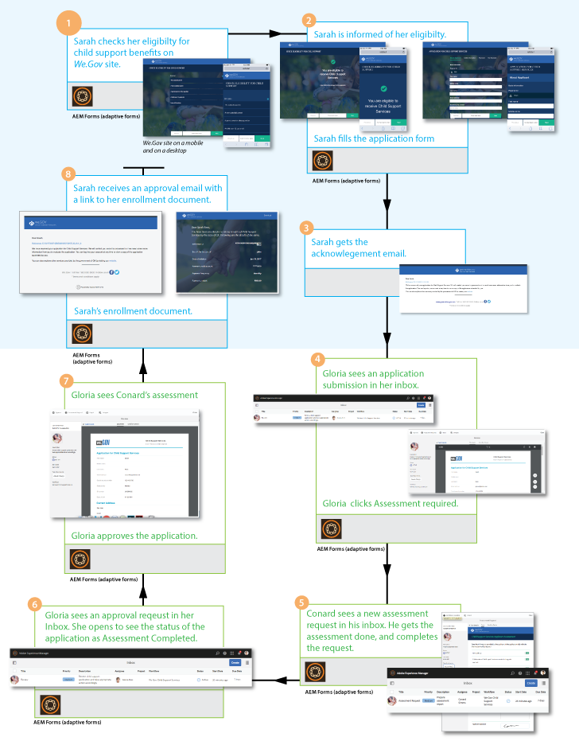

# We.Gov 참조 사이트 안내 {#we-gov-reference-site-walkthrough}

## 전제 조건 {#pre-requisite}

[AEM Forms 참조 사이트 설정 및 구성](/help/forms/using/setup-reference-sites.md)에 설명된 대로 We.Gov 참조 사이트를 설정합니다.

## 참조 사이트 시나리오 {#reference-site-scenario}

We.Gov는 입양 부모가 아이를 입양할 경우 양육비 등록을 할 수 있도록 해주는 주 운영 조직이다. 사이트는 다음을 관리합니다.

* 지원자의 자격, 양모
* 신청자의 개인 및 전문가 상세내역(양육비 지원대상자인 경우)
* 입양된 아동의 개인 정보

   지원자는 두 명 이상의 자녀의 세부 정보를 제공할 수 있습니다
* 지원자가 양육비 혜택을 받을 수 있는 지원자의 은행 계좌 상세내역
* 애플리케이션 요금 복구
* 애플리케이션 평가
* 애플리케이션 승인
* 신청자에 대한 자동화된 통신

지원서가 제출되고 그 비용이 지불되면, 지원자는 제출된 지원서에 대한 승인을 받아 조직으로부터 이메일을 받는다.

We.Gov 조직은 애플리케이션을 수신합니다. 그 조직은 애플리케이션을 평가받고 진품인 어플리케이션을 승인한다.

지원서가 승인되면, 지원자는 We.Gov 사이트로부터 이메일을 수신한다. 전자 메일의 **문서 보기** 옵션은 지원자의 등록 세부 정보가 있는 문서에 연결됩니다.

아래 인포그래픽은 We.Gov 참조 사이트 시나리오의 단계별 워크플로우를 보여줍니다.

이 시나리오에는 다음 가상 사용자가 포함됩니다.

* 양육비를 요구하는 양부모 사라 로즈
* 조, 입양된 아이
* We.Gov, 승인 부서의 책임자 Gloria Rios
* 애플리케이션 평가를 담당하는 현장 에이전트인 Conard Simms

## Sarah는 {#sarah-initiates-her-eligibility-check} 자격 검사를 시작합니다.

지원자는 양육비 지원을 요청할 자격을 확인할 수 있습니다. 이 사이트에서는 사용자가 질문에 답변하여 애플리케이션이 혜택을 받을 수 있는지 확인할 수 있습니다. 양부모인 사라는 그 일에 대한 희망적인 지원자이다. 자격 양식은 We.Gov 사이트의 자식 지원 서비스 응용 프로그램의 일부입니다. 자격 조건을 확인하기 위해, 사라는 We.Gov 웹 사이트에서 **[!UICONTROL 하위 지원]**&#x200B;을 클릭합니다. 하위 지원 페이지에서 사라는 **[!UICONTROL 자격 확인]**&#x200B;을 클릭합니다.

위의 방법 외에도 Sarah는 홈 페이지에서 **[!UICONTROL 시작하기]**&#x200B;를 클릭할 수 있습니다. Sarah가 모든 응용 프로그램 페이지로 이동됩니다. 이 페이지에서 **[!UICONTROL 하위 지원 서비스 응용 프로그램]**&#x200B;에서 적용 을 클릭할 수 있습니다. 그러면 사라는 자격검사를 받게 된다.

하위 지원 자격요건 확인 페이지에서 Sarah에게 자녀 지원 혜택에 대한 자격 여부를 결정하기 위한 일련의 질문이 제공됩니다. 질문 세트를 통해 그녀는 다음과 같이 질문을 받습니다.

* 만약 그녀가 그 아이의 부모라면
* 만약 그녀와 아이가 GX에 살고 있다면
* 아동 및 아동 교육의 연령대입니다.

사라는 이 질문에 대답하고, 그녀의 자격이 검증되었다. 그녀의 대답은 그녀가 양육비 자격이 있는지 여부를 결정한다.

사라는 그녀가 아동 지원을 받을 자격이 있다고 알려졌고, 신청료는 25달러이다.

### 작동 방법 {#how-it-works}

규칙 편집기를 사용하여 만든 자격 장벽을 통해 Sarah의 자격이 검증됩니다. 규칙 편집기를 사용하면 지원자가 신청 양식을 채우려면 먼저 충족되는 조건을 지정할 수 있습니다. 지원자인 사라가 모든 자격요건을 충족하면, 지원서를 제출한다.

자격 검사는 하위 지원 응용 프로그램 적응형 양식의 일부입니다. 다음 경우에 규칙이 적격성을 검증합니다.

* 신청자는 양육부 부모이다
* 신청자와 아이는 GX주에서 살고 있다
* 지원자는 그 아이를 하루 종일 돌본다
* 지원 서비스를 받는 어린이의 나이는 16세 미만입니다.

### 직접 {#see-it-yourself} 보기

브라우저에서 `https://<hostname>:<PublishPort>/content/we-gov/en.html` 을 엽니다. We.Gov 사이트에서 하위 지원을 클릭합니다. 하위 지원 페이지에서 자격 확인을 클릭합니다.

규칙을 보려면 다음을 수행하십시오.

1. 작성자 인스턴스에서 편집 모드로 양식을 엽니다. URL: `https://<hostname>:<AuthorPort>/editor.html/content/forms/af/we-gov/child-support/css.html`.
1. 구성 요소를 선택하고 를 클릭합니다.

   양식에 적용된 모든 규칙을 나열하는 규칙 편집기가 열립니다.

1. 왼쪽 패널에서 규칙 `passMsg` 및 `failMsg` 을 클릭하여 자격 검사가 작동하는 방식을 이해합니다.

## Sarah는 {#sarah-starts-her-application-for-child-support} 자녀 지원 신청 시작

Sarah는 **[!UICONTROL Start Application]**&#x200B;을 클릭한 후 자녀 지원에대한 자격이 있음을 알려줍니다.\
Application For Child Support Services 페이지에서 Sarah는 다음 섹션에 세부 정보를 제공합니다.

* **[!UICONTROL 지원자 정보]**:새라가 이 섹션에 자세한 내용을 알려주도록 하자.

* **[!UICONTROL 하위 정보]**:Sarah가 아동 지원 서비스를 받는 정보를 제공하도록 하자.

* **[!UICONTROL 결제]**:Sarah가 We.Gov가 매달 지원 보상을 예치할 수 있는 자세한 은행 정보를 제공할 수 있도록 해줍니다.

* **[!UICONTROL 수수료 지불]**:사라가 신청비를 지불하기 위해 신용카드 세부 사항을 제공하도록 하자.

기본적으로 Sarah는 **[!UICONTROL 지원자정보]** 섹션으로 이동됩니다.

언제든지 Sarah는 **[!UICONTROL 나중에 다시 돌아와]**&#x200B;응용 프로그램을 다시 시작할 수 있습니다. **[!UICONTROL 나중에 돌아옵니다]** 를 클릭하면 진행률이 초안으로 저장되고 초안으로 전자 메일을 보낼 수 있는 옵션이 제공됩니다.

**[!UICONTROL 전자 메일 보내기]**&#x200B;를 클릭하면 양식 초안으로 연결되는 링크가 포함된 전자 메일이 전송됩니다.

We.Gov 사이트의 하위 지원 양식은 적응형 양식을 사용합니다. 이메일에 이 링크를 사용하고 모바일 장치에서 양식을 채울 수 있습니다.

>[!NOTE]
>
>이메일 다시 시작 워크플로우는 로그인한 사용자만 작동합니다. 참조 사이트 시나리오에서 사용자 사라 로즈가 추가되었는지 확인합니다. Sarah의 로그인 자격 증명은 `srose/password`입니다.

사라는 어떤 섹션에서든 자세한 내용을 제공할 수 있지만, 모든 섹션에 필요한 정보를 제공한 후에만 지원비를 받습니다. 유료 결제 없이 애플리케이션이 완전하지 않으며 별표가 표시된 필드가 필요합니다.

### <strong>사라는 그녀의 정보를 제공한다</strong> {#strong-sarah-provides-her-information-strong}

Sarah가 **[!UICONTROL 응용 프로그램 시작]**&#x200B;을 클릭한 후, Application For Child Support Services 페이지의 [지원 정보] 섹션으로 이동합니다. 지원자 정보에서 사라는 탭을 탐색하고 지원서에 대한 개인 정보를 제공합니다. **[!UICONTROL 다음]**&#x200B;을 클릭하여 탭을 탐색합니다.

지원자 정보에서 다음 탭 아래에 상세내역을 제공해야 합니다.

* **[!UICONTROL 기본 정보]**

Basic Information에서 Sarah는 그녀의 신분증과 개인 정보를 제공한다. 사라의 개인 정보에는 이름, 이메일 ID, 그리고 사회 보장 번호가 포함됩니다.

* **[!UICONTROL 관계]**

   관계 아래에서, 사라는 그녀의 결혼 상태에 대한 정보를 입력합니다.

* **[!UICONTROL 추가 정보]**

   Sarah는 Additional Information에서 ID 번호, 생년월일, 현재 주소와 전화번호를 입력합니다.

### Sarah가 하위 정보 {#sarah-provides-child-information} 제공

Sarah가 개인 정보를 제공하고 **[!UICONTROL Next]**&#x200B;를 클릭하면, Child Information 섹션으로 이동합니다.

하위 정보 섹션에서 다음 세부 정보를 제공합니다.

* 자녀 지원 서비스를 요청할 자녀 수
* 자녀의 이름, 사회 보장 번호, 생년월일, 출생지

만약 사라가 두 명 이상의 아이를 선택할 경우, 그녀는 같은 세부사항을 쓸 수 있는 여분의 양식을 갖게 된다.\
사라는 그녀의 싱글 아이인 조를 선택하고 그의 이름을 입력합니다.

### Sarah가 결제 정보 {#sarah-provides-payment-information} 제공

Sarah가 입양된 자녀(또는 하위)에 대한 정보를 제공하고 **[!UICONTROL 다음]**&#x200B;을 클릭하면 **[!UICONTROL 결제 정보]** 섹션으로 이동합니다.

지급 정보 섹션에서 자녀 지원 혜택을 받을 수 있는 은행 계좌 상세내역을 제공합니다.\
그녀는 10자리 은행 계좌 번호를 입력합니다.

## Sarah는 응시료를 지불하고 {#sarah-pays-the-application-fee-and-signs-the-form} 양식에 서명한다

사라가 지원서의 조건에 동의한 후에, 그녀는 신청비로 25달러를 지불한다. 그녀의 신청을 처리하려면 응시료가 필요하다.\
Sarah가 신용 카드 세부 사항을 입력하고 **[!UICONTROL 지금 지불]**&#x200B;을 클릭합니다. 수수료를 지불하면 서명 필드에 PDF 버전이 나타납니다.

사라는 자신의 서명을 그리기 위해 타이핑을 하거나, 손으로 쓰거나, 서명 이미지를 삽입하거나, 모바일의 터치스크린을 사용하여 서명을 그릴 수 있다. Sarah가 이름을 입력하고 Click To Sign을 클릭합니다.

그녀의 지원서는 We.Gov 사이트에 제출된다.

### <strong>Sarah가 확인 이메일을 받았다</strong> {#strong-sarah-receives-an-acknowledgement-email-strong}

사라가 응시료를 지불한 후, 그녀는 We.Gov 사이트로부터 승인 이메일을 수신한다.\
We.Gov가 신청서를 처리하고, Sarah는 그녀의 신청이 승인되면 매달 보상을 받을 것이라고 통보받는다.

### 작동 방법 {#how-it-works-1}

하위 지원 애플리케이션에서 위쪽 탭, 마법사 및 아코디언 등의 패널 레이아웃의 조합을 사용하여 경험을 만듭니다. 이 템플릿은 We.Gov 하위 템플릿이라는 양식 템플릿을 사용합니다.

지원자는 섹션의 여러 부분으로 이동하여 양식의 여러 구성 요소를 채울 수 있습니다. 지원자가 양식을 작성하고, 제출하고, 약관에 동의하며, 비용을 지불하면 사용자 지정 워크플로우가 시작됩니다. 사용자 지정 워크플로우는 애플리케이션 제출을 승인하는 지원자에게 자동화된 이메일을 보냅니다. 신청서는 확인 및 승인을 위해 조직의 관계부로 보내진다.

양식의 레이아웃은 Gov Child Support Service 테마에 지정되어 있습니다. 스타일링에는 구성 요소 스타일, 페이지 배경, 구성 요소의 오류 상태 형식 및 글꼴 스타일이 포함되어 있습니다.

자격 확인에서는 양식에 지정된 규칙을 사용합니다. 아래에 지정된 유효성 검사를 사용합니다.

`SHOW passMsgWHEN (Does the child live in the state of GX? is equal to Yes) AND (Do you live in the state of GX? is equal to Yes) AND ( (Who has the main day-to-day care of the child? is equal to You) AND (Are you: is equal to The custodial parent) ) AND (Is the child you are applying for: is equal to Under 16 years) ELSE Hide`

`HIDE failMsg WHEN (Does the child lives in the state of GX? is equal to Yes) AND ( (Do you live in the state of GX? is equal to Yes) AND (Who has the main day-to-day care of the child? is equal to You) ) AND (Is the child you are applying for: is equal to Under 16 years) AND (Are you: is equal to The custodial parent) ELSE Show`

### 직접 {#see-it-yourself-1} 보기

브라우저에서 `https://<hostname>:<PublishPort>/content/forms/af/we-gov/child-support/css.html` 을 열고 필요한 정보를 입력합니다. 필요한 정보를 입력하고 비용을 지불한 후 신청서를 제출하면 확인 이메일을 받게 됩니다.

다음 위치에서 We.Gov 하위 템플릿을 참조하십시오.`https://<hostname>:<AuthorPort>/editor.html/conf/we-gov/settings/wcm/templates/we-gov-child-template/structure.html`

다음 주제를 참조하십시오.`https://<hostname>:<AuthorPort>/editor.html/content/dam/formsanddocuments-themes/we-gov/we-gov-theme-A/jcr:content`

모든 규칙을 보려면 다음 단계를 수행하십시오.

1. 작성 모드에서 양식을 엽니다.

   URL: `https://<hostname>:<AuthorPort>/editor.html/content/forms/af/we-gov/child-support/css.html`

1. 구성 요소를 선택하고 를 탭합니다. 위에 나열된 규칙을 포함하여 모든 규칙이 규칙 편집기에 나열됩니다.

## Gloria는 응용 프로그램 {#gloria-receives-the-application}을 받았습니다.

We.Gov의 승인 책임자 Gloria는 제출된 신청서를 보거나, 승인하거나, 거부할 수 있습니다. AEM 받은 편지함에서 제출된 모든 애플리케이션을 한 곳에서 볼 수 있습니다.

### 작동 방법 {#how-it-works-2}

Sarah가 1차 하위 구성요소 지원 애플리케이션을 작성하고 제출하면, PDF 또는 Document of Record가 작성되어 Gloria Rios의 받은 편지함으로 전송됩니다. 글로리아는 제출된 신청서를 보고 수락하거나 거부할 수 있습니다

### 직접 {#see-it-yourself-2} 보기

페이지 열기 `https://<hostname***>:<PublishPort>/content/we-gov/en.html`. 페이지에서 **[!UICONTROL 로그인]**&#x200B;을 탭하고 **[!UICONTROL 대리인]**&#x200B;으로 로그인 확인란을 선택한 다음, Gloria Rios의 사용자 이름/암호로 그리우/암호를 사용하여 AEM 받은 편지함에 로그인합니다. 하위 지원 응용 프로그램이 나타납니다. 양식 중심의 워크플로우 작업에 AEM 받은 편지함을 사용하는 방법에 대한 자세한 내용은 [AEM 받은 편지함에서 Forms 응용 프로그램 및 작업 관리](/help/forms/using/manage-applications-inbox.md)를 참조하십시오.

Gloria는 응용 프로그램 대시보드에서 응용 프로그램을 보고, 승인하거나 거부할 수 있습니다.

### 작동 방법 {#how-it-works-3}

We.Gov의 승인 수장인 Gloria는 그녀의 AEM 받은 편지함을 엽니다. 그녀는 자신의 업무 목록에서 리뷰 작업을 본다. 그녀는 검토 작업을 열고 봅니다.

그녀는 새라가 업로드한 서류와 함께 새라의 상세 정보가 담긴 양식의 PDF를 봅니다.\
글로리아는 신청서를 승인하거나 거부할 수 있다. 그러나 Gloria는 **[!UICONTROL 평가 필수]**&#x200B;를 클릭하여 애플리케이션을 평가합니다.

Sarah의 애플리케이션은 AEM 작업 과정의 시작점이다. 하위 지원 애플리케이션 양식이 제출되면 AEM 워크플로우를 시작합니다. AEM 워크플로우는 AEM 받은 편지함에 나타나는 글로리아를 위한 작업을 만듭니다. Gloria가 현장 평가를 요청하면 필드 에이전트에 대한 새로운 작업이 만들어집니다.

### 직접 {#see-it-yourself-3} 보기

구성이 완료되면 양식이 제출되면 바로 AEM 워크플로우가 시작됩니다. 글로리아의 자격 증명을 사용하여 받은 편지함에 로그인합니다.

https://&lt;***hostname***>:&lt;***PublishPort***>/content/we-gov/en.html에서 받은 편지함에 액세스합니다. 페이지에서 **[!UICONTROL 로그인]**&#x200B;을 탭하고 **[!UICONTROL 대리인]**&#x200B;로그인으로 로그인 확인란을 선택합니다.

* 사용자 이름:그리우
* 암호:암호

그녀의 AEM 받은 편지함에서 사라의 어플리케이션이 검토 작업으로 추가됩니다. 작업을 선택하고 **평가 필요**&#x200B;를 클릭하여 다음 단계로 진행합니다.

### Standard가 평가 작업 {#conard-assessment-task}을 받습니다.

Gloria가 **[!UICONTROL 평가 필수]**&#x200B;를 클릭하면 Conard가 AEM 받은 편지함에서 검토 작업을 받습니다. 작업은 워크플로우 모델에 정의된 AEM 워크플로우의 다음 단계입니다. 리뷰 작업을 보고 엽니다.

Conard는 아래 표시된 대로 지원자 평가 작업을 받습니다.

하위 지원 평가는 작업과 관련된 양식입니다. 그는 사라의 상세 정보와 지원 서류(업무 세부 사항에 첨부됨)를 받는다. Conard는 장치의 필드에 평가 양식을 입력하고 재평가를 위해 제출합니다.

Conard는 Sarah가 제공한 모든 세부사항을 확인하고 Sarah가 그 평가에 서명합니다. AEM Forms에서 위치 및 타임스탬프를 가져와 서명에 추가할 수 있습니다.

Conard가 **[!UICONTROL 재평가를 위해 제출]**&#x200B;을 클릭하면 AEM 워크플로우가 평가를 We.Gov 조직에 제출합니다.

### 작동 방법 {#how-it-works-4}

Gloria가 평가를 요청하면 AEM 워크플로우의 다음 단계가 시작되고 평가 작업이 Conard의 받은 편지함에 추가됩니다. 코나드(Conard)는 현장에서 일하는 사람이다.

Conard는 Sarah의 자리를 찾아가서 Sarah가 제공한 정보가 진짜인지 확인하고 평가 양식을 채웁니다. Conard는 Sarah가 작성한 전체 양식의 PDF에 액세스할 수 있습니다.

### 직접 {#see-it-yourself-4} 보기

태블릿에서 AEM 받은 편지함을 열고 Standard의 자격 증명을 사용하여 로그인합니다.

Conard의 기본 자격 증명은 다음과 같습니다.

* 사용자 이름:csimms
* 암호:암호

받은 편지함에 추가된 새 평가 요청 작업을 볼 수 있습니다. 완료된 평가를 제출하고 다음 단계로 진행합니다.

### Gloria는 평가를 검토하고 응용 프로그램 {#gloria-reviews-the-assessment-and-approves-the-application}을 승인합니다.

코나드가 평가를 제출한 후 글로리아는 그녀의 받은 편지함에서 리뷰 작업을 봅니다. **[!UICONTROL 검토]**&#x200B;를 선택하고 엽니다.

작업 세부 사항 아래에서 Gloria는 Submit for Reevaluation(Conard)으로 마지막으로 수행한 작업을 봅니다. 글로리아는 코나드 심스가 신청서를 평가했다고 봅니다.

### 작동 방법 {#how-it-works-5}

코나드가 평가를 제출한 후 글로리아는 그녀의 받은 편지함에서 리뷰 작업을 봅니다. 리뷰를 선택하고 엽니다. 작업 세부 사항 아래에서, 글로리아는 코나드가 &quot;모든 것이 순서대로 발견됨&quot;이라고 한 평가 논평을 봅니다.

Gloria가 신청서를 승인합니다.

### 직접 {#see-it-yourself-5} 보기

받은 편지함을 열고 글로리아의 자격 증명을 사용하여 로그인합니다. 검토라는 새 작업이 받은 편지함에 나타납니다.

작업을 열어 마지막으로 수행한 작업의 상태를 확인합니다. 평가에 따라 애플리케이션을 승인합니다.

## Sarah가 {#sarah-receives-an-approval-email} 승인 이메일을 받았습니다.

Gloria가 신청서를 승인한 후, Sarah는 We.Gov로부터 그녀의 신청이 승인되었다는 이메일을 받았다.

전자 메일의 **[!UICONTROL 문서 보기]** 단추는 등록 세부 정보에 연결됩니다. Sarah가 **[!UICONTROL 문서 보기를 클릭합니다.]**

등록 문서에는 참조 ID, 하위 보험, 개시 일자, 은행 계좌 번호, 지급 빈도 및 지급 금액과 같은 상세내역이 나열됩니다.

사라는 같은 페이지에서 업로드한 문서를 볼 수 있습니다.

### 작동 방법 {#how-it-works-6}

글로리아가 신청서를 승인하면, 사라는 등록 문서에 대한 링크가 포함된 자동 이메일을 받게 된다.

등록 문서는 대화형 커뮤니케이션이며 모든 장치에서 볼 수 있습니다. 여기에는 자녀 지원 서비스에 대한 세부 정보와 사라가 제공한 정보가 포함되어 있습니다.

### 직접 {#see-it-yourself-6} 보기

등록 문서에 대한 링크가 있는 자동화된 이메일에 대해 구성한 이메일 클라이언트를 확인합니다.

또는 브라우저에서 문서를 보려면 다음을 엽니다.`https://<hostname>:<PublishPort>/content/aemforms-refsite/doclink.html?document=/content/forms/af/we-gov/child-support/enrollment-document&referenceId=[reference-id]&channel=web`

## We.Gov는 응용 프로그램 {#we-gov-analyzes-the-performance-of-the-application}의 성능을 분석합니다.

We.Gov는 때때로 자녀 지원 서비스 애플리케이션의 성능을 검토하여 고객이 직면하고 있는 문제를 확인합니다. 이 분석을 사용하여 하위 지원 서비스 응용 프로그램에서 필요한 변경 사항에 대한 정보를 바탕으로 사용자 경험을 향상하고, 양식의 포기 비율을 줄여 전환을 향상시킬 수 있습니다. 또한 AEM Forms과 Adobe Analytics의 통합을 활용하여 분석할 수 있습니다. 다음 이미지는 분석 대시보드를 나타냅니다.

### 작동 방법 {#how-it-works-7}

하위 지원 서비스 애플리케이션 양식에 대한 성능 지표는 Adobe Analytics을 사용하여 추적됩니다. Adobe Analytics 구성 및 보고서 보기에 대한 자세한 내용은 [양식 및 문서에 대한 분석 구성](/help/forms/using/configure-analytics-forms-documents.md)을 참조하십시오.

### 직접 {#see-it-yourself-7} 보기

분석 보고서를 보고 탐색할 수 있도록 참조 사이트에서 하위 지원 서비스 응용 프로그램을 위한 시드 데이터를 제공합니다. 시드 데이터를 사용하기 전에 [Analytics 구성](/help/forms/using/setup-reference-sites.md#configureanalytics)을 참조하십시오. 시드 데이터로 보고서를 보려면 작성자 인스턴스에서 다음 단계를 수행하십시오.

1. https://&lt;*hostname*>의 **[!UICONTROL Forms 및 문서]** UI로 이동합니다.&lt;*AuthorPort*>/aem/forms.html/content/dam/formsanddocuments.

1. **We.Gov** 폴더를 열려면 클릭합니다.
1. **[!UICONTROL 하위 지원 서비스 응용 프로그램]** 적응형 양식을 선택한 다음 도구 모음에서 **[!UICONTROL Analytics]** 활성화 를 클릭합니다.

1. 양식을 다시 선택하고 도구 모음에서 **[!UICONTROL Analytics Report]** 를 클릭하여 보고서를 생성합니다. 처음에는 빈 보고서가 표시됩니다.

시드 데이터로 분석 보고서를 생성하려면:

1. CRXDE Lite의 주소 브라우저에서 다음을 입력합니다.**/apps/we-gov/demo-artifacts/analyticsTestData/Child 지원 서비스 Analytics 테스트 데이터**
1. 시드 데이터는 왼쪽 디렉토리 구조에서 선택됩니다.
1. 선택한 파일을 두 번 클릭하여 오른쪽 패널에서 해당 컨텐츠를 엽니다.
1. 테스트 데이터 파일의 모든 컨텐츠를 복사합니다.
1. CRXDE에서 다음 위치로 이동합니다.**/content/dam/formsanddocuments/we-gov/child-support/css/jcr:content/analyticsdatanode/lastsevendays**
1. 속성 아래의 Analytics 데이터 필드에서 테스트 데이터 파일의 복사한 콘텐츠를 붙여넣습니다.
1. 이제 **[!UICONTROL 자식 지원 서비스 응용 프로그램에 대한 분석 보고서를 다시 생성합니다]**. 생성된 보고서에서 시드 데이터를 볼 수 있습니다.
