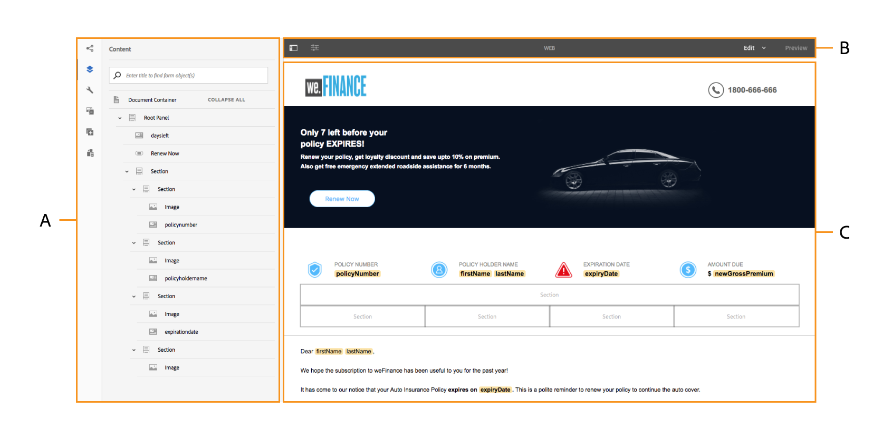

# 대화형 통신 작성 UI 소개 {#introduction-to-interactive-communication-authoring-ui}

>[!CAUTION]
>
>AEM 6.4가 확장 지원이 종료되었으며 이 설명서는 더 이상 업데이트되지 않습니다. 자세한 내용은 [기술 지원 기간](https://helpx.adobe.com/kr/support/programs/eol-matrix.html). 지원되는 버전 찾기 [여기](https://experienceleague.adobe.com/docs/).

대화형 커뮤니케이션을 작성하는 데 사용할 수 있는 다양한 사용자 인터페이스 요소를 소개합니다

작성을 위한 사용자 인터페이스 [대화형 통신](/help/forms/using/interactive-communications-overview.md) 는 직관적이며 대화형 커뮤니케이션의 인쇄 및 웹 채널을 작성하는 데 다음과 같은 기능을 제공합니다.

* WYSIWYG 드래그 앤 드롭 문서 편집기
* 자산에 대한 통합 저장소 - 서버에 업로드되고 서버에서 만든 자산은 Interactive Communication 작성 인터페이스의 자산 브라우저에서 사용할 수 있습니다

다음 경우에 [새 대화형 통신 만들기 또는 기존 대화형 통신 편집](/help/forms/using/create-interactive-communication.md)를 채울 때는 다음 사용자 인터페이스 요소를 사용합니다.

* [사이드바](#sidebar)
* [페이지 도구 모음](#page-toolbar)

* [구성 요소 도구 모음](#component-toolbar)
* 컨텐츠 영역

**A.** 사이드바 **B.** 페이지 도구 모음 **C.** 콘텐츠 영역

## 사이드바 {#sidebar}

[확대하려면 클릭](assets/sidebar-comps-1.png)

**A.** 채널 브라우저 **B.** 컨텐츠 브라우저 **C.** 속성 브라우저 **D.** 자산 브라우저 **E.** 구성 요소 브라우저 **F.** Data Sources 브라우저 - 데이터 모델 **G.** 데이터 소스 브라우저 - 기본 컨텐츠

사이드바는 다음과 같습니다.

* **채널 브라우저**

   채널 브라우저는 대화형 커뮤니케이션의 인쇄 및 웹 채널 간을 전환하는 데 도움이 됩니다. 채널 브라우저에서 선택한 채널을 기반으로 컨텐츠 및 구성 요소 와 같은 브라우저에 옵션이 표시됩니다.

* **컨텐츠 브라우저**

   컨텐츠 브라우저에서 선택한 채널에 대한 문서의 객체 계층 구조를 볼 수 있습니다. 작성자는 문서 객체 트리에서 해당 요소를 탭하여 특정 구성 요소로 이동할 수 있습니다. 작성자는 웹 채널에서 개체를 검색하고 이 트리에서 다시 정렬할 수 있습니다.

* **속성 브라우저**

   구성 요소의 속성을 편집할 수 있습니다. 속성은 구성 요소에 따라 변경됩니다. 예를 들어 문서 컨테이너의 속성을 보려면

   구성 요소를 선택한 다음  > **문서 컨테이너**&#x200B;를 누른 다음 탭합니다. .

* **에셋 브라우저**

   레이아웃 조각, 이미지, 문서, 페이지, 비디오와 같은 다양한 유형의 컨텐츠를 구분합니다. 작성자는 자산을 대화형 커뮤니케이션에 드래그하여 놓을 수 있습니다.

* **구성 요소 브라우저**

   문서의 인쇄 및 웹 채널을 만드는 데 사용할 수 있는 구성 요소를 포함합니다. 구성 요소를 대화형 커뮤니케이션으로 끌어 요소를 추가하고 요구 사항에 따라 추가된 요소를 구성할 수 있습니다. 다음 표에서는 인쇄 및 웹 채널을 위한 구성 요소 브라우저에 나열된 구성 요소를 설명합니다.

| **구성 요소** | **인쇄 채널** | **웹 채널** | **기능** |
|---|---|---|---|
| Chart | ✓ | ✓ | 양식 데이터 모델 수집 항목에서 검색한 2차원 데이터를 시각적으로 표시하기 위해 Interactive Communication에서 사용할 수 있는 차트를 추가합니다. |
| 문서 조각 | ✓ | ✓ | 재사용 가능한 구성 요소, 텍스트, 목록 또는 조건을 대화형 커뮤니케이션에 추가할 수 있습니다. 대화형 커뮤니케이션에 추가하는 재사용 가능한 구성 요소는 양식 데이터 모델 기반이거나 양식 데이터 모델이 없을 수 있습니다. |
| 이미지 | ✓ | ✓ | 이미지를 삽입할 수 있습니다. |
| 패널 | - | ✓ | 패널 구성 요소는 다른 구성 요소를 함께 그룹화하는 자리 표시자로서, 대화형 커뮤니케이션에서 구성 요소 그룹이 배치되는 방식을 제어합니다. 패널 구성 요소를 사용하면 교육 자격 증명을 채우는 데 필요한 여러 항목 경우와 같이 최종 사용자를 위해 반복 가능한 구성 요소 그룹을 만들 수도 있습니다. 또한 여러 탭이 있는 대화형 커뮤니케이션의 탭에 대해 각각 패널을 사용하는 것이 좋습니다. |
| 표 | &amp;ast; | ✓ | 행 및 열에 데이터를 구성할 수 있는 표를 추가합니다. |
| 대상 영역 | &amp;ast;&amp;ast; | ✓ | 웹 채널에서 대상 영역을 삽입하여 웹 채널별 구성 요소를 구성합니다. |
| 텍스트 | - | ✓ | 대화형 커뮤니케이션의 웹 채널에 텍스트를 추가합니다. 텍스트는 양식 데이터 모델 개체를 사용하여 컨텐츠를 동적으로 만들 수 있습니다. |

&amp;ast; 인쇄 채널에서 레이아웃 조각을 사용하여 표를 추가합니다.

&amp;ast;&amp;ast; 인쇄 채널에서 대상 영역은 XDP/인쇄 템플릿에서 미리 정의됩니다. 대화형 통신 작성 UI를 사용하여 새 대상 영역을 추가할 수 없습니다.

* **데이터 소스 브라우저**

   데이터 소스 브라우저에는 대화형 커뮤니케이션을 만드는 동안 선택한 양식 데이터 모델에 사용 가능한 데이터 소스가 표시됩니다.

### 구성 요소 작업 주요 사항 {#key-points-for-working-with-components}

대화형 통신 구성 요소로 작업할 때 주요 사항은 다음과 같습니다.

* 각 구성 요소에는 모양과 기능을 제어하는 관련 속성이 있습니다. 구성 요소의 속성을 구성하려면 구성 요소를 탭하고 탭합니다  를 클릭하여 속성 브라우저에서 구성 요소 속성을 엽니다.
* 구성 요소가 해당 요소 이름으로 식별됩니다. 탭할 때 를 채울 때는 속성 브라우저에서 요소 이름 필드 값을 변경하여 구성 요소의 이름을 변경할 수 있습니다. 요소 이름 필드는 문자, 숫자, 하이픈(-) 및 밑줄(_)만 사용할 수 있습니다. 다른 특수 문자는 사용할 수 없으며 요소 이름은 문자로 시작해야 합니다.
* 제목이 대화형 커뮤니케이션에 표시되는 한 속성 브라우저를 열지 않고 편집기에서 Interactive Communication 구성 요소 인라인의 제목 속성을 수정할 수 있습니다. 방법은 다음과 같습니다.

   1. 제목 속성이 있고 제목 숨기기 속성이 비활성화된 구성 요소를 탭하여 선택합니다.
   1. 탭  제목을 편집할 수 있도록 합니다.
   1. 제목을 수정하고 Return 키를 누르거나 구성 요소 외부의 아무 곳이나 탭하여 변경 사항을 저장합니다. Esc 키를 눌러 변경 사항을 삭제합니다.

## 구성 요소 도구 모음 {#component-toolbar}

구성 요소를 선택하면 해당 구성 요소로 작업할 수 있는 도구 모음이 표시됩니다. 구성 요소의 속성을 자르고, 붙여넣고, 이동하고, 지정하는 옵션이 제공됩니다. 옵션은 다음과 같습니다.

A.**구성**: **구성**&#x200B;을 탭하면 구성 요소 속성이 사이드바에 표시됩니다.

B. **규칙 편집**: 규칙 편집 을 탭하면 선택한 구성 요소에 대한 규칙을 편집하고 만들 수 있는 규칙 편집기가 나타납니다. 규칙 편집기에서 다른 양식 객체(구성 요소)를 선택하고 이러한 양식 객체에 대한 규칙을 편집/만들 수도 있습니다.

C. **복사**: 복사 옵션을 사용하여 구성 요소를 복사하여 대화형 커뮤니케이션의 다른 위치에 붙여넣을 수 있습니다.

D. **잘라내기**: 잘라내기 옵션을 사용하여 대화형 커뮤니케이션에서 한 위치에서 다른 위치로 구성 요소를 이동할 수 있습니다.

E. **삭제**: 대화형 커뮤니케이션에서 구성 요소를 삭제할 수 있습니다.

F. **구성 요소 삽입**: 선택한 구성 요소 위에 구성 요소를 삽입할 수 있습니다.

G. **붙여넣기**: 위에서 설명한 옵션을 사용하여 잘라내거나 복사한 구성 요소를 붙여넣을 수 있습니다.

H. **그룹**: 두 개 이상의 구성 요소를 함께 자르고 복사하거나 붙여넣으려는 경우 여러 구성 요소를 선택할 수 있습니다.

I. **상위**: 상위 구성 요소를 선택할 수 있습니다.

J. **자세히**: 선택한 구성 요소로 작업할 수 있는 추가 옵션을 제공합니다.

* SOM 표현식 보기(패널에만 해당)
* 패널에서 객체 그룹화(패널에만 해당)
* 조각 편집 (조각에만 해당)
* 조각으로 패널 저장 (패널만 해당)
* 하위 패널 추가 (패널만 해당)
* 패널 도구 모음 추가 (패널만 해당)
* 바꾸기 (패널에 해당되지 않음)

## 페이지 도구 모음 {#page-toolbar}

맨 위에 있는 페이지 도구 모음에서는 대화형 커뮤니케이션을 미리 보고 해당 속성을 변경할 수 있는 옵션을 제공합니다. 작성 시 대화형 커뮤니케이션을 미리 보고 그에 따라 변경할 수 있습니다. 페이지 도구 모음에는 다음 항목이 표시됩니다.

* 사이드 패널 전환: 사이드바를 표시하거나 숨길 수 있습니다.
* 페이지 정보 : 페이지 속성을 볼 수 있습니다.
* 에뮬레이터 : 태블릿이나 휴대폰과 같은 다양한 디스플레이 크기에 대해 대화형 커뮤니케이션의 모양을 에뮬레이션할 수 있습니다.
* 편집: 편집, 스타일, 개발자, 디자인  등 다른 모델을 선택할 수 있습니다.

   * 편집: 대화형 통신 및 해당 구성 요소의 속성을 편집할 수 있습니다. 예: 구성 요소 추가, 이미지 드롭, 필수 필드 지정 등.
   * 스타일: 대화형 커뮤니케이션의 구성 요소 모양을 스타일을 지정할 수 있습니다. 예를 들어 스타일 모드에서는 패널을 선택하고 배경색을 지정할 수 있습니다.
   * 개발자: 개발자는 다음 작업을 수행할 수 있습니다.

      * 대화형 커뮤니케이션으로 구성된 내용을 알아봅니다.
      * 장소와 시간에 따라 발생하는 문제를 디버그하면 문제 해결에 도움이 됩니다.
   * Target: 사용자 지정 구성 요소 또는 사이드바에 나열되지 않은 기본 구성 요소를 활성화하거나 비활성화할 수 있습니다.

* 미리 보기: 게시할 때 대화형 커뮤니케이션이 어떻게 보이는지 미리 볼 수 있도록 해줍니다.
