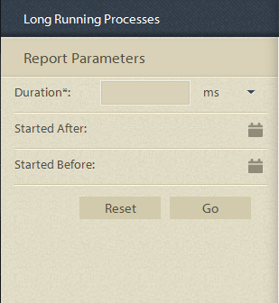

# 프로세스 보고에서 사전 정의된 보고서 {#pre-defined-reports-in-process-reporting}

AEM Forms 프로세스 보고는 다음 *즉시 사용* 보고서와 함께 제공됩니다.

* **[긴 실행 프로세스](/help/forms/using/process-reporting/pre-defined-reports-in-process-reporting.md#p-long-running-processes-p)**:완료하는 데 지정된 시간 이상 걸린 모든 AEM Forms 프로세스에 대한 보고서

* **[프로세스 기간 차트](/help/forms/using/process-reporting/pre-defined-reports-in-process-reporting.md#p-process-duration-report-br-p)**:기간별 지정된 AEM Forms 프로세스 보고서

* **[워크플로우 볼륨](/help/forms/using/process-reporting/pre-defined-reports-in-process-reporting.md#p-workflow-volume-report-p)**:날짜별로 지정된 프로세스의 실행 및 완료된 인스턴스에 대한 보고서

## 긴 실행 프로세스 {#long-running-processes}

긴 실행 프로세스 보고서는 완료하는 데 지정된 시간 이상 걸린 AEM Forms 프로세스를 표시합니다.

### 긴 실행 프로세스 보고서를 실행하려면 {#to-execute-a-long-running-process-report-br}

1. 프로세스 보고에서 사전 정의된 보고서의 목록을 보려면 **프로세스 보고** 트리 보기에서 **보고서** 노드를 클릭합니다.
1. **긴 실행 프로세스** 보고서 노드를 클릭합니다.

   

   보고서를 선택하면 **보고서 매개 변수** 패널이 트리 보기 오른쪽에 표시됩니다.

   

   매개 변수:

   * **기간**(*필수*):지속 시간 및 시간 단위를 지정합니다. 지정된 기간 이상 실행된 모든 AEM Forms 프로세스를 표시합니다.
   * **시작 후** (*선택 사항*):날짜를 선택합니다. 지정된 날짜 이후에 시작된 프로세스 인스턴스를 표시하도록 보고서를 필터링합니다.
   * **시작하기 전** (*선택 사항*):날짜를 선택합니다. 지정된 날짜 이전에 시작된 프로세스 인스턴스를 표시하도록 보고서를 필터링합니다.

1. **이동**&#x200B;을 클릭하여 보고서를 실행합니다.

   보고서는 **프로세스 보고** 창 오른쪽의 **보고서** 패널에 표시됩니다.

   

   보고서에서 다음 작업을 수행하려면 **보고서** 패널의 오른쪽 위 모서리에 있는 옵션을 사용합니다.

   * **새로 고침**:최신 데이터가 저장소에 있는 보고서를 새로 고칩니다.
   * **범례 색상** 변경:보고서 범례 색상 선택 및 변경
   * **CSV로 내보내기**:보고서의 데이터를 쉼표로 구분된 파일로 내보내고 다운로드합니다.

## 프로세스 기간 보고서 {#process-duration-report-br}

프로세스 기간 보고서에는 각 인스턴스가 실행한 일수로 Forms 프로세스 인스턴스 수가 표시됩니다.

### 프로세스 기간 보고서를 실행하려면 {#to-execute-a-process-duration-report-br}

1. 프로세스 보고에서 사전 정의된 보고서를 보려면 **프로세스 보고** 트리 보기에서 **보고서** 노드를 클릭합니다.
1. **프로세스 기간** 보고서 노드를 클릭합니다.

   

   보고서를 선택하면 **보고서 매개 변수** 패널이 트리 보기 오른쪽에 표시됩니다.

   

   매개 변수:

   * **프로세스** (*필수*) 선택:AEM Forms 프로세스를 선택합니다.

1. **이동**&#x200B;을 클릭하여 보고서를 실행합니다.

   보고서는 프로세스 보고 창 오른쪽의 **보고서** 패널에 표시됩니다.

   

   보고서에서 다음 작업을 수행하려면 **보고서** 패널의 오른쪽 위 모서리에 있는 옵션을 사용합니다.

   * **새로 고침**:최신 데이터가 저장소에 있는 보고서를 새로 고칩니다.
   * **범례 색상** 변경:보고서 범례 색상 선택 및 변경
   * **CSV로 내보내기**:보고서의 데이터를 쉼표로 구분된 파일로 내보내고 다운로드합니다.

## 워크플로 볼륨 보고서 {#workflow-volume-report}

워크플로우 볼륨 보고서는 일별 현재 실행 중이며 완료된 AEM Forms 프로세스 인스턴스 수를 표시합니다.

### 워크플로우 볼륨 보고서 {#to-execute-a-workflow-volume-report-br}를 실행하려면

1. 프로세스 보고에서 사전 정의된 보고서를 보려면 **프로세스 보고** 트리 보기에서 **보고서** 노드를 클릭합니다.
1. **워크플로우 볼륨** 보고서 노드를 클릭합니다.

   

   보고서를 선택하면 **보고서 매개 변수** 패널이 트리 보기 오른쪽에 표시됩니다.

   

   매개 변수:

   * **프로세스**(*필수*) 선택:AEM Forms 프로세스를 선택합니다.
   * **시작 후** (*선택 사항*):날짜를 선택합니다. 지정된 날짜 이후에 시작된 프로세스 인스턴스를 표시하도록 보고서를 필터링합니다.
   * **시작하기 전** (*선택 사항*):날짜를 선택합니다. 지정된 날짜 이전에 시작된 프로세스 인스턴스를 표시하도록 보고서를 필터링합니다.

1. **이동**&#x200B;을 클릭하여 보고서를 실행합니다.

   보고서는 **프로세스 보고** 창 오른쪽의 **보고서** 패널에 표시됩니다.

   

   보고서에서 다음 작업을 수행하려면 **보고서** 패널의 오른쪽 위 모서리에 있는 옵션을 사용합니다.

   * **새로 고침**:최신 데이터가 저장소에 있는 보고서를 새로 고칩니다.
   * **범례 색상** 변경:보고서 범례 색상 선택 및 변경
   * **CSV로 내보내기**:보고서의 데이터를 쉼표로 구분된 파일로 내보내고 다운로드합니다.

