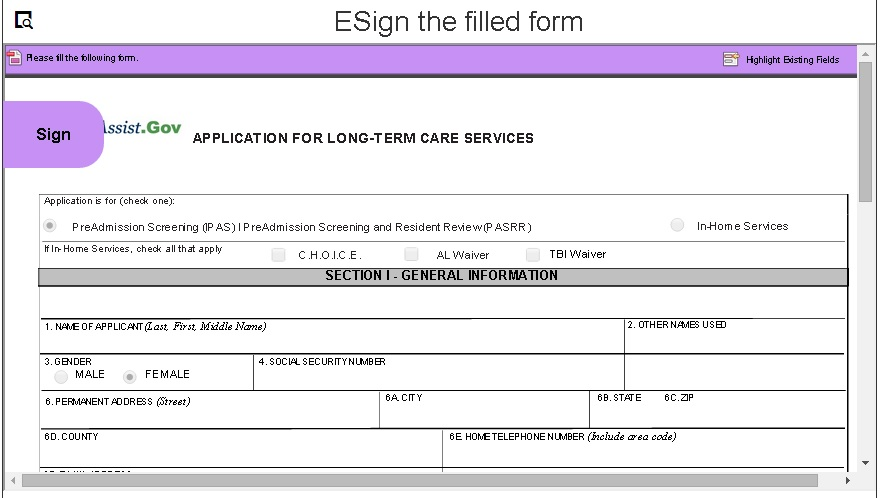

# 서명에 전자 서명 적용 {#apply-electronic-signatures-to-a-form-using-scribble-signatures}

자유 서명 구성 요소 및 **서명** 단계 **구성 요소를 사용하여 적응형 양식에 서명을** 그리기(스크리블)할 수 있습니다. 서명 단계 구성 요소는 적응형 양식의 PDF 버전을 표시합니다. 서명 단계 구성 요소를 사용하려면 기록 문서 옵션이 활성화되어 있거나 양식 템플릿 기반 적응형 양식이 필요합니다.

두 구성 요소 모두 아래 표시된 대로 양식에 서명할 수 있는 창을 제공합니다. 지리적 위치 아이콘  서명에 지리적 위치를 추가할 수도 있습니다.

## 자유 서명을 사용하도록 적응형 양식 구성 {#configure-an-adaptive-form-to-use-scribble-signature}

1. 기록 문서 만들기 옵션을 활성화하거나 양식 템플릿 기반 적응형 양식을 사용합니다. 단계별 정보는 적응형 양식 [만들기를 참조하십시오](/help/forms/using/creating-adaptive-form.md).
1. 구성 요소 브라우저에서 **문지가능 서명** 구성 요소를 응용 양식으로 드래그하여 놓습니다.
1. 구성 **아이콘을**  . 속성 브라우저를 열고 문지가능 서명 구성 요소의 속성을 표시합니다. 스크리블 서명 구성 요소의 속성을 구성합니다.
1. 서명 단계 구성 요소를 구성 요소 브라우저에서 응용 양식으로 드래그하여 놓습니다.

   >[!NOTE]
   >
   >서명 단계 구성 요소는 양식에 사용할 수 있는 전체 너비를 차지합니다. 서명 단계 구성 요소를 포함하는 섹션에는 다른 구성 요소가 없는 것이 좋습니다.

1. 컨텐츠 브라우저에서 **양식 컨테이너**&#x200B;를 누르고 구성 **** 구성  아이콘을누릅니다. 속성 브라우저를 열고 응용 양식 컨테이너 속성을 표시합니다. [ **적응형 양식 컨테이너** ] > [ **전자 서명** ]으로 이동하고 [Adobe Sign **활성화** ] 옵션을 선택 취소합니다. 변경 사항을 저장하려면  완료 아이콘을 누릅니다.

   >[!NOTE]
   >
   >서명 단계 구성 요소를 적응형 양식에 추가하면 Adobe Sign 활성화 옵션이 자동으로 선택됩니다.

1. 구성 **아이콘을**  . 속성 브라우저를 열고 서명 단계 속성을 표시합니다. 다음 속성을 구성합니다.

   * **요소 이름**: 구성 요소의 이름을 지정합니다.
   * **제목:** 구성 요소의 고유한 제목을 지정합니다.
   * **템플릿 메시지:** 서명 PDF를 로드하는 동안 표시할 메시지를 지정합니다. Adobe Sign 서비스는 서명 PDF를 준비하고 로드하는 데 시간이 다소 소요됩니다.
   * **서명 서비스:** [문지가능 서명] **옵션을** 선택합니다.
   * **CSS 클래스**: 클라이언트 라이브러리의 CSS 클래스(있는 경우)를 지정합니다. CSS 클래스 대신 [테마](/help/forms/using/themes.md) 및 [인라인 스타일을](/help/forms/using/inline-style-adaptive-forms.md) 사용하는 것이 좋습니다.

   변경 사항을 저장하려면  완료 아이콘을 누릅니다. 서명이 성공적으로 구성되었습니다.

   이제 양식을 채울 때 PDF 버전의 적응형 양식이 표시되고 PDF 문서에 서명할 수 있는 옵션이 제공됩니다. 자세한 내용은 문지르기 서명 [을 사용하여 적응형 양식 서명을 참조하십시오](/help/forms/using/signing-forms-using-scribble.md#p-sign-an-adaptive-form-using-scribble-signature-p).

## 자유 서명을 사용하여 적응형 양식 서명 {#sign-an-adaptive-form-using-scribble-signature}

1. 적응형 양식을 채우고 [서명 단계] 페이지에 도달하면 서명 화면이 표시됩니다.

   

1. 서명을 **[!UICONTROL 클릭합니다]**. 문지르기 기호 대화 상자가 나타납니다. 양식에 서명하고  완료 아이콘을 클릭하여 서명을 저장합니다.

   

1. 완료를 클릭하여 서명 프로세스를 완료합니다.

   

양식에 서명이 추가되고 양식 컨트롤이 다음 패널로 이동합니다.

