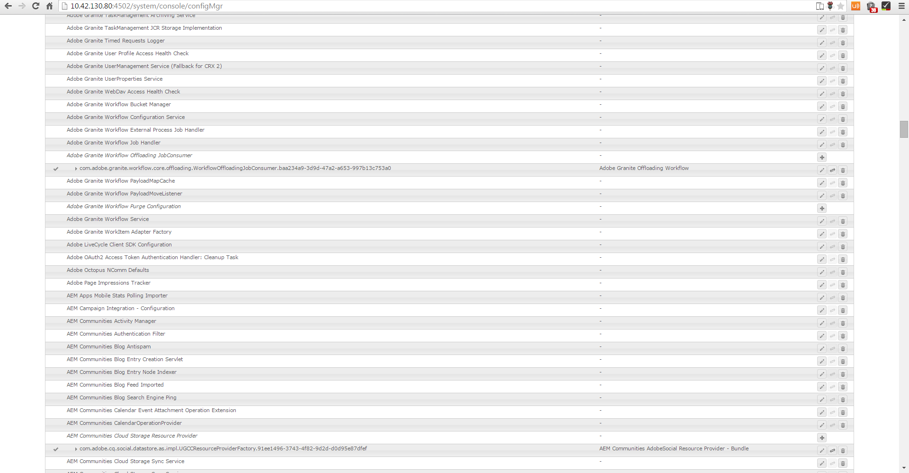

# 서신 및 인터랙티브한 커뮤니케이션의 사후 처리 {#post-processing-of-letters-and-interactive-communications}

## 사후 처리 {#post-processing}

에이전트는 문자 및 인터랙티브한 커뮤니케이션에 사후 처리 워크플로우를 연결하고 실행할 수 있습니다. 실행할 게시 프로세스는 문자 템플릿의 속성 보기에서 선택할 수 있습니다. 최종 편지를 이메일, 인쇄, 팩스 또는 보관하도록 게시 프로세스를 설정할 수 있습니다.

게시물 프로세스를 편지 또는 대화형 통신과 연결하려면 먼저 게시물 프로세스를 설정해야 합니다. 제출된 편지에서는 두 가지 유형의 워크플로우를 실행할 수 있습니다.

1. **양식 워크플로우:** 다음은 JEE 프로세스 관리 워크플로우의 AEM 양식입니다. 양식 워크플로우 설정 [지침](#formsworkflow).

1. **AEM 워크플로우:** AEM 워크플로우를 제출된 서신의 게시 프로세스로 사용할 수도 있습니다. AEM 워크플로우 설정 [지침](/help/forms/using/aem-forms-workflow.md).

## 양식 워크플로우 {#formsworkflow}

1. AEM에서 다음 URL을 사용하여 서버에 대한 Adobe Experience Manager 웹 콘솔 구성을 엽니다. `https://<server>:<port>/<contextpath>/system/console/configMgr`

   

1. 이 페이지에서 AEM Forms 클라이언트 SDK 구성을 찾아 클릭하여 확장합니다.
1. 서버 URL에서 JEE 서버에 있는 AEM Forms 이름과 로그인 세부 정보를 입력한 다음 **저장을 클릭합니다**.

   

1. 사용자 이름과 암호를 지정합니다.
1. sun.util.calendar가 Deserialization 방화벽 구성에 추가되었는지 확인합니다.

   Deserialization Firewall 구성으로 이동하고 패키지 접두사의 Whitellisted 클래스 아래에서 sun.util.calendar를 추가합니다.

1. 이제 서버가 매핑되고 JEE에서 AEM Forms의 게시물 프로세스는 AEM 사용자 인터페이스에서 문자를 만들 수 있습니다.

   

1. 프로세스/서비스를 인증하려면 프로세스 이름을 복사하고 Adobe Experience Manager 웹 콘솔 구성 페이지 > AEM Forms 클라이언트 SDK 구성으로 돌아가서 프로세스를 새 서비스로 추가합니다.

   예를 들어 문자의 속성 페이지의 드롭다운에 프로세스 이름이 양식 워크플로우 -> ValidCCPostProcess/SaveXML로 표시되면 서비스 이름을 다른 이름으로 추가합니다 `ValidCCPostProcess/SaveXML`.

1. 사후 처리를 위해 JEE 워크플로우에서 AEM Forms를 사용하려면 필요한 매개 변수 및 출력을 설정합니다. 매개 변수의 기본값은 아래에 표시됩니다.

   Adobe Experience Manager 웹 콘솔 구성 페이지 > 통신 **[!UICONTROL 관리 구성]** 으로 이동하여 다음 매개 변수를 설정합니다.

   1. **inPDFDoc(PDF 문서 매개 변수):** PDF 문서를 입력합니다. 이 입력에는 렌더링된 문자가 입력으로 포함됩니다. 표시된 매개 변수 이름은 구성할 수 있습니다. 통신 관리 구성에서 구성할 수 있습니다.
   1. **inXMLDoc(XML 데이터 매개 변수):** XML 문서를 입력합니다. 이 입력에는 사용자가 XML 형식으로 입력한 데이터가 포함됩니다.
   1. **inXDPDoc(XDP 문서 매개 변수):** XML 문서를 입력합니다. 이 입력에는 기본 레이아웃(XDP)이 포함됩니다.
   1. **inAttachmentDocs(첨부 문서 매개 변수):** 목록 입력 매개 변수입니다. 이 입력에는 모든 첨부 파일이 입력되어 있습니다.
   1. **redirectURL(리디렉션 URL 출력):** 리디렉션할 URL을 나타내는 출력 유형입니다.

   양식 워크플로우에는 PDF 문서 매개 변수 또는 XML 데이터 매개 변수가 **[!UICONTROL 서신 관리 구성에 지정된 이름과 동일한 이름으로 입력되어야 합니다]**. 게시 프로세스 드롭다운에 나열되는 프로세스에 필요합니다.

## 게시 인스턴스의 설정 {#settings-on-the-publish-instance}

1. 에 로그인합니다 `http://localhost:publishport/aem/forms`.
1. Letters **[!UICONTROL 로]** 이동하여 게시 인스턴스에서 사용할 수 있는 게시된 문자를 봅니다.
1. AEM DS 설정을 구성합니다. AEM [DS 설정 구성을 참조하십시오](/help/forms/using/configuring-the-processing-server-url-.md).

>[!NOTE]
>
>양식 또는 AEM 워크플로우를 사용하는 동안 게시 서버에서 제출하기 전에 DS 설정 서비스를 구성해야 합니다. 그렇지 않으면 양식 제출이 실패합니다.

## 문자 인스턴스 검색 {#letter-instances-retrieval}

LetterInstanceService에 정의된 다음 API를 사용하여 문자 인스턴스 검색 및 문자 인스턴스 삭제 등 저장된 문자 인스턴스를 더 조작할 수 있습니다.

<table> 
 <tbody> 
  <tr> 
   <td><strong>서버측 API</strong></td> 
   <td><strong>작업 이름</strong></td> 
   <td><strong>설명</strong></td> 
  </tr> 
  <tr> 
   <td>
Public LetterInstanceVO
 
getLetterInstance(String letterInstanceId)
 
ICCException을 던집니다. 
 </td> 
   <td>getLetterInstance</td> 
   <td>지정된 문자 인스턴스 가져오기 </td> 
  </tr> 
  <tr> 
   <td>public void deleteLetterInstance(String letterInstanceId)에 ICCException이 throw됩니다. </td> 
   <td>deleteLetterInstance </td> 
   <td>지정된 문자 인스턴스를 삭제했습니다. </td> 
  </tr> 
  <tr> 
   <td>List getAllLetterInstances(Query)는 ICCException을 던집니다. </td> 
   <td>getAllLetterInstances </td> 
   <td>이 API는 입력 쿼리 매개 변수를 기반으로 문자 인스턴스를 가져옵니다. 모든 문자 인스턴스를 가져오려면 쿼리 매개 변수를 null로 전달할 수 있습니다.  </td> 
  </tr> 
  <tr> 
   <td>공용 부울 letterInstanceExists(String letterInstanceName)에서 ICCException;을 throw합니다. </td> 
   <td>letterInstanceExists </td> 
   <td>LetterInstance가 지정된 이름으로 존재하는지 확인 </td> 
  </tr> 
 </tbody> 
</table>

## 게시물 프로세스와 편지 연결 {#associating-a-post-process-with-a-letter}

CCR 사용자 인터페이스에서 다음 단계를 완료하여 게시물 프로세스를 편지와 연결합니다.

1. 문자 위로 마우스를 가져간 다음 속성 **보기를 누릅니다**.
1. **편집**&#x200B;을 선택하십시오.
1. 기본 속성에서 게시물 프로세스 드롭다운을 사용하여 글자와 연결할 게시물 프로세스를 선택합니다. AEM 및 양식 관련 게시 프로세스가 모두 드롭다운에 나열됩니다.
1. 저장을 **누릅니다**.
1. 게시물 프로세스로 문자를 구성한 후, 문자를 게시하고 선택적으로 게시 인스턴스에서 AEM DS 설정 서비스에 처리 URL을 지정합니다. 이렇게 하면 사후 프로세스가 처리 인스턴스에서 실행됩니다.

## 초안 문자 인스턴스 다시 로드  {#reloaddraft}

다음 url을 사용하여 사용자 인터페이스에서 초안 문자 인스턴스를 다시 로드할 수 있습니다.

`https://<server>:<port>/aem/forms/`

`createcorrespondence.html?/random=$&cmLetterInstanceId=$<LetterInstanceId>`

LetterInstaceID: 제출된 편지 인스턴스의 고유 ID입니다.

초안 편지 저장에 대한 자세한 내용은 초안 [저장 및 서신 인스턴스 제출을 참조하십시오](/help/forms/using/create-correspondence.md#savingdrafts).
