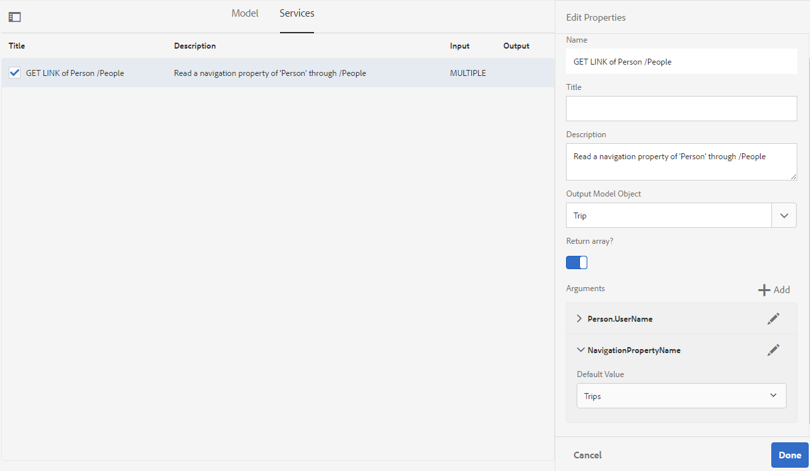

# 양식 데이터 모델 {#work-with-form-data-model} 작업

데이터 통합은 양식 데이터 모델을 구성하고 작업할 수 있는 양식 데이터 모델 편집기를 제공합니다.


양식 데이터 모델 편집기에서는 양식 데이터 모델을 편집하고 구성하기 위한 직관적인 사용자 인터페이스와 도구를 제공합니다. 편집기를 사용하여 양식 데이터 모델의 관련 데이터 소스에서 데이터 모델 개체, 속성 및 서비스를 추가하고 구성할 수 있습니다. 또한 데이터 소스 없이 데이터 모델 개체 및 속성을 만들고 나중에 각 데이터 모델 개체 및 속성에 바인딩할 수 있습니다. 미리 보는 동안 적응형 양식 및 대화형 커뮤니케이션을 미리 채우는 데 사용할 수 있는 데이터 모델 개체 속성에 대한 샘플 데이터를 생성하고 편집할 수도 있습니다. 양식 데이터 모델로 구성된 데이터 모델 개체 및 서비스를 테스트하여 데이터 소스와 제대로 통합되었는지 확인할 수 있습니다.

Forms 데이터 통합을 처음 사용하고 데이터 소스를 구성하지 않았거나 양식 데이터 모델을 만들지 않은 경우 다음 주제를 참조하십시오.

* [AEM Forms 데이터 통합](/help/forms/using/data-integration.md)
* [데이터 소스 구성](/help/forms/using/configure-data-sources.md)
* [양식 데이터 모델 만들기](/help/forms/using/create-form-data-models.md)

양식 데이터 모델 편집기를 사용하여 수행할 수 있는 다양한 작업 및 구성에 대한 자세한 내용을 살펴보십시오.

>[!NOTE]
>
>양식 데이터 모델을 만들고 작업할 수 있으려면 **fdm-author** 및 **forms-user** 그룹 모두의 구성원이어야 합니다. AEM 관리자에게 문의하여 그룹의 구성원이 되도록 하십시오.

## 데이터 모델 개체 및 서비스 추가 {#add-data-model-objects-and-services}

데이터 소스를 사용하여 양식 데이터 모델을 만든 경우 양식 데이터 모델 편집기를 사용하여 데이터 모델 개체 및 서비스를 추가하고, 속성을 구성하고, 데이터 모델 개체 간의 연결을 작성하고, 양식 데이터 모델과 서비스를 테스트할 수 있습니다.

양식 데이터 모델의 사용 가능한 데이터 소스에서 데이터 모델 개체 및 서비스를 추가할 수 있습니다. 추가된 데이터 모델 개체가 모델 탭에 나타나는 동안 추가된 서비스가 서비스 탭에 나타납니다.

데이터 모델 개체 및 서비스를 추가하려면 다음을 수행합니다.

1. AEM 작성자 인스턴스에 로그인하고 **[!UICONTROL Forms > 데이터 통합]**&#x200B;으로 이동한 다음 데이터 모델 개체를 추가할 양식 데이터 모델을 엽니다.
1. 데이터 소스 창에서 데이터 소스를 확장하여 사용 가능한 데이터 모델 개체 및 서비스를 봅니다.
1. 양식 데이터 모델에 추가할 데이터 모델 개체 및 서비스를 선택하고 **[!UICONTROL 선택한 항목 추가]**&#x200B;를 누릅니다.

   

   모델(Model) 탭에는 양식 데이터 모델에 추가된 모든 데이터 모델 객체와 해당 속성의 그래픽 표현이 표시됩니다. 각 데이터 모델 개체는 양식 데이터 모델의 상자로 표시됩니다.

   

   >[!NOTE]
   >
   >데이터 모델 개체 상자를 길게 끌어서 컨텐츠 영역에서 구성할 수 있습니다. 양식 데이터 모델에 추가된 모든 데이터 모델 개체가 데이터 소스 창에서 회색으로 표시됩니다.

   서비스 탭에는 추가된 서비스가 나열됩니다.

   

   >[!NOTE]
   >
   >데이터 모델 개체 및 서비스 외에도 OData 서비스 메타데이터 문서에는 두 데이터 모델 개체 간의 연결을 정의하는 탐색 속성이 포함되어 있습니다. 자세한 내용은 [OData 서비스의 탐색 속성 작업](#work-with-navigation-properties-of-odata-services)을 참조하십시오.

1. **[!UICONTROL 저장]**&#x200B;을 눌러 양식 모델 개체를 저장합니다.

   >[!NOTE]
   >
   >적응형 양식 규칙을 사용하여 양식 데이터 모델의 서비스 탭에서 구성한 서비스를 호출할 수 있습니다. 구성된 서비스는 규칙 편집기의 서비스 호출 작업에서 사용할 수 있습니다. 적응형 양식 규칙에서 이러한 서비스를 사용하는 방법에 대한 자세한 내용은 [규칙 편집기](/help/forms/using/rule-editor.md)에서 서비스 호출 및 규칙 값 설정을 참조하십시오.

## 데이터 모델 개체 및 하위 속성 {#create-data-model-objects-and-child-properties} 만들기

### 데이터 모델 개체 만들기 {#create-data-model-objects}

구성된 데이터 소스에서 데이터 모델 개체를 추가할 수 있지만, 데이터 소스 없이 데이터 모델 개체나 개체를 만들 수도 있습니다. 이 기능은 특히 양식 데이터 모델에서 데이터 소스를 구성하지 않은 경우에 유용합니다.

데이터 소스 없이 데이터 모델 개체를 만들려면

1. AEM 작성자 인스턴스에 로그인하고 **[!UICONTROL Forms > 데이터 통합]**&#x200B;으로 이동한 다음 데이터 모델 개체 또는 엔터티를 만들 양식 데이터 모델을 엽니다.
1. **[!UICONTROL 엔티티 만들기]**&#x200B;를 누릅니다.
1. 데이터 모델 만들기 대화 상자에서 데이터 모델 개체의 이름을 지정하고 **[!UICONTROL 추가]**&#x200B;를 누릅니다. 데이터 모델 개체가 양식 데이터 모델에 추가됩니다. 새로 추가된 데이터 모델 개체는 데이터 소스에 바인딩되지 않으며 다음 이미지에 표시된 대로 속성이 없습니다.

   

그런 다음 바인딩되지 않은 데이터 모델 개체에 하위 속성을 추가할 수 있습니다.

### 하위 속성 추가 {#child-properties}

양식 데이터 모델 편집기를 사용하면 데이터 모델 개체에 하위 속성을 만들 수 있습니다. 만들 때 속성은 데이터 소스의 속성에 바인딩되지 않습니다. 나중에 하위 속성을 포함 데이터 모델 개체의 다른 속성에 바인딩할 수 있습니다.

하위 속성을 만들려면:

1. 양식 데이터 모델에서 데이터 모델 개체를 선택하고 **[!UICONTROL 하위 속성 만들기]**&#x200B;를 누릅니다.
1. **[!UICONTROL 하위 속성 만들기]** 대화 상자에서 속성에 대한 이름과 데이터 유형을 각각 **[!UICONTROL 이름]** 및 **[!UICONTROL 유형]** 필드에 지정합니다. 속성에 대한 제목과 설명을 선택적으로 지정할 수 있습니다.
1. 속성이 계산된 속성이면 계산됨 을 활성화합니다. 계산된 속성의 값은 규칙이나 식을 기반으로 평가됩니다. 자세한 내용은 [속성 편집](#edit-properties)을 참조하십시오.
1. 데이터 모델 개체가 데이터 소스에 바인딩되면 추가된 자식 속성이 동일한 이름 및 데이터 유형을 가진 부모 데이터 모델 개체의 속성에 자동으로 바인딩됩니다.

   데이터 모델 개체 속성으로 자식 속성을 수동으로 바인딩하려면 **[!UICONTROL Bind Reference]** 필드 옆에 있는 찾아보기 아이콘을 탭합니다. **[!UICONTROL 개체 선택]** 대화 상자에는 상위 데이터 모델 개체의 모든 속성이 나열됩니다. 바인딩할 속성을 선택하고 확인 표시 아이콘을 탭합니다. 하위 속성과 동일한 데이터 유형의 속성만 선택할 수 있습니다.

1. **[!UICONTROL 완료]**&#x200B;를 눌러 하위 속성을 저장하고 **[!UICONTROL 저장]**&#x200B;을 눌러 양식 데이터 모델을 저장합니다. 이제 하위 속성이 데이터 모델 개체에 추가됩니다.

데이터 모델 개체 및 속성을 만들면 양식 데이터 모델을 기반으로 적응형 양식 및 대화형 커뮤니케이션을 계속 만들 수 있습니다. 나중에 사용 가능하고 구성된 데이터 소스가 있으면 양식 데이터 모델을 데이터 소스와 바인딩할 수 있습니다. 바인딩은 연결된 적응형 양식 및 대화형 커뮤니케이션에서 자동으로 업데이트됩니다. 양식 데이터 모델을 사용하여 적응형 양식 및 대화형 커뮤니케이션을 만드는 방법에 대한 자세한 내용은 [양식 데이터 모델 사용](/help/forms/using/using-form-data-model.md)을 참조하십시오.

### 데이터 모델 개체 및 속성 바인딩 {#bind-data-model-objects-and-properties}

통합할 데이터 소스를 양식 데이터 모델과 사용할 수 있으면 [데이터 소스 업데이트](/help/forms/using/create-form-data-models.md#update)에 설명된 대로 양식 데이터 모델에 추가할 수 있습니다. 그런 다음 바인딩되지 않은 데이터 모델 개체 및 속성을 바인딩하려면 다음을 수행합니다.

1. 양식 데이터 모델에서 데이터 소스에 바인딩할 바인딩되지 않은 데이터 소스를 선택합니다.
1. **[!UICONTROL 속성 편집]**&#x200B;을 누릅니다.
1. **[!UICONTROL 속성 편집]** 창에서 **[!UICONTROL 바인딩]** 필드 옆에 있는 찾아보기 아이콘을 탭합니다. 양식 데이터 모델에 추가된 데이터 소스를 나열하는 **[!UICONTROL 개체 선택]** 대화 상자가 열립니다.

   

1. 데이터 소스 트리를 확장하고 바인딩할 데이터 모델 개체를 선택하고 확인 표시 아이콘을 탭합니다.
1. **[!UICONTROL 완료]**&#x200B;를 눌러 속성을 저장한 다음 **[!UICONTROL 저장]**&#x200B;을 탭하여 양식 데이터 모델을 저장합니다. 이제 데이터 모델 개체가 데이터 소스와 바인딩됩니다. 데이터 모델 개체가 더 이상 바인딩되지 않음으로 표시되지 않습니다.

   

## 서비스 구성 {#configure-services}

데이터 모델 객체에 대한 데이터를 읽고 쓰려면 다음을 수행하여 읽기 및 쓰기 서비스를 구성합니다.

1. 데이터 모델 개체 맨 위에 있는 확인란을 선택하여 선택하고 **[!UICONTROL 속성 편집]**&#x200B;을 누릅니다.

   

   속성을 편집하여 데이터 모델 객체에 대한 읽기 및 쓰기 서비스를 구성합니다

   속성 편집 대화 상자가 열립니다.

   

   속성 편집 대화 상자

   >[!NOTE]
   >
   >데이터 모델 개체 및 서비스 외에도 OData 서비스 메타데이터 문서에는 두 데이터 모델 개체 간의 연결을 정의하는 탐색 속성이 포함되어 있습니다. 양식 데이터 모델에 OData 서비스 데이터 소스를 추가하면 데이터 모델 개체의 모든 탐색 속성에 대해 양식 데이터 모델에서 사용할 수 있는 서비스가 있습니다. 이 서비스를 사용하여 해당 데이터 모델 개체의 탐색 속성을 읽을 수 있습니다.
   >
   >서비스 사용에 대한 자세한 내용은 [OData 서비스의 탐색 속성 작업](#work-with-navigation-properties-of-odata-services)을 참조하십시오.

1. 데이터 모델 개체가 최상위 모델 개체인지 여부를 지정하려면 **[!UICONTROL 최상위 개체]**&#x200B;를 전환합니다.

   양식 데이터 모델에 구성된 데이터 모델 개체는 양식 데이터 모델을 기반으로 하는 적응형 양식의 컨텐츠 브라우저의 데이터 모델 개체 탭에서 사용할 수 있습니다. 두 데이터 모델 객체 간의 연관성을 추가하면 연관되는 데이터 모델 객체가 데이터 모델 객체 탭에서 연관되는 데이터 모델 객체 아래에 중첩됩니다. 중첩된 데이터 모델이 최상위 개체인 경우 데이터 모델 개체 탭에서도 별도로 나타납니다. 따라서 양식 작성자를 혼동시킬 수 있는 중첩 계층 구조 내부와 외부의 항목 두 개가 표시됩니다. 연관된 데이터 모델 개체가 중첩된 계층에만 나타나도록 하려면 최상위 객체 속성을 비활성화합니다.

1. 선택한 데이터 모델 객체에 대해 읽기 및 쓰기 서비스를 선택합니다. 서비스에 대한 인수가 나타납니다.

   

   직원 데이터 소스에 대해 구성된 읽기 및 쓰기 서비스

1. 읽기 서비스 인수에 대해 를 탭하여 사용자 프로필 속성, 요청 속성 또는 리터럴 값에 인수를 바인딩하고 바인딩 값을 지정합니다. 서비스 인수를 지정된 바인딩 특성 또는 리터럴 값에 바인딩합니다. 이 값은 지정된 값에 연결된 세부 정보를 데이터 소스에서 가져오기 위한 인수로 서비스에 전달됩니다.

   이 예에서 `id` 인수는 사용자 프로필의 `empid` 속성 값을 가져와 읽기 서비스에 인수로 전달합니다. 지정한 `empid`에 대한 `employee` 데이터 모델 개체에서 연결된 속성의 값을 읽고 반환합니다. 따라서 양식의 `empid` 필드에 00250을 지정하는 경우 읽기 서비스는 00250 직원 ID가 있는 직원의 세부 정보를 읽습니다.

   또한 인수를 필수 또는 선택 사항으로 만들 수 있습니다.

   

   AEM 사용자 프로필의 empid 속성에 id 인수 바인딩

1. **[!UICONTROL 완료]**&#x200B;를 눌러 인수를 저장하고, **[!UICONTROL 완료]**&#x200B;를 눌러 속성을 저장한 다음 **[!UICONTROL 저장]**&#x200B;을 눌러 양식 데이터 모델을 저장합니다.

## 연결 추가 {#add-associations}

일반적으로 데이터 소스의 데이터 모델 개체 간에 구축된 연결이 있습니다. 이 연결은 일대일 또는 일대다 연결이 될 수 있습니다. 예를 들어 사원과 연관된 여러 개의 종속 항목이 있을 수 있습니다. 이 연결을 일대다 연결이라고 하며 연결된 데이터 모델 개체를 연결하는 라인에서 `1:n`로 표시됩니다. 하지만, 조합이 주어진 직원 ID에 대한 고유한 사원명을 반환하는 경우, 이를 일대일 연관이라고 합니다.

데이터 소스의 연결된 데이터 모델 개체를 양식 데이터 모델에 추가하면 해당 연결이 유지되어 화살표 선으로 연결된 것으로 표시됩니다. 양식 데이터 모델에서 서로 다른 데이터 소스의 데이터 모델 개체 간에 연결을 추가할 수 있습니다.

>[!NOTE]
>
>JDBC 데이터 소스의 사전 정의된 연결은 양식 데이터 모델에서 유지되지 않습니다. 수동으로 만들어야 합니다.

연결을 추가하려면 다음을 수행합니다.

1. 데이터 모델 개체 맨 위에 있는 확인란을 선택하여 선택하고 **[!UICONTROL 연결 추가]**&#x200B;를 누릅니다. 연결 추가 대화 상자가 열립니다.

   

   >[!NOTE]
   >
   >데이터 모델 개체 및 서비스 외에도 OData 서비스 메타데이터 문서에는 두 데이터 모델 개체 간의 연결을 정의하는 탐색 속성이 포함되어 있습니다. 양식 데이터 모델에서 연결을 추가할 때 이러한 탐색 속성을 사용할 수 있습니다. 자세한 내용은 [OData 서비스의 탐색 속성 작업](#work-with-navigation-properties-of-odata-services)을 참조하십시오.

   연결 추가 대화 상자가 열립니다.

   

   연결 추가 대화 상자

1. 연결 추가 창에서 다음을 수행합니다.

   * 연결의 제목을 지정합니다.
   * 연결 유형(일대일 또는 일대다)을 선택합니다.
   * 연결할 데이터 모델 개체를 선택합니다.
   * 선택한 모델 개체에서 데이터를 읽을 읽기 서비스를 선택합니다. 읽기 서비스 인수가 나타납니다. 필요한 경우 편집을 클릭하여 인수를 변경하고 연결할 데이터 모델 개체의 속성에 바인딩합니다.

   다음 예에서 종속 데이터 모델 개체의 읽기 서비스에 대한 기본 인수는 `dependentid`입니다.

   

   종속 항목 읽기 서비스에 대한 기본 인수는 종속됩니다

   그러나 인수는 데이터 모델 개체 연결 간의 공통 속성이어야 합니다. 이 예제에서는 `Employeeid`입니다. 따라서 Dependents 데이터 모델 개체에서 연결된 종속 세부 정보를 가져오려면 Employee 데이터 모델 개체의 `id` 속성에 `Employeeid` 인수를 바인딩해야 합니다.

   

   인수 및 바인딩을 업데이트했습니다.

   **[!UICONTROL 완료]**&#x200B;를 눌러 인수를 저장합니다.

1. **[!UICONTROL 완료]**&#x200B;를 눌러 연결을 저장한 다음 **[!UICONTROL 저장]**&#x200B;을 눌러 양식 데이터 모델을 저장합니다.
1. 필요에 따라 단계를 반복하여 연결을 더 만듭니다.

>[!NOTE]
>
>추가된 연결이 지정된 제목과 연결된 데이터 모델 객체를 연결하는 선이 있는 데이터 모델 객체 상자에 나타납니다.
>
>확인란을 선택하여 연결을 편집하고 **[!UICONTROL 연결 편집]**&#x200B;을 탭할 수 있습니다.


## 속성 편집 {#properties}

양식 데이터 모델에 추가된 데이터 모델 개체, 해당 속성 및 서비스의 속성을 편집할 수 있습니다.

속성을 편집하려면:

1. 양식 데이터 모델에서 데이터 모델 개체, 속성 또는 서비스 옆에 있는 확인란을 선택합니다.
1. **[!UICONTROL 속성 편집]**&#x200B;을 누릅니다. 선택한 모델 개체, 속성 또는 서비스에 대한 **[!UICONTROL 속성 편집]** 창이 열립니다.

   * **데이터 모델 개체**:읽기 및 쓰기 서비스를 지정하고 인수를 편집합니다.
   * **속성**:속성에 대한 유형, 하위 유형 및 형식을 지정합니다. 선택한 속성이 데이터 모델 개체의 기본 키인지 여부를 지정할 수도 있습니다.
   * **서비스**:서비스의 입력 모델 개체, 출력 유형 및 인수를 지정합니다. Get 서비스의 경우 배열을 반환할지 여부를 지정할 수 있습니다.

   

   get 서비스에 대한 속성 편집 대화 상자

1. **[!UICONTROL 완료]**&#x200B;를 눌러 속성을 저장한 다음 **[!UICONTROL 저장]**&#x200B;을 눌러 양식 데이터 모델을 저장합니다.

### 계산된 속성 만들기 {#computed}

계산된 속성은 규칙이나 식을 기반으로 값이 계산되는 속성입니다. 규칙을 사용하여 계산된 속성의 값을 문자 문자열, 숫자, 수학 표현식의 결과 또는 양식 데이터 모델에서 다른 속성의 값으로 설정할 수 있습니다.

예를 들어, 기존 **FirstName** 및 **LastName** 속성을 연결한 결과인 계산된 속성 **FullName**&#x200B;을 만들 수 있습니다. 방법은 다음과 같습니다.

1. 데이터 유형이 String인 이름 `FullName`으로 새 속성을 만듭니다.
1. **[!UICONTROL Computed]**&#x200B;을 활성화하고 **[!UICONTROL Done]**&#x200B;을 탭하여 속성을 만듭니다.

   

   FullName 계산 속성이 만들어집니다. 속성 옆에 있는 아이콘을 통해 계산된 속성을 나타냅니다.

   

1. FullName 속성을 선택하고 **[!UICONTROL 규칙 편집]**&#x200B;을 누릅니다. 규칙 편집기 창이 열립니다.
1. 규칙 편집기 창에서 **[!UICONTROL 만들기]**&#x200B;를 누릅니다. **[!UICONTROL 값 설정]** 규칙 창이 열립니다.

   옵션 선택 드롭다운에서 **[!UICONTROL 수학 표현식]**&#x200B;을 선택합니다. 다른 사용 가능한 옵션은 **[!UICONTROL 양식 데이터 모델 개체]** 및 **[!UICONTROL 문자열]**&#x200B;입니다.

1. 수식 식에서 첫 번째 및 두 번째 개체에서 **[!UICONTROL FirstName]** 및 **[!UICONTROL LastName]**&#x200B;을 각각 선택합니다. **[!UICONTROL plus]**&#x200B;을 연산자로 선택합니다.

   **[!UICONTROL 완료]**&#x200B;를 탭한 다음, **[!UICONTROL 닫기]**&#x200B;를 탭하여 규칙 편집기 창을 닫습니다. 규칙은 다음과 유사합니다.

   

1. 양식 데이터 모델에서 **[!UICONTROL 저장]**&#x200B;을 누릅니다. 계산된 속성이 구성되었습니다.

## OData 서비스 {#work-with-navigation-properties-of-odata-services}의 탐색 속성을 사용하여 작업

OData 서비스에서 탐색 속성을 사용하여 두 데이터 모델 개체 간의 연결을 정의합니다. 이러한 속성은 엔티티 유형이나 복합 유형에 대해 정의됩니다. 예를 들어 샘플 [TripPin](https://www.odata.org/blog/trippin-new-odata-v4-sample-service/) OData 샘플 서비스의 메타데이터 파일에서 다음 추출에서 개인 엔티티는 Friends, BestFriend 및 Tripes의 세 가지 탐색 속성을 포함합니다.

탐색 속성에 대한 자세한 내용은 [OData 설명서](https://docs.oasis-open.org/odata/odata/v4.0/errata03/os/complete/part3-csdl/odata-v4.0-errata03-os-part3-csdl-complete.html#_Toc453752536)를 참조하십시오.

```xml
<edmx:Edmx xmlns:edmx="https://docs.oasis-open.org/odata/ns/edmx" Version="4.0">
<script/>
<edmx:DataServices>
<Schema xmlns="https://docs.oasis-open.org/odata/ns/edm" Namespace="Microsoft.OData.Service.Sample.TrippinInMemory.Models">
<EntityType Name="Person">
<Key>
<PropertyRef Name="UserName"/>
</Key>
<Property Name="UserName" Type="Edm.String" Nullable="false"/>
<Property Name="FirstName" Type="Edm.String" Nullable="false"/>
<Property Name="LastName" Type="Edm.String"/>
<Property Name="MiddleName" Type="Edm.String"/>
<Property Name="Gender" Type="Microsoft.OData.Service.Sample.TrippinInMemory.Models.PersonGender" Nullable="false"/>
<Property Name="Age" Type="Edm.Int64"/>
<Property Name="Emails" Type="Collection(Edm.String)"/>
<Property Name="AddressInfo" Type="Collection(Microsoft.OData.Service.Sample.TrippinInMemory.Models.Location)"/>
<Property Name="HomeAddress" Type="Microsoft.OData.Service.Sample.TrippinInMemory.Models.Location"/>
<Property Name="FavoriteFeature" Type="Microsoft.OData.Service.Sample.TrippinInMemory.Models.Feature" Nullable="false"/>
<Property Name="Features" Type="Collection(Microsoft.OData.Service.Sample.TrippinInMemory.Models.Feature)" Nullable="false"/>
<NavigationProperty Name="Friends" Type="Collection(Microsoft.OData.Service.Sample.TrippinInMemory.Models.Person)"/>
<NavigationProperty Name="BestFriend" Type="Microsoft.OData.Service.Sample.TrippinInMemory.Models.Person"/>
<NavigationProperty Name="Trips" Type="Collection(Microsoft.OData.Service.Sample.TrippinInMemory.Models.Trip)"/>
</EntityType>
```

양식 데이터 모델에서 OData 서비스를 구성할 때 엔티티 컨테이너의 모든 탐색 속성은 양식 데이터 모델의 서비스를 통해 사용할 수 있습니다. 이 TripPin OData 서비스의 예에서 `Person` 엔티티 컨테이너의 세 탐색 속성은 양식 데이터 모델에서 하나의 `GET LINK` 서비스를 사용하여 읽을 수 있습니다.

다음은 TripPin OData 서비스의 `Person` 엔터티에 있는 세 개의 탐색 속성에 대한 결합 서비스인 양식 데이터 모델의 `GET LINK of Person /People` 서비스를 강조 표시합니다.


양식 데이터 모델의 서비스 탭에 `GET LINK` 서비스를 추가하면 속성을 편집하여 서비스에 사용할 출력 모델 개체 및 탐색 속성을 선택할 수 있습니다. 예를 들어 다음 예에서 다음 `GET LINK of Person /People` 서비스는 이동 을 출력 모델 개체로 사용하고 탐색 속성을 이동 속성으로 사용합니다.



>[!NOTE]
>
>**NavigationPropertyName** 인수의 **[!UICONTROL 기본값]** 필드에서 사용할 수 있는 값은 **[!UICONTROL Return 배열 상태에 따라 다릅니다.]** 전환 단추. 활성화되면 컬렉션 유형의 탐색 속성이 표시됩니다.

이 예제에서는 출력 모델 개체를 Person으로 선택하고 탐색 속성 인수를 Friends 또는 BestFriend로 선택할 수도 있습니다( **[!UICONTROL Return array?]** 이 활성화되어 있거나 비활성화되어 있습니다.)


마찬가지로 양식 데이터 모델에서 연결을 추가할 때 `GET LINK` 서비스를 선택하고 탐색 속성을 구성할 수 있습니다. 그러나 탐색 속성을 선택하려면 **[!UICONTROL 바인딩 대상 필드]**&#x200B;가 **[!UICONTROL Literal]**&#x200B;로 설정되어 있는지 확인하십시오.


## 샘플 데이터 생성 및 편집 {#sample}

양식 데이터 모델 편집기를 사용하면 계산된 속성을 포함한 모든 데이터 모델 개체 속성에 대한 샘플 데이터를 양식 데이터 모델에서 생성할 수 있습니다. 각 속성에 대해 구성된 데이터 유형을 준수하는 임의의 값 집합입니다. 샘플 데이터를 다시 생성하더라도 유지되는 데이터를 편집하고 저장할 수도 있습니다.

샘플 데이터를 생성하고 편집하려면 다음을 수행하십시오.

1. 양식 데이터 모델을 열고 **[!UICONTROL 샘플 데이터 편집]**&#x200B;을 누릅니다. 샘플 데이터 편집 창에서 샘플 데이터를 생성하고 표시합니다.

   

1. **[!UICONTROL 샘플 데이터 편집]** 창에서 필요에 따라 데이터를 편집하고 **[!UICONTROL 저장]**&#x200B;을 탭합니다.

그런 다음 샘플 데이터를 사용하여 양식 데이터 모델을 기반으로 대화형 커뮤니케이션을 미리 채우고 테스트할 수 있습니다. 자세한 내용은 [양식 데이터 모델 사용](/help/forms/using/using-form-data-model.md)을 참조하십시오.

## 데이터 모델 개체 및 서비스 테스트 {#test-data-model-objects-and-services}

양식 데이터 모델은 구성되었지만 사용하기 전에 구성된 데이터 모델 개체 및 서비스가 예상대로 작동하는지 테스트할 수 있습니다. 데이터 모델 개체 및 서비스를 테스트하려면

1. 양식 데이터 모델에서 데이터 모델 개체 또는 서비스를 선택하고 **[!UICONTROL 테스트 모델 개체]** 또는 **[!UICONTROL 테스트 서비스]**&#x200B;를 각각 탭합니다.

   테스트 양식 데이터 모델 창이 열립니다.

   

1. 테스트 양식 데이터 모델 창의 입력 창에서 테스트할 데이터 모델 객체 또는 서비스를 선택합니다.

1. 테스트 코드에 인수 값을 지정하고 **[!UICONTROL 테스트]**&#x200B;를 누릅니다. 테스트가 성공하면 [출력] 창에 출력이 반환됩니다.

   

마찬가지로 양식 데이터 모델에서 다른 데이터 모델 개체 및 서비스를 테스트할 수 있습니다.

## 다음 단계 {#next-steps}

이제 적용형 양식 및 대화형 커뮤니케이션 워크플로우에서 사용할 수 있는 작업 양식 데이터 모델이 있습니다. 자세한 내용은 [양식 데이터 모델 사용](/help/forms/using/using-form-data-model.md)을 참조하십시오.
