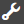

# 적응형 양식에서 Acrobat Sign 사용 {#using-adobe-sign-in-an-adaptive-form}

적응형 양식의 전자 서명(Acrobat Sign) 워크플로우를 활성화하여 서명 워크플로우를 자동화하고, 단일 및 다중 서명 프로세스를 간소화하고, 모바일 장치에서 양식에 전자 서명할 수 있습니다.

Acrobat Sign을 사용하면 적응형 양식에 전자 서명 워크플로우를 사용할 수 있습니다. 전자 서명은 법률, 영업, 급여, 인적 자원 관리 등 다양한 분야에 대한 문서를 처리하기 위한 워크플로우를 개선합니다.

일반적인 Acrobat Sign 및 적응형 양식 시나리오에서 사용자는 적응형 양식을 작성하여 서비스에 적용합니다. 예를 들어, 대출 및 신용 카드 신청은 모든 대출자와 공동 지원자의 법적 서명을 필요로 합니다. 유사한 시나리오에 대해 전자 서명 워크플로우를 활성화하려면 Acrobat Sign을 AEM Forms과 통합할 수 있습니다. 몇 가지 더 예를 들자면 Acrobat Sign을 사용하여 다음을 수행할 수 있습니다.

* 완전히 자동화된 제안, 견적 및 계약 프로세스를 사용하여 모든 장치의 거래를 마감합니다.
* 인적 자원 프로세스를 보다 신속하게 완료하고 직원들에게 디지털 경험을 제공합니다.
* 계약 주기를 단축하고 공급업체 가입을 보다 신속하게 처리합니다.
* 공통 프로세스를 자동화하는 디지털 워크플로우를 구축할 수 있습니다.

AEM Forms과 Acrobat Sign 통합은 다음을 지원합니다.

* 단일 및 다중 사용자 서명 워크플로우
* 순차적 및 동시 서명 워크플로우
* 양식 및 양식 외 서명 경험
* 양식을 익명 또는 로그인 사용자로 서명
* 동적 서명 프로세스(AEM Forms 워크플로우와 통합)
* 기술 자료, 전화 및 소셜 프로필을 통한 인증

학습 [적응형 양식에서 Acrobat Sign을 사용하는 우수 사례](https://medium.com/adobetech/using-adobe-sign-to-e-sign-an-adaptive-form-heres-the-best-way-to-do-it-dc3e15f9b684) 더 나은 서명 경험을 만들기 위해

## 사전 요구 사항 {#prerequisites}

적응형 양식에서 Acrobat Sign을 사용하기 전:

* AEM Forms 클라우드 서비스가 Acrobat Sign을 사용하도록 구성되어 있는지 확인합니다. 자세한 내용은 [Acrobat Sign과 AEM Forms 통합](/help/forms/using/adobe-sign-integration-adaptive-forms.md).
* 서명자 목록을 준비하세요. 모든 서명자에 대해 이메일 주소가 최소 필요합니다.

## 적응형 양식에 대한 Acrobat Sign 구성 {#configure-adobe-sign-for-an-adaptive-form}

적응형 양식에 대해 Acrobat Sign을 구성하려면 다음 단계를 수행하십시오.

1. [Acrobat Sign에 대한 적응형 양식 속성 편집](#enableadobesign)
1. [적응형 양식에 Acrobat Sign 필드 추가](#addadobesignfieldstoanadaptiveform)
1. [적응형 양식에 Acrobat Sign 활성화](#enableadobsignforanadaptiveform)
1. [적응형 양식에 대한 Acrobat Sign Cloud Service 선택](#selectadobesigncloudserviceforanadaptiveform)

1. [적응형 양식에 Acrobat Sign 서명자 추가](#addsignerstoanadaptiveform)
1. [적응형 양식에 대한 제출 작업 선택](#selectsubmitactionforanadaptiveform)

### Acrobat Sign에 대한 적응형 양식 속성 편집 {#enableadobesign}

기존 또는 새로운 적응형 양식에 대해 Acrobat Sign에 대한 적응형 양식 속성을 구성합니다.

[Acrobat Sign용 적응형 양식 만들기](/help/forms/using/working-with-adobe-sign.md#create-an-adaptive-form-for-adobe-sign) 기본 적응형 양식을 만드는 단계에 대해 설명합니다. 자세한 내용은 [적응형 양식 만들기](/help/forms/using/creating-adaptive-form.md) 적응형 양식을 만드는 동안 사용할 수 있는 다른 옵션도 있습니다.

#### Acrobat Sign용 적응형 양식 만들기 {#create-an-adaptive-form-for-adobe-sign}

다음 단계를 수행하여 Acrobat Sign에 대한 적응형 양식을 만듭니다.

1. 다음으로 이동 **[!UICONTROL Adobe Experience Manager]** > **[!UICONTROL Forms]** > **[!UICONTROL Forms 및 문서]**.
1. 탭 **[!UICONTROL 만들기]** 을(를) 선택합니다. **[!UICONTROL 적응형 양식]**. 템플릿 목록이 나타납니다. 템플릿을 선택하고 탭합니다 **[!UICONTROL 다음]**.
1. 에서 **[!UICONTROL 기본]** 탭:

   1. 을(를) 지정합니다. **이름** 및 **제목** 적응형 양식에 사용할 수 있습니다.
   1. 을(를) 선택합니다 [구성 컨테이너](/help/forms/using/adobe-sign-integration-adaptive-forms.md#configure-adobe-sign-with-aem-forms) AEM Forms과 Acrobat Sign을 구성하는 동안 생성되었습니다.

      >[!NOTE]
      >
      >다음 **[!UICONTROL Acrobat Sign Cloud Service]** 드롭다운 목록에는 이 필드에서 선택하는 구성 컨테이너에 구성된 클라우드 서비스가 표시됩니다. 다음 **[!UICONTROL Acrobat Sign Cloud Service]** 드롭다운 목록은 **[!UICONTROL 전자 서명]** 선택할 때 적응형 양식 속성의 섹션 **[!UICONTROL Acrobat Sign 활성화]** 선택 사항입니다.

1. 에서 **[!UICONTROL 양식 모델]** 탭에서 다음 옵션 중 하나를 선택합니다.

   * 을(를) 선택합니다 **[!UICONTROL 양식 서식 파일을 레코드 문서로 연결]** 옵션을 선택하고 레코드 문서 템플릿을 선택합니다. 적응형 양식 기반의 양식 템플릿을 사용하는 경우 서명을 위해 전송된 문서는 관련 양식 템플릿을 기반으로 하는 필드만 표시됩니다. 적용형 양식의 모든 필드가 표시되지 않습니다.
   * 을(를) 선택합니다 **[!UICONTROL 기록 문서 생성]** 선택 사항입니다. [레코드 문서] 옵션을 활성화된 적응형 양식을 사용하는 경우 서명을 위해 전송된 문서에 적응형 양식의 모든 필드가 표시됩니다.

1. 탭 **[!UICONTROL 만들기.]** Acrobat Sign 필드를 추가하는 데 사용할 수 있는 서명 사용 적응형 양식이 만들어집니다.

#### Acrobat Sign용 적응형 양식 편집 {#editafsign}

기존 적응형 양식에서 Acrobat Sign을 사용하려면 다음 단계를 수행하십시오.

1. 다음으로 이동 **[!UICONTROL Adobe Experience Manager]** > **[!UICONTROL Forms]**> **[!UICONTROL Forms 및 문서]**.
1. 적응형 양식을 선택하고 탭합니다 **[!UICONTROL 속성]**.
1. 에서 **[!UICONTROL 기본]** 탭에서 을 선택합니다 [구성 컨테이너](/help/forms/using/adobe-sign-integration-adaptive-forms.md#configure-adobe-sign-with-aem-forms) AEM Forms과 Acrobat Sign을 구성하는 동안 생성되었습니다.
1. 에서 **[!UICONTROL 양식 모델]** 탭에서 다음 옵션 중 하나를 선택합니다.

   * 을(를) 선택합니다 **[!UICONTROL 양식 서식 파일을 레코드 문서로 연결]** 옵션을 선택하고 레코드 문서 템플릿을 선택합니다. 적응형 양식 기반의 양식 템플릿을 사용하는 경우 서명을 위해 전송된 문서는 관련 양식 템플릿을 기반으로 하는 필드만 표시됩니다. 적용형 양식의 모든 필드가 표시되지 않습니다.
   * 을(를) 선택합니다 **[!UICONTROL 기록 문서 생성]** 선택 사항입니다. [레코드 문서] 옵션을 활성화된 적응형 양식을 사용하는 경우 서명을 위해 전송된 문서에 적응형 양식의 모든 필드가 표시됩니다.

1. 탭 **[!UICONTROL 저장 및 닫기]**. Acrobat Sign에 대해 적응형 양식이 활성화됩니다.

### 적응형 양식에 Acrobat Sign 필드 추가 {#addadobesignfieldstoanadaptiveform}

Acrobat Sign에는 적응형 양식에 배치할 수 있는 다양한 필드가 있습니다. 이러한 필드는 서명, 이니셜, 회사 또는 제목과 같은 다양한 유형의 데이터를 허용하며 서명과 함께 서명 중에 추가 정보를 수집하는 데 도움이 됩니다. Acrobat Sign 블록 구성 요소를 사용하여 적응형 양식의 다양한 위치에 Acrobat Sign 필드를 배치할 수 있습니다.

적응형 양식에 필드를 추가하고 이러한 필드와 관련된 다양한 옵션을 사용자 지정하려면 다음 단계를 수행하십시오.

1. 드래그 앤 드롭 **Acrobat Sign 블록** 구성 요소 브라우저의 구성 요소를 적응형 양식으로 전환했습니다. Acrobat Sign 블록 구성 요소에는 지원되는 모든 Acrobat Sign 필드가 있습니다. 기본적으로 **서명** 필드를 적응형 양식에 추가합니다.

   

   기본적으로 게시된 적응형 양식에는 Acrobat Sign 블록이 표시되지 않습니다. 서명 문서에서만 볼 수 있습니다. Acrobat Sign 블록 구성 요소의 속성에서 Acrobat Sign 블록 가시성을 변경할 수 있습니다.

   >[!NOTE]
   >
   >* 적응형 양식에서 Acrobat Sign을 반드시 사용해야 하는 것은 Acrobat Sign 블록을 사용하는 것이 아닙니다. Acrobat Sign 블록을 사용하지 않고 서명자에 대한 필드를 추가하지 않으면 서명 문서 하단에 기본 서명 필드가 표시됩니다.
   >* 자동으로 기록 문서를 생성하는 적응형 양식에 대해서만 Acrobat Sign 블록을 사용합니다. 사용자 지정 XDP를 사용하여 레코드 문서 또는 적응형 양식 기반의 양식 템플릿을 사용하는 경우 Acrobat Sign 블록이 필요하지 않습니다.

1. 을(를) 선택합니다 **Acrobat Sign 블록** 구성 요소 및 탭 **편집**  아이콘. 필드의 필드와 형식 모양을 추가하는 옵션이 표시됩니다.

   

   **A.** Acrobat Sign 필드를 선택하고 추가합니다. **B.** Acrobat Sign 블록을 전체 화면 보기로 확장합니다.

1. 탭하기 **Acrobat Sign 필드**  아이콘. Acrobat Sign 필드를 선택하고 추가하는 옵션이 표시됩니다.

   를 확장합니다. **유형** 드롭다운 필드를 클릭하여 Acrobat Sign 필드를 선택하고 완료 를 탭합니다  아이콘을 클릭하여 선택한 필드를 Acrobat Sign 블록에 추가합니다. 다음 **유형** 드롭다운 필드에는 서명, 서명자 정보 및 데이터 필드 유형이 포함됩니다. 유형 드롭다운 상자에 나열된 AEM Forms 지원 필드와 Acrobat Sign 통합을 사용합니다. Acrobat Sign 필드에 대한 자세한 내용은 [Acrobat Sign 설명서](https://helpx.adobe.com/sign/help/field-types.html).

   

   필드에 고유한 이름을 입력해야 합니다. 필수 필드를 선택하여 표시할 수도 있습니다. 추가 **이름** 및 **필수 여부** 옵션을 선택하면 일부 Acrobat Sign 필드에 더 많은 옵션이 있습니다. 예를 들어, 마스크 및 여러 줄. 또한, 필드가 동일하거나 다른 Acrobat Sign 블록에 있는지 여부에 따라 각 Acrobat Sign 필드에 고유한 이름을 지정합니다.

### 적응형 양식에 Acrobat Sign 활성화 {#enableadobsignforanadaptiveform}

기본적으로 Acrobat Sign은 적응형 양식에 대해 활성화되지 않습니다. 다음 단계를 수행하여 활성화하십시오.

1. 콘텐츠 브라우저에서 **양식 컨테이너**&#x200B;를 누르고 를 누릅니다 **구성**  아이콘. 속성 브라우저를 열고 적응형 양식 컨테이너 속성을 표시합니다.
1. 속성 브라우저에서 **전자 서명** 아코디언을 선택하고 **Acrobat Sign 활성화** 선택 사항입니다. 적응형 양식에 Acrobat Sign을 사용할 수 있습니다.

### Acrobat Sign Cloud Service 및 서명 순서 선택 {#selectadobesigncloudserviceforanadaptiveform}

AEM Forms 인스턴스에 대해 여러 Acrobat Sign 서비스를 구성할 수 있습니다. 각 기능(인사, 재무 등)에 대해 별도의 서비스 세트를 갖는 것이 좋습니다. 서명된 문서의 추적 및 보고가 더 쉬워집니다. 예를 들어, 은행에는 여러 부서가 있습니다. 문서 추적을 더 잘 하기 위해 각 부서에 대해 별도의 구성을 지정할 수 있습니다.

한 문서에 여러 서명자가 있을 수도 있습니다. 예를 들어, 신용 카드 지원에는 여러 명의 지원자가 포함될 수 있습니다. 은행은 지원서를 처리하기 전에 모든 지원자의 서명을 받아야 한다. 여러 서명자 시나리오의 경우 문서를 순차적 또는 동시 순서로 서명하도록 선택할 수 있습니다.

클라우드 서비스와 서명 순서를 선택하려면 다음 단계를 수행하십시오.

1. 콘텐츠 브라우저에서 **양식 컨테이너**&#x200B;를 누르고 를 누릅니다 **구성**  아이콘. 속성 브라우저를 열고 적응형 양식 컨테이너 속성을 표시합니다.
1. 속성 브라우저에서 **전자 서명** 아코디언을 선택하고 **Acrobat Sign 활성화** 선택 사항입니다. 적응형 양식에 Acrobat Sign을 사용할 수 있습니다.
1. 이미 구성된 Acrobat Sign Cloud Services 목록에서 클라우드 서비스를 선택합니다.

   만약 **Acrobat Sign Cloud Service** 목록이 비어 있는 경우 다음을 수행합니다 [AEM Forms을 사용하여 Acrobat Sign 구성](/help/forms/using/adobe-sign-integration-adaptive-forms.md) 서비스를 구성할 문서입니다.

   드롭다운에 `global` 도구 > 의 폴더 **[!UICONTROL Cloud Services]** > **[!UICONTROL Acrobat Sign]**. 또한 드롭다운에는 **[!UICONTROL 구성 컨테이너]** 적응형 양식을 만들 때 필드를 추가합니다.

1. 에서 서명 순서를 선택합니다 **서명자가 서명 가능** 대화 상자 Acrobat Sign 가수들은 적응형 양식에 서명할 수 있습니다 **순차적** - 다른 서명자 다음에 또는 **동시에** - 어떤 순서로

   순차적으로, 한 서명자가 한 번에 서명 양식을 수신합니다. 서명자가 문서 서명을 완료하면 다음 서명자에게 양식이 전송됩니다.

   동시에 여러 서명자가 한 번에 양식에 서명할 수 있습니다.

1. [적응형 양식에 서명자 추가](#addsignerstoanadaptiveform) 완료 아이콘을 탭하여 변경 사항을 저장합니다.

### 적응형 양식에 서명자 추가 {#addsignerstoanadaptiveform}

적응형 양식에 대해 서명자 또는 서명자가 여러 명만 가질 수 있습니다. 서명자를 추가할 때 서명자에 대한 인증 세부 사항을 구성할 수도 있습니다. 또한 양식 충전기와 가수가 같은 사람인지 선택할 수 있습니다. 서명자에 대한 다양한 세부 정보를 추가하고 제공하려면 다음 단계를 수행하십시오.

1. 콘텐츠 브라우저에서 **양식 컨테이너**&#x200B;를 누르고 를 누릅니다 **구성**  아이콘. 응용 양식 컨테이너 속성이 있는 속성 브라우저를 엽니다.
1. 속성 브라우저에서 **전자 서명** 아코디언을 선택하고 **Acrobat Sign 활성화** 선택 사항입니다. 적응형 양식에 Acrobat Sign을 사용할 수 있습니다.
1. 탭 **서명자 추가** 아래에 **서명자 구성.** 적응형 양식에 서명자가 추가됩니다. 적응형 양식에 여러 Acrobat Sign 서명자를 추가할 수 있습니다.
1. 

   을(를) 클릭합니다. **편집**  아이콘 을 클릭하여 서명자에 대한 다음 정보를 지정합니다.

   * **제목:** 서명자를 고유하게 식별할 제목을 지정합니다.
   * **서명자와 양식에 입력된 사람이 동일합니까?** 선택 **예**&#x200B;와 같은 경우 양식 작성자와 첫 번째 서명자가 동일합니다. 옵션을 로 설정한 경우 **아니요** 그런 다음 적응형 양식에서 서명 단계 구성 요소를 사용하지 마십시오. 양식에 서명 단계 구성 요소가 포함되어 있으면 필드가 자동으로 예로 설정됩니다.
   * **서명자 전자 메일 주소:** 서명자의 이메일 주소를 지정합니다. 서명자가 지정된 전자 메일 주소에서 서명된 문서/양식을 수신합니다. 양식 필드에 제공된 이메일 주소를 사용하거나, 로그인한 사용자의 AEM 사용자 프로필에서 이메일 주소를 사용하도록 선택하거나, 수동으로 이메일 주소를 입력할 수 있습니다. 이것은 필수 단계입니다. 또한 한 명의 서명자만 구성한 경우, 서명자의 이메일 주소가 AEM 클라우드 서비스를 구성하는 데 사용되는 Acrobat Sign 계정과 동일하지 않은지 확인하십시오.
   * **서명자 인증 방법:** 서명할 양식을 열기 전에 사용자를 인증하는 방법을 지정합니다. 전화, 기술 자료 및 소셜 ID 기반 인증 중에서 선택할 수 있습니다.

   >[!NOTE]
   >
   >* 기본적으로 소셜 ID 기반 인증은 Facebook, Google 및 LinkedIn을 사용하여 인증할 수 있는 옵션을 제공합니다. Acrobat Sign 지원 센터에 문의하여 다른 소셜 인증 공급자를 활성화할 수 있습니다.

   * **채우거나 서명할 Acrobat Sign 필드:** 서명자에 대한 Acrobat Sign 필드를 선택합니다. 적응형 양식에는 여러 Acrobat Sign 필드가 있을 수 있습니다. 서명자에 대해 특정 필드를 활성화하도록 선택할 수 있습니다. 이 필드에는 사용 가능한 모든 Acrobat Sign 블록이 표시됩니다. 블록을 선택하면 블록의 모든 필드가 선택됩니다. X 아이콘을 사용하여 필드를 선택 취소할 수 있습니다.

   

   위의 이미지에는 두 가지 Acrobat Sign 블록 예제가 있습니다. 개인 정보 및 Office 세부 정보

   완료 를 누릅니다  아이콘. 서명자가 추가되고 구성됩니다.

### 적응형 양식에 대한 제출 작업 선택 {#selectsubmitactionforanadaptiveform}

그런 다음 적응형 양식에 Acrobat Sign 필드를 추가하고, 양식 컨테이너에서 Acrobat Sign 을 활성화하고, Acrobat Sign Cloud Service을 선택하고, Acrobat Sign 서명자를 추가하고, 적응형 양식에 적합한 제출 작업을 선택합니다. 적응형 양식 제출 작업에 대한 자세한 내용은 [제출 작업 구성](/help/forms/using/configuring-submit-actions.md).

또한 Acrobat Sign이 활성화된 적응형 양식은 모든 서명자가 양식에 서명한 후에만 제출됩니다. 양식 포털의 보류 중인 서명 섹션에서 부분적으로 서명된 양식을 찾을 수 있습니다. Acrobat Sign 구성 서비스에서는 폴링 Acrobat Sign 서버를 [정규 간격](/help/forms/using/adobe-sign-integration-adaptive-forms.md) 서명 상태를 확인하려면 모든 서명자가 양식 서명을 완료하면 제출 작업 서비스가 시작되고 양식이 제출됩니다. 사용자 지정 제출 작업을 사용 중이며 양식에서 Acrobat Sign을 사용하는 경우 사용자 지정 제출 작업을 업데이트하여 제출 작업 서비스를 사용합니다.

>[!NOTE]
>
>적응형 양식의 데이터는 일시적으로 Forms Portal에 저장됩니다. 을 사용하는 것이 좋습니다 [Forms 포털용 사용자 지정 저장소](/help/forms/using/configuring-draft-submission-storage.md). 이렇게 하면 PII(개인 식별 정보) 데이터가 AEM 서버에 저장되지 않습니다.

양식 서명 경험이 준비되었습니다. 양식을 미리 보고 서명 경험을 확인할 수 있습니다. 게시된 양식에서, Acrobat Sign 블록 필드는 서명자가 이메일을 통해 서명하는 양식을 수신하면 표시됩니다. 이 경험을 양식 없는 서명 경험이라고도 합니다. 첫 번째 서명자를 위한 양식 서명 환경을 구성할 수도 있습니다. 자세한 단계는 다음을 참조하십시오. [양식 서명 경험 만들기](/help/forms/using/working-with-adobe-sign.md#create-in-form-signing-experience).

## 적응형 양식에 대한 클라우드 서명 구성 {#configure-cloud-signatures-for-an-adaptive-form}

클라우드 기반 디지털 서명 또는 원격 서명은 데스크탑, 모바일 및 웹에서 작동하는 새로운 세대의 디지털 서명으로, 서명자 인증을 위한 최고 수준의 규정 준수 및 보증을 충족합니다. 클라우드 기반 디지털 서명을 사용하여 적응형 양식에 서명할 수 있습니다.

후 [Acrobat Sign에 대한 적응형 양식 속성 편집](#enableadobesign)적응형 양식에 클라우드 서명 필드를 추가하려면 다음 단계를 수행하십시오.

1. 드래그 앤 드롭 **Acrobat Sign 블록** 구성 요소 브라우저의 구성 요소를 적응형 양식으로 전환했습니다. Acrobat Sign 블록 구성 요소에는 지원되는 모든 Acrobat Sign 필드가 있습니다. 기본적으로 **서명** 필드를 적응형 양식에 추가합니다.

   

1. 을(를) 선택합니다 **Acrobat Sign 블록** 구성 요소 및 탭 **편집**  아이콘. 필드의 필드와 형식 모양을 추가하는 옵션이 표시됩니다.

   

   **A.** Acrobat Sign 필드를 선택하고 추가합니다. **B.** Acrobat Sign 블록을 전체 화면 보기로 확장합니다.

1. 탭하기 **Acrobat Sign 필드**  아이콘. Acrobat Sign 필드를 선택하고 추가하는 옵션이 표시됩니다.

   를 확장합니다. **유형** 선택할 드롭다운 필드 **디지털 서명** 완료 를 탭하고  아이콘을 클릭하여 선택한 필드를 Acrobat Sign 블록에 추가합니다.

   

   필드에 고유한 이름을 입력해야 합니다.

   다음을 사용하여 적응형 양식에 디지털 서명을 적용합니다.

   * 클라우드 서명: 로그인하여 [디지털 ID](https://helpx.adobe.com/sign/kb/digital-certificate-providers.html) 트러스트 서비스 공급자가 호스팅합니다.
   * Adobe Acrobat 또는 Reader: 스마트 카드, USB 토큰 또는 파일 기반 디지털 ID를 사용하여 서명하려면 Adobe Acrobat 또는 Reader으로 문서를 다운로드하여 엽니다.

   적응형 양식에 클라우드 서명 필드를 추가한 후 다음 단계를 수행하여 구성 프로세스를 완료합니다.

   * [적응형 양식에 Acrobat Sign 활성화](#enableadobsignforanadaptiveform)
   * [적응형 양식에 대한 Acrobat Sign Cloud Service 선택](#selectadobesigncloudserviceforanadaptiveform)
   * [적응형 양식에 Acrobat Sign 서명자 추가](#addsignerstoanadaptiveform)
   * [적응형 양식에 대한 제출 작업 선택](#selectsubmitactionforanadaptiveform)

## 양식 서명 경험 만들기 {#create-in-form-signing-experience}

사용자는 양식을 채우는 동안 적응형 양식에 서명할 수도 있습니다. 이 경험을 양식 서명 경험이라고도 합니다. 양식 서명 환경은 여러 서명자 환경에서 첫 번째 가수만 사용할 수 있습니다. 적응형 양식에 대해 양식 서명 경험을 만들려면 다음 단계를 수행하십시오.

1. [서명 단계 구성 요소 추가 및 구성](#add-and-configure-the-signature-step-component).
1. [요약 단계 구성 요소 추가](#configure-the-thank-you-page-or-summary-step-component).

### 서명 단계 구성 요소 추가 및 구성 {#add-and-configure-the-signature-step-component}

서명 단계 구성 요소를 사용하여 채워진 양식에 전자 서명할 영역을 제공합니다. 서명 단계 구성 요소가 포함된 섹션이 렌더링되면 채워진 양식의 서명 가능한 PDF 버전이 표시됩니다. 서명 단계 구성 요소는 양식에 사용할 수 있는 전체 너비를 높입니다. 서명 단계 구성 요소가 포함된 섹션에는 다른 구성 요소가 없는 것이 좋습니다.

다음 단계를 수행하여 서명 단계 구성 요소를 구성합니다.

1. 드래그 앤 드롭 **서명 단계** 구성 요소 브라우저의 구성 요소를 양식에서 작성할 수 있습니다.
1. 새로 추가된 서명 단계 구성 요소를 선택하고 **구성**  아이콘. 속성 브라우저를 열고 서명 단계 속성을 표시합니다. 다음 속성을 구성합니다.

   * **요소 이름**: 구성 요소의 이름을 지정합니다.
   * **제목:** 구성 요소의 고유한 제목을 지정합니다.
   * **템플릿 메시지:** 서명 PDF을 로드하는 동안 표시할 메시지를 지정합니다. Acrobat Sign 서비스는 서명 PDF을 준비하고 로드하는 데 시간이 오래 걸립니다.
   * **서명 서비스:** 을(를) 선택합니다 **Acrobat Sign** 선택 사항입니다.
   * **기존 E-sign 구성 요소 사용**: 에서 각 적응형 양식을 사용하는 경우 [AEM Forms 작업 공간](/help/forms/using/introduction-html-workspace.md), AEM Forms 앱 또는 기본 적응형 양식에 기존 e-sign 구성 요소가 있는 경우 **기존 E-sign 구성 요소 사용** 선택 사항입니다.
   * **구성**: 구성(Acrobat Sign Cloud Service)을 선택합니다. 드롭다운 상자는 **기존 E-sign 구성 요소 사용** 옵션이 활성화되어 있습니다.

   완료 를 누릅니다  아이콘을 클릭하여 변경 사항을 저장합니다.

   

   >[!NOTE]
   >
   >* 을(를) 끌어다 놓을 때 **[!UICONTROL 서명 단계]** 구성 요소를 양식, **[!UICONTROL 서명자와 양식을 채우는 사람이 같은 건가요?]** 옵션이 자동으로 **예**. 양식을 계속 작동시켜야 합니다.
   >* Acrobat Sign이 활성화된 적응형 양식은 서명 단계 구성 요소를 사용하여 섹션이나 패널에서 제출 단추 사용을 지원하지 않습니다. 수동 제출을 위한 서명 단계 이후에 또는 을 사용하여 설정된 간격 후에 자동 제출을 위한 요약 단계를 추가할 수 있습니다 [Acrobat Sign 구성 서비스](/help/forms/using/adobe-sign-integration-adaptive-forms.md#configure-adobe-sign-scheduler-to-sync-the-signing-status).

### 감사 인사 페이지 또는 요약 단계 구성 요소 구성 {#configure-the-thank-you-page-or-summary-step-component}

다음 **요약 단계** 구성 요소는 양식을 자동으로 제출하고, 사용자 지정된 요약 페이지 내의 정보를 채우고, 제출된 양식의 요약을 표시합니다. 또한 반환 맵에서 필요한 정보를 가져옵니다. 요약 단계 구성 요소는 양식에 사용할 수 있는 전체 너비를 설정합니다. 요약 단계 구성 요소가 포함된 섹션에는 다른 구성 요소가 없는 것이 좋습니다.

이제 양식 서명 경험을 사용할 수 있습니다. 양식을 미리 보고 서명 경험을 확인할 수 있습니다.

## 자주 묻는 질문 {#frequently-asked-questions}

**Q: 적응형 양식을 다른 적응형 양식에 포함할 수 있습니다. 포함된 적응형 양식을 Acrobat Sign에서 활성화할 수 있습니까?**

**Ans:** 아니요. AEM Forms은 서명을 위해 Acrobat Sign이 활성화된 적응형 양식을 포함하는 적응형 양식 사용을 지원하지 않습니다.

**Q: 고급 템플릿을 사용하여 적응형 양식을 만들고 편집할 수 있도록 열면 &quot;전자 서명 또는 서명자가 올바르게 구성되지 않았습니다.&quot;라는 오류 메시지가 표시됩니다. 이 나타납니다. 오류 메시지를 해결하는 방법**

**Ans:** 고급 템플릿을 사용하여 만든 적응형 양식은 Acrobat Sign을 사용하도록 구성됩니다. 오류를 해결하려면 Acrobat Sign 클라우드 구성을 만들고 선택하고 적응형 양식의 Acrobat Sign 서명자를 구성합니다.

**Q: 적응형 양식의 정적 텍스트 구성 요소에서 Acrobat Sign 텍스트 태그를 사용할 수 있습니까?**

**Ans:** 예. 텍스트 구성 요소에서 텍스트 태그를 사용하여 Acrobat Sign 필드를 [기록 문서](/help/forms/using/generate-document-of-record-for-non-xfa-based-adaptive-forms.md) (레코드 옵션의 자동 생성 문서만) 적응형 양식을 활성화했습니다. 텍스트 태그를 만드는 절차 및 규칙에 대해 알아보려면 [Acrobat Sign 설명서](https://experienceleague.adobe.com/docs/document-cloud-learn/sign-learning-hub/admin-set-up/advanced-tasks-admins/adobe-sign-text-tagging.html). 또한 적응형 양식에는 텍스트 태그에 대한 지원이 제한됩니다. 텍스트 태그를 사용하여 Acrobat Sign 블록이 지원하는 필드만 만들 수 있습니다.

**Q: AEM Forms은 Acrobat Sign 블록 및 서명 단계 구성 요소를 모두 제공합니다. 적응형 양식에서 동시에 사용할 수 있습니까?**

**Ans:** 양식에서 두 구성 요소를 동시에 사용할 수 있습니다. 다음은 이러한 구성 요소를 사용하기 위한 몇 가지 권장 사항입니다.

**Acrobat Sign 블록:** Acrobat Sign 블록 을 사용하여 적응형 양식의 어디에나 Acrobat Sign 필드를 추가할 수 있습니다. 서명자에게 특정 필드를 할당하는 데에도 도움이 됩니다. 적응형 양식을 미리 보거나 게시된 Acrobat Sign 블록이 기본적으로 표시되지 않습니다. 이러한 블록은 서명 문서에서만 사용할 수 있습니다. 서명 문서에서는 서명자에게 지정된 필드만 활성화됩니다. Acrobat Sign 블록은 첫 번째 및 후속 서명자와 함께 사용할 수 있습니다.

**서명 단계 구성 요소:** 서명 단계 구성 요소를 사용하여 양식 서명 경험을 만들 수 있습니다. 양식을 채우는 동안 첫 번째 서명자만 서명할 수 있습니다. 서명 단계 구성 요소가 포함된 섹션이 렌더링되면 양식의 서명 가능한 PDF 버전이 표시됩니다. 일반적으로 양식의 마지막 섹션이나 최종 섹션 뒤에 요약 구성 요소가 옵니다.
