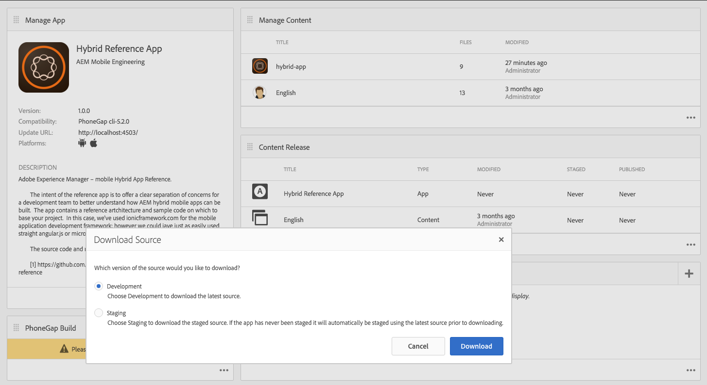

# AEM Mobile을 위한 하이브리드 앱 준비{#is-your-hybrid-app-ready-for-aem-mobile}

>[!NOTE]
>
>단일 페이지 애플리케이션 프레임워크 기반 클라이언트측 렌더링(예: 응답)이 필요한 프로젝트에는 SPA 편집기를 사용하는 것이 좋습니다. [추가 정보](/help/sites-developing/spa-overview.md).

Hybrid PhoneGap 또는 Cordova 앱을 AEM으로 가져온 이유는 무엇입니까? 앱에 작성 가능한 콘텐츠를 추가할 수 있습니다. 이 작업을 수행하려면 AEM 앱의 구조를 전반적으로 이해해야 합니다. AEM의 앱은 일반적으로 두 부분으로 나뉘어져 있습니다. &#39;shell&#39;과 &#39;content&#39;입니다. &#39;shell&#39;은 앱의 정적 부분으로 구성됩니다. PhoneGap 구성 파일, 앱 프레임워크 및 내비게이션 컨트롤과 같은 작업을 할 수 있습니다. 가져온 아카이브의 컨텐츠는 셸의 일부로 저장됩니다. 이 문서의 컨텍스트에서 셸은 모두 앱 개발자가 빌드한 하이브리드 PhoneGap 앱의 AEM이 아닌 컨텐츠 버전입니다.

컨텐츠는 AEM Developer가 작성한 AEM에서 만든 구성 요소, 템플릿 및 작성된 페이지를 나타냅니다. 컨텐츠는 개발자 컨텐츠 또는 작성된 컨텐츠로 분류됩니다. 구성 요소, 디자인 및 페이지 템플릿은 개발자가 빌드하므로 개발 콘텐츠로 간주됩니다. 작성자 컨텐츠는 구성 요소 및 템플릿을 사용하여 작성된 페이지입니다. 이러한 작업은 일반적으로 디자이너나 마케터가 수행합니다.

제작된 AEM 페이지를 하이브리드 앱에 추가하려면 앱 개발자와 AEM 개발자 간의 조정이 필요합니다. 앱 개발자는 제작된 콘텐츠를 추가할 앱의 아무 곳에서나 AEM에서 오버레이할 수 있는 구조로 이러한 페이지를 구성해야 합니다. 앱 개발자는 AEM 개발자가 AEM에서 제작한 컨텐츠를 추가할 경로를 개발자에게 제공한 다음 AEM 개발자가 페이지 컨텐츠를 제작한 후 교체될 하이브리드 앱에서 자리 표시자 페이지를 제공할 수 있어야 합니다.

설명을 쉽게 따르기 위해 AEM Marketing Cloud을 사용할 것입니다. AEM Mobile 하이브리드 참조를 참조하십시오. 하이브리드 참조 앱은 사이드 메뉴가 있는 홈 페이지로 구성됩니다.

이 예에서는 애플리케이션의 시작 페이지를 작성하려고 합니다. 소스 https://github.com/Adobe-Marketing-Cloud-Apps/aem-mobile-hybrid-reference/blob/master/hybrid-app/www/js/app.js#L75 [을 살펴보십시오](https://github.com/Adobe-Marketing-Cloud-Apps/aem-mobile-hybrid-reference/blob/master/hybrid-app/www/js/app.js#L75). 앱 개발자가 시작 페이지를 정의하고 앱에서 렌더링하는 페이지에 대한 템플릿을 제공했음을 확인할 수 있습니다. 여기에서 앱 개발자와 AEM 개발자는 이를 조정해야 합니다. 하이브리드 참조 앱에서 시작 페이지 템플릿의 경로는 &quot;content/mobileapps/hybrid-reference-app/en/welcome.template.html&quot;로 정의됩니다. AEM 개발자가 동일한 경로를 사용하여 AEM 저장소에서 시작 페이지를 작성하므로 이 경로는 매우 중요합니다.

하이브리드 앱과 AEM에서 제작한 컨텐츠는 동일한 경로를 사용하는 것이 중요합니다. Adobe는 컨텐츠 동기화를 사용하여 컨텐츠를 오버레이하여 하이브리드 앱에 새 페이지를 추가하는 기능을 사용하기 때문입니다. 가져오기 프로세스의 일부로 하이브리드 앱을 AEM으로 가져오는 경우 콘텐츠 동기화 구성이 설정됩니다.

앱 대시보드에서 &#39;소스 다운로드&#39;하면 이 ContentSync 스크립트가 하이브리드 앱의 아카이브를 조합하기 위해 실행됩니다.

ContentSync는 먼저 앱의 &#39;shell&#39;을 가져옵니다. 이 앱의 모든 앱이 개발한 콘텐츠를 저장한 다음 앱의 &#39;content&#39;를 가져옵니다. 이제 &#39;content&#39;의 경로와 동일한 경로를 갖는 &#39;shell&#39;의 페이지가 있는 경우 &#39;shell&#39; 아래의 페이지가 &#39;content&#39; 아래의 페이지로 (대체됨) 즉, AEM에서 ContentSync를 실행할 때 &quot;content/mobileapps/hybrid-reference-app/en/welcome.template.html&quot;과 같은 경로를 가진 페이지를 만드는 경우 하이브리드 참조 앱 내의 AEM에 있는 것과 함께 하이브리드 참조 앱의 일부인 페이지가 오버레이됩니다. 오버레이는 ContentSync에서 처리되므로 앱을 사용하는 사용자의 경우 AEM에서 제작한 콘텐츠가 포함된 앱 업데이트 내용이 매끄럽고 앱을 다시 빌드할 필요가 없습니다. 따라서 앱을 실행하면 시작 페이지가 다음과 같이 표시됩니다.

