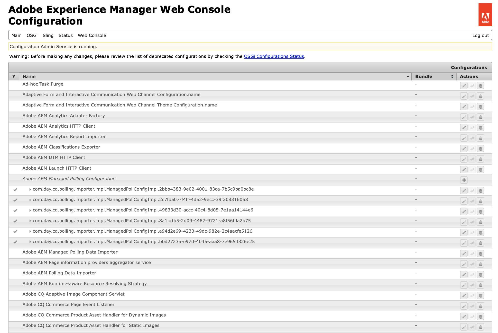

# Configuring and Deploying AEM Screens{#configuring-and-deploying-aem-screens}

이 페이지에서는 장치에 Screens 플레이어를 설치하고 구성하는 방법을 보여주며 다음 주제를 다룹니다.

* AEM Screens 플레이어 설치
* 서버 구성
* 플레이어 장치에 대한 하드웨어 선택 지침
* 다음 단계

## AEM Screens 플레이어 설치 {#installing-aem-screens-player}

AEM Screens 플레이어는 Android, Chrome OS, iOS 및 Windows에서 사용할 수 있습니다.

AEM **Screens 플레이어를**&#x200B;다운로드하려면 AEM 6.4 Player [**다운로드&#x200B;**](https://download.macromedia.com/screens/)페이지를 참조하십시오.

>[!NOTE]
>
>최신 플레이어(*.exe*)를 다운로드한 후 플레이어의 단계에 따라 임시 설치를 완료합니다.
>
>1. 왼쪽 위 모서리를 길게 눌러 관리 패널을 엽니다.
>1. 왼쪽 **작업** 메뉴에서 구성으로 이동하고 서버에 AEM 인스턴스의 위치 주소를 입력하고 **저장을** **클릭합니다**.
   >
   >
1. 왼쪽 **작업** 메뉴 및 아래 단계를 클릭하여 장치 등록 프로세스를 완료합니다.
>

### 추가 리소스 {#additional-resources}

자세한 내용은 다음 항목을 참조하십시오.

* Android Player를 다운로드하려면 Google Play **를 방문하십시오**. Android Watchdog 구현에 대한 자세한 내용은 Android 플레이어 **[구현을 참조하십시오](implementing-android-player.md)**.

* Chrome OS Player를 구현하려면 Chrome [관리 콘솔을](implementing-chrome-os-player.md) 참조하십시오.
* AEM Screens Windows 플레이어를 구성하려면 Windows Player [구현을 참조하십시오](implementing-windows-player.md).

## 서버 구성 {#server-configuration}

>[!NOTE]
>
>**중요 사항**:
>
>AEM Screens 플레이어는 CSRF(교차 사이트 요청 위조) 토큰을 사용하지 않습니다. 따라서 AEM Screens에 사용할 수 있도록 AEM 서버를 구성하고 준비하려면 빈 레퍼러를 허용하여 레퍼러 필터를 건너뜁니다.

### 전제 조건 {#prerequisites}

아래 주요 사항은 AEM Screens에 사용할 수 있도록 AEM 서버를 구성하고 구성하는 데 도움이 됩니다.

#### 빈 레퍼러 요청 허용 {#allow-empty-referrer-requests}

아래 절차에 따라 Apache Sling 레퍼러 필터 비어 있음 허용을 활성화합니다. 이는 AEM Screens 플레이어와 AEM Screens 서버 간의 제어 프로토콜을 최적화하기 위해 필요합니다.

1. **Adobe Experience Manager 웹 콘솔 구성 **via AEM instance —> 망치 아이콘 —> 작업 **** —> 웹 **콘솔로 이동합니다**.

   

1. **Adobe Experience Manager 웹 콘솔 구성이** 열립니다. 슬링 레퍼러를 검색합니다.

   Mac용 Command+F를 누르고 **Windows용** Ctrl+F **를**********&#x200B;누르면 Windows가검색됩니다.

   

1. 아래 **그림에서와 같이** 빈 허용 옵션을 선택합니다.

   

1. Apache **Sling** Referrer Filter Allow Empty를 활성화하려면 저장을 클릭합니다.

#### AEM Screens용 터치 UI 활성화 {#enable-touch-ui-for-aem-screens}

AEM Screens에는 터치 UI가 필요하며 AEM(Adobe Experience Manager)의 클래식 UI에서는 작동하지 않습니다.

1. &lt;yourAuthorInstance>/system/console/configMgr/com.day.cq.wcm.core.impl.AuthoringUIModeServiceImpl으로 *이동합니다.*
1. 아래 그림과 같이 기본 **작성** UI 모드가 **TOUCH로**&#x200B;설정되어 있는지 확인합니다.

또는*&lt;yourAuthorInstance> *->* 도구(망치 아이콘)* -> **Operations** ->**Web Console을** 사용하여 동일한 설정을 수행하고 **WCM 작성 UI 모드 서비스를**&#x200B;검색할 수도 있습니다.

>[!NOTE]
>
>사용자 환경 설정을 사용하여 특정 사용자에 대해 항상 클래식 UI를 활성화할 수 있습니다.

#### NOSAMPLECONTENT 런타임 모드의 AEM {#aem-in-nosamplecontent-runmode}

프로덕션에서 AEM을 실행하면 NOSAMPLECONTENT **런모드가** 사용됩니다. X- *Frame-Options=SAMEORIGIN* 헤더(추가 응답 헤더 섹션에서)를

[http://localhost:4502/system/console/configMgr/org.apache.sling.engine.impl.SlingMainServlet](http://localhost:4502/system/console/configMgr/org.apache.sling.engine.impl.SlingMainServlet).

AEM Screens 플레이어에서 온라인 채널을 재생하려면 필요합니다.

#### 암호 제한 {#password-restrictions}

DeviceServiceImpl ***에 대한***&#x200B;최신 변경 사항을 사용하면 암호 제한을 제거할 필요가 없습니다.

화면 장치 ***사용자에 대한*** 암호를 만드는 동안 암호 제한을 사용하도록 아래 링크에서 DeviceServiceImpl을 구성할 수 있습니다.

[http://localhost:4502/system/console/configMgr/com.adobe.cq.screens.device.impl.DeviceService](http://localhost:4502/system/console/configMgr/com.adobe.cq.screens.device.impl.DeviceService)

아래 절차에 따라 DeviceServiceImpl을 ***구성하십시오***.

1. AEM **인스턴스 —> 망치 아이콘 —> 작업** —> 웹 **콘솔을** 통해 Adobe Experience Manager 웹 콘솔 구성으로 **이동합니다**.

1. **Adobe Experience Manager 웹 콘솔 구성이** 열립니다. 디바이스 서비스 검색 속성을 검색하려면 Command+F **for** Mac **및** Ctrl+F **를******&#x200B;눌러 Windows를 선택합니다.

#### Dispatcher Configuration {#dispatcher-configuration}

**Dispatcher의 경우 **모든 파일에 클라이언트 헤더를 추가합니다. 다음 헤더를 허용합니다.

* &quot;X-Requested-With&quot;
* &quot;X-SET-HEARTBEAT&quot;
* &quot;X-REQUEST-COMMAND&quot;

#### Java 인코딩 {#java-encoding}

Java ***인코딩을*** 유니코드로 설정합니다. 예를 들어 Dfile. *encoding=Cp1252는* 작동하지 않습니다.

>[!NOTE]
>
>**추천:**
>
>제작 시 AEM Screens Server용 HTTPS를 사용하는 것이 좋습니다.

## 플레이어 장치에 대한 하드웨어 선택 지침 {#hardware-selection-guidelines-for-player-device}

다음 섹션에서는 스크린 프로젝트에 대한 하드웨어 선택 지침을 제공합니다.

* PC ***플레이어와 디스플레이*** 패널 또는 프로젝터에 ***항상 상업용 또는 산업용*** 등급 구성 요소를 제공합니다.

* 디지털 사이니지 시장을 제공하는 벤더와 항상 교류할 수 있습니다.
* 항상 주위 온도 및 상대 습도와 같은 환경적 요인을 고려하십시오.
* 전원 요구 사항 및 전원 조절을 항상 검토합니다.
* 애플리케이션에 필요한 성능 요구 사항 및 입출력 포트를 신중하게 검토합니다.

다음 표는 AEM Screens 프로젝트에 대한 일반적인 사용 사례와 함께 하드웨어 구성을 요약합니다.

<table> 
 <tbody> 
  <tr> 
   <td>플레이어 구성</td> 
   <td>프로세서</td> 
   <td>메모리</td> 
   <td>스토리지 SSD</td> 
   <td>GPU</td> 
   <td>표시</td> 
   <td>I/O</td> 
   <td>일반적인 사용 사례</td> 
  </tr> 
  <tr> 
   <td>기본</td> 
   <td>듀얼 코어, i3 또는 엔트리 레벨 쿼드 코어 Intel® Atom 프로세서</td> 
   <td>
4GB 메모리
 
2MB 캐시
 </td> 
   <td>
ChromeOS 32GB
 
Windows 128GB
 </td> 
   <td>OnBoard</td> 
   <td>1920x1080</td> 
   <td>DVI,   이더넷/무선,  2xUSB</td> 
   <td> 
    <ul> 
     <li>표준 전체 화면 반복   </li> 
     <li>하루 분할</li> 
    </ul> </td> 
  </tr> 
  <tr> 
   <td>표준</td> 
   <td>쿼드 코어, Intel® Core i5 프로세서</td> 
   <td>
8GB의 메모리
 
4MB 캐시
 </td> 
   <td>128GB</td> 
   <td>OnBoard</td> 
   <td>3840x2160(4K)</td> 
   <td>DVI, HDMI  이더넷/무선,  2xUSB</td> 
   <td> 
    <ul> 
     <li>단일 소스 동적 컨텐츠 </li> 
     <li>간단한 인터랙티브</li> 
     <li> 1-3 영역 레이아웃</li> 
    </ul> </td> 
  </tr> 
  <tr> 
   <td>고급</td> 
   <td>하이퍼스레딩(hyperthreading) 기술이 적용된 쿼드 코어, Intel® Core i7 프로세서</td> 
   <td>
16GB의 메모리
 
8MB 캐시
 </td> 
   <td>256GB</td> 
   <td>개별 GPU</td> 
   <td>3840x2160(4K)</td> 
   <td>DVI, HDMI  이더넷/무선,  4xUSB</td> 
   <td> 
    <ul> 
     <li>4개 이상의 컨텐츠 영역, 동시 비디오 재생</li> 
     <li> 인터랙티브한 다중 페이지</li> 
     <li>다중 소스 데이터 트리거</li> 
    </ul> </td> 
  </tr> 
 </tbody> 
</table>

## 다음 단계 {#the-next-steps}

Screens 플레이어를 설치하고 구성한 후에는 아래 항목을 따라 시작하십시오.

1. [스크린 프로젝트 만들기 및 관리](creating-a-screens-project.md)
1. [채널 만들기 및 관리](managing-channels.md)
1. [위치 만들기 및 관리](managing-locations.md)
1. [디스플레이 만들기 및 관리](managing-displays.md)
1. [채널 지정](channel-assignment.md)
1. [장치 관리](managing-devices.md)
1. [장치 등록](device-registration.md)
1. [장치 할당](managing-devices.md)
1. [예약 만들기 및 관리](managing-schedules.md)
1. [AEM 스크린 플레이어](working-with-screens-player.md)
1. [장치 컨트롤 센터 문제 해결](monitoring-screens.md)

