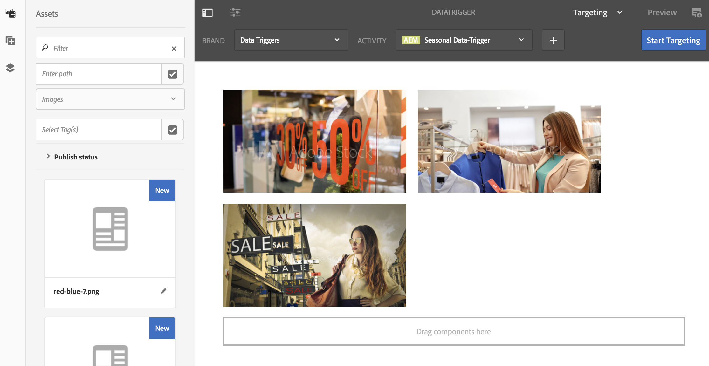

# 데이터 트리거된 자산 변경{#data-triggered-asset-change}

## 사용 사례 설명 {#use-case-description}

이 사용 사례 예에서는 사용자의 위치를 기반으로 개인화된 컨텐츠를 얻는 방법을 설명합니다.

다음 AEM Screens 프로젝트는 ContextHub, 세그멘테이션 엔진 및 컨텐츠 타깃팅 UI를 포함하는 AEM 개인화를 활용합니다.

이 사용 사례는 각 지역의 현재 날씨를 기반으로 개인화된 컨텐츠를 제공합니다.

* *햇살이 내리면 여름 옷이 표시됩니다*
* *추운 겨울옷을 전시합니다*

>[!NOTE]
>
>데모용으로 이 사용 사례는 지리적 위치를 캡처하여 콘텐츠 업데이트를 보여줍니다. 다른 시나리오에서 지리적 위치 보기를 수동으로 업데이트할 수 있습니다.

### 전제 조건 {#preconditions}

이 사용 사례를 시작하기 전에 다음 사항을 이해해야 합니다.

* [개인화](/help/sites-administering/personalization.md)
* [ContextHub 구성](/help/sites-administering/contexthub-config.md)
* [ContextHub을 사용하여 세그멘테이션 구성](/help/sites-administering/segmentation.md)
* [타깃팅 모드를 사용한 타깃팅된 컨텐츠 작성](/help/sites-authoring/content-targeting-touch.md)

### 주요 배우 {#primary-actors}

컨텐츠 작성자

## 기본 흐름:프로젝트 설정 {#basic-flow-setting-up-the-project}

아래 절차에 따라 데이터 트리거 자산 변경을 보여주는 프로젝트를 설정합니다.

1. 아래와 같이 DataTriggerAsset **으로**&#x200B;명명된 AEM Screens 프로젝트를 만듭니다.

   

1. **시퀀스 채널 만들기**

   1. 채널 폴더를 **선택하고** 만들기를 클릭하여 **마법사를** 열어 채널을 만듭니다.
   1. 마법사에서 **시퀀스** 채널을 선택하고 DataTrigger라는 이름의 채널을 **만듭니다**.
   

1. **시퀀스 채널에 컨텐츠 추가**

   1. 채널 DataTrigger를 **선택합니다**.
   1. 작업 표시줄에서 **편집**&#x200B;을 클릭하여 편집기를 엽니다. 몇 개의 자산을 채널에 드래그하여 놓습니다.
   

   >[!NOTE]
   >
   >기본 이미지만 편집기에 추가해야 합니다. (6) 단계에서 타깃팅 모드로 전환할 때 교체하려는 이미지를 편집기에 추가해야 합니다.

1. **ContextHub 및 타깃팅 구성 설정**

   1. DataTriggerAsset **—> 채널** —> **DataTrigger** 로 이동하고 **작업 표시줄에서** **** 속성을 클릭합니다.
   1. 개인화 **탭을** 클릭합니다.
   

1. **ContextHub 및 타깃팅 구성 추가**

   1. 데모를 위해 아래 콘텐츠 패키지를 다운로드하십시오.
   1. 패키지를 AEM 인스턴스로 다운로드한 후에는 ContextHub 및 세그먼트 경로를 설정해야 합니다.
   * ContextHub **의**&#x200B;경우 경로를 다음으로 설정합니다./libs/settings/cloudsettings/legacy/contexthub ******
   * 세그먼트 **경로의**&#x200B;경우 경로를 다음으로 설정합니다./conf/data-triggers/settings/wcm/segments ******
   데이터 트리거

   [파일 가져오기](assets/data-triggers-1_00.zip)

   >[!NOTE]
   >
   >ContextHub 및 세그멘테이션 구성에 대한 자세한 내용은 다음을 참조하십시오.
   >
   >* [ContextHub 구성](/help/sites-administering/contexthub-config.md)
   >* [ContextHub을 사용하여 세그멘테이션 구성](/help/sites-administering/segmentation.md)

   

   저장 **및 닫기를 클릭합니다**.

1. **타겟 모드로 전환**

   1. DataTriggerAsset > **채널** **> DataTrigger** 로 **이동하고** 작업 **막대에서 편집을** 클릭합니다.
   1. 편집 **아래의** 메뉴 모음에서 타깃팅을 **선택합니다**.
   

1. **타깃팅된 컨텐츠 추가**

   1. BRAND **에서 데이터** 트리거 **및 **ACTIVITY에서** 계절별 데이터 트리거 **를 **선택합니다**.
   1. Click the **Start Targeting**
   

1. **타깃팅된 구성 요소 정의**

   1. 타깃팅된 컨텐츠를 보유할 구성 요소를 선택합니다.
   1. 타겟 **단추를** 클릭하여 해당 구성 요소에 대한 타깃팅을 활성화합니다.
   1. 사이드 레일의 대상자 변형을 선택하고 **필요에 따라** 컨텐츠를 조정하여 각 변형에 대한 컨텐츠를 정의합니다.
   >[!NOTE]
   >
   >편집기에서 **에셋** 패널을 숨기려면 아래 그림과 같이 오른쪽 패널의 왼쪽 화살표를 클릭해야 합니다.

   

## 결과 보기 {#viewing-the-results}

이전 단계를 완료했으면 다음 단계를 따라 결과를 미리 보고 확인합니다.

1. 편집기에서 **미리** 보기를 클릭합니다.

   

1. 예를 들어, 이미지를 표시하기 위해, 위치 및 영역의 추가 온도에 따라 아래 표시된 대로 ContextHub 아이콘을 수동으로 클릭할 수 있습니다.

   위치를 업데이트하면 해당 영역의 온도가 캡처되고 겨울 선택 영역으로 이미지가 업데이트되어 여름 선택 이미지가 바뀝니다.

   

