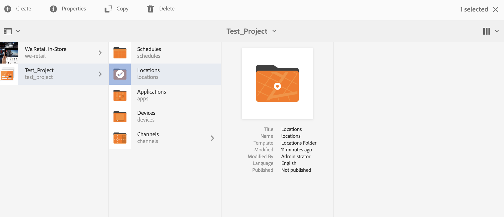

# 시작 안내서{#kickstart-guide}

이 섹션은 AEM Screens의 시작 단계이며 기본 작업을 수행하는 방법을 보여줍니다. 콘텐츠/자산을 사용하는 기본적인 디지털 사이니지 환경을 설정하고 Screens 플레이어에 게시하는 과정을 안내합니다. 스크린 개발을 위한 모든 구성 요소에 대한 자세한 내용은 페이지 끝에 있는 리소스를 참조하십시오.

## 5분 만에 디지털 서명 경험 만들기 {#creating-a-digital-signage-experience-in-minutes}

다음 단계에서는 스크린용 샘플 프로젝트를 만들고 Screens 플레이어에 컨텐츠를 게시할 수 있습니다.

1. AEM **Screens 플레이어를**&#x200B;다운로드하려면 [여기를 클릭하십시오](https://download.macromedia.com/screens/).

   AEM Screens는 Google Play에서도 사용할 수 **있습니다**.

   Chrome OS Player 구현에 대한 자세한 내용은 [Chrome](implementing-chrome-os-player.md) 관리 콘솔을 참조하십시오.

   자세한 [내용은 화면](configuring-screens-introduction.md) 설치 및 구성을 참조하십시오.

   >[!NOTE]
   >
   >**OSGI 설정**
   >
   >장치가 서버에 데이터를 게시할 수 있도록 하려면 빈 레퍼러를 활성화해야 합니다. 예를 들어 빈 레퍼러 속성이 비활성화된 경우 장치는 스크린샷을 다시 게시할 수 없습니다. 현재 이러한 기능 중 일부는 OSGI 구성에서 Apache Sling 레퍼러 필터 비어 있음 허용이 활성화된 경우에만 사용할 수 있습니다. 대시보드에 보안 설정이 이러한 기능 중 일부가 작동하지 않을 수 있다는 경고가 표시될 수 있습니다.
   >
   >아래 절차에 따라 Apache Sling 레퍼러 필터를 ***비움 허용하십시오***.
   >
   >1. Adobe Experience [Manager 웹 콘솔 구성으로 이동합니다](http://localhost:4502/system/console/configMgr/org.apache.sling.security.impl.ReferrerFilter).
   >1. allow. **empty** 옵션을 선택합니다.
   >1. **저장**&#x200B;을 클릭합니다.
   >    
   >자세한 내용에서 이전 단계에 대한 자세한 내용은 AEM Screens 구성 ***및 배포의*** 사전 요구 사항 [섹션을 참조하십시오](configuring-screens-introduction.md).

1. **새 프로젝트 생성**

   1. Adobe Experience Manager 링크(왼쪽 위)를 선택한 다음 **스크린**&#x200B;을 선택합니다. Alternatively, you can go directly to: [http://localhost:4502/screens.html/content/screens](http://localhost:4502/screens.html/content/screens).
   1. 만들기를 **클릭하여** 새 스크린 프로젝트를 만듭니다(아래 그림 참조).
   1. Select **Screens** from the **Create Screens Project** wizard and click **Next**.
   1. Enter the title as **Test_Project** and click **Create**.
   

    이제 프로젝트를 선택할 수 있습니다. 프로젝트에는 예약, **위치**, **애플리케이션**, **장치**, **채널** , 아래 그림에 표시된 다섯 가지 유형의 폴더가 **있습니다**.

   >[!NOTE]
   >
   >일정은 AEM 6.3 사이트 기능 팩 1을 설치한 경우에만 사용할 수 있습니다. 이 Feature Pack에 액세스하려면 Adobe 지원 센터에 연락하여 액세스 권한을 요청해야 합니다. 권한이 있으면 [패키지 공유]에서 다운로드할 수 있습니다.

   

   자세한 [내용은 스크린 프로젝트](creating-a-screens-project.md) 만들기 및 관리를 참조하십시오.

1. **Creating a new channel**

   프로젝트를 준비하면 컨텐츠를 관리하는 새 채널을 만들어야 합니다.

   Follow the steps below to create a new channel for your project:

   1. Navigate to the **Test_Project** you created and select the **Channels** folder.
   1. Click **Create** from the action bar (see the figure below). 마법사가 열립니다.
   1. Choose the **Sequence Channel** and click **Next**.
   1. Enter the **Name** and **Title** as **TestChannel** and click **Create**.
   

   아래 *그림과 같이* TestChannel이 만들어지고 채널 폴더에 추가됩니다.

   

   채널 [생성](managing-channels.md) 및 관리에 대한 자세한 내용은 채널 관리를 참조하십시오.

1. **채널에 컨텐츠 추가**

   적절한 채널을 확보했으면 AEM Screens 플레이어에서 표시할 컨텐츠를 채널에 추가해야 합니다.

   아래 절차에 따라 프로젝트의 채널(TestChannel)*에 컨텐츠를*&#x200B;추가하십시오.

   1. Navigate to the *Test_Project* you created and select the **Channels** folder.
   1. Click **Edit** from the action bar (see the figure below). The editor for the *TestChannel* opens.
   1. 작업 표시줄의 왼쪽에 있는 사이드 패널을 전환하는 아이콘을 클릭하여 자산과 구성 요소를 엽니다.
   1. 채널에 추가할 구성 요소를 드래그하여 놓습니다.
   

   이 예에서는 편집기에 채널에 추가된 이미지가 표시됩니다.

   

1. **새 위치 만들기**

   적절한 채널을 확보했으면 위치를 만들어야 합니다.

   ***위치는*** 다양한 디지털 사이니지 경험을 구분하고 다양한 화면의 위치에 따라 디스플레이의 구성을 포함합니다.

   아래 절차에 따라 프로젝트의 새 위치를 만드십시오.

   1. Navigate to the *Test_Project* you created and select the **Locations** folder.
   1. 작업 **표시줄의 더하기** 아이콘 옆에 있는 만들기를 클릭합니다(아래 그림 참조). 마법사가 열립니다.
   1. Select **Location** from the wizard and click **Next**.
   1. Enter the **Name** and **Title** for your location (enter the title as *TestLocation*) and click **Create**.
   

   TestLocation *이* 만들어지고 위치 **폴더에 추가됩니다** .

   

1. **TestLocation에 대한 새 디스플레이&#x200B;*만들기&#x200B;***

   위치를 만든 후에는 위치에 대한 새 디스플레이를 만들어야 합니다.

   ***디스플레이는*** 하나 이상의 화면에서 실행되는 디지털 경험을 나타냅니다.

   1. 위 그림에 표시된 대로 디스플레이를 만들 위치(Test_*Project*—> **위치** —> *TestLocation)* 로 *이동하고 TestLocation*&#x200B;을선택합니다.
   1. 작업 표시줄에서** 만들기 **를 클릭합니다.
   1. Select **Display** from the **Create** wizard and click **Next**.
   1. Enter **Title** for your display location (enter the title as *TestDisplay*).
   1. **만들기**&#x200B;를 클릭합니다.
   아래 그림과 *같이* 새 디스플레이 TestDisplay가 *위치 TestLocation에*&#x200B;추가됩니다.

   

1. **예약 추가**

   AEM Screens의 *예약*&#x200B;을 사용하면 컨텐츠를 표시할 각 디스플레이에 대해 개별적으로 지정을 반복할 필요가 없도록 채널을 재사용 가능 그룹으로 구성할 수 있습니다.

   >[!NOTE]
   >
   >이 스크린 기능은 AEM 6.3 사이트 기능 팩 1 이상을 설치한 경우에만 사용할 수 있습니다. 이 Feature Pack에 액세스하려면 Adobe 지원 센터에 연락하여 액세스 권한을 요청해야 합니다. 권한이 있으면 [패키지 공유]에서 다운로드할 수 있습니다.

   1. Test_Project **—** > Schedules 폴더로 **이동합니다**.
   1. 작업 표시줄에서** 만들기 **를 클릭합니다. 마법사가 열립니다.
   1. 만들기 **마법사** 페이지에서 **예약을** 선택합니다.
   1. 속성 **페이지에서** 제목을 *MorningSchedule* 로 입력합니다.
   1. 만들기를 **클릭하면** 예약 **폴더가** 아래 그림과 같이 추가됩니다.
   

   또한 예약(MorningSchedule)*을*&#x200B;선택하고 작업 **표시줄에서 Dashboard를** 클릭하여 예약 대시보드를 봅니다. 대시보드에서 일정의 속성을 보거나 변경하고, 채널을 할당하고, 지정된 디스플레이를 볼 수 있습니다.

   

   일정에 대한 [자세한 내용은 예약](managing-schedules.md) 생성 및 관리를 참조하십시오.

1. **채널 지정**

   1. Navigate to the display from *Test_Project* --> **Locations** --> *TestLocation* --> *TestDisplay*.
   1. Select *TestDisplay* and tap/click **Assign Channel **from the action bar, *Or*,
   1. Click **Dashboard** and select **+Assign Channel** at the top right from **ASSIGNED CHANNELS &amp; SCHEDULES** panel, as shown in the figure below. **채널 지정** 대화 상자가 열립니다.
   1. Select **Reference Channel** by **path**.
   1. 채널 경로( **Test_Project**** —> Channels *Test* Channel *에서 ChannelsTestChannel* ****)를 선택합니다. 채널 **역할은** 채널 이름으로 자동으로 채워집니다.
   1. Select the **Priority** for this channel as *1*.
   1. Choose the **Supported Events** as **Initial Load** and **Idle Screen**.
   1. 예약을 **입력하고** , **활성** 및 **활성 날짜까지**&#x200B;날짜를 선택합니다. *특정 시간 간격 동안 채널을 표시하려면 이 필드를 채워야 합니다.*
   1. **저장**&#x200B;을 클릭합니다.
   채널이 할당되어 패널에 추가됩니다.

   

   채널 지정 **대화 상자 및** 관련 속성에 대한 자세한 내용은 채널 지정을 [참조하십시오.](channel-assignment.md)

1. **채널에 예약 추가**

   1. Navigate to the display from *Test_Project* --> **Locations** --> *TestLocation* --> *TestDisplay*.
   1. Click **Dashboard** and select **+Assign Schedule** at the top right from **ASSIGNED CHANNELS &amp; SCHEDULES** panel, as shown in the figure above. **할당 예약** 대화 상자가 열립니다.
   1. 일정을 만든 경로(여기에서 Test_Project —> *예약* —> **Morning** Schedule *)를*&#x200B;선택합니다.
   1. 저장을 **클릭하여** 채널에 일정을 추가합니다.
   

1. **장치 등록**

   AEM 대시보드를 사용하여 장치를 등록해야 합니다.

   >[!NOTE]
   >
   >다운로드한 AEM Screens 앱 또는 웹 브라우저를 사용하여 Screens 플레이어를 열 수 있습니다.

   보류 중인 장치를 보려면:

   1. 별도의 브라우저 창을 실행합니다.
   1. Go to Screens player using the [web browser](http://localhost:4502/content/mobileapps/cq-screens-player/firmware.html) or launch the AEM Screens app. 장치를 열면 장치의 상태가 등록되지 않음으로 표시됩니다.
   1. From the AEM dashboard, navigate to *Test_Project* --> **Devices**
   1. Click **Device Manager** from the action bar.
   1. 장치 **등록을** 클릭하면 아래 그림과 같이 보류 중인 장치가 표시됩니다.
   >[!NOTE]
   >
   >AEM Screens Player를 ChromeOS 확장 프로그램으로 사용하는 경우 AEM Screens FAQ 페이지에서 ChromeOS ***플레이어를 Chrome 브라우저 플러그인으로 설치하는 방법*** 아래의 [쿼리를](aem-screens-faqs.md) 참조하십시오.

   

   Select the device you want to register and click **Register Device**.

   

   웹 브라우저나 AEM Screens 플레이어에서 코드를 확인하여 코드의 유효성을 검사해야 합니다.

   Click **Validate** to navigate to **Device Registration** screen.

   

   Enter **Title** and click **Register** and the device will be registered.

   마침을 **클릭하여** 장치 등록 단계를 완료합니다.

   

   마침을 **클릭하면** 할당되지 않고 할당된 장치를 표시하는 장치 페이지로 돌아갑니다.

   

   >[!NOTE]
   >
   >추가한 장치가 [할당됨] **상태 아래에** [지정되지 않음] **으로** 표시됩니다.

1. **표시할 장치 할당**

   장치를 등록했으면 디스플레이에 장치를 할당해야 합니다.

   장치를 할당하려면 아래 절차를 따르십시오.

   1. 할당할 장치를 선택합니다.
   1. Click **Assign Device** from the action bar.
   1. Select the display path for your channel as */content/screens/Test_Project/***Locations***/TestLocation/TestDisplay.*
   1. Click **Assign**.
   1. Click **Finish** to complete the process, and now the device is assigned.
   

   디스플레이 대시보드가 열리고 장치 구성 세부 정보와 함께 지정된 채널 및 예약과 관련된 모든 정보가 표시됩니다.

   

### Viewing the content in Screens Player {#viewing-the-content-in-screens-player}

위의 구성을 추가한 후에는 플레이어에서 이미지(이 시나리오에서는 시퀀스 채널 및 컨텐츠가 웹 브라우저용 Screens 플레이어에 표시됨)와 같이 장치에 표시되는 기본 채널을 자동으로 표시해야 합니다.

AEM [Screens 플레이어에](working-with-screens-player.md)대한 자세한 내용은 AEM Screens 플레이어를 참조하십시오.

### 추가 리소스 {#additional-resources}

화면에 대한 모든 모듈에 대한 자세한 내용은 아래 리소스를 참조하십시오.

1. [화면 설치 및 구성](configuring-screens-introduction.md)
1. [스크린 프로젝트 만들기 및 관리](creating-a-screens-project.md)
1. [장치 할당](managing-devices.md)
1. [채널 만들기 및 관리](managing-channels.md)
1. [위치 만들기 및 관리](managing-locations.md)
1. [디스플레이 만들기 및 관리](managing-displays.md)
1. [채널 지정](channel-assignment.md)
1. [장치 관리](managing-devices.md)
1. [예약 만들기 및 관리](managing-schedules.md)
1. [AEM 스크린 플레이어](working-with-screens-player.md)
1. [장치 컨트롤 센터 문제 해결](monitoring-screens.md)

