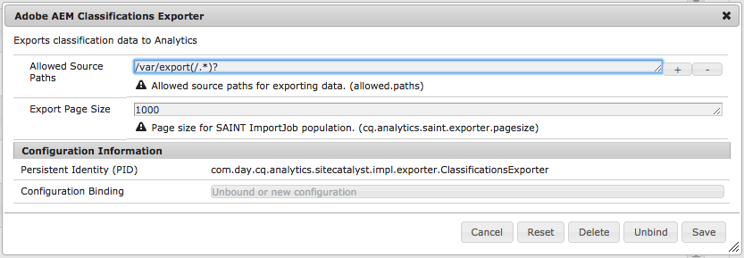

# Adobe 분류{#adobe-classifications}

Adobe 분류은 분류 데이터를 예약된 방식으로 [Adobe Analytics](/help/sites-administering/adobeanalytics.md)로 내보냅니다. 내보내기는 **com.adobe.cq.scheduled.exporter.Exporter**&#x200B;의 구현입니다.

이를 구성하려면:

1. **도구, Cloudservices**&#x200B;를 통해 **Adobe Analytics** 섹션으로 이동합니다.
1. 새 구성을 추가합니다. **Adobe Analytics 분류** 구성 템플릿이 **Adobe Analytics Framework** 구성 아래에 표시됩니다. 필요에 따라 **제목** 및 **이름**&#x200B;을 입력합니다.

   

1. **만들기**&#x200B;를 클릭하여 설정을 구성합니다.

   

   속성에는 다음이 포함됩니다.

   | **필드** | **설명** |
   |---|---|
   | 활성화됨 | Adobe 분류 설정을 활성화하려면 **예**&#x200B;를 선택합니다. |
   | 충돌 시 덮어쓰기 | 데이터 충돌을 덮어쓰려면 **예**&#x200B;를 선택합니다. 기본적으로 이 값은 **No**&#x200B;로 설정됩니다. |
   | 삭제가 처리되었습니다 | **Yes**&#x200B;로 설정하면 처리된 노드를 내보낸 후 삭제합니다. 기본값은 **False**&#x200B;입니다. |
   | 작업 내보내기 설명 | Adobe 분류 작업에 대한 설명을 입력합니다. |
   | 알림 이메일 | Adobe 분류 알림에 대한 이메일 주소를 입력합니다. |
   | 보고서 세트 | 가져오기 작업을 실행할 보고서 세트를 입력합니다. |
   | 데이터 세트 | 가져오기 작업을 실행할 데이터 집합 관계 ID를 입력합니다. |
   | 변환자 | 드롭다운 메뉴에서 변환기 구현을 선택합니다. |
   | 데이터 소스 | 데이터 컨테이너의 경로로 이동합니다. |
   | 일정 내보내기 | 내보내기 일정을 선택합니다. 기본값은 30분마다 있습니다. |

1. 설정을 저장하려면 **확인**&#x200B;을 클릭합니다.

## 페이지 크기 수정 {#modifying-page-size}

레코드는 페이지에서 처리됩니다. 기본적으로 Adobe 분류은 페이지 크기가 1000인 페이지를 만듭니다.

페이지 크기는 Adobe 분류에서 정의당 최대 25,000개이며 Felix 콘솔에서 수정할 수 있습니다. 내보내는 동안 Adobe 분류은 소스 노드를 잠가 동시 수정을 방지합니다. 내보내기 후, 오류 시 또는 세션이 닫힌 후 노드의 잠금이 해제됩니다.

페이지 크기를 변경하려면:

1. **https://&lt;호스트>:&lt;포트>/system/console/configMgr**&#x200B;의 OSGI 콘솔로 이동하고 **Adobe AEM 분류 내보내기**&#x200B;를 선택합니다.

   

1. **페이지 크기 내보내기**&#x200B;를 필요에 따라 업데이트한 다음 **저장**&#x200B;을 클릭합니다.

## SAINTDefaultTransformer {#saintdefaulttransformer}

>[!NOTE]
>
>Adobe 분류은 이전에 SAINT 내보내기라고도 했습니다.

내보내기 프로그램은 Transformer를 사용하여 내보내기 데이터를 특정 형식으로 변형할 수 있습니다. Adobe 분류의 경우 Transformer 인터페이스를 구현하는 하위 인터페이스 `SAINTTransformer<String[]>`가 제공되었습니다. 이 인터페이스는 데이터 유형을 SAINT API에서 사용하는 `String[]`으로 제한하고 마커 인터페이스를 사용하여 선택할 서비스를 찾습니다.

기본 구현 SAINTDefaultTransformer에서 내보내기 소스의 자식 리소스는 속성 이름을 키와 속성 값으로 포함하는 레코드로 처리됩니다. **키** 열은 첫 번째 열로 자동으로 추가됩니다. 이 값은 노드 이름이 됩니다. 지정된 속성(포함 :)은 무시됩니다.

*노드 구조:*

* id-classification `nt:unstructured`

   * 1 `nt:unstructured`

      * 제품 = 내 제품 이름(문자열)
      * 가격 = 120.90 (문자열)
      * 크기 = M(문자열)
      * 색상 = 검정(문자열)
      * 색상^코드 = 101(문자열)

**SAINT 헤더 및 레코드:**

| **키** | **제품** | **가격** | **크기** | **색상** | **색상^코드** |
|---|---|---|---|---|---|
| 1 | 내 제품 이름 | 120.90 | M | black | 101년 |

속성에는 다음이 포함됩니다.

<table> 
 <tbody> 
  <tr> 
   <td><strong>속성 경로</strong></td> 
   <td><strong>설명</strong></td> 
  </tr> 
  <tr> 
   <td>변압기</td> 
   <td>SAINTTrans전 구현의 클래스 이름</td> 
  </tr> 
  <tr> 
   <td>이메일</td> 
   <td>알림 이메일 주소입니다.</td> 
  </tr> 
  <tr> 
   <td>reportsuites</td> 
   <td>보고서 세트 ID를 사용하여 가져오기 작업을 실행합니다. </td> 
  </tr> 
  <tr> 
   <td>데이터 집합</td> 
   <td>가져오기 작업을 실행할 데이터 집합 관계 ID입니다. </td> 
  </tr> 
  <tr> 
   <td>설명</td> 
   <td>작업 설명입니다.  </td> 
  </tr> 
  <tr> 
   <td>덮어쓰기</td> 
   <td>데이터 충돌을 덮어쓸 플래그. 기본값은 <strong>false</strong>입니다.</td> 
  </tr> 
  <tr> 
   <td>checkdification</td> 
   <td>호환성이 있는지 보고서 세트를 확인하는 플래그. 기본값은 <strong>true</strong>입니다.</td> 
  </tr> 
  <tr> 
   <td>deletered</td> 
   <td>내보내기 후 처리된 노드를 삭제하는 플래그. 기본값은 <strong>false</strong>입니다.</td> 
  </tr> 
 </tbody> 
</table>

## Adobe 분류 내보내기 자동화 {#automating-adobe-classifications-export}

고유한 워크플로우를 만들 수 있으므로 새 가져오기를 통해 **/var/export/**&#x200B;에서 적절하고 올바르게 구조화된 데이터를 만드는 워크플로우를 실행할 수 있으므로 Adobe 분류으로 내보낼 수 있습니다.
