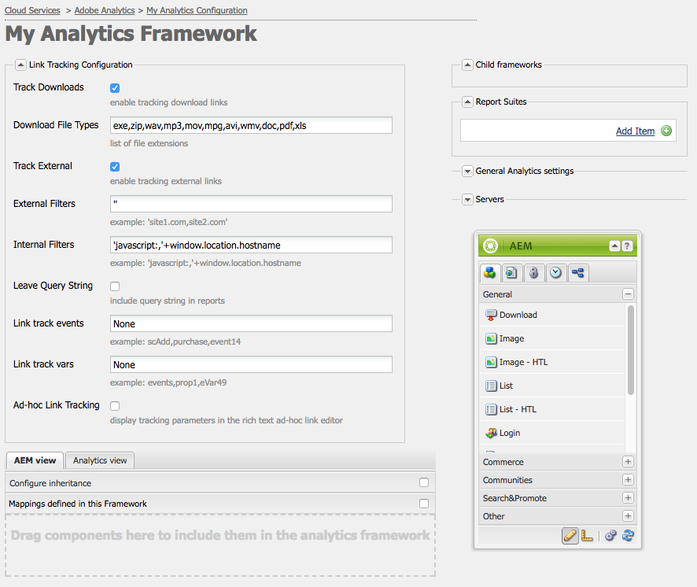
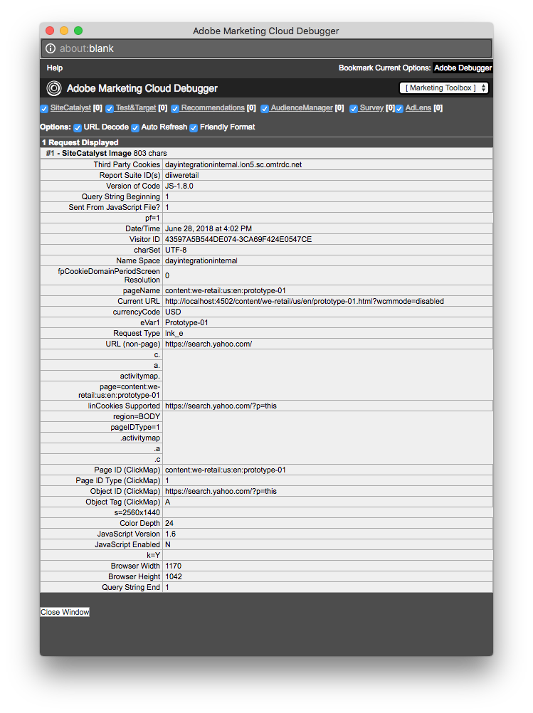

# Adobe Analytics에 대한 링크 추적 구성{#configuring-link-tracking-for-adobe-analytics}

사용자가 웹 사이트의 페이지에서 링크를 클릭하면 Adobe Analytics에서 관련 정보를 캡처할 수 있습니다. 예를 들어 링크 추적을 사용하여 사용자가 사이트와 상호 작용하는 방법, 파일 다운로드 추적 및 종료 링크 추적 등을 살펴볼 수 있습니다.

## Adobe Analytics 프레임워크에 대한 링크 추적 구성 {#configuring-link-tracking-for-an-adobe-analytics-framework}

1. 탐색 **을**&#x200B;사용하여 배포 **, Cloud Service**&#x200B;를 **거쳐** Adobe Analytics섹션으로 **** 이동합니다.

1. 구성 **표시를**&#x200B;사용하여 필요한 Adobe Analytics 프레임워크을 엽니다.
1. 링크 **추적 구성** 섹션을 확장하고 필요에 따라 구성합니다(이 페이지에서는 자세한 내용을 제공합니다).

   

## 파일 다운로드 추적 {#tracking-file-downloads}

관련 페이지에서 다운로드한 파일이 Adobe Analytics에서 다운로드로 자동으로 추적되도록 Adobe Analytics 프레임워크을 구성합니다. 다운로드 추적을 활성화하면 지정한 파일 유형만 추적됩니다.

다음 파일 유형의 다운로드는 기본적으로 추적됩니다.

* exe
* zip
* wav
* mp3
* mov
* mph
* avi
* wmv
* doc
* pdf
* xls

예를 들어 PDF 파일에 대한 다운로드 추적 기능이 활성화되면 사용자가 PDF 파일에 대한 링크를 클릭할 때마다 PDF 다운로드가 추적됩니다.

프레임워크의 다운로드 추적 속성은 페이지에 대해 생성된 파일의 코드로 `analytics.sitecatalyst.js` 구현됩니다. 다음 코드 샘플은 기본 다운로드 추적 구성을 나타냅니다.

```
s.trackDownloadLinks= true;
s.linkDownloadFileTypes= 'exe,zip,wav,mp3,mov,mpg,avi,wmv,doc,pdf,xls';
```

Adobe Analytics 프레임워크에 대한 다운로드 추적을 활성화하려면:

1. [Adobe Analytics 프레임워크을 열고 링크 추적 구성 섹션을 확장합니다](#configuring-link-tracking-for-an-adobe-analytics-framework).
1. 다운로드 **추적 활성화를 참조하십시오**.
1. [ **파일 형식** 다운로드] 상자에 추적하려는 파일 유형의 파일 이름 확장자를 입력합니다.

## 외부 링크 추적 {#tracking-external-links}

페이지에서 외부 링크(종료 링크)의 클릭을 추적할 수 있습니다.

Adobe Analytics 프레임워크에 대한 외부 링크를 추적하려면:

1. [Adobe Analytics 프레임워크을 열고 **링크 추적 구성** 섹션을 확장합니다](#configuring-link-tracking-for-an-adobe-analytics-framework).
1. 요구 사항에 따라 다음 속성을 구성합니다.

외부 링크를 클릭할 때 추적할 속성:

* **외부 추적**&#x200B;외부 링크 추적을 활성화합니다.

* **외부 필터**(선택 사항) 링크 대상의 외부 URL과 일치하는 필터를 정의합니다. 링크 대상이 필터와 일치하면 링크가 추적됩니다. 외부 필터는 페이지의 일부 외부 링크만 추적하는 데 유용합니다.

   추적할 외부 링크를 지정하려면 링크 대상의 URL의 전체 또는 일부를 입력합니다. 여러 필터를 쉼표로 구분합니다. 문자열 리터럴을 작은 따옴표로 묶습니다. 값 없음(기본값, 작은 따옴표 두 개)으로 인해 모든 외부 링크가 `''`추적됩니다.

* **내부 필터**&#x200B;내부 링크의 URL과 일치하는 필터를 정의합니다. 링크가 이 필터와 일치하는 URL을 타깃팅하면 링크가 추적되지 않습니다. 기본값은 현재 창 주소에 대한 URL의 호스트 이름을 반환하는 javascript 명령입니다.

   추적되지 않는 내부 링크를 지정하려면 링크 대상의 내부 URL의 전체 또는 일부를 입력합니다. 여러 필터를 쉼표로 구분합니다. 문자열 리터럴을 작은 따옴표로 묶습니다.

   기본값은 입니다. `'javascript:,'+window.location.hostname`

* **쿼리 문자열**&#x200B;에서 내부 및 외부 필터로 일치를 평가할 때 URL 매개 변수를 그대로 둡니다.

   외부 및 내부 필터에 대해 링크 대상 URL을 평가할 때 URL 매개 변수를 포함할 수 있습니다.

외부 링크 추적 속성은 페이지에 대해 생성된 파일의 `analytics.sitecatalyst.js` 코드로 구현됩니다. 다음 구성으로 외부 링크 추적을 활성화한 프레임워크와 연결된 페이지에 대해 다음 예제 코드가 생성됩니다.

* 외부 필터는 `'google.com'`
* 내부 필터는 `'javascript:,'+window.location.hostname`
* 필터에 대해 링크 대상을 평가할 때는 쿼리 문자열이 포함되지 않습니다.

```
s.trackExternalLinks= false;
s.linkExternalFilters= 'google.com';
s.linkInternalFilters= 'javascript:,'+window.location.hostname;
s.linkLeaveQueryString= false;
```

## 링크 클릭으로 변수 데이터 전송 {#sending-variable-data-with-link-clicks}

사용자가 링크를 클릭할 때 이벤트 및 변수 데이터를 Adobe Analytics으로 보내도록 AEM을 구성할 수 있습니다. 링크 **추적 구성** 속성을 사용하면 링크 클릭 발생 시 추적할 Adobe Analytics 이벤트 및 변수를 지정할 수 있습니다.

프레임워크 매핑은 이벤트 및 변수 값을 결정합니다. 링크를 클릭할 때 추적하려는 데이터를 저장하는 컨텐츠 구성 요소의 변수에 Adobe Analytics 변수를 매핑할 수 있습니다.

링크 클릭으로 변수 데이터를 전송하려면

1. [Adobe Analytics 프레임워크을 열고 링크 추적 구성 섹션을 확장합니다](#configuring-link-tracking-for-an-adobe-analytics-framework).
1. 요구 사항에 따라 다음 속성을 구성합니다.

링크 클릭 시 변수 데이터를 전송하는 속성:

* **링크 추적 이벤트**&#x200B;링크 클릭 횟수를 계산하는 데 사용할 Adobe Analytics 이벤트 변수를 입력합니다.

   여러 변수 이름을 쉼표로 구분합니다.

   의 기본값은 이벤트 추적을 `None` 발생시키지 않습니다.

* **링크 추적 변수**&#x200B;링크를 클릭할 때 Adobe Analytics으로 전송할 Adobe Analytics 변수를 입력합니다. 여러 변수 이름을 쉼표로 구분합니다.

   의 기본값은 변수 데이터를 전송하지 `None` 않게 합니다.

전송할 이벤트 및 변수를 지정하면 페이지에 대해 생성된 파일의 코드로 구성이 `analytics.sitecatalyst.js` 구현됩니다. 프레임워크가 이벤트 및 속성을 추적할 때 페이지에 대해 다음 예제 `event10` 코드가 `prop4` 생성됩니다.

```
s.linkTrackEvents= 'event10';
s.linkTrackVars= 'prop4';
```

## 링크 추적 구성 예 {#example-link-tracking-configuration}

다음 절차를 수행하여 Adobe Analytics 통합의 링크 추적 동작을 탐색합니다. 이 절차에서는 [Adobe Experience Cloud Debugger의 결과를 보여 줍니다](https://docs.adobe.com/content/help/en/debugger/using/experience-cloud-debugger.html).

### General configuration {#general-configuration}

이 예에서는 추적 및 디버거 컨텍스트에서 매핑이 작동하는 방식을 보여 줍니다.

1. 웹 페이지와 연결된 프레임워크를 엽니다.
1. 페이지 **구성** 요소를 프레임워크의 매핑 영역으로 드래그합니다. 페이지 **구성** 요소는 사이드 킥의 **일반** 구성 요소 그룹에 속합니다.

   >[!NOTE]
   >
   >실제 시나리오에서 사용해야 하는 구성 요소는 상속된 구성 요소에 따라 다릅니다(있는 경우).
   >
   >그렇지 않은 경우 고유한 구성 요소를 여기에 노출시켜야 합니다(해당 페이지 구성 요소에서 분석 하위 노드를 정의함으로써).

   왼쪽 패널에서 Analytics(SiteCatalyst) 변수를 드래그하여 다음 표에 따라 매핑을 구성합니다.

<table> 
 <tbody> 
  <tr> 
   <th>CQ Variable<br /> </th> 
   <th>변수 브라우저의 입력<br /> </th> 
   <th>Adobe Analytics 변수</th> 
  </tr> 
  <tr> 
   <td>pagedata.title</td> 
   <td>사용자 지정 eVar 1(eVar1)</td> 
   <td>eVar1</td> 
  </tr> 
  <tr> 
   <td>eventdata.events.pageView</td> 
   <td>사용자 지정 1(event1)</td> 
   <td>event1</td> 
  </tr> 
 </tbody> 
</table>

1. 검색 구성 요소를 프레임워크의 매핑 영역으로 드래그합니다. 검색 구성 요소는 사이드 킥의 일반 구성 요소 그룹에 속합니다. 왼쪽 패널에서 Analytics(SiteCatalyst) 변수를 드래그하여 다음 표에 따라 매핑을 구성합니다.

<table> 
 <tbody> 
  <tr> 
   <th>CQ Variable<br /> </th> 
   <th>변수 브라우저의 입력</th> 
   <th>Adobe Analytics 변수</th> 
  </tr> 
  <tr> 
   <td>eventdata.keyword</td> 
   <td>사용자 지정 eVar 2(eVar2)</td> 
   <td>eVar2</td> 
  </tr> 
  <tr> 
   <td>eventdata.results</td> 
   <td>사용자 지정 eVar 3(eVar3)</td> 
   <td>eVar3</td> 
  </tr> 
  <tr> 
   <td>eventdata.events.search</td> 
   <td>사용자 지정 2(event2)</td> 
   <td>event2</td> 
  </tr> 
 </tbody> 
</table>

### 외부 링크 추적 구성 {#configure-external-link-tracking}

1. 프레임워크에서 **링크 추적 구성** 영역을 확장합니다.
1. [다운로드 **추적]을 선택 취소합니다**.

1. [외부 **추적]을 선택합니다**.
1. 쿼리 **문자열**&#x200B;남기기 선택 취소
1. [외부 필터] **목록에** 대해 다음 값을 사용하여 외부 URL로 식별합니다.

   `‘yahoo.com’`

1. [추적 이벤트 **연결] 필드에 다음 값을** 추가합니다.

   ```
       event1,event2
   ```

1. 링크 추적 변수 필드에 다음 값을 **추가합니다** .

   ```
       eVar1,eVar2
   ```

1. 프레임워크와 연결된 페이지에서 **텍스트** 구성 요소를 추가합니다. 텍스트 **구성** 요소 내에서 다음 주소를 가리키는 하이퍼링크를 추가합니다.

   `https://search.yahoo.com/?p=this`

1. 미리 **보기 모드로** 전환하고 링크를 클릭합니다.

Adobe Marketing Cloud Debugger를 사용하여 볼 때 호출은 다음과 같이 표시됩니다.



>[!NOTE]
>
>URL에 쿼리 문자열이 포함되어 있지 않습니다. `?p=this`

### URL 매개 변수 포함 {#include-the-url-parameter}

1. 프레임워크에서 **링크 추적 구성 영역을** 확장합니다.
1. 쿼리 **문자열**&#x200B;남기를 활성화합니다.
1. 페이지 미리 보기를 다시 로드하고 링크를 클릭합니다.

Adobe Marketing Cloud 디버거에 나타나는 호출 세부 사항은 다음 예와 유사합니다.


>[!NOTE]
>
>이번에는 URL에 쿼리 문자열이 포함됩니다. `?p=this`

## Ad-Hoc Link Tracking {#ad-hoc-link-tracking}

애드혹 링크 추적을 사용하면 컨텐츠 작성자가 구성 요소에 대한 링크 추적을 구성할 수 있습니다. 구성 요소의 구성은 프레임워크의 **링크 추적 구성을** 대체하므로, 프레임워크와 연결된 페이지에서 **텍스트** 구성 요소를 URL의 링크 추적에 대해 구성할 수 있습니다.

애드혹 링크 추적을 사용하면 이벤트 및 변수 데이터와 함께 다운로드 링크, 외부 링크를 추적할 수 있습니다.

애드혹 링크 추적을 활성화하려면 다음을 수행해야 합니다.

* [텍스트 구성 요소를 포함하는 페이지 **를** 프레임워크와 연결합니다](/help/sites-administering/adobeanalytics-connect.md#associating-a-page-with-a-adobe-analytics-framework).
* [애드혹 링크 추적을 사용하도록 Adobe Analytics 프레임워크을 구성합니다](#enabling-ad-hoc-link-tracking).
* [텍스트 구성 요소에 대한 링크 추적 구성을 참조하십시오](#configuring-link-tracking-for-a-text-component).

### 애드혹 링크 추적 활성화 {#enabling-ad-hoc-link-tracking}

애드혹 링크 추적을 사용하도록 Adobe Analytics 프레임워크을 구성합니다.

1. Adobe Analytics 프레임워크을 열고 **링크 추적 구성** 섹션을 확장합니다.

1. 애드혹 **링크 추적을 활성화합니다**.

   >[!NOTE]
   >
   >모든 사용자 유형이 이 확인란을 사용할 수 있는 것은 아닙니다. 액세스 권한이 필요한 경우 사이트 관리자에게 문의하십시오.

>[!NOTE]
>
>이제 XSS Antisamy 구성이 /libs/sling/xss.config.xml **** 경로 아래의 SLING에 있으며 애드혹 연결이 작동하려면 다음 규칙을 추가해야 합니다.

#### 앵커 태그 규칙 확장 {#anchor-tag-rule-extension}

```xml
<attribute name="onclick">
    <literal-list>
        <literal value="CQ_Analytics.Sitecatalyst.customTrack(this)"/>
    </literal-list>
</attribute>
<attribute name="adhocenable">
    <literal-list>
        <literal value="true"/>
        <literal value="false"/>
    </literal-list>
</attribute>
<attribute name="adhocevents">
    <regexp-list>
        <regexp name="anything"/>
    </regexp-list>
</attribute>
<attribute name="adhocevars">
    <regexp-list>
        <regexp name="anything"/>
    </regexp-list>
</attribute>
```

### 텍스트 구성 요소에 대한 링크 추적 구성 {#configuring-link-tracking-for-a-text-component}

텍스트 구성 요소 자체에 대한 **애드혹** 링크 추적을 구성하려면 먼저 다음 구성이 이미 구현되어 있어야 합니다.

* Adobe [Analytics 프레임워크은 애드혹 링크 추적을 활성화하도록 구성되어 있습니다](#enabling-ad-hoc-link-tracking).
* 텍스트 [구성 **요소를 포함하는** 페이지는 프레임워크와 연결됩니다](/help/sites-administering/adobeanalytics-connect.md#associating-a-page-with-a-adobe-analytics-framework).

텍스트 구성 요소에 대한 링크 추적을 구성하려면 다음 절차를 **** 사용하십시오.

1. 편집 모드에서 페이지를 열고 **텍스트** 구성 요소를 편집합니다.

1. 하이퍼텍스트로 사용할 텍스트를 선택하고 [하이퍼링크] 단추를 클릭합니다.

   

1. 연결 대상 상자에 대상 URL을 추가한 다음 링크 추적 영역을 확장합니다.

   >[!NOTE]
   >
   >사용자 지정 링크 추적은 링크/연결 해제 작업(Analytics 아이콘) 옆에 있는 별도의 작업으로 볼 수 있습니다.
   >
   >RTE에서 유효한 링크를 선택한 경우에만 활성화됩니다.

   

1. 사용자 **지정 링크 추적** 기능을 활성화하여 Adobe Analytics 프레임워크의 링크 추적 구성을 무시하고 현재 링크에 대한 링크 추적을 활성화합니다.

1. (선택 사항) 링크를 클릭하여 이벤트를 추적하려면 Adobe Analytics 변수 **포함 필드에 Adobe Analytics 이벤트 이름을** 추가합니다. 여러 이벤트 이름을 쉼표로 구분합니다(예:

   `event1, event22`.

1. (선택 사항) 링크를 클릭하여 변수 데이터를 추적하려면 Adobe Analytics 변수 **포함 필드에 Adobe Analytics 변수를** 추가합니다. 다음 형식 중 하나를 사용하십시오.

   * `*<Variable-name>*: *<Dynamic Value>*`
   * `*<Variable-name>*: *‘CONSTANT’*`

   다음 예는 각 형식을 보여 줍니다.

   * `eVar10:pagedata.title`
   * `prop1: ‘Aubergine'`

   여러 값을 쉼표로 구분합니다.

1. 확인을 **선택합니다**.

