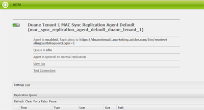
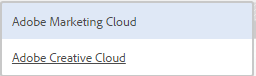

# Experience Cloud 및 Creative Cloud과 AEM Assets 통합 구성 {#configure-aem-assets-integration-with-experience-cloud-and-creative-cloud}

Adobe Experience Cloud 고객인 경우, Adobe Experience Manager(AEM) 자산 내의 자산을 Adobe Creative Cloud과 동기화하거나의 자산을 동기화할 수 있습니다. 또한 자산을 Experience Cloud과 동기화하거나 그 반대로 동기화할 수 있습니다. Adobe I/O를 통해 이 동기화를 설정할 수 있습니다.

이 통합을 설정하는 워크플로우는 다음과 같습니다.

1. 공용 게이트웨이를 사용하여 Adobe I/O에서 인증을 만들고 응용 프로그램 ID를 얻습니다.
1. 응용 프로그램 ID를 사용하여 AEM Assets 인스턴스에 프로필을 만듭니다.
1. 이 구성을 사용하여 AEM Assets 내의 자산을 Creative Cloud과 동기화합니다.

백 엔드에서 AEM 서버는 게이트웨이로 프로필을 인증한 다음 AEM Assets과 Experience Cloud 간에 데이터를 동기화합니다.

>[!NOTE]
>
>AEM-Adobe Creative Cloud 폴더 공유 기능은 더 이상 사용되지 않습니다. 자세한 내용을 살펴보고 [AEM 및 Creative Cloud 통합 모범 사례를](../assets/aem-cc-integration-best-practices.md)확인하십시오. AEM에서 Marketing Cloud으로 복제 및 AEM Assets과 Marketing Cloud 간 자산 교환은 더 이상 필요하지 않습니다.

AEM Assets 및 Creative Cloud이 통합된 경우 데이터 흐름

>[!NOTE]
>
>Adobe Experience Cloud과 Adobe Creative Cloud 간에 자산을 공유하려면 AEM 인스턴스에 대한 관리자 권한이 필요합니다.

>[!CAUTION]
>
>Adobe Marketing Cloud는 Adobe Experience Cloud으로 다시 브랜딩되었습니다. 아래 절차에서는 여전히 현재 인터페이스를 반영하기 위해 Marketing Cloud을 언급합니다.

## 애플리케이션 만들기 {#create-an-application}

1. https://legacy-oauth.cloud.adobe.io에서 로그인하여 Adobe 개발자 게이트웨이 인터페이스에 [액세스합니다](https://legacy-oauth.cloud.adobe.io/).

   >[!NOTE]
   >
   >응용 프로그램 ID를 만들려면 관리자 권한이 필요합니다.

1. 왼쪽 창에서 **[!UICONTROL 개발자 도구]** > **[!UICONTROL 응용 프로그램]** 으로 이동하여 응용 프로그램 목록을 봅니다.
1. 응용 프로그램 **[!UICONTROL 을]** 만들려면  추가를 클릭합니다.
1. [ **[!UICONTROL 클라이언트 자격 증명]** ] 목록에서 **[!UICONTROL 서버 인증을 위한 서버 간 통신 서비스인 서비스 계정(JWT Assertion)]**&#x200B;을 선택합니다.

   

1. 응용 프로그램의 이름과 선택적 설명을 지정합니다.
1. 조직 **** 목록에서 자산을 동기화할 조직을 선택합니다.
1. [ **[!UICONTROL 범위]** ] 목록에서 **[!UICONTROL dam-read]**, **[!UICONTROL dam-sync]****[!UICONTROL , dam-write, dam-write]******,cc-share를 선택합니다.
1. **[!UICONTROL 만들기]**&#x200B;를 클릭합니다. 응용 프로그램이 작성되었음을 알리는 메시지가 표시됩니다.

   

1. 새 응용 프로그램에 대해 생성된 **[!UICONTROL 응용 프로그램 ID]** 를 복사합니다.

   >[!CAUTION]
   >
   >응용 프로그램 ID 대신 응용 프로그램 **[!UICONTROL 암호를]** 실수로 복사하지 않도록 **[!UICONTROL 하십시오]**.

## Marketing Cloud에 새 구성 추가 {#add-a-new-configuration-to-marketing-cloud}

1. 로컬 AEM Assets 인스턴스의 사용자 인터페이스에서 AEM 로고를 클릭하고 **[!UICONTROL 도구]** > **[!UICONTROL Cloud Services]** > **[!UICONTROL 기존 Cloud Services으로]**&#x200B;이동합니다.

1. **[!UICONTROL Adobe Marketing Cloud]** 서비스를 찾습니다. 구성이 없으면 지금 **[!UICONTROL 구성을 클릭합니다]**. 구성이 있는 경우 구성 **[!UICONTROL 표시]** 를 클릭하고 **[!UICONTROL [+]]** 를 클릭하여 새 구성을 추가합니다.

   >[!NOTE]
   >
   >조직에 대한 관리자 권한이 있는 Adobe ID 계정을 사용하십시오.

1. 구성 **[!UICONTROL 만들기]** 대화 상자에서 새 구성의 제목과 이름을 지정하고 만들기를 **[!UICONTROL 클릭합니다]**.

   

1. 테넌트 **[!UICONTROL URL]** 필드에서 AEM Assets의 URL을 지정합니다.

   >[!CAUTION]
   >
   >리브랜딩으로 인해 테넌트 URL을 **https://&lt;테넌트_id>.marketing.adobe.com** 으로 입력한 경우 **https://&lt;테넌트_id>.experiencecloud.adobe.com으로 변경해야 합니다.** 이렇게 하려면 아래 절차를 따르십시오.
   1. 도구 > **Cloud Services > 기존 Cloud Services으로 이동합니다**.
   1. Adobe Marketing Cloud 아래에서 구성 **표시를 클릭합니다**.
   1. AEM-MAC-CC 동기화를 설정하는 동안 생성된 구성을 선택합니다.
   1. cloudservice 구성을 편집하고 테넌트 URL 필드의 **marketing.adobe.com** 을 **experiencecloud.adobe.com으로 바꿉니다**.
   1. 구성을 저장합니다.
   1. mac 동기화 복제 에이전트를 테스트합니다.

1. 클라이언트 **[!UICONTROL ID]** 필드에서 애플리케이션 만들기 [절차의 끝 부분에 복사한 응용 프로그램 ID를](/help/sites-administering/configure-assets-cc-integration.md#create-an-application)붙여넣습니다.

   

1. [ **[!UICONTROL 동기화]** ]에서 **[!UICONTROL 활성화됨을]** 선택하여 동기화를 활성화하고 **[!UICONTROL 확인을]**&#x200B;클릭합니다.

   >[!NOTE]
   비활성화됨을 **선택하면**&#x200B;동기화가 한 방향으로 작동합니다.

1. 구성 페이지에서 공개 키 **[!UICONTROL 표시를]** 클릭하여 인스턴스에 대해 생성된 공개 키를 표시합니다. 또는 OAuth 게이트웨이에 대한 **[!UICONTROL 공개 키 다운로드를]** 클릭하여 공개 키가 포함된 파일을 다운로드합니다. 그런 다음 파일을 열어 공개 키를 표시합니다.

## 동기화 사용 {#enable-synchronization}

1. 새 구성을 Marketing Cloud에 [추가 절차의 마지막 단계에서 언급한 다음 방법 중 하나를 사용하여 공개 키를 표시합니다](/help/sites-administering/configure-assets-cc-integration.md#add-a-new-configuration-to-marketing-cloud). Click **[!UICONTROL Display Public Key]**.

   

1. 공개 키를 복사하여 응용 프로그램 만들기 **[!UICONTROL 에서 만든 응용 프로그램의 구성 인터페이스의]** 공개 키 [필드에](/help/sites-administering/configure-assets-cc-integration.md#create-an-application)붙여넣습니다.

   

1. Click **[!UICONTROL Update]**. 지금 AEM Assets 인스턴스와 자산을 동기화합니다.

## 동기화 테스트 {#test-the-synchronization}

1. 로컬 AEM Assets 인스턴스의 사용자 인터페이스에서 AEM 로고를 클릭하고 **[!UICONTROL 도구]**> **[!UICONTROL 배포]**> **[!UICONTROL 복제]**로 이동하여 동기화용으로 만든 복제프로필을 찾습니다.
1. On the **[!UICONTROL Replication]** page, click **[!UICONTROL Agents on author]**.
1. 프로파일 목록에서 조직의 기본 복제 프로필을 클릭하여 엽니다.
1. 대화 상자에서 연결 **[!UICONTROL 테스트를 클릭합니다]**.

   

1. 복제 공간이 완료되면 테스트 결과 끝에 있는 성공 메시지를 확인합니다.

## Marketing Cloud에 사용자 추가 {#add-users-to-marketing-cloud}

1. 관리자 자격 증명을 사용하여 Marketing Cloud에 로그인합니다.
1. 레일에서 **[!UICONTROL 관리]**로 이동한 다음 **[!UICONTROL Launch Enterprise Dashboard를 클릭/탭합니다]**.
1. 레일에서 **[!UICONTROL 사용자]** 를 클릭하여 **[!UICONTROL 사용자 관리]** 페이지를 엽니다.
1. 도구 모음에서 **aem_assets_add** _icon .
1. Creative Cloud과 자산을 공유할 수 있는 기능을 제공할 사용자를 하나 이상 추가합니다.

   >[!NOTE]
   Marketing Cloud에 추가한 사용자만 AEM Assets에서 Creative Cloud으로 자산을 공유할 수 있습니다.

## AEM Assets과 Marketing Cloud 간 에셋 교환 {#exchange-assets-between-aem-assets-and-marketing-cloud}

1. AEM Assets에 로그인합니다.
1. 자산 콘솔에서 폴더를 만들고 여기에 자산을 업로드합니다. 예를 들어 폴더 **mc-demo** 를 만들고 자산을 여기에 업로드합니다.
1. 폴더를 선택하고 **자산** 공유 .
1. 메뉴에서 **[!UICONTROL Adobe Marketing Cloud을]** 선택하고 **[!UICONTROL 공유를 클릭합니다]**. 폴더가 Marketing Cloud과 공유되었음을 알리는 메시지가 표시됩니다.

   

   >[!NOTE]
   해당 유형의 자산 폴더 `sling:OrderedFolder`는 Adobe Marketing Cloud에서 공유하는 컨텍스트에서 지원되지 않습니다. 폴더를 공유하려는 경우 AEM Assets에서 폴더를 만들 때 [ **[!UICONTROL 주문됨]** ] 옵션을 선택하지 마십시오.

1. AEM Assets 사용자 인터페이스를 새로 고칩니다. 로컬 AEM Assets 인스턴스의 자산 콘솔에서 만든 폴더가 Marketing Cloud UI에 복사됩니다. AEM Assets의 폴더에 업로드하는 자산은 AEM 서버에서 처리한 후 Marketing Cloud의 폴더 사본에 나타납니다.
1. Marketing Cloud에 있는 폴더의 복제된 사본에 자산을 업로드할 수도 있습니다. 처리가 완료되면 자산이 AEM Assets의 공유 폴더에 나타납니다.

## AEM Assets과 Creative Cloud 간 에셋 교환 {#exchange-assets-between-aem-assets-and-creative-cloud}

AEM Assets을 사용하면 에셋이 포함된 폴더를 Adobe Creative Cloud 사용자와 공유할 수 있습니다.

1. 자산 콘솔에서 Creative Cloud과 공유할 폴더를 선택합니다.
1. 도구 모음에서 **[!UICONTROL 자산 공유]** _ .
1. 목록에서 **[!UICONTROL Adobe Creative Cloud]** 옵션을 선택합니다.

   >[!NOTE]
   루트에 대한 읽기 권한이 있는 사용자는 이 옵션을 사용할 수 있습니다. 사용자는 Marketing Cloud의 복제 에이전트 정보에 액세스하려면 필요한 권한이 있어야 합니다.

1. [ **[!UICONTROL Creative Cloud 공유]** ] 페이지에서 폴더를 공유할 사용자를 추가하고 사용자의 역할을 선택합니다. 저장 **[!UICONTROL 을]** 클릭하고 **[!UICONTROL 확인을 클릭합니다]**.

1. 폴더를 공유한 사용자의 자격 증명으로 Creative Cloud에 로그온합니다. 공유 폴더는 Creative Cloud에서 사용할 수 있습니다.

AEM Assets-Marketing Cloud 동기화는 자산이 업로드된 사용자 시스템 인스턴스가 자산을 수정할 수 있는 권한을 유지하는 방식으로 디자인됩니다. 이러한 변경 사항만 다른 인스턴스로 전파됩니다.

예를 들어, 자산이 AEM Assets(온-프레미스) 인스턴스에서 업로드되는 경우 이 인스턴스의 자산 변경 사항이 Marketing Cloud 인스턴스로 전파됩니다. 그러나 Marketing Cloud 인스턴스에서 동일한 자산으로 변경한 내용이 AEM 인스턴스로 전파되지 않고 Marketing Cloud에서 업로드된 에셋도 인스턴스로 전파되지 않습니다.

>[!MORELIKETHIS]
* [AEM 및 Creative Cloud 통합 모범 사례](../assets/aem-cc-integration-best-practices.md)
* [AEM-Creative Cloud 폴더 공유 우수 사례](../assets/aem-cc-folder-sharing-best-practices.md)

