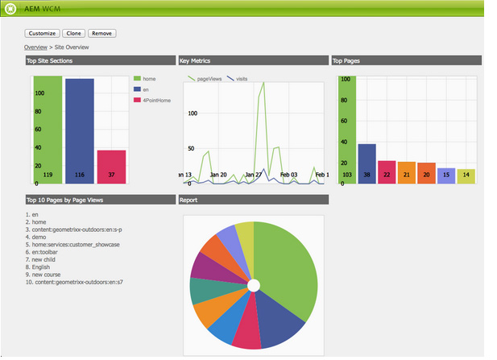
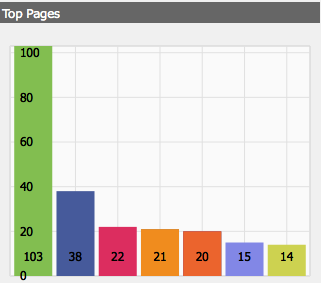
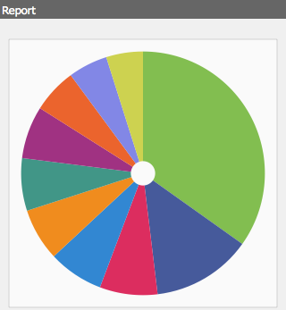

# 대시보드{#dashboards}

>[!CAUTION]
>
>AEM 6.4가 확장 지원이 종료되었으며 이 설명서는 더 이상 업데이트되지 않습니다. 자세한 내용은 [기술 지원 기간](https://helpx.adobe.com/kr/support/programs/eol-matrix.html). 지원되는 버전 찾기 [여기](https://experienceleague.adobe.com/docs/).

AEM을 사용할 때 다양한 유형(예: 페이지, 자산)의 많은 컨텐츠를 관리할 수 있습니다. AEM 대시보드는 통합 데이터를 표시하는 페이지를 정의하는 사용하기 쉽고 사용자 지정 가능한 방법을 제공합니다.

>[!NOTE]
>
>AEM 대시보드는 사용자별로 만들어지므로 사용자는 자신의 대시보드에만 액세스할 수 있습니다.
>
>
>하지만, [대시보드 템플릿](#creating-a-dashboard-template) 일반적인 구성 및 대시보드 레이아웃을 공유하는 데 사용할 수 있습니다.



## 대시보드 관리 {#administering-dashboards}

### 대시보드 만들기 {#creating-a-dashboard}

새 대시보드를 만들려면 다음과 같이 진행하십시오.

1. 에서 **도구** 섹션을 클릭합니다. **구성 콘솔**.

1. 트리에서 Double-Click **대시보드**.

1. 클릭 **새 대시보드**.

1. 을(를) 입력합니다 **제목** (예: 내 대시보드) 및 **이름**.

1. **만들기**&#x200B;를 클릭합니다.

### 대시보드 복제 {#cloning-a-dashboard}

다른 보기의 콘텐츠에 대한 정보를 빠르게 보기 위한 여러 대시보드를 원할 수 있습니다. 새 대시보드를 만드는 데 도움이 되도록 AEM에서는 기존 대시보드를 복제하는 데 사용할 수 있는 복제 기능을 제공합니다. 대시보드를 복제하려면 다음과 같이 진행하십시오.

1. 에서 **도구** 섹션을 클릭합니다. **구성 콘솔**.

1. 트리에서 **대시보드**.
1. 복제할 대시보드를 클릭합니다.

1. 클릭 **복제**.

1. 을(를) 입력합니다 **이름** 새 대시보드

### 대시보드 제거 {#removing-a-dashboard}

1. 에서 **도구** 섹션을 클릭합니다. **구성 콘솔**.

1. 트리에서 **대시보드**.
1. 삭제할 대시보드를 클릭합니다.

1. **제거**&#x200B;를 클릭합니다.

1. **예**&#x200B;를 클릭하여 확인합니다.

## 대시보드 구성 요소 {#dashboard-components}

### 개요 {#overview}

대시보드 구성 요소는 일반적인 구성 요소에 불과합니다 [AEM 구성 요소](/help/sites-developing/developing-components-samples.md). 이 섹션에서는 AEM과 함께 제공되는 보고 구성 요소에 대해 설명합니다.

### Web Analytics 보고 구성 요소 {#web-analytics-reporting-components}

AEM은 의 여러 지표를 렌더링하는 구성 요소 세트와 함께 제공합니다. [SiteCatalyst](/help/sites-administering/adobeanalytics.md) 데이터. 이러한 구성 요소는 사이드 킥의 **대시보드** 섹션을 참조하십시오.

각 보고 구성 요소에서는 세 개 이상의 탭을 제공합니다.

* **기본**: 에는 기본 구성이 포함되어 있습니다.

* **보고서:** 각 보고서별 구성을 포함합니다.
* **스타일**: 차트 크기 및 여백과 같은 스타일 지정 구성을 포함합니다.

보고 구성 요소는 대시보드를 빠르게 설정하는 데 도움이 되는 기본 구성으로 초기화됩니다.

#### 기본 구성 {#basic-configuration}

다음 **기본** 탭에서는 다음 구성 항목에 액세스할 수 있습니다.

**제목** 대시보드에 표시되는 제목입니다.

**요청 유형** 데이터를 요청하는 방법입니다.

**SiteCatalyst 구성(선택 사항)** SiteCatalyst에 연결하는 데 사용할 구성입니다. 제공되지 않을 경우 구성은 대시보드 페이지(페이지 속성을 통해)에서 구성된 것으로 가정합니다.

**보고서 세트 ID(선택 사항)** 그래프를 생성하는 데 사용할 SiteCatalyst 보고서 세트입니다.

#### 보고서 구성 {#report-configuration}

웹 통계를 표시하려면 가져올 데이터의 날짜 범위를 정의해야 합니다. 다음 **보고서** 탭에는 해당 범위를 정의하는 두 개의 필드가 있습니다.

>[!NOTE]
>
>날짜 범위를 크게 설정하면 대시보드의 응답성이 줄어들 수 있습니다.

**일자: 부터** 데이터를 가져오는 절대 또는 상대적 날짜입니다.

**종료 날짜** 데이터를 가져오는 절대 또는 상대적 날짜입니다.

각 구성 요소는 특정 설정도 정의합니다.

#### 초과 근무 보고서 {#overtime-report}


**날짜 세부기간** X축의 시간 단위(예: 일, 시간)입니다.

**지표** 표시할 이벤트 목록입니다.

**요소** 그래프에서 지표 데이터를 분류하는 요소 목록입니다.

#### 등급 목록 보고서 {#ranked-list-report}


**요소** 그래프에서 지표 데이터를 분류하는 요소입니다.

**지표** 표시할 이벤트입니다.

**아니요. 상위 항목** 보고서에 의해 표시되는 항목 수입니다.

#### 등급 보고서 {#ranked-report}



**지표** 표시할 이벤트입니다.

**요소** 그래프에서 지표 데이터를 분류하는 요소입니다.

#### 인기 사이트 섹션 보고서 {#top-site-section-report}

이 구성 요소는 다음 구성에 따라 웹 사이트의 더 많은 방문 섹션을 표시하는 그래프를 표시합니다.


**아니요. 상위 항목** 보고서에 표시되는 섹션의 수입니다.

#### 트렌드 보고서 {#trended-report}



**날짜 세부기간** X축의 시간 단위(예: 일, 시간)입니다.

**지표** 표시할 이벤트입니다.

**요소** 그래프에서 지표 데이터를 분류하는 요소입니다.

## 대시보드 확장 {#extending-dashboard}

### 개요 {#overview-1}

대시보드는 일반적인 페이지( `cq:Page`). 따라서 모든 구성 요소를 사용하여 대시보드를 조합할 수 있습니다.

기본 구성 요소 그룹이 있습니다 `Dashboard` 기본적으로 템플릿에서 활성화된 analytics 보고 구성 요소 포함.

### 대시보드 템플릿 만들기 {#creating-a-dashboard-template}

템플릿은 새 대시보드의 기본 컨텐츠를 정의합니다. 여러 유형의 대시보드를 만드는 데 여러 개의 템플릿을 사용할 수 있습니다.

대시보드 템플릿은 아래에 저장된다는 점을 제외하고 다른 페이지 템플릿과 유사하게 만들어집니다 `/libs/cq/dashboards/templates/`. 자세한 내용은 [컨텐츠 페이지 템플릿 만들기](/help/sites-developing/website.md#creating-the-contentpage-template) 섹션을 참조하십시오.

>[!NOTE]
>
>대시보드 템플릿은 사용자 간에 공유됩니다.

### 대시보드 구성 요소 개발 {#developing-a-dashboard-component}

대시보드 구성 요소를 개발하는 것은 일반 AEM 구성 요소를 만드는 것으로 이루어집니다. 이 섹션에서는 기여자의 상위 10개를 표시하는 구성 요소의 예를 설명합니다.


상위 작성자 구성 요소는 저장소에 저장됩니다. `/apps/geometrixx-outdoors/components/reporting` 및 은 로 구성됩니다.

1. a `jsp` jcr 데이터를 읽고 정의하는 파일 `html` 자리 표시자입니다.

1. 하나를 포함하는 클라이언트 측 라이브러리 `js` 데이터를 가져오고 순서를 지정한 다음 `html` 자리 표시자입니다.


다음 Javascript 파일은 `geout.reporting.topauthors` [클라이언트 라이브러리](/help/sites-developing/clientlibs.md) 를 구성 요소 자체의 하위로 지정합니다.

다음 [QueryBuilder](/help/sites-developing/querybuilder-api.md) 이(가) 읽을 리포지토리를 쿼리하는 데 사용됩니다 `cq:AuditEvent` 노드 아래에 나열됩니다. 쿼리 결과는 작성 기여도가 추출되는 JSON 개체입니다.

#### top_authors.js {#top-authors-js}

```
$.ajax({
  url: "/bin/querybuilder.json",
  cache: false,
  data: {
       "orderby": "cq:time",
       "orderby.sort": "desc",
       "p.hits": "full",
       "p.limit": 100,
       "path": "/var/audit/com.day.cq.wcm.core.page/",
       "type": "cq:AuditEvent"
   },
  dataType: "json"     
}).done(function( res ) {
    var authors = {};
    // from JSON to Object
    for(var r in res.hits) {
        var userId = res.hits[r].userId;
        if(userId == undefined) {
            continue;
        }
        var auth = authors[userId] || {userId : userId};
        auth.contrib = (auth.contrib || 0) +1;
        
        authors[userId] = auth;
    }
    
    // order by contribution
    var orderedByContrib = [];
    for(var a in authors) {
        orderedByContrib.push(authors[a]);
    }
    orderedByContrib.sort(function(a,b){return b.contrib - a.contrib});
    
    // produce the list
    for (var i=0, tot=orderedByContrib.length; i < tot; i++) {
        var current = orderedByContrib[i];
        $("<div> #" + (i + 1) +" "+ current.userId + " (" + current.contrib +" contrib.)</div>").appendTo("#authors-list");

    }
});  
```

다음 `JSP` 둘 다 포함 `global.jsp` 및 `clientlib`.

#### top_authors.jsp {#top-authors-jsp}

```java
<%@page session="false" contentType="text/html; charset=utf-8" %><%
%><%
%><%@include file="/libs/foundation/global.jsp" %><%
%>
<ui:includeClientLib categories="geout.reporting.topauthors" />
<%
String reportletTitle = properties.get("title", "Top Authors");
%>
<html>
     <h3><%=xssAPI.encodeForHTML(reportletTitle) %></h3>
     <div id="authors-list"></div>
</html>
```
