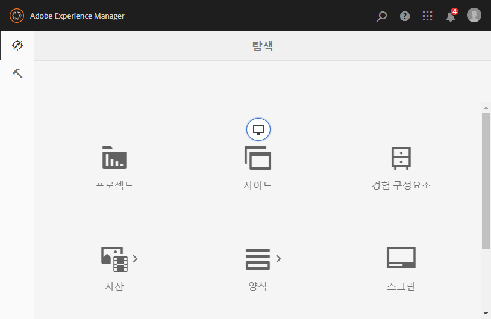

# Admin Console{#admin-consoles}

기본적으로 관리 콘솔을 통해 클래식 UI로 전환하는 기능이 비활성화되었습니다. 따라서 클래식 UI에 액세스할 수 있도록 허용하면서 특정 콘솔 아이콘 위에 마우스를 올려 놓을 때 표시되는 팝업 아이콘이 더 이상 표시되지 않습니다.

`/libs/cq/core/content/nav`에 클래식 UI 버전이 있는 모든 콘솔은 마우스를 올려 놓을 때 콘솔 아이콘 위에 **클래식 UI** 옵션이 다시 표시되도록 개별적으로 다시 활성화할 수 있습니다.

이 예에서는 사이트 콘솔에 대한 클래식 UI를 다시 활성화합니다.

1. CRXDE Lite을 사용하여 클래식 UI를 다시 활성화할 관리 콘솔에 해당하는 노드를 찾습니다. 다음 항목에서 찾을 수 있습니다.

   `/libs/cq/core/content/nav`

   예

   [ `http://localhost:4502/crx/de/index.jsp#/libs/cq/core/content/nav`](http://localhost:4502/crx/de/index.jsp#/libs/cq/core/content/nav)

1. 클래식 UI를 다시 활성화할 콘솔에 해당하는 노드를 선택합니다. 예를 들어 사이트 콘솔에 대한 클래식 UI를 다시 활성화합니다.

   `/libs/cq/core/content/nav/sites`

1. **오버레이 노드** 옵션을 사용하여 오버레이를 만듭니다.예를 들면 다음과 같습니다.

   * **경로**: `/apps/cq/core/content/nav/sites`
   * **오버레이 위치**: `/apps/`
   * **노드 유형 일치**:active(확인란 선택)

1. 오버레이된 노드에 다음 부울 속성을 추가합니다.

   `enableDesktopOnly = {Boolean}true`

1. **클래식 UI** 옵션은 관리 콘솔에서 팝오버 옵션으로 다시 사용할 수 있습니다.

   

클래식 UI 버전에 대한 액세스를 다시 활성화할 모든 콘솔에 대해 이 단계를 반복합니다.
