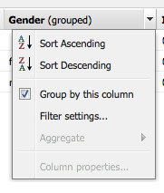
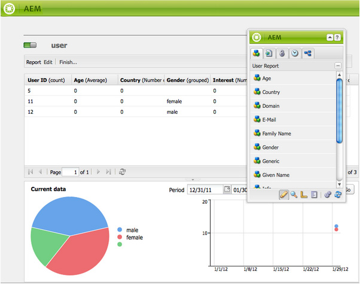
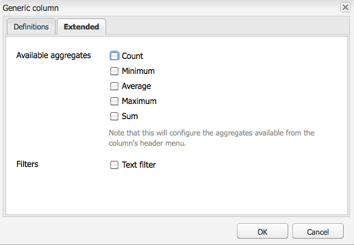
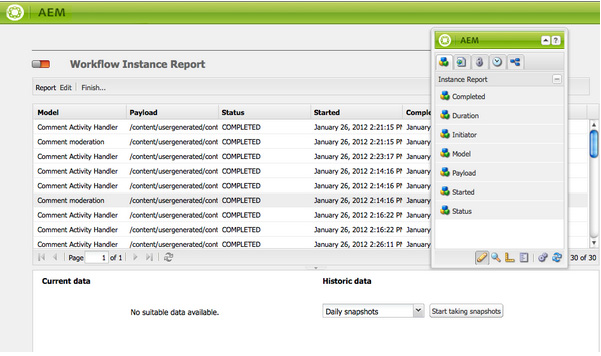

# 보고 {#reporting}

인스턴스의 상태를 모니터링하고 분석하는 데 도움이 되도록 AEM에서는 개별 요구 사항에 맞게 구성할 수 있는 기본 보고서 선택을 제공합니다.

* [구성 요소 보고서](#component-report)
* [디스크 사용량](#disk-usage)
* [상태 확인](#health-check)
* [페이지 활동 보고서](#page-activity-report)
* [사용자 생성 콘텐츠 보고서](#user-generated-content-report)
* [사용자 보고서](#user-report)
* [워크플로우 상속 보고서](#workflow-instance-report)
* [워크플로우 보고서](#workflow-report)

모든 보고서는 **도구** 콘솔에서 액세스할 수 있습니다. 왼쪽 창에서 **보고서를** 선택한 다음 오른쪽 창에서 필요한 보고서를 두 번 클릭하여 보고/또는 구성할 수 있도록 엽니다.

보고서의 새 인스턴스는 **도구** 콘솔에서 만들 수도 있습니다. 왼쪽 창에서 **보고서** 를 선택한 다음 도구 **모음에서 새로 만들기..** .를 선택합니다. 제목 **및** 이름 **을**&#x200B;정의하고 필요한 보고서 유형을 선택한 다음 만들기를 **클릭합니다**. 새 보고서 인스턴스가 목록에 나타납니다. 이 아이콘을 두 번 클릭하여 연 다음, 사이드 킥에서 구성 요소를 드래그하여 첫 번째 열을 만들고 보고서 정의를 시작합니다.

>[!NOTE]
>
>기본적으로 제공되는 표준 AEM 보고서 외에도 완전히 새로운 보고서를 [개발할 수 있습니다](/help/sites-developing/dev-reports.md).

## 보고서 사용자 지정 기본 사항 {#the-basics-of-report-customization}

사용할 수 있는 보고서 형식은 다양합니다. 다음 보고서에서는 모두 다음 섹션에 자세히 설명된 대로 사용자 정의할 수 있는 열을 사용합니다.

* [구성 요소 보고서](#component-report)
* [페이지 활동 보고서](#page-activity-report)
* [사용자 생성 콘텐츠 보고서](#user-generated-content-report)
* [사용자 보고서](#user-report)
* [워크플로우 상속 보고서](#workflow-instance-report)

>[!NOTE]
>
>다음 보고서는 각각 고유한 형식 및 사용자 지정을 가집니다.
>
>
>* [상태 확인은](#health-check) 선택 필드를 사용하여 보고하려는 데이터를 지정합니다.
>* [디스크 사용량](#disk-usage) 링크를 사용하여 저장소 구조를 드릴다운합니다.
>* [워크플로우 보고서는](/help/sites-administering/reporting.md#workflow-report) 인스턴스에서 실행되는 워크플로우에 대한 개요를 제공합니다.

>
>
따라서 열 구성에 대한 다음 절차는 적합하지 않습니다. 자세한 내용은 개별 보고서 설명을 참조하십시오.

### 데이터 열 선택 및 배치 {#selecting-and-positioning-the-data-columns}

표준 또는 사용자 지정된 보고서에 열을 추가하거나, 보고서에 위치를 변경하거나, 보고서에서 제거할 수 있습니다.

사이드 킥의 **구성 요소** 탭(보고서 페이지에서 사용 가능)에는 열로 선택할 수 있는 모든 데이터 카테고리가 나열됩니다.

데이터 선택을 변경하려면 다음을 수행하십시오.

* 새 열을 추가하려면 사이드 킥에서 필요한 구성 요소를 끌어 원하는 위치에 놓습니다.

   * 녹색 확인 표시는 위치가 유효함을 나타내고 화살표 쌍은 위치가 위치할 위치를 정확히 나타냅니다
   * 위치가 잘못된 시점을 나타내는 빨간색 이동 금지 기호가 표시됩니다.

* 열을 이동하려면 헤더를 클릭하고 누른 상태에서 새 위치로 드래그합니다
* 열을 제거하려면 열 제목을 클릭하고, 길게 누른 상태에서 보고서 헤더 영역으로 드래그합니다(빨간색 빼기 기호는 위치가 유효하지 않음을 나타냅니다). 마우스 버튼을 놓으면 구성 요소 삭제 대화 상자가 열삭제 확인을 요청합니다.

### 열 드롭다운 메뉴 {#column-drop-down-menu}

보고서의 각 열에는 드롭다운 메뉴가 있습니다. 이렇게 하면 마우스 커서를 열 제목 셀 위로 가져가면 표시됩니다.

제목 셀의 맨 오른쪽에 화살표 머리글이 나타납니다( [현재 정렬 메커니즘을 나타내는 제목 텍스트 오른쪽에 있는 화살표 머리부분과 혼동하지 마십시오](#sorting-the-data)).

메뉴에서 사용할 수 있는 옵션은 열의 구성(프로젝트 개발 도중)에 따라 다르며, 잘못된 옵션은 회색으로 표시됩니다.

### 데이터 정렬 {#sorting-the-data}

데이터는 다음 중 하나를 사용하여 특정 열에 따라 정렬할 수 있습니다.

* 해당 열 헤더를 클릭합니다. 정렬은 제목 텍스트 바로 옆에 있는 화살표 헤드로 표시되는 오름차순과 내림차순 간에 전환됩니다
* 열의 [드롭다운 메뉴를](#column-drop-down-menu) 사용하여 **오름차순** 정렬 또는 내림차순 **정렬**&#x200B;중 하나를선택합니다. 제목 텍스트 바로 옆에 화살표가 표시됩니다.

### 그룹 및 현재 데이터 차트 {#groups-and-the-current-data-chart}

적절한 열의 경우 **열의 드롭다운 메뉴에서 이 열** 기준 [으로 그룹을 선택할 수 있습니다](#column-drop-down-menu). 이렇게 하면 해당 열 내의 서로 다른 각 값에 따라 데이터가 그룹화됩니다. 그룹화할 열을 두 개 이상 선택할 수 있습니다. 열의 데이터가 부적절한 경우 옵션이 회색으로 표시됩니다. 즉, 모든 항목은 고유하며 사용자 보고서의 사용자 ID 열과 같이 어떠한 그룹도 만들 수 없습니다.

하나 이상의 열이 그룹화된 후 이 그룹화에 따라 **현재 데이터** 파이 차트가 생성됩니다. 여러 열을 그룹화하는 경우 차트에도 표시됩니다.

원형 차트 위로 커서를 이동하면 해당 세그먼트에 대해 집계된 값이 표시됩니다. 현재 열에 정의된 합계를 사용합니다. 예: count, minimum, average 등

### 필터 및 집계 {#filters-and-aggregates}

적절한 열에서 **필터 설정** 및/또는 **집계를** 열 [의 드롭다운 메뉴에서 구성할 수도](#column-drop-down-menu)있습니다.

#### 필터 {#filters}

필터 설정을 사용하면 표시할 항목의 기준을 지정할 수 있습니다. 사용 가능한 연산자는 다음과 같습니다.

* `contains`
* `equals`

필터를 설정하려면

1. 드롭다운 목록에서 원하는 연산자를 선택합니다.
1. 필터링할 텍스트를 입력합니다.
1. 적용을 **클릭합니다**.

필터를 비활성화하려면

1. 필터 텍스트를 제거합니다.
1. 적용을 **클릭합니다**.

#### 집계 {#aggregates}

집계 방법을 선택할 수도 있습니다(선택한 열에 따라 달라질 수 있음).

### 열 속성 {#column-properties}

이 옵션은 [사용자 보고서](#generic-column) 에서 일반 열을 [사용한 경우에만 사용할 수 있습니다](#user-report).

### 내역 데이터 {#historic-data}

시간의 경과에 따른 데이터의 변경 차트는 **기록 데이터**&#x200B;아래에 표시될 수 있습니다. 이는 주기적으로 촬영되는 스냅샷에서 비롯됩니다.

데이터는 다음과 같습니다.

* 사용 가능한 경우 첫 번째 정렬 열, 그렇지 않은 경우 첫 번째(그룹화되지 않은) 열
* 적절한 열로 그룹화됨

보고서를 생성할 수 있습니다.

1. 필요한 **열에 그룹화** 설정을 참조하십시오.
1. **구성을 편집하여** 스냅샷 생성 빈도를 정의합니다. 시간별 또는 일별
1. **완료.** . 스냅샷 수집을 시작하는 정의입니다.

   왼쪽 상단에 있는 빨간색/녹색 슬라이더 버튼은 스냅샷이 수집되고 있음을 나타냅니다.

결과 차트는 오른쪽 하단에 표시됩니다.

데이터 수집이 시작되면 다음을 선택할 수 있습니다.

* **기간**

   보고서 데이터를 표시할 시작 날짜와 종료 날짜를 선택할 수 있습니다.

* **간격**

   보고서의 비율 및 집계에 대해 월, 주, 일, 시간을 선택할 수 있습니다.

   예를 들어 2011년 2월에 일일 스냅샷을 사용할 수 있는 경우

   * 간격을 로 설정하면 각 스냅샷 `Day`이 차트에 단일 값으로 표시됩니다.
   * 간격을 로 설정하면 2월 `Month`의 모든 스냅샷이 단일 값으로 집계됩니다(차트에 단일 &quot;점&quot;으로 표시됨).

요구 사항을 선택한 다음 **이동을** 클릭하여 보고서에 적용합니다. 추가 스냅샷이 생성된 후 디스플레이를 업데이트하려면 **이동을** 다시 클릭합니다.

스냅샷을 수집하는 경우 다음을 수행할 수 있습니다.

* 컬렉션 **을 다시 초기화하려면 마침..** .

   **보고서 구조(예: 보고서에 지정된 열, 그룹화되고 정렬되고 필터링된 열 등)를 &quot;중단&quot;으로 완료합니다** . 스냅샷을 촬영하기 시작합니다.

* [ **편집** ] 대화 상자 **를** 열어 필요에 따라 수집을 종료할 데이터 스냅샷없음을 선택합니다.

   **편집만** 하면 스냅샷 촬영이 켜지거나 꺼집니다. 스냅샷 찍기가 다시 켜지면 추가 스냅샷을 촬영하기 위해 마지막으로 완료되었을 때 보고서 상태를 사용합니다.

>[!NOTE]
>
>스냅샷은 경로 `/var/reports/...` 의 나머지가 보고서가 끝날 때 생성된 각 보고서 및 ID의 경로를 미러링하는 위치에 저장됩니다.
>
>
>이러한 인스턴스가 더 이상 필요하지 않다고 완전히 확신하는 경우 이전 스냅샷을 수동으로 제거할 수 있습니다.

>[!NOTE]
>
>사전 구성된 보고서는 성능이 높지 않지만 프로덕션 환경에서 일별 스냅샷을 사용하는 것이 좋습니다. 웹 사이트에 활동이 많지 않은 시간에 이러한 일일 스냅샷을 실행할 수 있는 경우; CQ일 보고 구성 `Daily snapshots (repconf.hourofday)` 매개 변수를 사용하여 **정의할 수 있습니다**. 이 [구성 방법에 대한 자세한 내용은 OSGI](/help/sites-deploying/configuring-osgi.md) 구성을 참조하십시오.

#### 표시 제한 {#display-limits}

선택한 기간에 대한 결과 수에 따라 설정할 수 있는 제한으로 인해 내역 데이터 보고서가 약간 변경될 수도 있습니다.

각 가로 선은 일련의 행이라고 하며(차트 범례의 항목에 해당함) 점의 각 세로 열은 집계된 스냅샷을 나타냅니다.

오랜 시간 동안 차트를 정리하기 위해 설정할 수 있는 제한이 있습니다. 표준 보고서의 경우 다음과 같습니다.

* 수평 시리즈 - 기본값과 시스템 최대값 모두 `9`

* 세로 집계 스냅샷 - 기본값은 `35` (가로 시리즈당)

따라서 (적절한) 제한이 초과될 경우

* 점이 표시되지 않음
* 내역 데이터 차트의 범례에는 현재 데이터 차트의 항목 수가 다르게 표시될 수 있습니다

사용자 지정된 보고서는 모든 시리즈에 **대한** 합계 값을 표시할 수도 있습니다. 이 항목은 일련의(범례에 있는 가로 행 및 항목)으로 표시됩니다.

>[!NOTE]
>
>사용자 지정된 보고서의 경우 제한을 다르게 설정할 수 있습니다.

### Edit (Report) {#edit-report}

[ **편집** ] 단추를 클릭하면 [보고서 **편집] 대화 상자가** 열립니다.

이전 데이터에 대한 스냅샷을 수집하는 기간이 정의되는 한 [위치](#historic-data) 지만 다양한 다른 설정도 정의할 수 있습니다.

* **제목**

   자신의 제목을 정의할 수 있습니다.

* **설명**

   자신만의 설명을 정의할 수 있습니다.

* **루트 경로** (*특정 보고서에만 활성화*)

   보고서를 저장소의 (하위) 섹션으로 제한하려면 이 아이콘을 사용합니다.

* **보고서 처리**

   * **자동으로 데이터 새로 고침**

      보고서 정의를 업데이트할 때마다 보고서 데이터가 새로 고쳐집니다.

   * **수동으로 데이터 새로 고침**

      이 옵션을 사용하면 대량의 데이터가 있을 때 자동 새로 고침 작업으로 인해 발생하는 지연을 방지할 수 있습니다.

      이 옵션을 선택하면 보고서 구성의 모든 부분이 변경될 때 보고서 데이터를 수동으로 새로 고쳐야 합니다. 또한 구성을 변경하면 보고서 테이블이 지워집니다.

      이 옵션을 선택하면 데이터 **[로드](#load-data)**단추가 표시됩니다(보고서의&#x200B;**편집**옆).**데이터**로드 시 데이터가 로드되고 표시된 보고서 데이터가 새로 고쳐집니다.

* **스냅샷**&#x200B;스냅샷 생성 빈도를 정의할 수 있습니다. 일별, 시간별 또는 전혀 그렇지 않습니다.

### 데이터 로드 {#load-data}

데이터 **로드** 버튼은 **편집에서 수동으로 데이터** 새로 고침을 선택한 경우에만 **[표시됩니다](#edit-report)**.

데이터 **로드를** 클릭하면 데이터가 다시 로드되고 표시되는 보고서가 업데이트됩니다.

데이터를 수동으로 새로 고치도록 선택하면 다음과 같은 내용이 표시됩니다.

1. 보고서 구성을 변경하면 보고서 데이터 테이블이 지워집니다.

   예를 들어 열의 정렬 메커니즘을 변경하는 경우 데이터가 표시되지 않습니다.

1. 보고서 데이터를 다시 표시하려면 데이터 **로드를** 클릭하여 데이터를 다시 로드해야 합니다.

### Finish (report) {#finish-report}

보고서를 **마쳤을** 때:

* 해당 시점 *의 보고서 정의는 스냅샷을 촬영하는 데* 사용됩니다(그런 다음 스냅샷과 분리되므로 보고서 정의를 계속 작업할 수 있습니다).
* 기존 스냅샷이 제거됩니다.
* 내역 데이터에 대해 새 스냅숏이 [수집됩니다](#historic-data).

이 대화 상자를 사용하면 결과 보고서의 제목과 설명을 정의하거나 업데이트할 수 있습니다.

## 보고서 유형 {#report-types}

### 구성 요소 보고서 {#component-report}

구성 요소 보고서는 웹 사이트에서 구성 요소를 사용하는 방법에 대한 정보를 제공합니다.

[다음에 대한 정보](#selecting-and-positioning-the-data-columns) 열:

* 작성
* 구성 요소 경로
* 구성 요소 유형
* 마지막 수정 날짜
* 페이지

예를 들어 다음과 같이 볼 수 있습니다.

* 어느 구성 요소가 사용되는 위치에 있습니까?

   예를 들어 테스트 시 유용합니다.

* 특정 구성 요소의 인스턴스가 배포되는 방법입니다.

   특정 페이지(예: &quot;heavy pages&quot;)에 성능 문제가 발생했습니다.

* 자주/덜 자주 변경되는 사이트의 일부분을 확인합니다.
* 시간 경과에 따라 페이지 컨텐츠가 어떻게 향상되는지 살펴보십시오.

모든 구성 요소, 제품 표준 및 프로젝트별 포함 사용자는 **편집** 대화 상자를 **사용하여 보고서의 시작점을 정의하는** 루트 경로를설정할 수도 있습니다. 해당 루트 아래의 모든 구성 요소는 보고서에 고려됩니다.

 

### 디스크 사용량 {#disk-usage}

디스크 사용량 보고서는 저장소 내에 저장된 데이터에 대한 정보를 보여줍니다.

보고서는 저장소의 루트( / )에서 시작됩니다. 특정 분기를 클릭하여 저장소 내에서 드릴다운할 수 있습니다(현재 경로가 보고서 제목에 반영됨).

### Health Check {#health-check}

이 보고서는 현재 요청 로그를 분석합니다.

`<cq-installation-dir>/crx-quickstart/logs/request.log`\
지정된 기간 내에 가장 비싼 요청을 식별하는 데 도움이 됩니다.

보고서를 생성하려면 다음을 지정할 수 있습니다.

* **기간(시간)**

   분석할 시간(과거)입니다.

   기본값: `24`

* **최대. 결과**

   출력 라인의 최대 수입니다.

   기본값: `50`

* **최대. 요청**

   분석할 최대 요청 수입니다.

   기본값: `-1` (all)

* **이메일 주소**

   결과를 이메일 주소로 보냅니다.

   선택 사항; 기본값: 비어 있음

* **매일(hh:mm) 실행**

   보고서를 매일 자동으로 실행할 시간을 지정합니다.

   선택 사항; 기본값: 비어 있음

### 페이지 활동 보고서 {#page-activity-report}

페이지 활동 보고서에는 페이지와 그에 대해 수행된 작업이 나열됩니다.

[다음에 대한 정보](#selecting-and-positioning-the-data-columns) 열:

* 페이지
* 시간
* 유형
* 사용자

다음을 모니터링할 수 있습니다.

* 최신 수정 내용
* 특정 페이지에서 작업하는 작성자입니다.
* 최근에 수정되지 않은 페이지이므로 작업이 필요할 수 있습니다.
* 가장 자주/가장 적게 변경된 페이지.
* 가장 활성화된 사용자/가장 낮은 사용자

페이지 활동 보고서는 감사 로그에서 모든 정보를 가져옵니다. 기본적으로 루트 경로는 감사 로그에 구성됩니다 `/var/audit/com.day.cq.wcm.core.page`.

### 사용자 생성 콘텐츠 보고서 {#user-generated-content-report}

이 보고서는 사용자가 생성한 컨텐츠에 대한 정보를 제공합니다. 댓글, 평점 또는 포럼과 관련됩니다.

[다음에 대한 정보](#selecting-and-positioning-the-data-columns) 열:

* 날짜
* IP 주소
* 페이지
* 레퍼러
* 유형
* 사용자 ID

다음을 수행할 수 있습니다.

* 가장 많은 댓글을 받은 페이지를 확인할 수 있습니다.
* 특정 사이트 방문자가 떠나는 모든 댓글에 대한 개요를 살펴볼 수 있습니다. 아마도 문제가 관련이 있을 수 있습니다.
* 새로운 컨텐츠가 페이지에서 주석이 작성되는 경우를 모니터링하여 주석을 자극하는지 여부를 판단합니다.

### 사용자 보고서 {#user-report}

이 보고서는 계정 및/또는 프로필을 등록한 모든 사용자에 대한 정보를 제공합니다. 조직 내의 작성자와 외부 방문자를 모두 포함할 수 있습니다.

[다음에 대한 정보](#selecting-and-positioning-the-data-columns) 열(사용 가능한 경우):

* 연령
* 국가
* 도메인
* 이메일
* 성
* 성별
* [일반](#generic-column)
* 이름
* 정보
* 관심
* 언어
* NTLM 해시 코드
* 사용자 ID

다음을 수행할 수 있습니다.

* 사용자의 인구 분포 보기
* 프로필에 추가한 사용자 정의 필드에 대한 보고서

#### Generic Column {#generic-column}

사용자 **보고서에서 일반** 열을 사용할 수 있으므로 일반적으로 [사용자 프로필에서 사용자 지정 정보에 액세스할 수 있습니다](/help/sites-administering/identity-management.md#profiles-and-user-accounts). 예를 들어 프로필 정의에 필드 [추가에서 자세히 설명된 즐겨찾기 색상을 참조하십시오](/help/sites-administering/identity-management.md#adding-fields-to-the-profile-definition).

다음 중 하나를 수행하면 일반 열 대화 상자가 열립니다.

* 사이드 킥에서 범용 구성 요소를 보고서로 드래그합니다.
* 기존 일반 열에 대한 열 속성을 선택합니다.

From the **Definitions** tab you can define:

* **제목**

   일반 열에 대한 고유한 제목.

* **속성**

   저장소에 저장된 속성 이름(일반적으로 사용자의 프로필 내에 있음)

* **경로**

   일반적으로 이 속성은 해당 위치에서 가져옵니다 `profile`.

* **유형**

   필드 유형을 `String`, `Number`, `Integer`에서 선택합니다 `Date`.

* **기본 집계**

   하나 이상의 그룹화된 열이 있는 보고서에서 열을 그룹 해제하면 기본적으로 사용되는 집계를 정의합니다. 필요한 집계를 `Count`, `Minimum`, `Average`, `Maximum`에서 선택합니다 `Sum`.

   예를 들어 *필드에* 대한 수는 집계된 상태의 열에 대해 고유한 `String` `String` 값의 수가 표시됨을 의미합니다.

확장 **** 탭에서 사용 가능한 집계 및 필터를 정의할 수도 있습니다.

### 워크플로우 상속 보고서 {#workflow-instance-report}

이를 통해 실행 및 완료된 워크플로우의 개별 인스턴스에 대한 정보를 제공하는 간략한 개요를 알 수 있습니다.

[다음에 대한 정보](#selecting-and-positioning-the-data-columns) 열:

* 완료됨
* 기간
* 개시자
* 모델
* 페이로드
* 시작됨
* 상태

다음을 수행할 수 있습니다.

* 워크플로우의 평균 기간 모니터링; 이러한 문제가 정기적으로 발생하면 워크플로우의 문제를 강조 표시할 수 있습니다.

### 워크플로우 보고서 {#workflow-report}

인스턴스에서 실행되는 워크플로우에 대한 주요 통계를 제공합니다.

## 게시 환경에서 보고서 사용 {#using-reports-in-a-publish-environment}

보고서를 특정 요구 사항에 맞게 구성했으면 활성화를 통해 구성을 게시 환경으로 전송할 수 있습니다.

>[!CAUTION]
>
>게시 환경 **에 대한 내역 데이터** 를 원하는 경우 **페이지를 활성화하기** 전에 작성 환경에 대한 보고서를 마칩니다.

그런 다음

`/etc/reports`

예를 들어, 사용자 생성 컨텐츠 보고서는

`http://localhost:4503/etc/reports/ugcreport.html`

이제 게시 환경에서 수집된 데이터에 대해 보고됩니다.

게시 환경에서는 보고서 구성이 허용되지 않으므로 **편집** 및 **마침** 단추를 사용할 수없습니다. 하지만 스냅샷을 수집하는 경우 **내역 데이터** 보고서 **에** 대해 **기간** 과간격을 선택할 수있습니다.

>[!CAUTION]
>
>이러한 보고서에 대한 액세스는 보안 문제가 될 수 있습니다. 따라서 외부 방문자가 사용할 수 없도록 Dispatcher `/etc/reports` 를 구성하는 것이 좋습니다. 자세한 내용은 [보안 체크리스트를](security-checklist.md) 참조하십시오.

## 보고서 실행에 필요한 권한 {#permissions-needed-for-running-reports}

필요한 권한은 작업에 따라 다릅니다.

* 보고서 데이터는 기본적으로 현재 사용자의 권한을 사용하여 수집됩니다.
* 내역 데이터는 보고서를 완료한 사용자의 권한을 사용하여 수집됩니다.

표준 AEM 설치에서는 보고서에 대해 다음 권한이 사전 설정됩니다.

* **사용자 보고서**

   `user administrators` - 읽기 및 쓰기

* **페이지 활동 보고서**

   `contributors` - 읽기 및 쓰기

* **구성 요소 보고서**

   `contributors` - 읽기 및 쓰기

* **사용자 생성 콘텐츠 보고서**

   `contributors` - 읽기 및 쓰기

* **워크플로우 상속 보고서**

   `workflow-users` - 읽기 및 쓰기

그룹의 모든 구성원은 `administrators` 새 보고서를 만들 수 있는 필요한 권한을 가집니다.
