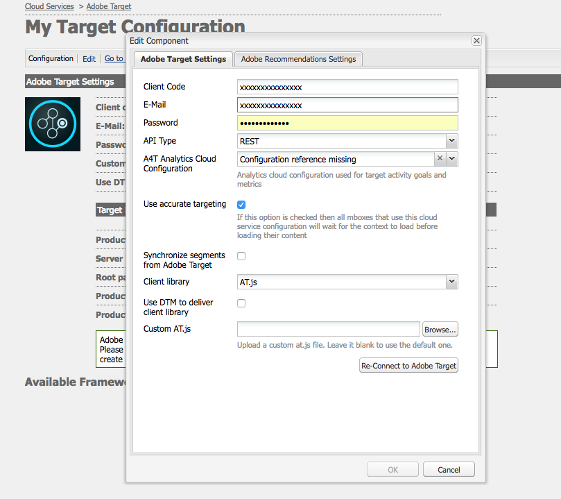
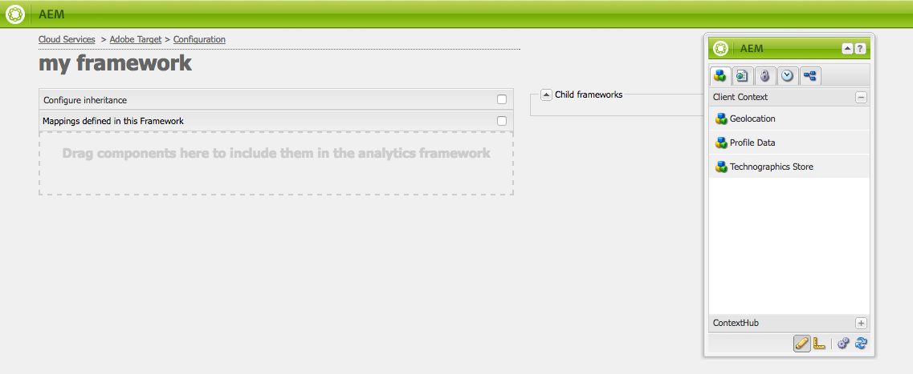

# Adobe Target {#manually-configuring-the-integration-with-adobe-target}과(와) 통합 수동 구성

마법사를 사용할 때 수행한 옵트인 마법사 구성을 수정하거나 마법사를 사용하지 않고 Adobe Target과 수동으로 통합할 수 있습니다.

## 옵트인 마법사 구성 수정 {#modifying-the-opt-in-wizard-configurations}

[AEM을 Adobe Target](/help/sites-administering/target.md)에 통합하는 [옵트인 마법사](/help/sites-administering/opt-in.md)는 프로비전된 Target 구성이라는 Target 클라우드 구성을 자동으로 만듭니다. 또한 마법사는 제공된 Target 프레임워크라는 클라우드 구성에 대한 Target 프레임워크을 만듭니다. 필요한 경우 클라우드 구성 및 프레임워크의 속성을 수정할 수 있습니다.

A4T Analytics Cloud 구성을 구성하여 컨텐츠를 타깃팅할 때 Adobe Target을 보고 소스로 사용하도록 Adobe Target을 구성할 수도 있습니다.

클라우드 구성 및 프레임워크를 찾으려면 **도구** > **배포** > **클라우드**&#x200B;를 통해 **Cloud Services**&#x200B;으로 이동합니다. ([http://localhost:4502/libs/cq/core/content/tools/cloudservices.html](http://localhost:4502/libs/cq/core/content/tools/cloudservices.html))\
Adobe Target 아래에서 **구성 표시**&#x200B;를 클릭하거나 탭합니다.

### 제공된 Target 구성 속성 {#provisioned-target-configuration-properties}

다음 속성 값은 옵트인 마법사가 만드는 제공된 Target 구성 클라우드 구성에서 사용됩니다.

* **클라이언트 코드:** 옵트인 마법사에 입력한 대로
* **이메일:** 옵트인 마법사에 입력한 대로
* **암호:** 옵트인 마법사에 입력한 대로
* **API 유형:** REST
* **Adobe Target에서 세그먼트 동기화:** 선택됨.

* **클라이언트 라이브러리:** mbox.js.
* **DTM을 사용하여 클라이언트 라이브러리 제공:** 선택되지 않음. [DTM](/help/sites-administering/dtm.md) 또는 다른 태그 관리 시스템을 사용하여 mbox.js 또는 AT.js 파일을 호스트하는 경우 이 옵션을 선택합니다. Adobe은 라이브러리를 제공하기 위해 AEM이 아닌 DTM을 사용하는 것이 좋습니다.

* **사용자 지정 mbox.js:** 기본 mbox.js 파일이 사용되도록 지정되지 않았습니다. 필요에 따라 사용할 사용자 지정 mbox.js 파일을 지정합니다. mbox.js를 선택한 경우에만 나타납니다.
* **사용자 지정 AT.js:** None을 지정하여 기본 AT.js 파일이 사용됩니다. 필요에 따라 사용할 사용자 지정 AT.js 파일을 지정합니다. AT.js를 선택한 경우에만 나타납니다.

>[!NOTE]
>
>AEM 6.3에서는 Target 라이브러리 파일 [AT.JS](https://docs.adobe.com/content/help/en/target/using/implement-target/client-side/mbox-implement/mbox-download.html)를 선택할 수 있습니다. 이 파일은 일반적인 웹 구현과 단일 페이지 애플리케이션 모두에 맞게 설계된 Adobe Target용 새 구현 라이브러리입니다.
>
>AT.js는 mbox.js 라이브러리에 대한 다음과 같은 몇 가지 개선 사항을 제공합니다.
>
>* 웹 구현을 위해 페이지 로드 시간 개선
>* 향상된 보안
>* 단일 페이지 애플리케이션을 위한 향상된 구현 옵션
>* AT.js에는 target.js에 포함된 구성 요소가 포함되어 있으므로 더 이상 target.js에 대한 호출이 없습니다.

### 제공된 Target 프레임워크 속성 {#provisioned-target-framework-properties}

옵트인 마법사가 만드는 프로비전된 Target 프레임워크은 프로필 데이터 저장소에서 컨텍스트 데이터를 전송하도록 구성됩니다. 스토어의 연령 및 성별 데이터 항목은 기본적으로 Target으로 전송됩니다. 솔루션을 사용하려면 추가 매개 변수를 전송해야 합니다.

[Target 프레임워크 추가](/help/sites-administering/target-configuring.md#adding-a-target-framework)에 설명된 대로 추가적인 컨텍스트 정보를 Target에 전송하도록 프레임워크를 구성할 수 있습니다.

### A4T Analytics Cloud 구성 구성 {#configuring-a-t-analytics-cloud-configuration}

컨텐츠를 타깃팅할 때 Adobe Analytics을 보고 소스로 사용하도록 Adobe Target을 구성할 수 있습니다.

이렇게 하려면 Adobe Target 클라우드 구성을 연결할 A4T 클라우드 구성을 지정해야 합니다.

1. **AEM 로고** > **도구** > **배포** > **Cloud Services**&#x200B;을 통해 &lt;a0/>Cloud Services **으로 이동합니다.**
1. **Adobe Target** 섹션에서 **지금 구성**&#x200B;을 클릭합니다.
1. Adobe Target 구성에 다시 연결합니다.
1. **A4T Analytics Cloud 구성** 드롭다운 메뉴에서 프레임워크를 선택합니다.

   >[!NOTE]
   >
   >A4T에 대해 활성화된 분석 구성만 사용할 수 있습니다.
   >
   >AEM으로 A4T를 구성할 때 구성 참조 항목이 누락될 수 있습니다. 분석 프레임워크를 선택하려면 다음을 수행합니다.
   > 
   >1. **도구** > **일반** > **CRXDE Lite**&#x200B;으로 이동합니다.
   1. **/libs/cq/analytics/components/testandtargetpage/dialog/items/tab1_general/items/a4tAnalyticsConfig**
   1. **disable** 속성을 **false**&#x200B;로 설정합니다.
   1. **모두 저장**&#x200B;을 탭하거나 클릭합니다.

   

   **확인**&#x200B;을 클릭합니다. Adobe Target으로 컨텐츠를 타깃팅하는 경우 보고서 소스 [를 선택할 수 있습니다](/help/sites-authoring/content-targeting-touch.md).

## Adobe Target {#manually-integrating-with-adobe-target}과 수동으로 통합

옵트인 마법사를 사용하는 대신 Adobe Target과 수동으로 통합할 수 있습니다.

>[!NOTE]
Target 라이브러리 파일 [AT.JS](https://docs.adobe.com/content/help/en/target/using/implement-target/client-side/mbox-implement/mbox-download.html)는 일반적인 웹 구현과 단일 페이지 애플리케이션 모두에 맞게 설계된 Adobe Target의 새로운 구현 라이브러리입니다. Adobe에서는 mbox.js 대신 AT.js를 클라이언트 라이브러리로 사용하는 것이 좋습니다.
AT.js는 mbox.js 라이브러리에 대한 다음과 같은 몇 가지 개선 사항을 제공합니다.
* 웹 구현을 위해 페이지 로드 시간 개선
* 향상된 보안
* 단일 페이지 애플리케이션을 위한 향상된 구현 옵션
* AT.js에는 target.js에 포함된 구성 요소가 포함되어 있으므로 더 이상 target.js에 대한 호출이 없습니다.

**클라이언트 라이브러리** 드롭다운 메뉴에서 AT.js 또는 mbox.js를 선택할 수 있습니다.

### Target 클라우드 구성 만들기 {#creating-a-target-cloud-configuration}

AEM이 Adobe Target과 상호 작용할 수 있도록 하려면 Target 클라우드 구성을 만드십시오. 구성을 만들려면 Adobe Target 클라이언트 코드 및 사용자 자격 증명을 제공합니다.

구성을 여러 AEM 캠페인에 연결할 수 있으므로 Target 클라우드 구성을 한 번만 만듭니다. 여러 개의 Adobe Target 클라이언트 코드가 있는 경우 각 클라이언트 코드에 대해 하나의 구성을 만듭니다.

Adobe Target의 세그먼트를 동기화하도록 클라우드 구성을 구성할 수 있습니다. 동기화를 활성화하면 클라우드 구성이 저장되자마자 백그라운드에서 Target에서 세그먼트를 가져옵니다.

AEM에서 Target 클라우드 구성을 만들려면 다음 절차를 따르십시오.

1. **AEM 로고** > **도구** > **배포** > **Cloud Services**&#x200B;을 통해 &lt;a0/>Cloud Services **으로 이동합니다.** ([http://localhost:4502/libs/cq/core/content/tools/cloudservices.html](http://localhost:4502/libs/cq/core/content/tools/cloudservices.html))

   **Adobe Marketing Cloud** 개요 페이지가 열립니다.

1. **Adobe Target** 섹션에서 **지금 구성**&#x200B;을 클릭합니다.
1. **구성 만들기** 대화 상자에서 다음을 수행합니다.

   1. 구성에 **제목**&#x200B;을 지정합니다.
   1. **Adobe Target 구성** 템플릿을 선택합니다.
   1. **만들기**&#x200B;를 클릭합니다.

   편집 대화 상자가 열립니다.

   

   >[!NOTE]
   AEM으로 A4T를 구성할 때 구성 참조 항목이 누락될 수 있습니다. 분석 프레임워크를 선택하려면 다음을 수행합니다.
   1. **도구** > **일반** > **CRXDE Lite**&#x200B;으로 이동합니다.
   1. **/libs/cq/analytics/components/testandtargetpage/dialog/items/tab1_general/items/a4tAnalyticsConfig**
   1. **disable** 속성을 **false**&#x200B;로 설정합니다.
   1. **모두 저장**&#x200B;을 탭하거나 클릭합니다.

1. 대화 상자에서 이러한 속성의 값을 제공합니다.

   * **클라이언트 코드**:target 계정 클라이언트 코드
   * **이메일**:target 계정 이메일.
   * **암호**:target 계정 암호입니다.
   * **API 유형**:REST 또는 XML
   * **A4T Analytics Cloud 구성**:타겟 활동 목표 및 지표에 사용되는 Analytics 클라우드 구성을 선택합니다. 컨텐츠를 타깃팅할 때 보고 소스로 Adobe Analytics을 사용하는 경우 이 옵션이 필요합니다. 클라우드 구성이 표시되지 않는 경우 [A4T Analytics Cloud 구성](#configuring-a-t-analytics-cloud-configuration)의 참고 사항을 참조하십시오.

   * **정확한 타깃팅 사용:** 기본적으로 이 확인란이 선택되어 있습니다. 이 옵션을 선택하면 클라우드 서비스 구성이 내용을 로드하기 전에 컨텍스트가 로드될 때까지 대기합니다. 다음 사항에 주의하십시오.
   * **Adobe Target에서 세그먼트 동기화:** AEM에서 사용할 Target에 정의된 세그먼트를 다운로드하려면 이 옵션을 선택합니다. 인라인 세그먼트는 지원되지 않으며 항상 Target의 세그먼트를 사용해야 하므로 API 유형 속성이 REST인 경우 이 옵션을 선택해야 합니다. (&#39;segment&#39;의 AEM 용어는 &#39;audience&#39; Target과 같습니다.)
   * **클라이언트 라이브러리:** mbox.js 또는 AT.js 클라이언트 라이브러리를 원하는지 선택합니다.
   * **DTM을 사용하여 클라이언트 라이브러리**  제공 - DTM 또는 다른 태그 관리 시스템의 AT.js 또는 mbox.js를 사용하려면 이 옵션을 선택합니다. 이 옵션을 사용하려면 [DTM 통합](/help/sites-administering/dtm.md)을 구성해야 합니다. Adobe은 라이브러리를 제공하기 위해 AEM이 아닌 DTM을 사용하는 것이 좋습니다.
   * **사용자 지정 mbox.js**:DTM 상자를 선택하거나 기본 mbox.js를 사용하려면 비워 두십시오. 또는 사용자 지정 mbox.js를 업로드합니다. mbox.js를 선택한 경우에만 나타납니다.
   * **사용자 지정 AT.js**:DTM 상자를 선택하거나 기본 AT.js를 사용하려면 비워 둡니다. 또는 사용자 지정 AT.js를 업로드합니다. AT.js를 선택한 경우에만 나타납니다.

   >[!NOTE]
   기본적으로 Adobe Target 구성 마법사를 선택하면 정확한 타깃팅이 활성화됩니다.
   정확한 타깃팅은 클라우드 서비스 구성이 컨텐츠를 로드하기 전에 컨텍스트가 로드되기를 기다리는 것을 의미합니다. 그 결과, 성과 측면에서, 정확한 타깃팅은 컨텐츠를 로드하기 전에 몇 밀리초의 지연을 만들 수 있습니다.
   작성자 인스턴스에서 항상 정확한 타깃팅을 사용할 수 있습니다. 하지만 게시 인스턴스에서 클라우드 서비스 구성(**http://localhost:4502/etc/cloudservices.html**)의 정확한 타게팅 옆에 있는 확인 표시를 지워 정확한 타게팅을 전체적으로 끌 수 있습니다. 클라우드 서비스 구성의 설정에 관계없이 개별 구성 요소에 대해 정확한 타깃팅을 켜거나 끌 수도 있습니다.
   ***이미***&#x200B;에서 타깃팅된 구성 요소를 만들고 이 설정을 변경하는 경우 변경 내용이 해당 구성 요소에 영향을 주지 않습니다. 해당 구성 요소를 직접 변경해야 합니다.

1. Target과의 연결을 초기화하려면 **Target에 연결**&#x200B;을 클릭합니다. 연결이 성공하면 message** Connection successful**가 표시됩니다. 메시지에서 **확인**&#x200B;을 클릭한 다음 대화 상자에서 **확인**&#x200B;을 클릭합니다.

   Target에 연결할 수 없는 경우 [문제 해결](/help/sites-administering/target-configuring.md#troubleshooting-target-connection-problems) 섹션을 참조하십시오.

### Target 프레임워크 {#adding-a-target-framework} 추가

Target 클라우드 구성을 구성한 후 Target 프레임워크을 추가합니다. 프레임워크는 사용 가능한 [Client Context](/help/sites-administering/client-context.md) 또는 [ContextHub](/help/sites-administering/contexthub-config.md) 구성 요소에서 Adobe Target으로 전송되는 기본 매개 변수를 식별합니다. Target은 매개 변수를 사용하여 현재 컨텍스트에 적용되는 세그먼트를 결정합니다.

단일 Target 구성에 대해 여러 프레임워크를 만들 수 있습니다. 여러 프레임워크는 웹 사이트의 여러 섹션에 대해 다른 매개 변수 세트를 Target으로 보내야 할 때 유용합니다. 전송해야 하는 각 매개 변수 세트에 대한 프레임워크를 만듭니다. 웹 사이트의 각 섹션을 적절한 프레임워크와 연결합니다. 웹 페이지는 한 번에 하나의 프레임워크만 사용할 수 있습니다.

1. Target 구성 페이지에서 사용 가능한 프레임워크 옆에 있는 **+**(더하기 기호)를 클릭합니다.
1. 프레임워크 만들기 대화 상자에서 **제목**&#x200B;을 지정하고 **Adobe Target Framework**&#x200B;을 선택하고 **만들기**&#x200B;를 클릭합니다.

   

   프레임워크 페이지가 열립니다. 사이드 킥은 매핑할 수 있는 [Client Context](/help/sites-administering/client-context.md) 또는 [ContextHub](/help/sites-administering/contexthub-config.md)의 정보를 나타내는 구성 요소를 제공합니다.

   

1. 드롭 대상에 매핑하는 데 사용할 데이터를 나타내는 Client Context 구성 요소를 드래그합니다. 또는 **ContextHub 저장소** 구성 요소를 프레임워크로 드래그합니다.

   >[!NOTE]
   매핑 시 매개 변수는 간단한 문자열을 통해 mbox에 전달됩니다. ContextHub에서 배열을 매핑할 수 없습니다.

   예를 들어 사이트 방문자에 대해 **프로필 데이터**&#x200B;를 사용하여 Target 캠페인을 제어하려면 **프로필 데이터** 구성 요소를 페이지로 드래그합니다. Target 매개 변수에 매핑하는 데 사용할 수 있는 프로필 데이터 변수가 나타납니다.

   

1. 해당 열에서 **공유** 확인란을 선택하여 Adobe Target 시스템에 표시할 변수를 선택합니다.

   

   >[!NOTE]
   매개 변수를 동기화하는 것은 AEM에서 Adobe Target에 이르는 한 방법일 뿐입니다.

프레임워크가 생성됩니다. 프레임워크를 게시 인스턴스에 복제하려면 사이드 킥에서 **프레임워크 활성화** 옵션을 사용합니다.

### 활동을 Target 클라우드 구성과 연결 {#associating-activities-with-the-target-cloud-configuration}

[AEM 활동](/help/sites-authoring/activitylib.md)을(를) Target 클라우드 구성과 연결하면 [Adobe Target](https://docs.adobe.com/content/help/en/target/using/experiences/offers/manage-content.html)에서 활동을 미러링할 수 있습니다.

>[!NOTE]
사용 가능한 활동 유형은 다음 방법으로 결정됩니다.
* Adobe Target에 연결하기 위해 AEM 측에 사용된 Adobe Target 임차인(clientcode)에서 **xt_only** 선택 사항이 활성화되면, AEM에서 XT 활동&#x200B;**만** 만들 수 있습니다.

* Adobe Target 임차인(clientcode)에서 **xt_only** 선택 사항이 활성화되지 **않으면** AEM에서에서 XT 활동과 A/B 활동을 **모두** 만들 수 있습니다.

**추가 참고:** **xt_only** 선택 사항은 특정 Target 임차인(clientcode)에 적용되는 설정이며, Adobe Target에서 직접 수정하는 것만 가능합니다. 이 선택 사항은 AEM에서 활성하거나 비활성화할 수 없습니다.

### Target 프레임워크을 사이트 {#associating-the-target-framework-with-your-site}에 연결

AEM에서 Target 프레임워크을 만든 후 웹 페이지를 프레임워크에 연결합니다. 페이지의 타깃팅된 구성 요소는 추적을 위해 프레임워크 정의 데이터를 Adobe Target으로 보냅니다. ([콘텐츠 타깃팅](/help/sites-authoring/content-targeting-touch.md)을 참조하십시오.)

페이지를 프레임워크와 연결하면 하위 페이지가 연결을 상속합니다.

1. **사이트** 콘솔에서 구성할 사이트로 이동합니다.
1. [빠른 작업](/help/sites-authoring/basic-handling.md#quick-actions) 또는 [선택 모드](/help/sites-authoring/basic-handling.md)를 사용하여 **속성 보기를 선택합니다.**
1. **Cloud Services** 탭을 선택합니다.
1. **편집**&#x200B;을 탭/클릭합니다.
1. **Cloud Service 구성**&#x200B;에서 **구성 추가**&#x200B;를 탭/클릭하고 **Adobe Target**&#x200B;를 선택합니다.

   

1. **구성 참조**&#x200B;에서 원하는 프레임워크를 선택합니다.

   >[!NOTE]
   만들어진 Target 클라우드 구성이 아닌 사용자가 만든 특정 **프레임워크**&#x200B;를 선택해야 합니다.

1. **완료**&#x200B;를 탭/클릭합니다.
1. 웹 사이트의 루트 페이지를 활성화하여 게시 서버에 복제합니다. ([페이지 게시 방법](/help/sites-authoring/publishing-pages.md) 참조)

   >[!NOTE]
   페이지에 첨부한 프레임워크가 아직 활성화되지 않은 경우 마법사를 열어 게시할 수도 있습니다.

## Target 연결 문제 해결 {#troubleshooting-target-connection-problems}

Target에 연결할 때 발생하는 문제를 해결하려면 다음 작업을 수행하십시오.

* 제공하는 사용자 자격 증명이 올바른지 확인하십시오.
* AEM 인스턴스가 Target 서버에 연결할 수 있는지 확인합니다. 예를 들어 방화벽 규칙이 아웃바운드 AEM 연결을 차단하지 않거나 AEM이 필요한 프록시를 사용하도록 구성되어 있는지 확인합니다.
* AEM 오류 로그에서 유용한 메시지를 찾습니다. error.log 파일은 AEM이 설치된 **crx-quickstart/logs** 디렉토리에 있습니다.
* Adobe Target에서 활동을 편집할 때 URL은 localhost를 가리킵니다. AEM 외부 도우미를 올바른 URL로 설정하여 이 문제를 해결하십시오.

