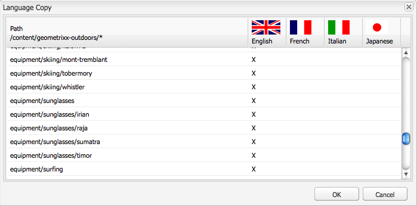

# 클래식 UI를 사용하여 언어 루트 만들기{#creating-a-language-root-using-the-classic-ui}

다음 절차에서는 클래식 UI를 사용하여 사이트의 언어 루트를 만듭니다. 자세한 내용은 [언어 루트 만들기](/help/sites-administering/tc-prep.md#creating-a-language-root)를 참조하십시오.

1. 웹 사이트 콘솔의 웹 사이트 트리에서 사이트의 루트 페이지를 선택합니다. ([http://localhost:4502/siteadmin#](http://localhost:4502/siteadmin#))
1. 사이트의 언어 버전을 나타내는 새 하위 페이지를 추가합니다.

   1. 새로 만들기 > 새 페이지 를 클릭합니다.
   1. 대화 상자에서 제목 및 이름을 지정합니다. 이름은 `<language-code>` 또는 `<language-code>_<country-code>` 형식이어야 합니다(예: en, en_US, en_us, en_GB, en_gb).

      * 지원되는 언어 코드는 ISO-639-1에 따라 소문자, 두 문자 코드입니다
      * 지원되는 국가 코드는 ISO 3166에 따라 소문자 또는 대문자 2자로 된 코드입니다
   1. 템플릿을 선택하고 생성을 누릅니다.

   

1. 웹 사이트 콘솔의 웹 사이트 트리에서 사이트의 루트 페이지를 선택합니다.
1. 도구 메뉴에서 언어 복사를 선택합니다.

   

   언어 복사 대화 상자에는 사용 가능한 언어 버전 및 웹 페이지의 매트릭스가 표시됩니다. 언어 열의 x는 해당 언어로 페이지를 사용할 수 있음을 의미합니다.

   

1. 기존 페이지 또는 페이지 트리를 언어 버전에 복사하려면 언어 열에서 해당 페이지의 셀을 선택합니다. 화살표를 클릭하고 생성할 복사 유형을 선택합니다.

   다음 예에서는 equipment/선글라스/irian 페이지가 프랑스어 버전에 복사됩니다.

   

   | 언어 사본 유형 | 설명 |
   |---|---|
   | auto | 상위 페이지의 동작을 사용합니다 |
   | 무시 | 이 페이지와 해당 하위 페이지의 복사본을 만들지 않습니다. |
   | `<language>+` (예: 프랑스어+) | 페이지와 모든 하위 항목을 해당 언어로 복사합니다. |
   | `<language>` (예: 프랑스어) | 해당 언어의 페이지만 복사합니다. |

1. 확인 을 클릭하여 대화 상자를 닫습니다.
1. 다음 대화 상자에서 예 를 클릭하여 복사본을 확인합니다.
