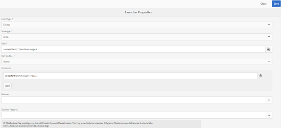

# 자산 워크플로 오프로더{#assets-workflow-offloader}

자산 워크플로우 오프로더를 사용하면 AEM(Adobe Experience Manager) 자산의 여러 인스턴스를 활성화하여 기본(리더) 인스턴스의 처리 부하를 줄일 수 있습니다. 처리 부하가 지시형 인스턴스와 여기에 추가하는 다양한 오프로더(작업자) 인스턴스 간에 배포됩니다. 자산의 처리 부하를 배포하면 AEM Assets에서 자산을 처리하는 효율성과 속도가 높아집니다. 또한 특정 MIME 유형의 자산을 처리하기 위해 전용 리소스를 할당할 수도 있습니다. 예를 들어 토폴로지의 특정 노드를 할당하여 InDesign 자산만 처리할 수 있습니다.

## 오프로더 토폴로지 구성 {#configure-offloader-topology}

Configuration Manager를 사용하여 지시선 인스턴스의 연결 요청에 대해 지시선 인스턴스에 대한 URL과 offloader 인스턴스의 호스트 이름을 추가합니다.

1. AEM 로고를 탭/클릭하고 **도구** > **작업** > **웹 콘솔**&#x200B;을 선택하여 구성 관리자를 엽니다.
1. 웹 콘솔에서 **Sling** > **토폴로지 관리**&#x200B;를 선택합니다.

   

1. 토폴로지 관리 페이지에서 **Configure Discovery.Oak Service** 링크를 탭/클릭합니다.

   

1. 검색 서비스 구성 페이지에서 **토폴로지 커넥터 URL** 필드에 지시자 인스턴스에 대한 커넥터 URL을 지정합니다.

   

1. **토폴로지 커넥터 화이트 리스트** 필드에서 지시자 인스턴스와 연결할 수 있는 오프로더 인스턴스의 IP 주소 또는 호스트 이름을 지정합니다. **저장**&#x200B;을 탭/클릭합니다.

   

1. 지시선 인스턴스에 연결된 오프로더 인스턴스를 보려면 **도구** > **배포** > **토폴로지**&#x200B;로 이동하여 클러스터 보기를 탭/클릭합니다.

## {#disable-offloading} 오프로딩 사용 안 함

1. AEM 로고를 탭/클릭하고 **도구** > **배포** > **오프로딩**&#x200B;을 선택합니다. **브라우저 오프로딩** 페이지에는 항목을 사용할 수 있는 항목과 서버 인스턴스가 표시됩니다.

   

1. 사용자가 AEM 에셋을 업로드하거나 변경하기 위해 상호 작용하는 대상 인스턴스에 대해 *com/adobe/granite/workflow/offloading* 항목을 비활성화합니다.

   

## 지시선 인스턴스 {#configure-workflow-launchers-on-the-leader-instance}에 대해 워크플로우 래터 구성

**Dam 자산 업데이트** 작업 과정 대신 선도적인 인스턴스에서 **DAM 자산 업데이트 오프로딩** 작업 과정을 사용하도록 작업 흐름 분포를 구성합니다.

1. AEM 로고를 탭/클릭하고 **도구** > **워크플로우** > **방사기**&#x200B;를 선택하여 **워크플로우 달리** 콘솔을 엽니다.

   

1. **DAM 자산 업데이트** 작업 과정을 실행하는 이벤트 유형 **Node Created** 및 **Node Modified**&#x200B;인 두 개의 실행 관리자 구성을 각각 찾습니다.
1. 각 구성에 대해 그 앞에 있는 확인란을 선택하고 도구 모음에서 **속성 보기** 아이콘을 탭/클릭하여 **론치 속성** 대화 상자를 표시합니다.

   

1. **워크플로우** 목록에서 **DAM 자산 업데이트 오프로딩**&#x200B;을 선택하고 **저장**&#x200B;을 탭/클릭합니다.

   

1. AEM 로고를 탭/클릭하고 **도구** > **워크플로우** > **모델**&#x200B;을 선택하여 **워크플로우 모델** 페이지를 엽니다.
1. **DAM 자산 업데이트 오프로딩** 작업 과정을 선택하고 도구 모음에서 **편집**&#x200B;을 탭/클릭하여 세부 사항을 표시합니다.

   

1. **DAM Workflow Offloading** 단계의 컨텍스트 메뉴를 표시하고 **편집**&#x200B;을 선택합니다. 구성 대화 상자의 **일반 인수** 탭의 **작업 항목** 필드에 항목을 확인합니다.

   

## 오프로더 인스턴스 {#disable-the-workflow-launchers-on-the-offloader-instances}에서 워크플로 런터을 비활성화합니다.

지시자 인스턴스에서 **DAM 자산 업데이트** 작업 과정을 실행하는 워크플로 런처를 비활성화합니다.

1. AEM 로고를 탭/클릭하고 **도구** > **워크플로우** > **방사기**&#x200B;를 선택하여 **워크플로우 달리** 콘솔을 엽니다.

   

1. **DAM 자산 업데이트** 작업 과정을 실행하는 이벤트 유형 **Node Created** 및 **Node Modified**&#x200B;인 두 개의 실행 관리자 구성을 각각 찾습니다.
1. 각 구성에 대해 그 앞에 있는 확인란을 선택하고 도구 모음에서 **속성 보기** 아이콘을 탭/클릭하여 **론치 속성** 대화 상자를 표시합니다.

   

1. **활성화 **섹션에서 슬라이더를 드래그하여 워크플로우 런처를 비활성화하고 **저장**&#x200B;을 탭/클릭하여 비활성화합니다.

   

1. 지시선 인스턴스에서 유형 이미지의 자산을 업로드합니다. 오프로드된 인스턴스에서 에셋에 대해 생성된 축소판을 다시 포팅했는지 확인합니다.

