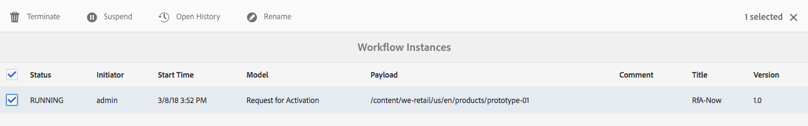

# 워크플로 인스턴스 관리{#administering-workflow-instances}

>[!CAUTION]
>
>AEM 6.4가 확장 지원이 종료되었으며 이 설명서는 더 이상 업데이트되지 않습니다. 자세한 내용은 [기술 지원 기간](https://helpx.adobe.com/kr/support/programs/eol-matrix.html). 지원되는 버전 찾기 [여기](https://experienceleague.adobe.com/docs/).

워크플로 콘솔은 워크플로 인스턴스가 예상대로 실행되도록 관리하기 위한 몇 가지 도구를 제공합니다.

>[!NOTE]
>
>다음 [JMX 콘솔](/help/sites-administering/jmx-console.md#workflow-maintenance) 추가 워크플로우 유지 관리 작업을 제공합니다.

다양한 콘솔을 사용하여 워크플로를 관리할 수 있습니다. [전역 탐색](/help/sites-authoring/basic-handling.md#global-navigation)을 사용하여 **도구** 창을 연 다음 **워크플로**&#x200B;를 선택합니다.

* **모델**: 워크플로 정의 관리
* **인스턴스**: 실행 중인 워크플로 인스턴스 조회 및 관리
* **시작 관리자**: 워크플로 실행 방법 관리
* **보관**: 정상적으로 완료된 워크플로 내역 조회
* **실패**: 오류와 함께 완료된 워크플로 내역 조회

## 워크플로 인스턴스 상태 모니터링 {#monitoring-the-status-of-workflow-instances}

1. 탐색을 사용하여 **도구**&#x200B;를 선택한 다음 **워크플로**&#x200B;를 선택합니다.
1. **인스턴스**&#x200B;를 선택하여 현재 진행 중인 워크플로 인스턴스 목록을 표시합니다.

   

1. 특정 항목을 선택한 다음 **내역 열기**&#x200B;를 선택하여 세부 정보를 표시합니다.

   

## 워크플로 인스턴스 일시 중단, 재시작 및 종료 {#suspending-resuming-and-terminating-a-workflow-instance}

1. 탐색을 사용하여 **도구**&#x200B;를 선택한 다음 **워크플로**&#x200B;를 선택합니다.
1. **인스턴스**&#x200B;를 선택하여 현재 진행 중인 워크플로 인스턴스 목록을 표시합니다.

   

1. 특정 항목을 선택한 다음 **종료**, **일시 중단** 또는 **재시작**&#x200B;을 적절히 사용합니다. 확인 및/또는 세부 정보가 필요합니다.

   

## 보관된 워크플로 보기 {#viewing-archived-workflows}

1. 탐색을 사용하여 **도구**&#x200B;를 선택한 다음 **워크플로**&#x200B;를 선택합니다.
1. **보관**&#x200B;을 선택하여 정상적으로 완료된 워크플로 인스턴스 목록을 표시합니다.

   

   >[!NOTE]
   >
   >중단 상태는 다음과 같은 사용자 작업의 결과로 발생하므로 성공적인 종료로 간주됩니다.
   >
   >* **종료** 작업 사용
   >* 워크플로의 대상인 페이지가 (강제로) 삭제되면 워크플로가 종료됩니다.

1. 특정 항목을 선택한 다음 **내역 열기**&#x200B;를 선택하여 세부 정보를 표시합니다.

   

## 워크플로 인스턴스 실패 해결 {#fixing-workflow-instance-failures}

워크플로가 실패하면 AEM은 **실패** 콘솔을 제공하므로 원래 원인을 처리하고 나면 이를 조사하고 적절한 조치를 취할 수 있습니다.

* **실패 세부 정보** - 창을 열어 다음을 표시합니다. 
**실패 메시지**, **단계** 및 **실패 누적**

* **내역 열기** - 워크플로 내역의 세부 정보를 표시합니다.

* **단계 다시 시도** - 스크립트 단계 구성 요소 인스턴스를 다시 실행합니다. 원래 오류 원인을 해결한 후 Retry Step 명령을 사용합니다. 예를 들어 프로세스 단계에서 실행되는 스크립트에서 버그를 수정하고 단계를 다시 시도할 수 있습니다.
* **종료** 오류로 인해 워크플로우가 인식할 수 없는 상황이 발생한 경우 워크플로우를 종료합니다. 예를 들어, 워크플로우는 워크플로우 인스턴스에 더 이상 유효하지 않은 저장소의 정보와 같은 환경 조건을 사용할 수 있습니다.
* **종료 및 다시 시도** - **종료**&#x200B;와 유사합니다. 단, 이 옵션은 원래 페이로드, 제목, 설명을 사용하여 새 워크플로 인스턴스를 시작합니다.

실패를 조사한 다음 그 직후에 워크플로를 다시 시작하거나 종료하려면 다음 단계를 사용하십시오.

1. 탐색을 사용하여 **도구**&#x200B;를 선택한 다음 **워크플로**&#x200B;를 선택합니다.
1. **실패**&#x200B;를 선택하여 정상적으로 완료되지 않은 워크플로 인스턴스 목록을 표시합니다.
1. 특정 항목을 선택한 다음 적절한 작업을 선택합니다.

   

## 정기적인 워크플로 인스턴스 제거 {#regular-purging-of-workflow-instances}

워크플로 인스턴스 수를 최소화하면 워크플로 엔진의 성능이 향상되므로 완료되었거나 실행 중인 워크플로 인스턴스를 저장소에서 정기적으로 제거할 수 있습니다.

수명 및 상태에 따라 워크플로 인스턴스를 제거하도록 **Adobe Granite 워크플로 제거 구성**&#x200B;을 구성합니다. 또한 모든 모델 또는 특정 모델의 워크플로 인스턴스를 제거할 수 있습니다.

여러 서비스 구성을 생성하여 서로 다른 기준을 충족하는 워크플로 인스턴스를 제거할 수도 있습니다. 예를 들어 특정 워크플로 모델의 인스턴스가 예상 시간보다 오래 실행될 때 해당 인스턴스를 제거하는 구성을 생성할 수 있습니다. 저장소 크기를 최소화하기 위해 특정 일수가 지난 후 완료된 모든 워크플로를 제거하는 다른 구성을 생성할 수도 있습니다.

서비스를 구성하려면 [웹 콘솔](/help/sites-deploying/configuring-osgi.md#osgi-configuration-with-the-web-console) 또는 [저장소에 OSGi 구성 추가](/help/sites-deploying/configuring-osgi.md#osgi-configuration-in-the-repository). 다음 표에서는 두 방법 중 하나에 필요한 속성에 대해 설명합니다.

>[!NOTE]
>
>저장소에 구성을 추가하는 경우 서비스 PID는 다음과 같습니다.
>
>`com.adobe.granite.workflow.purge.Scheduler`
>
>이 서비스는 공장 서비스이므로 `sling:OsgiConfig` 노드의 이름에는 다음과 같은 식별자 접미사가 필요합니다.
>
>`com.adobe.granite.workflow.purge.Scheduler-myidentifier`

<table> 
 <tbody> 
  <tr> 
   <th>속성 이름(웹 콘솔)</th> 
   <th>OSGi 속성 이름</th> 
   <th>설명</th> 
  </tr> 
  <tr> 
   <td>작업 이름</td> 
   <td>scheduledpurge.name</td> 
   <td>예약된 제거의 설명적인 이름입니다.</td> 
  </tr> 
  <tr> 
   <td>워크플로 상태</td> 
   <td>scheduledpurge.workflowStatus</td> 
   <td>
제거할 워크플로 인스턴스의 상태입니다. 다음은 유효한 값입니다.
 
    <ul> 
     <li>완료됨: 완료된 워크플로 인스턴스가 제거됩니다.</li> 
     <li>실행 중: 실행 중인 워크플로 인스턴스가 제거됩니다.</li> 
    </ul> </td> 
  </tr> 
  <tr> 
   <td>제거 모델</td> 
   <td>scheduledpurge.modelIds</td> 
   <td>
제거할 워크플로 모델의 ID입니다. 이 ID는 모델 노드로의 경로입니다(예:  /conf/global/settings/workflow/models/dam/update_asset/jcr:content/model ). 값을 지정하지 않으면 모든 워크플로 모델의 인스턴스가 제거됩니다.
 
여러 모델을 지정하려면 웹 콘솔에서 “+” 버튼을 클릭하십시오. 
 </td> 
  </tr> 
  <tr> 
   <td>워크플로 수명</td> 
   <td>scheduledpurge.daysold</td> 
   <td>제거할 워크플로 인스턴스의 수명(일)입니다.</td> 
  </tr> 
 </tbody> 
</table>

## 받은 편지함의 최대 크기 설정 {#setting-the-maximum-size-of-the-inbox}

를 구성하여 받은 편지함의 최대 크기를 설정할 수 있습니다 **Granite Workflow 서비스 Adobe**&#x200B;를 사용 [웹 콘솔](/help/sites-deploying/configuring-osgi.md#osgi-configuration-with-the-web-console) 또는 [저장소에 OSGi 구성 추가](/help/sites-deploying/configuring-osgi.md#osgi-configuration-in-the-repository). 다음 표에서는 두 방법 중 하나에 대해 구성하는 속성에 대해 설명합니다.

>[!NOTE]
>
>저장소에 구성을 추가하는 경우 서비스 PID는 다음과 같습니다.
>
>`com.adobe.granite.workflow.core.WorkflowSessionFactory`.

| 속성 이름 (웹 콘솔) | OSGi 속성 이름 |
|---|---|
| 최대 받은 편지함 쿼리 크기 | granite.workflow.inboxQuerySize |
