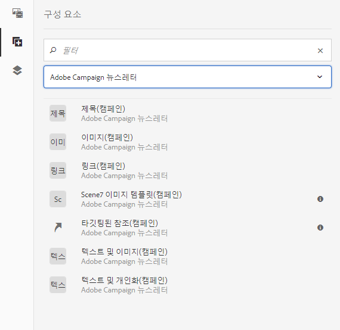
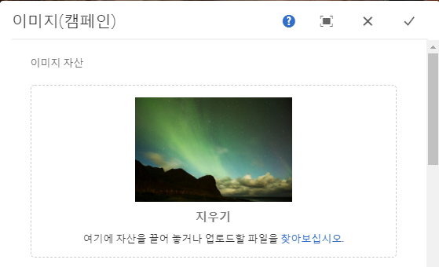
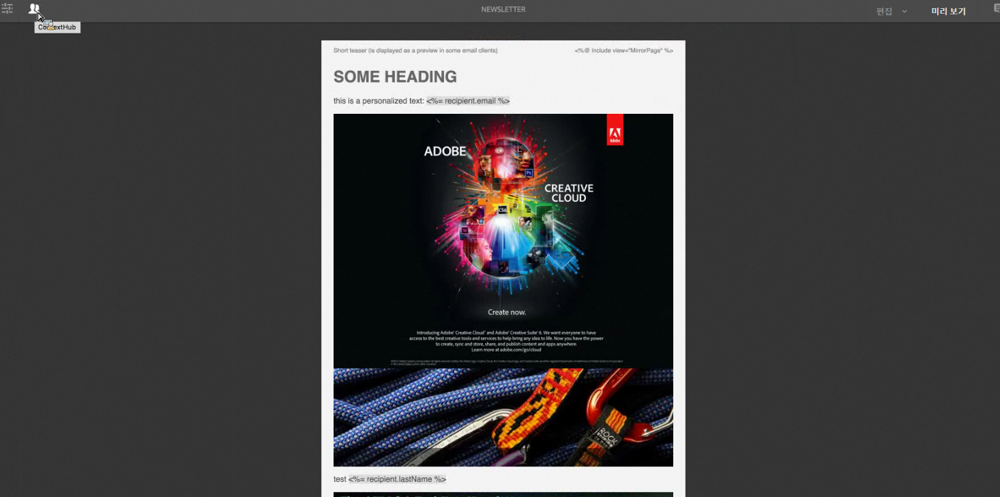
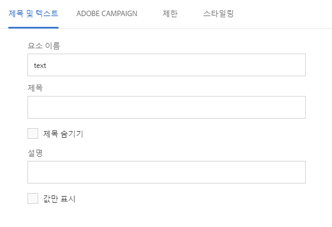
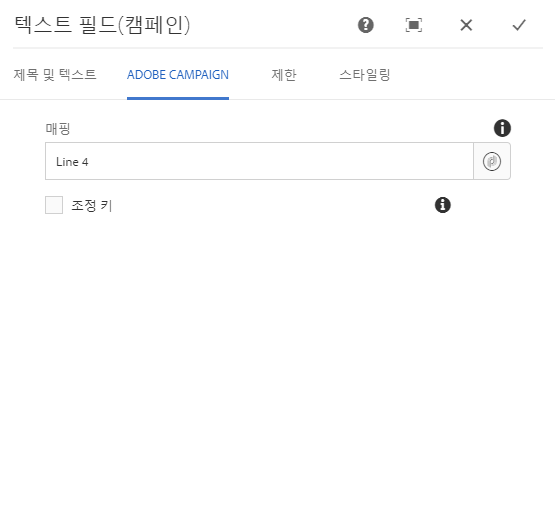
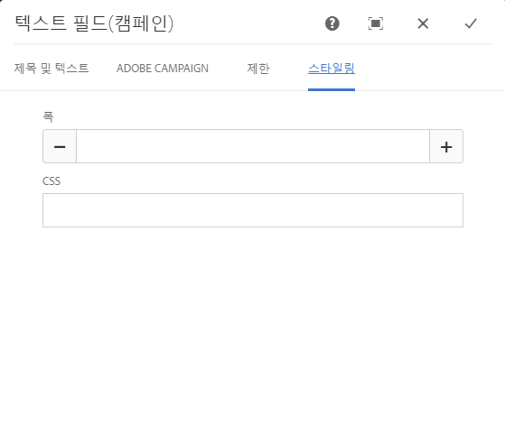
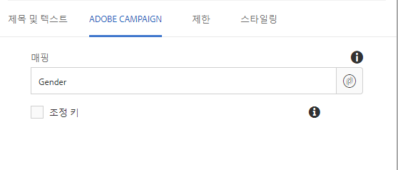

# Adobe Campaign 구성 요소{#adobe-campaign-components}

Adobe Campaign과 통합하면 뉴스레터와 양식을 사용하여 작업할 때 사용할 수 있는 구성 요소가 있습니다. 모두 이 문서에 설명되어 있습니다.

## Adobe Campaign 뉴스레터 구성 요소 {#adobe-campaign-newsletter-components}

모든 Campaign 구성 요소는 [이메일 템플릿 우수 사례](/help/sites-administering/best-practices-for-email-templates.md)에 요약된 우수 사례를 따르며, Adobe 마크업 언어 [HTL](https://helpx.adobe.com/kr/experience-manager/htl/using/overview.html)을 기반으로 합니다.

Adobe Campaign과 통합하도록 구성된 뉴스레터/이메일을 열면 **Adobe Campaign 뉴스레터** 섹션에 다음 구성 요소가 표시됩니다.

* 제목(캠페인)
* 이미지(캠페인)
* 링크(캠페인)
* Dynamic Media 이미지 템플릿(캠페인)
* 타깃팅된 참조(캠페인)
* 텍스트 및 이미지(캠페인)
* 텍스트 및 개인화(캠페인)

이 구성 요소들에 대한 설명은 다음 섹션에 있습니다.

구성 요소는 다음과 같이 표시됩니다.

### 제목(캠페인) {#heading-campaign}

제목 구성 요소의 기능은 다음과 같습니다.

* **제목** 필드를 비워 현재 페이지의 이름을 표시합니다.
* **제목** 필드에서 지정하는 텍스트를 표시합니다.

**제목(캠페인)** 구성 요소를 직접 편집합니다. 페이지 제목을 사용하려면 비워 둡니다.

다음 내용을 구성할 수 있습니다.

* **제목**
페이지 제목 이외의 이름을 사용하려면 여기에 입력합니다.

* **제목 수준(1, 2, 3, 4)** HTML 제목 크기 1-4를 기반으로 하는 제목 수준입니다.

다음 예는 제목(캠페인) 구성 요소가 표시되는 것을 보여줍니다.

### 이미지(캠페인) {#image-campaign}

이미지(캠페인) 구성 요소는 지정된 매개 변수에 따라 이미지와 추가 텍스트를 표시합니다.

이미지를 업로드한 다음 편집하고 조작(예: 자르기, 회전, 링크/제목/텍스트 추가)할 수 있습니다.

[자산 브라우저](/help/sites-authoring/author-environment-tools.md#assets-browser)의 이미지를 구성 요소나 해당 [구성 대화 상자](/help/sites-authoring/editing-content.md#edit-configure-copy-cut-delete-paste)로 바로 끌어다 놓을 수 있습니다. 구성 대화 상자에서 이미지를 업로드할 수도 있습니다. 이 대화 상자는 이미지의 모든 정의 및 조작도 제어합니다.

>[!NOTE]
>
>**대체 텍스트** 필드에 정보를 입력해야 합니다. 그렇지 않으면 이미지를 저장할 수 없습니다.

이미지가 업로드된 후(그 전은 아님) [즉석 편집](/help/sites-authoring/editing-content.md#edit-configure-copy-cut-delete-paste)을 사용하여 필요에 따라 이미지를 자르거나 회전할 수 있습니다.

>[!NOTE]
>
>즉석 편집기에서는 편집할 때 이미지의 원래 크기와 종횡비를 사용합니다. 높이 및 너비 속성을 지정할 수도 있습니다. 속성에 정의된 모든 크기와 종횡비는 편집 변경 사항을 저장할 때 적용됩니다.
>
>사용자 인스턴스에 따라 최소 및 최대 제한 사항은 [페이지의 디자인](/help/sites-developing/designer.md)에 의해 적용될 수도 있습니다. 이러한 제한 사항은 프로젝트 구현 중 개발됩니다.

맵 및 확대/축소와 같은 몇 가지 추가 옵션은 전체 화면 편집 모드에서 사용할 수 있습니다.

이미지가 로드되면 다음 항목을 구성할 수 있습니다.

* **맵**

   이미지를 매핑하려면 맵을 선택합니다. 이미지 맵을 만들 방법(사각형, 다각형 등)과 영역이 가리킬 대상 위치를 지정할 수 있습니다.

* **자르기**

   자르기를 선택하여 이미지를 자릅니다. 마우스를 사용하여 이미지를 자를 수 있습니다.

* **회전**

   이미지를 회전하려면 회전을 선택합니다. 이미지가 원하는 방향으로 회전할 때까지 반복적으로 사용합니다.

* **지우기**

   현재 이미지를 제거합니다.

* 확대/축소 막대(클래식만 해당)

   이미지를 확대/축소하려면 이미지 아래에서 [확인] 및 [취소] 단추 위에 있는 슬라이드 막대를 사용합니다.

* **제목**

   이미지의 제목입니다.

* **대체 텍스트**

   액세스 가능한 컨텐츠를 만들 때 사용할 대체 텍스트입니다.

* **링크 대상**

   웹 사이트 내의 자산 또는 다른 페이지로 이동하는 링크를 만듭니다.

* **설명**

   이미지의 설명입니다.

* **크기**

   이미지의 높이와 폭을 설정합니다.

>[!NOTE]
>
>**고급** 탭에서 **대체 텍스트** 필드에 정보를 입력해야 합니다. 그렇지 않으면, 이미지를 저장할 수 없으며 다음 오류 메시지가 표시됩니다.
>
>`Validation failed. Verify the values of the marked fields.`

다음 예는 이미지(캠페인) 구성 요소가 표시되는 것을 보여줍니다.

### 링크(캠페인) {#link-campaign}

링크(캠페인) 구성 요소를 사용하면 뉴스레터에 링크를 추가할 수 있습니다. 

**디스플레이**, **URL 정보** 또는 **고급** 탭에서 다음 내용을 구성할 수 있습니다.

* **링크 캡션**

   링크에 대한 캡션입니다. 사용자에게 표시되는 텍스트입니다.

* **링크 도구 설명**

   링크 사용 방법에 대한 추가 정보를 추가합니다.

* **LinkType**

   드롭다운 목록에서 **사용자 지정 URL**&#x200B;과 **응용 문서** 중에서 선택합니다. 이 필드는 반드시 입력해야 합니다. [사용자 지정 URL]을 선택하는 경우 링크 URL을 제공할 수 있습니다. [응용 문서]를 선택하는 경우 문서 경로를 제공할 수 있습니다.

* **추가 URL 매개 변수**

   추가 URL 매개 변수를 추가합니다. 여러 항목을 추가하려면 [항목 추가]를 클릭하십시오.

>[!NOTE]
>
>**URL 정보** 탭의 **링크 유형** 필드에 정보를 입력해야 합니다. 그렇지 않으면 구성 요소를 저장할 수 없으며 다음 오류 메시지가 표시됩니다.
>
>`Validation failed. Verify the values of the marked fields.`

다음 예는 링크(캠페인) 구성 요소가 표시되는 것을 보여줍니다.

### Scene7 이미지 템플릿(캠페인) {#scene-image-template-campaign}

[Scene7 이미지 ](https://experienceleague.adobe.com/docs/dynamic-media-classic/using/template-basics/quick-start-template-basics.html#template-basics) 템플릿은 레이어로 구성된 이미지 파일로, 컨텐츠와 속성을 가변성 있게 매개 변수화할 수 있습니다. **이미지 템플릿** 구성 요소를 사용하면 뉴스레터 내에 Dynamic Media Classic(이전 Scene7) 템플릿을 사용하고 템플릿 매개 변수의 값을 변경할 수 있습니다. 또한 매개 변수 내에서 Adobe Campaign 메타데이터 변수를 사용하여 각 사용자가 개인화된 방식으로 이미지를 경험하도록 할 수 있습니다.

**편집**&#x200B;을 클릭하여 구성 요소를 구성합니다. 이 섹션에 설명된 설정을 구성할 수 있습니다. 이 Dynamic Media Classic(이전 Scene7) 이미지 템플릿은 [Scene7 이미지 템플릿 구성 요소](/help/assets/scene7.md#image-template)에 자세히 설명되어 있습니다.

또한 매개 변수 패널에는 Dynamic Media Classic(이전 Scene7)에서 템플릿에 대해 정의된 모든 템플릿 매개 변수가 나열됩니다. 이러한 각 매개 변수에 대해 값을 조정하거나, 변수를 삽입하거나, 이를 기본값으로 재설정할 수 있습니다.

### 타깃팅된 참조(캠페인) {#targeted-reference-campaign}

타깃팅된 참조(캠페인) 구성 요소를 사용하면 타깃팅된 단락에 대한 참조를 만들 수 있습니다.

이 구성 요소에서 타깃팅된 단락으로 이동하여 선택합니다.

폴더 아이콘을 클릭하여 참조할 단락으로 이동하십시오. 완료되면 확인 표시를 클릭합니다.

### 텍스트 및 이미지(캠페인)  {#text-image-campaign}

텍스트 및 이미지(캠페인) 구성 요소는 텍스트 블록과 이미지를 추가합니다.

클릭하여 구성 요소를 구성할 때 텍스트나 이미지를 선택합니다.

**텍스트**&#x200B;를 선택하면 인라인 편집기가 표시됩니다.

**이미지**&#x200B;를 선택하면 이미지를 위한 즉석 편집기가 표시됩니다.

이미지 작업에 대한 자세한 내용은 [이미지(캠페인) 구성 요소](#image-campaign)를 참조하십시오. 텍스트 작업에 대한 자세한 내용은 [텍스트 및 개인화(캠페인) 구성 요소](#text-personalization-campaign)를 참조하십시오.

텍스트 및 개인화(캠페인)와 이미지(캠페인) 구성 요소와 함께 다음 내용을 구성할 수 있습니다.

* **텍스트**

   텍스트를 입력합니다. 도구 모음을 사용하여 서식을 수정하고, 목록을 만들고, 링크를 추가합니다.

* **이미지**

   Content Finder에서 이미지를 드래그하거나 클릭하여 이미지를 찾습니다. 필요에 따라 자르거나 회전합니다.

* **이미지 속성**(**고급 이미지 속성**)

   다음을 지정할 수 있습니다.

   * **제목**

      블록의 제목으로서 마우스로 가리킬 때 표시됩니다.

   * **대체 텍스트**

      이미지를 표시할 수 없을 때 표시되는 대체 텍스트입니다.

   * **링크 대상**

      웹 사이트 내의 자산 또는 다른 페이지로 이동하는 링크를 만듭니다.

   * **설명**

      이미지의 설명입니다.

   * **크기**

      이미지의 높이와 폭을 설정합니다.

>[!NOTE]
>
>**고급** 탭의 **대체 텍스트** 필드는 반드시 입력해야 합니다. 그렇지 않으면, 구성 요소를 저장할 수 없으며 다음 오류 메시지가 표시됩니다.
>
>`Validation failed. Verify the values of the marked fields.`

다음 예는 텍스트 및 이미지(캠페인) 구성 요소가 표시되는 것을 보여줍니다.

### 텍스트 및 개인화(캠페인) {#text-personalization-campaign}

텍스트 및 개인화(캠페인) 구성 요소를 사용하면 [리치 텍스트 편집기](/help/sites-authoring/rich-text-editor.md)에서 제공하는 기능과 함께 WYSIWYG 편집기를 사용하여 텍스트 블록을 입력할 수 있습니다. 또한 이 구성 요소를 사용하면 Adobe Campaign에서 사용할 수 있는 컨텍스트 필드와 개인화 블록을 사용할 수 있습니다. [개인화 삽입](/help/sites-authoring/campaign.md#inserting-personalization)을 참조하십시오.

여러 가지 아이콘을 사용하여 글꼴 특성, 정렬, 링크, 목록 및 들여쓰기 등의 텍스트 서식을 지정할 수 있습니다. 모양과 느낌은 다르지만 기능은 기본적으로 [두 UI](/help/sites-authoring/editing-content.md)에서 동일합니다.

즉석 편집기에서는 텍스트를 추가하고, 양쪽 맞춤을 변경하고, 링크를 추가 또는 제거하고, 컨텍스트 필드나 개인화 블록을 추가하고, 전체 화면 모드로 전환할 수 있습니다. 텍스트/개인화 추가 작업이 완료되면 확인 표시를 선택하여 변경 사항을 저장하십시오(취소하려면 또는 x 선택). 자세한 내용은 [즉석 편집](/help/sites-authoring/editing-content.md#edit-configure-copy-cut-delete-paste)을 참조하십시오.

>[!NOTE]
>
>* 사용 가능한 개인화 필드는 뉴스레터가 연결된 Adobe Campaign 템플릿의 종류에 따라 달라집니다.
>* ContextHub에서 가상 사용자를 선택하면 개인화 필드는 선택된 프로필의 데이터로 자동 교체됩니다.

>
>
[개인화 삽입](/help/sites-authoring/campaign.md#inserting-personalization)을 참조하십시오.

>[!NOTE]
>
>**nms:seedMember** 스키마나 그 확장 중 하나에서 정의된 필드만 고려됩니다. **nms:seedMember**&#x200B;에 연결된 표의 특성은 사용할 수 없습니다.

## Adobe Campaign 양식 구성 요소 {#adobe-campaign-form-components}

Adobe Campaign 구성 요소를 사용하여 뉴스레터에 가입하거나, 뉴스레터 가입을 해지하거나, 사용자 프로필을 업데이트하기 위해 사용자가 채우는 양식을 만들 수 있습니다. 자세한 내용은 [Adobe Campaign 양식 만들기](/help/sites-authoring/adobe-campaign-forms.md)를 참조하십시오.

각 구성 요소 필드는 Adobe Campaign 데이터베이스 필드에 연결할 수 있습니다. 사용 가능한 필드는 [구성 요소 및 데이터 유형](#components-and-data-type) 섹션에 설명된 대로 필드가 포함하는 데이터의 유형에 따라 달라집니다. Adobe Campaign에서 수신자 스키마를 확장하는 경우에는, 데이터 유형이 일치하는 구성 요소에서 새 필드를 사용할 수 있습니다.

Adobe Campaign과 통합하도록 구성된 양식을 열면 **Adobe Campaign** 섹션에 다음 구성 요소가 표시됩니다.

* 확인란(캠페인)
* 날짜 필드(캠페인)와 날짜 필드/HTML5(캠페인)
* 암호화된 기본 키(캠페인)
* 표시 오류(캠페인)
* 숨겨진 조정 키(캠페인)
* 숫자 필드(캠페인)
* 옵션 필드(캠페인)
* 가입 확인 목록(캠페인)
* 텍스트 필드(캠페인)

구성 요소는 다음과 같이 표시됩니다.

이 섹션에서는 각 구성 요소에 대해 자세히 설명합니다.

### 구성 요소 및 데이터 유형  {#components-and-data-type}

다음 표에서는 Adobe Campaign 프로필 데이터를 표시하고 수정하는 데 사용할 수 있는 구성 요소에 대해 설명합니다. 각 구성 요소는 필드 값을 표시하고 양식이 제출되면 필드를 업데이트하도록 Adobe Campaign 프로필 필드에 매핑할 수 있습니다. 다른 구성 요소는 적절한 데이터 유형의 필드에만 대응시킬 수 있습니다.

<table> 
 <tbody> 
  <tr> 
   <td>
<strong>구성 요소</strong>
 </td> 
   <td>
<strong>Adobe Campaign 필드의 데이터 유형</strong>
 </td> 
   <td>
<strong>예제 필드</strong>
 </td> 
  </tr> 
  <tr> 
   <td>
확인란(캠페인)
 </td> 
   <td>
부울
 </td> 
   <td>
더 이상 연락하지 않음(모든 채널에서)
 </td> 
  </tr> 
  <tr> 
   <td>
날짜 필드(캠페인)
 
날짜 필드/HTML 5(캠페인)
 </td> 
   <td>
날짜
 </td> 
   <td>
생년월일
 </td> 
  </tr> 
  <tr> 
   <td>
숫자 필드(캠페인)
 </td> 
   <td>
숫자(바이트, short, long, double)
 </td> 
   <td>
연령
 </td> 
  </tr> 
  <tr> 
   <td>
옵션 필드(캠페인)
 </td> 
   <td>
연결된 값이 있는 바이트
 </td> 
   <td>
성별
 </td> 
  </tr> 
  <tr> 
   <td>
텍스트 필드(캠페인)
 </td> 
   <td>
문자열
 </td> 
   <td>
이메일
 </td> 
  </tr> 
 </tbody> 
</table>

### 대부분의 구성 요소에 공통인 설정 {#settings-common-to-most-components}

Adobe Campaign 구성 요소에는 모든 구성 요소(암호화된 기본 키와 숨겨진 조정 키 구성 요소 제외)에서 공통인 설정이 있습니다.

대부분의 구성 요소에서 다음 내용을 구성할 수 있습니다.

#### 제목 및 텍스트  {#title-and-text}

* **제목**

   요소 이름 이외의 이름을 사용하려면 여기에 입력합니다.

* **제목 숨기기**

   제목을 표시하지 않으려면 이 확인란을 선택합니다.

* **설명**

   설명을 필드에 추가하여 사용자에 대한 자세한 정보를 제공합니다.

* **값만 표시**

   값이 있을 경우 값만 표시됩니다.

#### Adobe Campaign {#adobe-campaign}

다음 내용을 구성할 수 있습니다.

* **매핑**

   해당되는 경우 Adobe Campaign 개인화 필드를 선택합니다.

* **조정 키**

   이 필드가 조정 키의 일부인 경우 이 확인란을 선택합니다.

#### 제한 {#constraints}

* **필수**

   이 구성 요소를 필수 구성 요소로 만들려면 이 확인란을 선택합니다.즉, 사용자가 값을 입력해야 합니다.

* **필수 메시지**

   필수 필드임을 알리는 메시지를 추가할 수도 있습니다.

#### 스타일링 {#styling}

* **CSS** 이 구성 요소에 사용할 CSS 클래스를 입력하십시오.

### 확인란(캠페인) {#checkbox-campaign}

확인란(캠페인) 구성 요소를 사용하면 사용자가 부울 데이터 유형의 Adobe Campaign 프로필 필드를 수정할 수 있습니다. 예를 들어, 수신자가 채널을 통해 연락을 받지 않도록 지정할 수 있게 해주는 확인란(캠페인) 구성 요소가 있을 수 있습니다.

확인란(캠페인) 구성 요소에서 [대부분의 Adobe Campaign 구성 요소에 공통인 설정을 구성](#settings-common-to-most-components)할 수 있습니다.

다음 예는 확인란(캠페인) 구성 요소가 표시되는 것을 보여줍니다.

### 날짜 필드(캠페인)와 날짜 필드/HTML 5(캠페인) {#date-field-campaign-and-date-field-html-campaign}

수신자가 날짜를 지정할 수 있도록 하려면 날짜 필드를 사용하십시오. 예를 들어, 수신자가 생년월일을 지정하도록 할 수 있습니다. 날짜 형식은 Adobe Campaign 인스턴스에 사용된 형식과 일치합니다.

[대부분의 Adobe Campaign 구성 요소에 공통인 설정](#settings-common-to-most-components) 외에 다음 내용을 구성할 수 있습니다.

* **제한 -** 제한 드롭다운

   **없음** 또는 **날짜**-를 선택하여 날짜 제한을 추가하거나 제한을 추가하지 않을 수 있습니다. 날짜를 선택하는 경우, 사용자가 필드에 입력하는 응답의 형식은 날짜 형식이어야 합니다.

* **제한 메시지**

   또한 응답의 형식을 적절하게 지정하는 방법을 알 수 있도록 제한 메시지를 추가할 수 있습니다.
* **스타일링 -**
너비필드의 너비를 조정하려면 
**+** 및  **아이콘을 선택하거나 숫자를** 입력합니다.

다음 예는 날짜 필드(캠페인) 구성 요소가 조정된 너비로 표시되는 것을 보여줍니다.

### 암호화된 기본 키(캠페인) {#encrypted-primary-key-campaign}

이 구성 요소는 Adobe Campaign 프로필의 ID를 포함할 URL 매개 변수의 이름을 정의합니다(각각 Adobe Campaign Standard와 6.1의 **기본 리소스 ID** 또는 **암호화된 기본 키**).

Adobe Campaign 프로필 데이터를 표시 및 수정하는 각 양식은 암호화된 기본 키 구성 요소를 포함&#x200B;**해야** 합니다.

암호화된 기본 키(캠페인) 구성 요소에서는 다음 내용을 구성할 수 있습니다.

* **제목 및 텍스트 - 요소 이름**

   기본값은 encryptedPK입니다. 양식에서 다른 요소의 이름과 충돌할 때에만 요소 이름을 변경해야 합니다. 두 양식 필드에는 동일한 요소 이름이 있을 수 없습니다.
* **Adobe Campaign - URL 매개 변수** EPK용 URL 매개 변수를 추가합니다. 예를 들어 
**epk**.

다음 예는 암호화된 기본 키(캠페인) 구성 요소가 표시되는 것을 보여줍니다.

### 표시 오류(캠페인) {#error-display-campaign}

이 구성 요소를 사용하면 백엔드 오류를 표시할 수 있습니다. 구성 요소가 제대로 작동하도록 하려면 양식의 오류 처리를 [앞으로]로 설정해야 합니다.

다음 예는 오류 표시(캠페인) 구성 요소가 표시되는 것을 보여줍니다.

### 숨겨진 조정 키(캠페인) {#hidden-reconciliation-key-campaign}

숨겨진 조정 키(캠페인) 구성 요소를 사용하면 숨겨진 필드를 조정 키의 일부로 양식에 추가할 수 있습니다.

숨겨진 조정 키(캠페인) 구성 요소에서는 다음 내용을 구성할 수 있습니다.

* **제목 및 텍스트 - 요소 이름**

   기본값은 reconcilKey입니다. 양식에서 다른 요소의 이름과 충돌할 때에만 요소 이름을 변경해야 합니다. 두 양식 필드에는 동일한 요소 이름이 있을 수 없습니다.
* **Adobe Campaign - 매핑** Adobe Campaign 개인화 필드에 매핑하십시오.

다음 예는 숨겨진 조정 키(캠페인) 구성 요소가 표시되는 것을 보여줍니다.

### 숫자 필드(캠페인) {#numeric-field-campaign}

수신자가 나이와 같은 숫자를 입력할 수 있도록 하려면 숫자 필드를 사용하십시오.

[대부분의 Adobe Campaign 구성 요소에 공통인 설정](#settings-common-to-most-components) 외에 다음 내용을 구성할 수 있습니다.

* **제한 -** 제한 드롭다운

   - **없음** 또는 **Numeric**&#x200B;을 선택하여 숫자 제한을 추가하거나 제한을 추가하지 않을 수 있습니다. 숫자를 선택하는 경우, 사용자가 필드에 입력하는 응답의 형식은 숫자여야 합니다.

* **제한 메시지**

   또한 응답의 형식을 적절하게 지정하는 방법을 알 수 있도록 제한 메시지를 추가할 수 있습니다.
* **스타일링 -**
너비필드의 너비를 조정하려면 
**+** 및  **아이콘을 선택하거나 숫자를** 입력합니다.

다음 예는 숫자 필드(캠페인) 구성 요소가 구성된 너비로 표시되는 것을 보여줍니다.

### 옵션 필드(캠페인) {#option-field-campaign}

이 드롭다운 목록에서는 수신자의 성별이나 상태와 같은 선택 사항을 선택할 수 있습니다.

옵션 필드(캠페인) 구성 요소에서 [대부분의 Adobe Campaign 구성 요소에 공통인 설정을 구성](#settings-common-to-most-components)할 수 있습니다. 드롭다운 목록을 채우려면 Adobe Campaign 기호를 클릭하거나 탭하고 적절한 필드로 이동하여 Adobe Campaign 개인화 필드에서 해당 필드를 선택하십시오.

다음 예는 옵션 필드(캠페인) 구성 요소가 표시되는 것을 보여줍니다.

### 가입 확인 목록(캠페인) {#subscriptions-checklist-campaign}

Adobe Campaign 프로필과 연결된 가입을 수정하려면 **가입 확인 목록(캠페인)** 구성 요소를 사용하십시오.

이 구성 요소를 양식에 추가하면 모든 사용 가능한 가입이 확인란으로 표시되고 사용자가 원하는 가입을 선택할 수 있습니다. 사용자가 양식을 제출하면 이 구성 요소는 양식 작업 유형(**Adobe Campaign:서비스** 또는 **Adobe Campaign 가입:서비스 구독 취소**).

>[!NOTE]
>
>이 구성 요소는 사용자가 이미 가입했거나 가입을 해지한 서비스를 확인하지는 않습니다.

가입 확인 목록(캠페인) 구성 요소에서 [대부분의 Adobe Campaign 구성 요소에 공통인 설정을 구성](#settings-common-to-most-components)할 수 있습니다. (이 구성 요소에 사용할 수 있는 Adobe Campaign 구성이 없습니다.)

다음 예는 가입 확인 목록(캠페인) 구성 요소가 표시되는 것을 보여줍니다.

### 텍스트 필드(캠페인) {#text-field-campaign}

텍스트 필드(캠페인) 구성 요소에서는 문자열 유형 데이터(예: 이름, 성, 주소, 이메일 주소 등)를 입력할 수 있습니다.

[대부분의 Adobe Campaign 구성 요소에 공통인 설정](#settings-common-to-most-components) 외에 다음 내용을 구성할 수 있습니다.

* **제한 -** 제한 드롭다운

   **없음, 이메일,** 또는 **이름(모음 기호 없음)**-을 선택하여 이메일 주소, 이름 또는 제한 조건 없이 제한을 추가할 수 있습니다. 이메일을 선택하는 경우, 사용자가 필드에 입력하는 응답의 형식은 이메일 주소여야 합니다. 이름을 선택하는 경우 이름이어야 합니다(모음 기호는 허용되지 않음).

* **제한 메시지**

   또한 응답의 형식을 적절하게 지정하는 방법을 알 수 있도록 제한 메시지를 추가할 수 있습니다.

* **스타일 - 너비**

   **+** 및 **-** 아이콘을 클릭하거나 탭하거나 숫자를 입력하여 필드의 너비를 조정합니다.

다음 예는 텍스트 필드(캠페인) 구성 요소가 표시되는 것을 보여줍니다.

