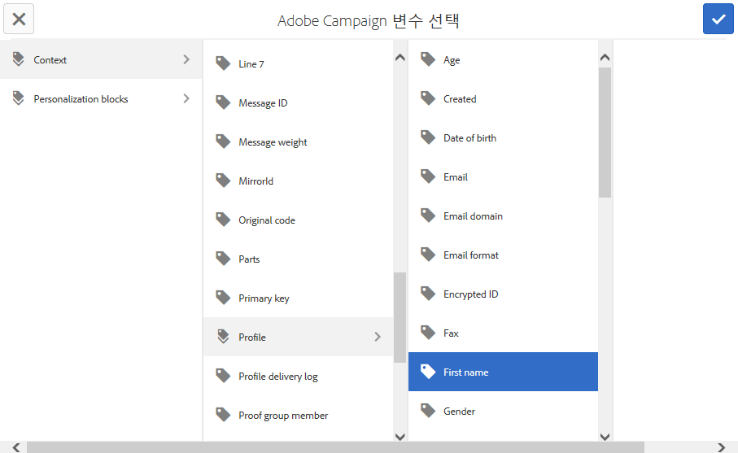
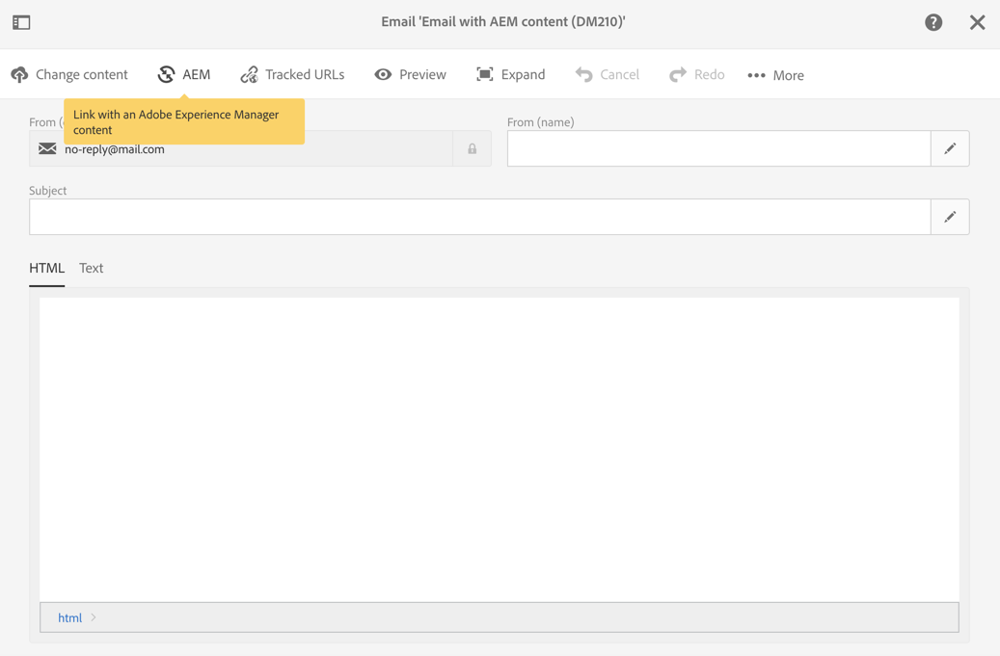

# Adobe Campaign Classic 및 Adobe Campaign Standard 작업{#working-with-adobe-campaign-classic-and-adobe-campaign-standard}

>[!CAUTION]
>
>AEM 6.4가 확장 지원이 종료되었으며 이 설명서는 더 이상 업데이트되지 않습니다. 자세한 내용은 [기술 지원 기간](https://helpx.adobe.com/kr/support/programs/eol-matrix.html). 지원되는 버전 찾기 [여기](https://experienceleague.adobe.com/docs/).

AEM에서 이메일 콘텐츠를 만들고 Adobe Campaign 이메일에서 처리할 수 있습니다. 이를 수행하려면 다음을 수행해야 합니다.

1. Adobe Campaign 관련 템플릿에서 AEM의 새 뉴스레터를 만듭니다.
1. 선택 [Adobe Campaign 서비스](#selecting-the-adobe-campaign-cloud-service-and-template) 컨텐츠를 편집하기 전에 모든 기능에 액세스합니다.
1. 컨텐츠를 편집합니다.
1. 컨텐츠의 유효성을 검사합니다.

그런 다음 Adobe Campaign에서 콘텐츠를 게재와 동기화할 수 있습니다. 자세한 지침은 이 문서에 설명되어 있습니다.

참조 - [AEM에서 Adobe Campaign Forms 만들기](/help/sites-authoring/adobe-campaign-forms.md).

>[!NOTE]
>
>이 기능을 사용하려면 먼저 와 통합하도록 AEM을 구성해야 합니다 [Adobe Campaign](/help/sites-administering/campaignonpremise.md) 또는 [Adobe Campaign Standard](/help/sites-administering/campaignstandard.md).

## Adobe Campaign을 통해 이메일 컨텐츠 보내기 {#sending-email-content-via-adobe-campaign}

AEM 및 Adobe Campaign을 구성한 후 AEM에서 직접 이메일 게재 콘텐츠를 만든 다음 Adobe Campaign에서 처리할 수 있습니다.

AEM에서 Adobe Campaign 컨텐츠를 만들 때 모든 기능에 액세스하려면 컨텐츠를 편집하기 전에 Adobe Campaign 서비스에 연결해야 합니다.

다음 두 가지 가능한 경우가 있습니다.

* Adobe Campaign의 게재와 컨텐츠를 동기화할 수 있습니다. 이렇게 하면 게재에서 AEM 콘텐츠를 사용할 수 있습니다.
* (Adobe Campaign Classic만 해당) 컨텐츠를 Adobe Campaign으로 직접 전송할 수 있으며, 이 경우 자동으로 새 이메일 게재가 생성됩니다. 이 모드에는 제한 사항이 있습니다.

자세한 지침은 이 문서에 설명되어 있습니다.

### 새 이메일 콘텐츠 만들기 {#creating-new-email-content}

>[!NOTE]
>
>전자 메일 템플릿을 추가할 때는 아래에 추가하십시오 **/content/campaigns** 사용할 수 있도록 합니다.

#### 새 이메일 콘텐츠 만들기 {#creating-new-email-content-1}

1. AEM에서 을 선택합니다. **Sites** 그런 다음 **캠페인**&#x200B;을 클릭한 다음 이메일 캠페인이 관리되는 위치로 이동합니다. 다음 예에서 경로는 입니다. **Sites** > **캠페인** > **Geometrixx Outdoors** > **이메일 캠페인**.

   >[!NOTE]
   >
   >[이메일 샘플은 Geometrixx에서만 사용할 수 있습니다](/help/sites-developing/we-retail.md). 패키지 공유에서 샘플 Geometrixx 콘텐츠를 다운로드하십시오.

   

1. 선택 **만들기** 그런 다음 **페이지 만들기**.
1. 연결할 Adobe Campaign과 관련된 사용 가능한 템플릿 중 하나를 선택한 다음 을 클릭합니다 **다음**. 기본적으로 다음 세 가지 템플릿을 사용할 수 있습니다.

   * **Adobe Campaign Classic 이메일**: 전달을 위해 Adobe Campaign Classic에 보내기 전에 미리 정의된 템플릿(열 2개)에 컨텐츠를 추가할 수 있습니다.
   * **Adobe Campaign Standard 이메일**: 전달을 위해 Adobe Campaign Standard에 보내기 전에 미리 정의된 템플릿(열 2개)에 컨텐츠를 추가할 수 있습니다.

1. 을 입력합니다. **제목** 원할 경우 **설명** 을(를) 클릭합니다. **만들기**. 제목은 이메일을 편집하는 동안 덮어쓰지 않는 한 뉴스레터/이메일의 제목으로 사용됩니다.

### Adobe Campaign 클라우드 서비스 및 템플릿 선택 {#selecting-the-adobe-campaign-cloud-service-and-template}

Adobe Campaign과 통합하려면 페이지에 Adobe Campaign 클라우드 서비스를 추가해야 합니다. 이렇게 하면 개인화 및 기타 Adobe Campaign 정보에 액세스할 수 있습니다.

또한 Adobe Campaign 템플릿을 선택하고 제목을 변경하고 HTML에서 이메일을 보지 않는 사용자를 위해 일반 텍스트 컨텐츠를 추가해야 할 수도 있습니다.

다음 중 하나에서 클라우드 서비스를 선택할 수 있습니다 **Sites** 탭하거나 만든 후 이메일/뉴스레터 내에서 선택할 수 있습니다.

에서 클라우드 서비스 선택 **Sites** 탭은 권장되는 방법입니다. 이메일/뉴스레터에서 클라우드 서비스를 선택하려면 해결 방법이 필요합니다.

에서 **Sites** 페이지:

1. AEM에서 이메일 페이지를 선택하고 을(를) 클릭합니다 **속성 보기**.

   

1. 선택 **편집** 그리고 **클라우드 서비스** 탭을 클릭하고 아래로 스크롤한 다음 + 기호를 클릭하여 구성을 추가한 다음 을 선택합니다 **Adobe Campaign**.

   

1. 드롭다운 목록에서 Adobe Campaign 인스턴스와 일치하는 구성을 선택한 다음 을 클릭하여 확인합니다 **저장**.
1. ** Adobe Campaign** 탭을 클릭하여 이메일이 적용된 템플릿을 볼 수 있습니다. 다른 템플릿을 선택하려면 편집하는 동안 이메일 내에서 템플릿에 액세스할 수 있습니다.

   기본 메일 템플릿 이외의 특정 이메일 게재 템플릿(Adobe Campaign의)을에서 적용하려면 **속성**&#x200B;에서 을(를) 선택합니다. **Adobe Campaign** 탭. 관련 Adobe Campaign 인스턴스에 이메일 게재 템플릿의 내부 이름을 입력합니다.

   선택하는 템플릿에 따라 Adobe Campaign에서 사용할 수 있는 개인화 필드가 결정됩니다.

   

작성의 뉴스레터/이메일 내에서 의 Adobe Campaign 클라우드 서비스 구성을 선택하지 않을 수 있습니다 **페이지 속성** 레이아웃 문제로 인해 여기에 설명된 해결 방법을 사용할 수 있습니다.

1. AEM에서 이메일 페이지를 선택하고 을(를) 클릭합니다 **편집**. 클릭 **속성 열기**.

   

1. 선택 **클라우드 서비스** 을(를) 클릭합니다. **+** 구성을 추가합니다. 표시되는 구성을 선택합니다(어떤 구성이든 상관 없음). 을 클릭하거나 탭합니다 **+** 다른 구성을 추가하고 을(를) 선택합니다. **Adobe Campaign**.

   >[!NOTE]
   >
   >또는, 을(를) 선택하여 클라우드 서비스를 선택할 수 있습니다 **속성 보기** 에서 **Sites** 탭.

1. 드롭다운 목록에서 Adobe Campaign 인스턴스와 일치하는 구성을 선택하고, Adobe Campaign용으로 만든 구성이 아닌 첫 번째 구성을 삭제한 다음, 확인 표시를 클릭하여 확인합니다.
1. 이전 절차의 4단계를 계속하여 템플릿을 선택하고 일반 텍스트를 추가합니다.

### 전자 메일 콘텐츠 편집 {#editing-email-content}

이메일 컨텐츠를 편집하려면:

1. 이메일을 열고 기본적으로 편집 모드로 들어갑니다.

   

1. 전자 메일의 제목을 변경하거나 HTML에서 전자 메일을 보지 않는 사용자를 위해 일반 텍스트를 추가하려면 을(를) 선택합니다 **이메일** 제목과 텍스트를 추가합니다. HTML에서 일반 텍스트 버전을 자동으로 생성하려면 페이지 아이콘을 선택합니다. 완료되면 확인 표시를 클릭합니다.

   Adobe Campaign 개인화 필드를 사용하여 뉴스레터를 개인화할 수 있습니다. 개인화 필드를 추가하려면 Adobe Campaign 로고를 표시하는 버튼을 클릭하여 개인화 필드 선택기를 엽니다. 그런 다음 이 뉴스레터에 사용할 수 있는 모든 필드 중에서 선택할 수 있습니다.

   >[!NOTE]
   >
   >편집기 내의 속성의 개인화 필드가 회색으로 표시되면 구성을 다시 검사하십시오.

   

1. 화면 왼쪽에서 구성 요소 패널을 열고 을 선택합니다 **Adobe Campaign 뉴스레터** 드롭다운 메뉴에서 해당 구성 요소를 찾습니다.

   

1. 구성 요소를 페이지로 직접 드래그하고 그에 따라 편집합니다. 예를 들어 **텍스트 및 개인화(캠페인)** 구성 요소를 만들고 개인화된 텍스트를 추가합니다.

   

   자세한 내용은 [Adobe Campaign 구성 요소](/help/sites-authoring/adobe-campaign-components.md) 를 참조하십시오.

   

### 개인화 삽입 {#inserting-personalization}

컨텐츠를 편집할 때 다음을 삽입할 수 있습니다.

* Adobe Campaign 컨텍스트 필드. 이러한 필드는 텍스트 내에 삽입할 수 있는 필드로, 수신자 데이터(예: 이름, 성 또는 대상 차원의 데이터)에 따라 조정됩니다.
* Adobe Campaign 개인화 블록. 브랜드 로고 또는 미러 페이지에 대한 링크와 같이, 수신자의 데이터와 관련이 없는 사전 정의된 컨텐츠 블록입니다.

자세한 내용은 [Adobe Campaign 구성 요소](/help/sites-authoring/adobe-campaign-components.md) 캠페인 구성 요소에 대한 전체 설명입니다.

>[!NOTE]
>
>* Adobe Campaign의 필드만 **프로필** 타겟팅 차원이 고려됩니다.
>* 등록 정보를 볼 때 **Sites** Adobe Campaign 컨텍스트 필드에 액세스할 수 없습니다. 편집하는 동안 이메일에서 직접 액세스할 수 있습니다.
>

개인화를 삽입하려면:

1. 새 항목 삽입 **뉴스레터** > **텍스트 및 개인화(캠페인)** 구성 요소를 페이지로 드래그하여 추가합니다.

   

1. 연필 아이콘을 클릭하여 구성 요소를 엽니다. 즉석 편집기가 열립니다.

   

   >[!NOTE]
   >
   >**Adobe Campaign Standard의 경우:**
   >
   >* 사용 가능한 컨텍스트 필드는 **프로필** Adobe Campaign의 타겟팅 차원.
   >* 자세한 내용은 [Adobe Campaign 이메일에 AEM 페이지 연결](#linking-an-aem-page-to-an-adobe-campaign-email-adobe-campaign-standard).

   >
   >**Adobe Campaign Classic의 경우:**
   >
   >* 사용 가능한 컨텍스트 필드는 Adobe Campaign에서 동적으로 복구됩니다 **nms:seedMember** 스키마. Target 확장 데이터는 컨텐츠와 동기화된 게재를 포함하는 워크플로우에서 동적으로 복구됩니다. (자세한 내용은 [AEM에서 만든 컨텐츠를 Adobe Campaign의 게재와 동기화](#synchronizing-content-created-in-aem-with-a-delivery-from-adobe-campaign-classic) 섹션).
   >
   >* 개인화 요소를 추가하거나 숨기려면 다음을 참조하십시오 [개인화 필드 및 블록 관리](/help/sites-administering/campaignonpremise.md#managing-personalization-fields-and-blocks).
   >* **중요 사항**: 모든 시드 테이블 필드는 수신자 테이블(또는 해당 연락처 테이블)에도 있어야 합니다.

1. 텍스트를 입력하여 삽입합니다. Adobe Campaign 구성 요소를 클릭하고 선택하여 컨텍스트 필드 또는 개인화 블록을 삽입합니다. 완료되면 확인 표시를 선택합니다.

   

   컨텍스트 필드 또는 개인화 블록을 삽입한 후 뉴스레터를 미리 보고 필드를 테스트할 수 있습니다. 자세한 내용은 [뉴스레터 미리 보기](#previewing-a-newsletter).

### 뉴스레터 미리 보기 {#previewing-a-newsletter}

뉴스레터의 모양을 미리 보고 개인화를 미리 볼 수 있습니다.

1. Newsletter를 연 채 **미리 보기** AEM 오른쪽 상단 모서리에서 을(를) 클릭합니다. AEM은 사용자가 뉴스레터를 수신할 때의 뉴스레터 모양을 표시합니다.

   

   >[!NOTE]
   >
   >Adobe Campaign Standard을 사용하고 샘플 템플릿을 사용하는 경우 초기 컨텐츠를 표시하는 두 개의 개인화 블록 - **&quot;&lt;%@ include view=&quot;MirrorPage&quot; %>&quot;** 및 **&quot;&lt;%@ include view=&quot;UnsubscriptionLink&quot; %>&quot;** - 전달하는 동안 컨텐츠를 가져올 때 오류가 발생합니다. 개인화 블록 선택기를 사용하여 해당 블록을 선택하여 조정할 수 있습니다.

1. 개인화를 미리 보려면 도구 모음에서 해당 아이콘을 클릭/탭하여 ContextHub를 엽니다. 이제 개인화 필드 태그가 선택한 가상 사용자의 시드 데이터로 대체됩니다. ContextHub에서 개인화를 전환할 때 변수가 조정되는 방식을 참조하십시오.

   

1. 현재 선택한 성향과 연관된 Adobe Campaign의 시드 데이터를 볼 수 있습니다. 이렇게 하려면 ContextHub 모음에서 Adobe Campaign 모듈을 클릭/탭합니다. 그러면 현재 프로필의 모든 시드 데이터를 표시하는 대화 상자가 열립니다. 다른 가상 사용자로 전환할 때 데이터가 다시 조정됩니다.

   

### AEM에서 컨텐츠 승인 {#approving-content-in-aem}

컨텐츠가 완료되면 승인 프로세스를 시작할 수 있습니다. 로 이동합니다. **워크플로우** 도구 상자의 탭을 선택하고 **Adobe Campaign 승인** 워크플로우.

이 기본 워크플로우에는 두 가지 단계가 있습니다. 개정 후 승인 또는 개정 후 거부 하지만 이 워크플로우를 확장하고 보다 복잡한 프로세스에 맞게 조정할 수 있습니다.

Adobe Campaign에 대한 컨텐츠를 승인하려면 을(를) 선택하여 워크플로우를 적용합니다 **워크플로우** 및 선택 **Adobe Campaign 승인** 을(를) 클릭합니다. **워크플로우 시작**. 단계를 거쳐 컨텐츠를 승인합니다. 을 선택하여 컨텐츠를 거부할 수도 있습니다 **거부** 대신 **승인** 마지막 워크플로우 단계에 있는 을 참조하십시오.

컨텐츠가 승인되면 Adobe Campaign에 승인된 것으로 표시됩니다. 그런 다음 이메일을 보낼 수 있습니다.

Adobe Campaign Standard에서:

Adobe Campaign Classic에서:

>[!NOTE]
승인되지 않은 콘텐츠는 Adobe Campaign에서 게재와 동기화할 수 있지만 게재를 실행할 수 없습니다. 승인된 컨텐츠만 캠페인 게재를 통해 보낼 수 있습니다.

## Adobe Campaign Standard 및 Adobe Campaign Classic과 AEM 연결 {#linking-aem-with-adobe-campaign-standard-and-adobe-campaign-classic}

AEM을 Adobe Campaign과 연결하거나 동기화하는 방법은 구독 기반 Adobe Campaign Standard을 사용하는지 또는 온-프레미스 기반 Adobe Campaign Classic을 사용하는지에 따라 다릅니다.

Adobe Campaign 솔루션 기반의 지침은 다음 섹션을 참조하십시오.

* [AEM 페이지를 Adobe Campaign 이메일에 연결(Adobe Campaign Standard)](#linking-an-aem-page-to-an-adobe-campaign-email-adobe-campaign-standard)
* [AEM에서 만든 컨텐츠를 Adobe Campaign Classic의 게재와 동기화](#synchronizing-content-created-in-aem-with-a-delivery-from-adobe-campaign-classic)

### AEM 페이지를 Adobe Campaign 이메일에 연결(Adobe Campaign Standard) {#linking-an-aem-page-to-an-adobe-campaign-email-adobe-campaign-standard}

Adobe Campaign Standard을 사용하면 AEM에서 만든 컨텐츠를 다음과 같이 복구하고 연결할 수 있습니다.

* 이메일.
* 이메일 템플릿.

이렇게 하면 컨텐츠를 전달할 수 있습니다. 페이지에 표시되는 코드로 뉴스레터가 단일 게재에 연결되어 있는지 여부를 확인할 수 있습니다.

>[!NOTE]
뉴스레터가 여러 게재에 연결된 경우 연결된 게재 수입니다(모든 ID가 표시되지는 않음).

AEM에서 만든 페이지를 Adobe Campaign의 이메일과 연결하려면

1. AEM 관련 이메일 템플릿을 기반으로 새 이메일을 만듭니다. 을(를) 참조하십시오. [Adobe Campaign Standard에서 이메일 만들기](https://helpx.adobe.com/campaign/standard/channels/using/creating-an-email.html) 추가 정보.

   

1. 를 엽니다. **컨텐츠** 게재 대시보드에서 블록을 추가합니다.

   

1. 선택 **Adobe Experience Manager 콘텐츠과 연결** 도구 모음에서 AEM에서 사용할 수 있는 컨텐츠 목록에 액세스합니다.

   >[!NOTE]
   만약 **Adobe Experience Manager과 연결** 옵션이 작업 모음에 나타나지 않으면 **컨텐츠 편집 모드** 가 로 올바르게 구성되어 있음 **Adobe Experience Manager** 을 입력합니다.

   

1. 이메일에 사용할 콘텐츠를 선택합니다.

   이 목록은 다음 항목을 지정합니다.

   * AEM에 있는 컨텐츠의 레이블입니다.
   * AEM에 있는 컨텐츠의 승인 상태입니다. 컨텐츠가 승인되지 않은 경우 컨텐츠를 동기화할 수 있지만 게재를 전송하기 전에 승인해야 합니다. 그러나 증명 전송 또는 미리 보기 테스트와 같은 특정 작업을 실행할 수 있습니다.
   * 컨텐츠의 마지막 수정 날짜입니다.
   * 게재에 이미 연결된 모든 콘텐츠.

   >[!NOTE]
   기본적으로 게재와 이미 동기화된 컨텐츠는 숨겨집니다. 그러나 표시하고 사용할 수 있습니다. 예를 들어 컨텐츠를 여러 게재에 대한 템플릿으로 사용하려는 경우

   이메일이 AEM 컨텐츠에 연결되어 있으면 Adobe Campaign에서 컨텐츠를 편집할 수 없습니다.

1. 대시보드에서 이메일의 다른 매개 변수(대상, 실행 일정)를 지정합니다.
1. 이메일 게재를 실행합니다. 게재 분석 중에 최신 버전의 AEM 컨텐츠가 검색됩니다.

   >[!NOTE]
   컨텐츠가 이메일에 연결되어 있는 동안 AEM에서 업데이트되면 분석 중에 Adobe Campaign에서 자동으로 업데이트됩니다. 동기화는 **Adobe Experience Manager 컨텐츠 새로 고침** 컨텐츠 작업 표시줄에서 을 참조하십시오.
   을 사용하여 이메일과 AEM 컨텐츠 간의 링크를 취소할 수 있습니다 **Adobe Experience Manager 컨텐츠와의 링크 삭제** 컨텐츠 작업 표시줄에서 을 참조하십시오. 이 단추는 컨텐츠가 게재와 이미 연결된 경우에만 사용할 수 있습니다. 다른 콘텐츠를 게재와 연결하려면 새 링크를 설정하기 전에 현재 콘텐츠 링크를 삭제해야 합니다.
   링크가 삭제되면 로컬 컨텐츠는 유지되며 Adobe Campaign에서 편집할 수 있게 됩니다. 컨텐츠를 수정한 후 다시 연결하면 모든 변경 사항이 손실됩니다.

### AEM에서 만든 컨텐츠를 Adobe Campaign Classic의 게재와 동기화 {#synchronizing-content-created-in-aem-with-a-delivery-from-adobe-campaign-classic}

Adobe Campaign을 사용하면 AEM에서 만든 컨텐츠를 복구하고 다음과 동기화할 수 있습니다.

* 캠페인 게재
* 캠페인 워크플로우의 게재 활동
* 반복 게재
* 연속 게재
* 메시지 센터 게재
* 게재 템플릿

AEM에서 뉴스레터가 단일 게재에 연결된 경우 게재 코드가 페이지에 표시됩니다.

>[!NOTE]
뉴스레터가 여러 게재에 연결된 경우 연결된 게재 수(하지만 모든 ID가 표시되지 않음)입니다.

>[!NOTE]
워크플로우 단계 **Adobe Campaign에 게시** 는 AEM 6.1에서 더 이상 사용되지 않습니다. 이 단계는 Adobe Campaign과 AEM 6.0 통합의 일부로 제공되었으며, 더 이상 필요하지 않습니다.

AEM에서 만든 컨텐츠를 Adobe Campaign의 게재와 동기화하려면:

1. 게재를 만들거나 **AEM 컨텐츠가 포함된 이메일 전달(mailAEMContent)** 게재 템플릿.

   

1. 선택 **동기화** 도구 모음에서 AEM에서 사용할 수 있는 컨텐츠 목록에 액세스합니다.

   >[!NOTE]
   만약 **동기화** 옵션이 게재 도구 모음에 표시되지 않고 **컨텐츠 편집 모드** 필드는에 올바르게 구성되어 있습니다. **AEM** 선택 **속성** > **고급**.

   

1. 게재와 동기화할 컨텐츠를 선택합니다.

   이 목록은 다음 항목을 지정합니다.

   * AEM에 있는 컨텐츠의 레이블입니다.
   * AEM에 있는 컨텐츠의 승인 상태입니다. 컨텐츠가 승인되지 않은 경우 컨텐츠를 동기화할 수 있지만 게재를 전송하기 전에 승인해야 합니다. 그러나 BAT 보내기 또는 미리 보기 테스트와 같은 특정 작업을 실행할 수 있습니다.
   * 컨텐츠에 대한 마지막 수정 날짜입니다.
   * 게재에 이미 연결된 모든 콘텐츠.

   >[!NOTE]
   기본적으로 게재와 이미 동기화된 컨텐츠는 숨겨집니다. 그러나 표시하고 사용할 수 있습니다. 예를 들어 컨텐츠를 여러 게재에 대한 템플릿으로 사용하려는 경우

   

1. 게재의 다른 매개 변수(대상 등)를 지정합니다.
1. 필요한 경우 Adobe Campaign에서 게재 승인 프로세스를 시작합니다. Adobe Campaign에 구성된 승인(예산, 대상 등) 외에 AEM의 컨텐츠 승인이 필요합니다. AEM에서 이미 컨텐츠가 승인된 경우에만 Adobe Campaign에서 컨텐츠 승인이 가능합니다.
1. 게재를 실행합니다. 게재 분석 중에 최신 버전의 AEM 컨텐츠가 복구됩니다.

   >[!NOTE]
   * 게재 및 컨텐츠가 동기화되면 Adobe Campaign의 게재 컨텐츠는 읽기 전용이 됩니다. 이메일 제목과 콘텐츠를 더 이상 수정할 수 없습니다.
   * 컨텐츠가 Adobe Campaign의 게재에 연결되어 있는 동안 AEM에서 업데이트되면 게재 분석 중에 게재에서 자동으로 업데이트됩니다. 동기화는 **지금 컨텐츠 새로 고침** 버튼을 클릭합니다.
   * 를 사용하여 게재와 AEM 컨텐츠 간의 동기화를 취소할 수 있습니다 **동기화 취소** 버튼을 클릭합니다. 컨텐츠가 게재와 이미 동기화된 경우에만 사용할 수 있습니다. 다른 컨텐츠를 게재와 동기화하려면 새 링크를 설정하기 전에 현재 컨텐츠 동기화를 취소해야 합니다.
   * 동기화가 취소되면 로컬 컨텐츠가 유지되고 Adobe Campaign에서 편집할 수 있게 됩니다. 컨텐츠를 수정한 후 다시 동기화하면 모든 변경 사항이 손실됩니다.
   * 반복 및 연속 게재의 경우, 게재가 실행될 때마다 AEM 컨텐츠와의 동기화가 중지됩니다.

