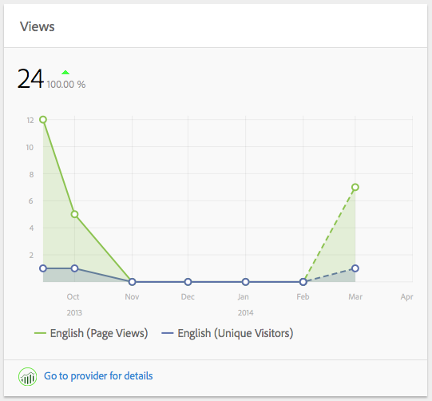

# 컨텐츠 인사이트{#content-insight}

>[!CAUTION]
>
>AEM 6.4가 확장 지원이 종료되었으며 이 설명서는 더 이상 업데이트되지 않습니다. 자세한 내용은 [기술 지원 기간](https://helpx.adobe.com/kr/support/programs/eol-matrix.html). 지원되는 버전 찾기 [여기](https://experienceleague.adobe.com/docs/).

컨텐츠 인사이트는 웹 분석 및 SEO 추천을 사용하여 페이지 성능에 대한 정보를 제공합니다. 컨텐츠 인사이트를 사용하여 페이지를 수정하는 방법을 결정하거나 이전 변경 사항이 성능에 어떻게 변경되었는지 알아보십시오. 작성하는 모든 페이지의 경우, 컨텐츠 인사이트를 열어 페이지를 분석할 수 있습니다.

컨텐츠 인사이트 페이지의 레이아웃은 사용 중인 장치의 화면 크기 및 방향에 맞게 변경됩니다.

## 보고서 데이터

컨텐츠 인사이트 페이지에는 Adobe SiteCatalyst, Adobe Target, Adobe Social 및 BrightEdge 데이터를 사용하는 보고서가 포함되어 있습니다.

* SiteCatalyst: 다음 지표에 대한 보고서를 사용할 수 있습니다.

   * 페이지 보기 수
   * 페이지에서 보낸 평균 시간
   * 소스

* Target: 페이지에 오퍼가 포함된 캠페인 활동에 대한 보고서입니다.
* BrightEdge: 검색 엔진에 대한 페이지 가시성을 향상시키는 페이지 기능에 대한 보고서이며 구현해야 하는 기능을 권장합니다.

자세한 내용은 [페이지에 대한 Analytics 및 Recommendations 열기](/help/sites-authoring/ci-analyze.md#opening-analytics-and-recommendations-for-a-page).

## 보고 기간

보고서는 사용자가 제어하는 기간 동안의 데이터를 보여줍니다. 보고 기간을 조정하면 보고서가 해당 기간의 데이터로 자동으로 새로 고쳐집니다. 시각적 큐는 각 버전의 성능을 비교할 수 있도록 페이지 버전이 변경된 시간을 나타냅니다.

또한 보고된 데이터의 세부기간을 지정할 수도 있습니다. 예를 들어 일별, 주별, 월별 또는 연간 데이터를 볼 수 있습니다.

자세한 내용은 [보고 기간 변경](/help/sites-authoring/ci-analyze.md#changing-the-reporting-period).

>[!NOTE]
>
>컨텐츠 인사이트 보고서를 사용하려면 관리자가 SiteCatalyst, Target 및 BrightEdge와 AEM을 통합해야 합니다. 자세한 내용은 [SightCatalyst와 통합](/help/sites-administering/adobeanalytics.md), [Adobe Target과 통합](/help/sites-administering/target.md), 및 [BrightEdge와 통합](/help/sites-administering/brightedge.md).

## 보기 보고서 {#the-views-report}

보기 보고서에는 페이지 트래픽을 평가하기 위한 다음 기능이 포함되어 있습니다.

* 보고 기간 동안의 페이지에 대한 총 보기 수입니다.
* 보고 기간 동안의 보기 횟수 그래프:

   * 총 보기 수.
   * 고유 방문자 수.

## 페이지 평균 참여 보고서 {#the-page-average-engaged-report}

페이지 평균 참여 보고서에는 페이지 효과를 평가하기 위한 다음 기능이 포함되어 있습니다.

* 전체 보고 기간 동안 페이지가 열려 있는 평균 시간입니다.
* 보고 기간 동안의 페이지 보기 평균 길이 그래프입니다.

## 소스 보고서 {#the-sources-report}

소스 보고서는 사용자가 페이지로 이동한 방법(예: 검색 엔진 결과 또는 알려진 URL 사용)을 나타냅니다.

## 바운스 수 보고서 {#the-bounces-report}

바운스 수 보고서에는 선택한 보고 기간 동안 페이지에 대해 발생한 바운스 수를 보여주는 그래프가 포함되어 있습니다.

## 캠페인 활동 보고서 {#the-campaign-activity-report}

페이지가 활성 상태인 각 캠페인에 대해 다음과 같은 보고서가 나타납니다. *캠페인 이름* 활동. 보고서는 오퍼가 제공되는 각 세그먼트에 대한 페이지 노출 횟수 및 전환을 보여줍니다.

## SEO Recommendations 보고서 {#the-seo-recommendations-report}

SEO Recommendations 보고서에는 페이지에 대한 BrightEdge 분석 결과가 포함되어 있습니다. 이 보고서는 검색 엔진을 사용하여 검색성을 최대화하기 위해 페이지가 포함하는 기능과 포함하지 않는 기능을 나타내는 페이지 기능 확인 목록입니다.

이 보고서를 사용하면 페이지 검색성을 향상시키기 위해 작업을 만들 수 있습니다. Recommendations은 권장 사항을 구현하기 위해 작업이 생성되었음을 나타냅니다. 자세한 내용은 [SEO Recommendations용 작업 할당](/help/sites-authoring/ci-analyze.md#assigning-tasks-for-seo-recommendations).

