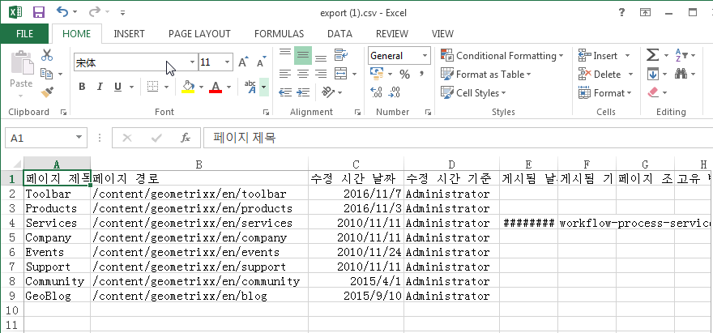
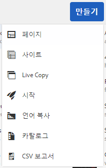
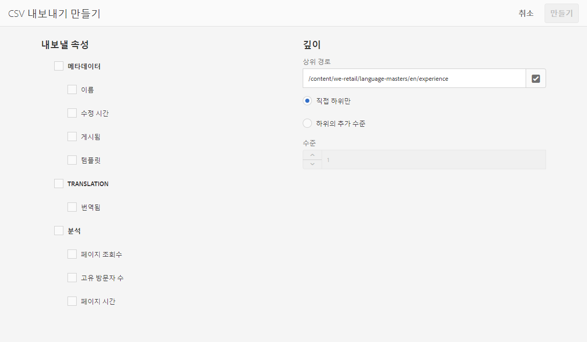

# CSV로 내보내기{#export-to-csv}

>[!CAUTION]
>
>AEM 6.4가 확장 지원이 종료되었으며 이 설명서는 더 이상 업데이트되지 않습니다. 자세한 내용은 [기술 지원 기간](https://helpx.adobe.com/kr/support/programs/eol-matrix.html). 지원되는 버전 찾기 [여기](https://experienceleague.adobe.com/docs/).

**CSV 내보내기 만들기** 로컬 시스템에서 페이지에 대한 정보를 CSV 파일로 내보낼 수 있습니다.

* 다운로드한 파일은 `export.csv`라고 합니다.
* 콘텐츠는 사용자가 선택한 속성에 따라 다릅니다.
* 내보내기에 대한 깊이와 함께 경로를 정의할 수 있습니다.

>[!NOTE]
>
>브라우저의 다운로드 기능 및 기본 대상이 사용됩니다.

CSV 내보내기 만들기 마법사를 사용하여 다음을 선택할 수 있습니다.

* 내보낼 속성

   * 메타데이터

      * 수정됨
      * 게시됨
   * 분석

      * 페이지 조회수
      * 고유 방문자
      * 페이지 시간

* 깊이

   * 상위 경로
   * 직접 하위만
   * 하위의 추가 수준
   * 수준

결과 `export.csv` 파일은 Excel 또는 기타 호환되는 애플리케이션에서 열 수 있습니다. 예를 들면 다음과 같습니다.

만들기 **CSV 내보내기** 선택 사항은 **Sites** 콘솔(목록 보기): 이것은 **만들기** 드롭다운 메뉴:

CSV 내보내기를 만들려면:

1. **사이트** 콘솔을 열고 필요한 경우 필요한 위치로 이동합니다.
1. 도구 모음에서 를 선택합니다 **만들기** 그런 다음 **CSV 내보내기** 마법사를 열려면 다음을 수행하십시오.

   

1. 내보낼 필수 속성을 선택합니다.
1. **만들기**&#x200B;를 선택합니다.
