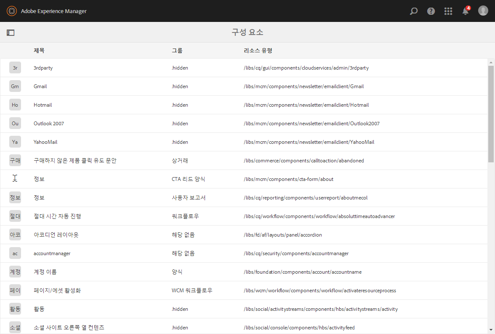
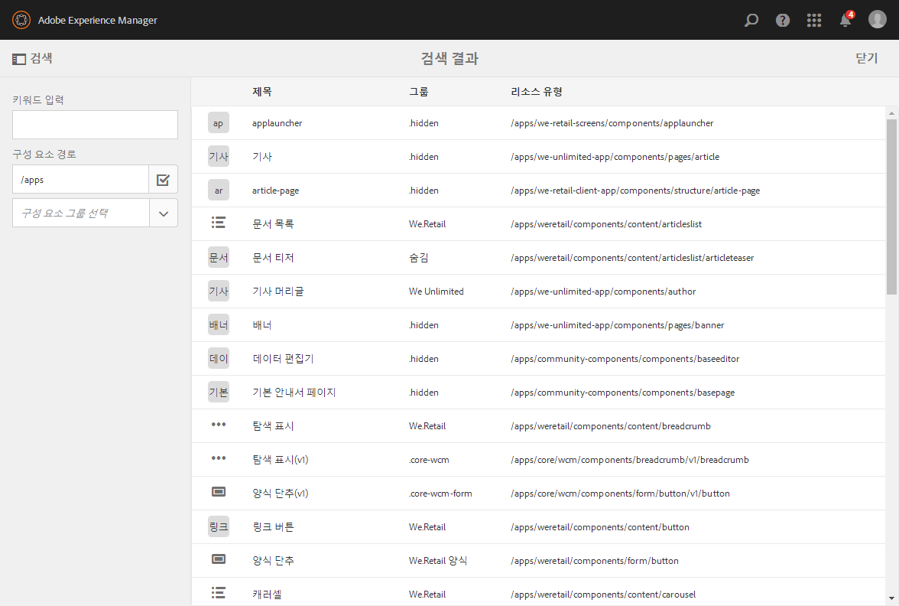
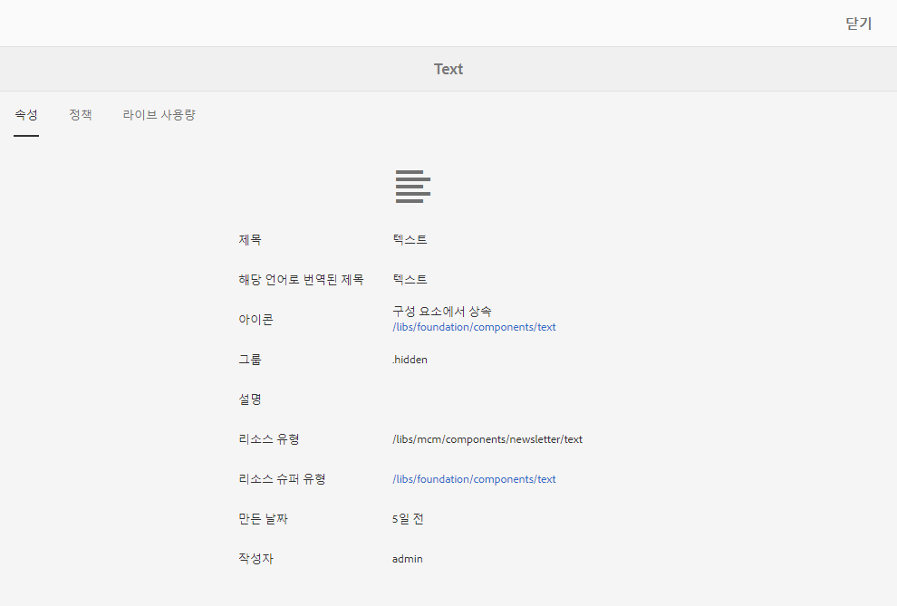
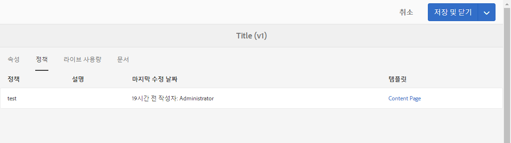
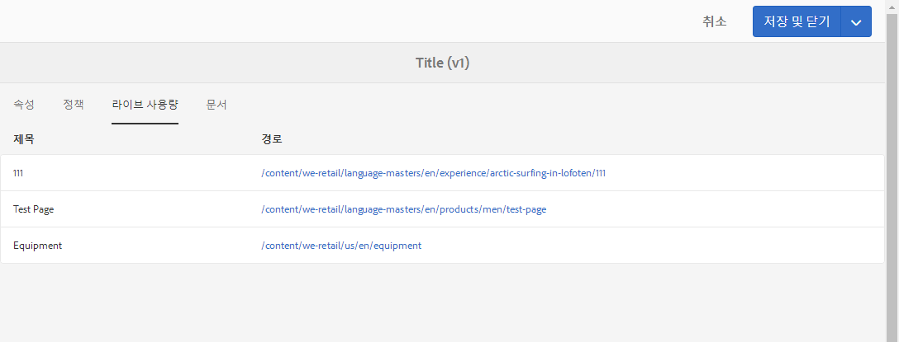
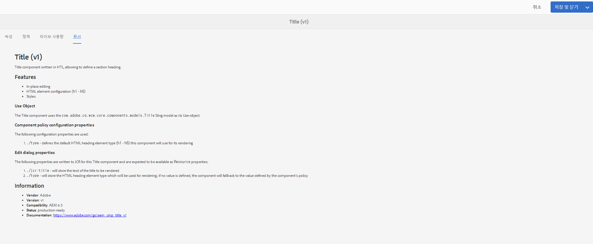

# 구성 요소 콘솔{#components-console}

>[!CAUTION]
>
>AEM 6.4가 확장 지원이 종료되었으며 이 설명서는 더 이상 업데이트되지 않습니다. 자세한 내용은 [기술 지원 기간](https://helpx.adobe.com/kr/support/programs/eol-matrix.html). 지원되는 버전 찾기 [여기](https://experienceleague.adobe.com/docs/).

구성 요소 콘솔에서 인스턴스에 대해 정의된 모든 구성 요소를 탐색하고 각 구성 요소에 대한 주요 정보를 볼 수 있습니다.

다음 위치에서 액세스할 수 있습니다. **도구** -> **일반** -> **구성 요소**. In the console, card and list view are available. Because there is no tree structure for components, column view is not available.

>[!NOTE]
>
>구성 요소 콘솔은 시스템의 모든 구성 요소를 표시합니다. [구성 요소 브라우저](/help/sites-authoring/author-environment-tools.md#components-browser)는 작성자가 사용할 수 있는 구성 요소를 표시하며 마침표(`.`)로 시작하는 모든 구성 요소 그룹을 숨깁니다.

## 검색 {#search-features}

**콘텐츠 전용** 아이콘(왼쪽 상단)을 사용하여 구성 요소를 검색 및/또는 필터링할 **검색** 패널을 열 수 있습니다.

## 구성 요소 세부 정보 {#component-details}

특정 구성 요소에 대한 세부 사항을 보려면 필요한 리소스를 탭/클릭합니다. 세 개의 탭에서 다음을 제공합니다.

* **속성**

   

   [속성] 탭에서 다음 작업을 수행할 수 있습니다.

   * 구성 요소의 일반 속성 확인
   * 방법 보기 [아이콘 또는 약어를 정의했습니다.](/help/sites-developing/components-basics.md#component-icon-in-touch-ui) 구성 요소에 사용할 수 있습니다.

      * 아이콘 소스를 클릭하면 해당 구성 요소로 이동합니다.
   * 보기 **리소스 유형** 및 **리소스 슈퍼 유형** (정의된 경우) 포함할 수 없습니다.

      * 리소스 수퍼 유형 을 클릭하면 해당 구성 요소로 이동합니다.
   >[!NOTE]
   >
   >`/apps`는 런타임 시 편집할 수 없으므로 구성 요소 콘솔은 읽기 전용입니다.

* **정책**

   

* **라이브 사용량**

   

   >[!CAUTION]
   >
   >이 보기에 대해 수집 중인 정보의 특성으로 인해 순서대로 구성하거나 표시하는 데 시간이 걸릴 수 있습니다.

* **설명서**

   개발자가 다음을 제공한 경우 [구성 요소에 대한 설명서](/help/sites-developing/developing-components.md#documenting-your-component)로 설정되면 **설명서** 탭. 사용 가능한 설명서가 없으면 **설명서** 탭이 표시되지 않습니다.

   
