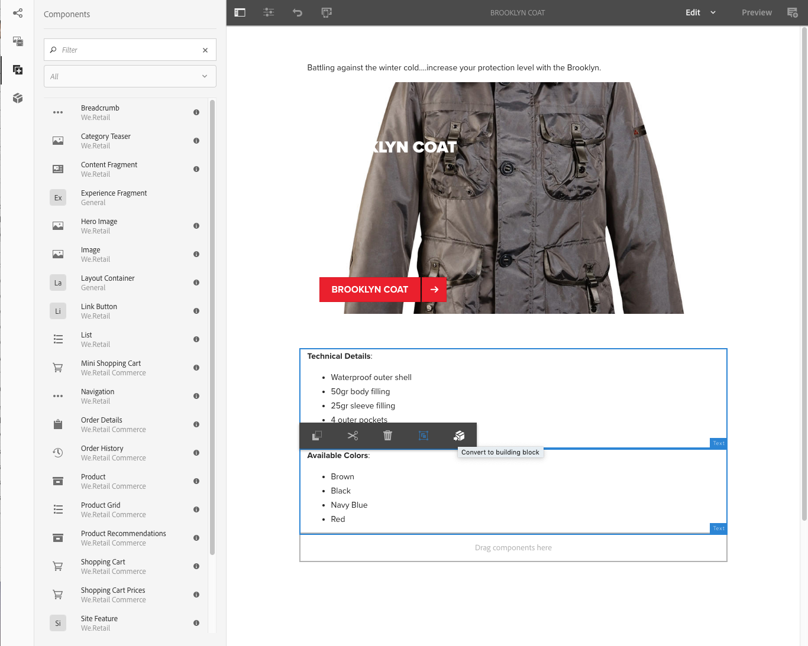

# 경험 조각{#experience-fragments}

경험 조각은 페이지 내에서 참조할 수 있는 컨텐츠 및 레이아웃을 포함한 하나 이상의 구성 요소 그룹입니다. 모든 구성 요소를 포함할 수 있습니다.

경험 조각:

* 경험(페이지)의 일부입니다.
* 여러 페이지에서 사용할 수 있습니다.
* 구조 및 구성 요소를 정의하기 위한 템플릿(편집만 가능)을 기반으로 합니다.
* 단락 시스템에서 레이아웃이 있는 하나 이상의 구성 요소로 구성되어 있습니다.
* 다른 경험 조각을 포함할 수 있습니다.
* 다른 조각(다른 경험 조각 포함)과 결합하여 전체 페이지(경험)를 형성할 수 있습니다.
* 다른 변형이 있을 수 있으며, 이 변형이 컨텐츠 및/또는 구성 요소를 공유할 수 있습니다.
* 조각의 여러 변형에서 사용할 수 있는 빌딩 블록으로 분할할 수 있습니다.

경험 조각을 사용할 수 있습니다.

* 작성자가 페이지의 일부(경험 조각)를 재사용하려는 경우 해당 조각을 복사하여 붙여넣어야 합니다. 이러한 복사/붙여넣기 경험을 생성하고 유지 관리하는 데는 시간이 오래 걸리고 사용자 오류가 발생합니다. 경험 조각은 복사/붙여넣기가 필요하지 않습니다.
* 경험 조각을 사용하여 헤드리스 CMS 사용 사례를 지원할 수 있습니다. 작성자는 작성에만 AEM을 사용하고 고객에게 전달하는 데에는 사용하지 않습니다. 타사 시스템/터치포인트는 이러한 경험을 소모한 다음 최종 사용자에게 전달합니다.

>[!NOTE]
>
>경험 조각에 대한 쓰기 액세스 권한을 사용하려면 그룹에 사용자 계정을 등록해야 합니다.
>
>`experience-fragments-editors`
>
>문제가 발생하는 경우 시스템 관리자에게 문의하십시오.

## 언제 경험 조각을 사용해야 합니까? {#when-should-you-use-experience-fragments}

경험 조각은 다음과 같은 경우 사용해야 합니다.

* 경험을 재사용하려고 할 때

   * 경험을 동일하거나 유사한 컨텐츠에서 재사용

* 타사의 컨텐츠 전달 플랫폼으로 AEM을 사용할 때

   * AEM을 컨텐츠 전달 플랫폼으로 사용하려는 솔루션
   * 타사 터치포인트에 컨텐츠 포함

* 다양한 변형 또는 표현물에 대한 경험이 있는 경우

   * 채널 또는 컨텍스트별 변형
   * 그룹에 의미가 있는 경험(예: 채널 간에 다양한 경험이 있는 캠페인)

* Omnichannel Commerce를 사용하는 경우

   * 소셜 미디어 채널에서 대규모로 상거래 관련 컨텐츠 공유
   * 터치포인트를 거래와 관련시키기

## 경험 조각 구성 {#organizing-your-experience-fragments}

권장 사항:
* 폴더를 사용하여 경험 조각 구성하는 것이 좋습니다,

* [이러한 폴더에 허용된 템플릿을 구성합니다](#configure-allowed-templates-folder).

폴더를 만들면 다음 작업을 수행할 수 있습니다.

* 경험 조각에 의미 있는 구조를 만들 수 있습니다(예: 분류에 따라).

   >[!NOTE]
   >
   >경험 조각의 구조를 사이트의 페이지 구조에 일치시킬 필요는 없습니다.

* [폴더 수준에서 허용된 템플릿을 할당할 수 있습니다](#configure-allowed-templates-folder).

   >[!NOTE]
   >
   >[템플릿 편집기](/help/sites-authoring/templates.md)를 사용하여 나만의 템플릿을 생성할 수 있습니다.

다음 예는 에 따라 구조화된 경험 조각을 보여줍니다 `Contributors`. 사용된 구조는 다중 사이트 관리(언어 사본 포함)와 같은 다른 기능을 사용할 방법도 보여줍니다.

>[!CAUTION]
>
>다음 스크린샷은 Adobe Experience Manager을 Cloud Service으로 사용하여 WKND 사이트에서 촬영되었습니다.

## 경험 조각용 폴더 만들기 및 구성 {#creating-and-configuring-a-folder-for-your-experience-fragments}

경험 조각용 폴더를 만들고 구성하려면 다음 작업을 수행하는 것이 좋습니다.

1. [폴더를 만듭니다](/help/sites-authoring/managing-pages.md#creating-a-new-folder).

1. [해당 폴더에 대해 허용되는 경험 조각 템플릿을 구성합니다](#configure-allowed-templates-folder).

>[!NOTE]
>
>It is also possible to configure the [Allowed Templates for your instance](#configure-allowed-templates-instance), but this method is **not** recommended as the values may be overwritten upon upgrade.

### 폴더에 대해 허용되는 템플릿 구성 {#configure-allowed-templates-folder}

>[!NOTE]
>
>이 방법은 업그레이드 시 값을 덮어쓰지 않으므로 **[!UICONTROL 허용된 템플릿]**&#x200B;을 지정하는 데 권장됩니다.

1. 필수 **[!UICONTROL 경험 조각]** 폴더로 이동합니다.

1. 폴더를 선택한 다음, **[!UICONTROL 속성]**&#x200B;을 선택합니다.

1. **[!UICONTROL 허용된 템플릿]** 필드에서 필요한 템플릿을 검색할 정규 표현식을 지정합니다.

   예:
   `/conf/(.*)/settings/wcm/templates/experience-fragment(.*)?`

   

1. **[!UICONTROL 저장 후 닫기]**&#x200B;를 선택합니다.

### 인스턴스에 대해 허용되는 템플릿 구성 {#configure-allowed-templates-instance}

>[!CAUTION]
>
>It is not recommended to change the **[!UICONTROL Allowed Templates]** by this method, as the templates specified may be overwritten upon upgrade.
>
>이 대화 상자는 정보용으만 사용하십시오.

1. 필요한 **[!UICONTROL 경험 조각]** 콘솔로 이동합니다.

1. **[!UICONTROL 구성 옵션]**&#x200B;을 선택합니다.

   

1. **[!UICONTROL 경험 조각 구성]** 대화 상자에서 필요한 템플릿을 지정합니다.

   

1. **[!UICONTROL 저장]**&#x200B;을 선택합니다.

## 경험 조각 생성 {#creating-an-experience-fragment}

경험 조각을 생성하려면 다음을 수행하십시오.

1. 전역 탐색에서 **[!UICONTROL 경험 조각]**&#x200B;을 선택합니다.

   

1. Navigate to the required folder and select **[!UICONTROL Create]**.

1. **[!UICONTROL 경험 조각]**&#x200B;을 선택하여 **[!UICONTROL 경험 조각 만들기]** 마법사를 엽니다.

   필요한 **[!UICONTROL 템플릿]**&#x200B;을 선택하고 **[!UICONTROL 다음]**&#x200B;을 선택합니다.

   

1. **[!UICONTROL 경험 조각]**&#x200B;에 대한 속성을 입력합니다.

   **[!UICONTROL 제목]**&#x200B;은 필수입니다. **[!UICONTROL 이름]**&#x200B;을 비워 두면 **[!UICONTROL 제목]**&#x200B;에서 파생됩니다.

   

1. **[!UICONTROL 만들기]**&#x200B;를 클릭합니다.

   메시지가 표시됩니다. 선택:

   * **[!UICONTROL 완료]**: 콘솔로 돌아갑니다. 
   * **[!UICONTROL 열기]**: 조각 편집기를 엽니다.

## 경험 조각 편집 {#editing-your-experience-fragment}

[경험 조각 편집기]는 일반 페이지 편집기와 유사한 기능을 제공합니다. See [Editing Page Content](/help/sites-authoring/editing-content.md) for more information on how to use it.

다음 예제 프로시저는 제품에 대한 티저를 작성하는 방법을 보여 줍니다.

1. Drag and drop a **[!UICONTROL Category Teaser]** from the [Components Browser](/help/sites-authoring/author-environment-tools.md#components-browser).

   

1. 구성 요소 도구 모음에서 **[[!UICONTROL 구성]](/help/sites-authoring/editing-content.md#edit-configure-copy-cut-delete-paste)**&#x200B;을 선택합니다.
1. **[!UICONTROL 자산]**&#x200B;을 추가하고 필요에 따라 **[!UICONTROL 속성]**&#x200B;을 정의합니다.
1. **[!UICONTROL 완료]**(틱 아이콘)로 정의를 확인합니다.
1. 필요에 따라 구성 요소를 더 추가합니다.

## 경험 조각 변형 만들기 {#creating-an-experience-fragment-variation}

필요에 따라 경험 조각의 변형을 만들 수 있습니다.

1. [편집](/help/sites-authoring/experience-fragments.md#editing-your-experience-fragment)할 조각을 엽니다.
1. **[!UICONTROL 변형]** 탭을 엽니다.

   

1. **만들기**&#x200B;를 사용하여 다음을 생성할 수 있습니다.

   * **[!UICONTROL 변형]**
   * **[!UICONTROL 변형을 Live Copy로]**.

1. 필수 속성을 정의합니다.

   * **[!UICONTROL 템플릿]**
   * **[!UICONTROL 제목]**
   * **[!UICONTROL 이름]**(비워 두면 제목에서 파생됨)
   * **[!UICONTROL 설명]**
   * **[!UICONTROL 변형 태그]**

   

1. **[!UICONTROL 완료]**(틱 아이콘)로 확인하면 새 변형이 패널에 표시됩니다.

   

## 경험 조각 사용 {#using-your-experience-fragment}

이제 페이지를 작성할 때 경험 조각을 사용할 수 있습니다.

1. 편집할 페이지를 엽니다.

   예: [http://localhost:4502/editor.html/content/we-retail/language-masters/kr/products/men.html](http://localhost:4502/editor.html/content/we-retail/language-masters/kr/products/men.html)

1. 구성 요소 브라우저에서 페이지 단락 시스템으로 구성 요소를 끌어 와서 경험 조각 구성 요소의 인스턴스를 생성합니다.

   

1. 다음 중 한 방법으로 실제 경험 조각을 구성 요소 인스턴스에 추가합니다.

   * 자산 브라우저에서 필요한 조각을 구성 요소에 끌어다 놓기
   * 구성 요소 도구 모음에서 **[!UICONTROL 구성]**&#x200B;을 선택하고 사용할 조각을 지정한 다음 **완료**(틱)로 확인

   

   >[!NOTE]
   >
   >구성 요소 도구 모음의 편집은 조각 편집기에서 조각을 여는 단축키로 작동합니다.

## 빌딩 블록 {#building-blocks}

한 개 이상의 구성 요소를 선택하여 조각 내에서 재활용할 빌딩 블록을 생성할 수 있습니다.

### 빌딩 블록 작성 {#creating-a-building-block}

새 빌딩 블록을 작성하려면 다음을 수행하십시오.

1. 경험 조각 편집기에서 재사용할 구성 요소를 선택합니다.

   

1. 구성 요소 도구 모음에서 **[!UICONTROL 빌딩 블록으로 변환]**&#x200B;을 선택합니다.

   

   예:

   

1. **[!UICONTROL 빌딩 블록]**&#x200B;의 이름을 입력하고 **[!UICONTROL 변환]**&#x200B;으로 확인합니다.

   

1. **빌딩 블록**&#x200B;이 탭에 표시되며, 단락 시스템에서 선택할 수 있습니다.

   

### 빌딩 블록 관리 {#managing-a-building-block}

빌딩 블록은 **[!UICONTROL 빌딩 블록]** 탭에서 볼 수 있습니다. 각 블록에서 다음 작업을 수행할 수 있습니다.

* 마스터로 이동: 새 탭에서 마스터 변형을 엽니다.
* 이름 변경
* 삭제

### 빌딩 블록 사용 {#using-a-building-block}

빌딩 블록을 구성 요소처럼, 조각의 단락 시스템으로 끌 수 있습니다.

## 일반 HTML 표현물 {#the-plain-html-rendition}

Using the `.plain.` selector in the URL, you can access the plain HTML rendition.

이는 브라우저에서 사용할 수 있지만 주요 목적은 URL만 사용하여 다른 응용 프로그램(예: 타사 웹 앱, 사용자 지정 모바일 구현)이 경험 조각의 컨텐츠에 직접 액세스하도록 허용하는 것입니다.

일반 HTML 변환은 다음과 같은 경로에 프로토콜, 호스트 및 컨텍스트 경로를 추가합니다.

* 의 유형: `src`, `href`또는 `action`

* 또는 다음으로 끝남: `-src`, 또는 `-href`

예:

`.../brooklyn-coat/master.plain.html`

>[!NOTE]
>
>링크는 항상 게시 인스턴스를 참조합니다. 이러한 링크는 타사에서 소비하기 위한 것이므로 작성자가 아닌 게시 인스턴스에서 항상 호출됩니다.

## 경험 조각 내보내기 {#exporting-experience-fragments}

기본적으로 경험 조각은 HTML 형식으로 제공됩니다. 이는 AEM과 타사 채널에서 모두 동일하게 사용할 수 있습니다.

Adobe Target으로 내보내기 위해 HTML이 사용됩니다. 자세한 내용은 [경험 조각과 Target 통합](/help/sites-administering/experience-fragments-target.md)을 참조하십시오.

