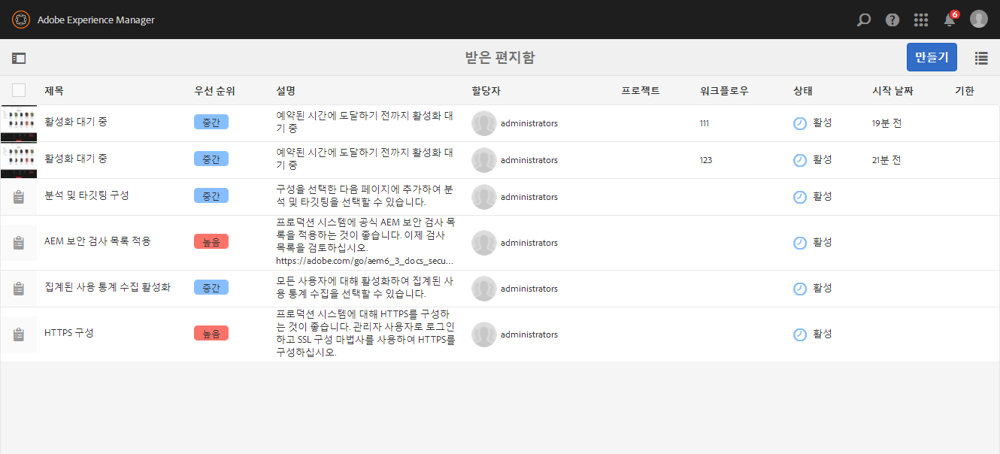
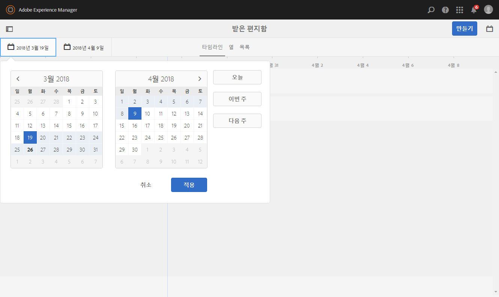
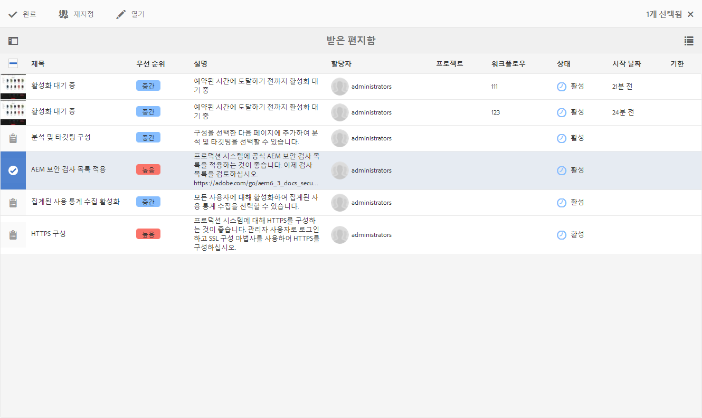
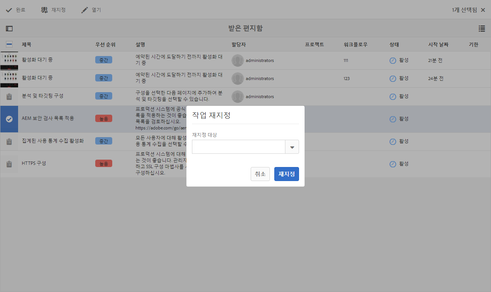
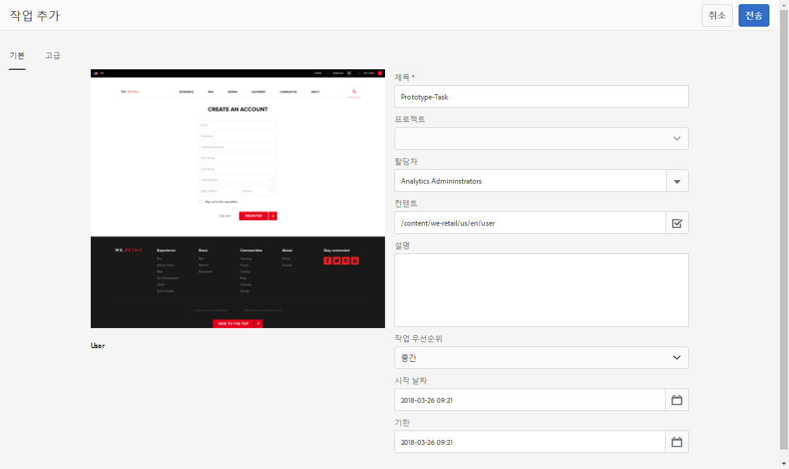
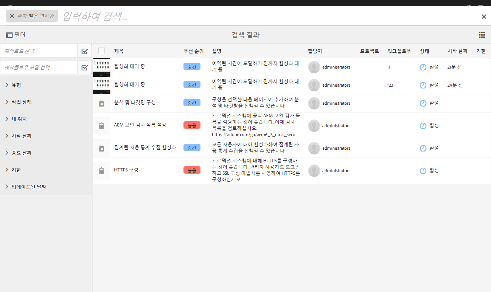
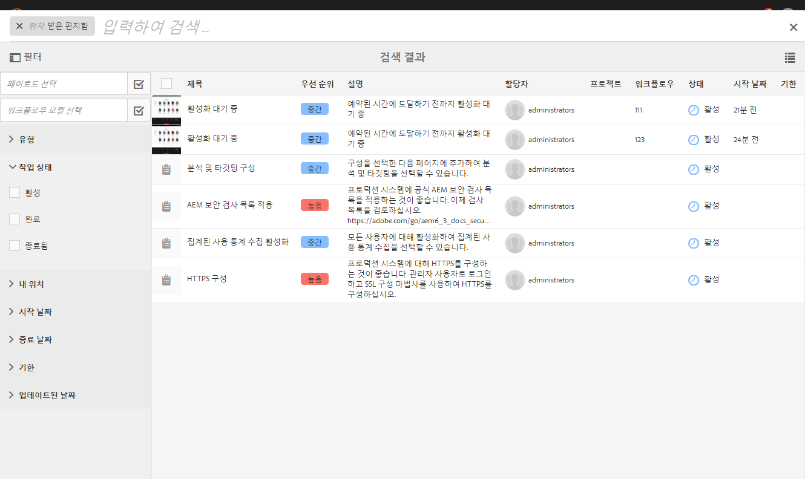

# 받은 편지함{#your-inbox}

워크플로우 및 프로젝트를 포함하여 다양한 AEM 영역에서 알림을 받을 수 있습니다. 예를 들면 다음과 같습니다.

* 작업:

   * AEM UI 내의 다양한 지점(예: **프로젝트** 아래)에서 생성할 수 있습니다.
   * 워크플로우 **작업 만들기** 또는 **프로젝트 작업 만들기** 단계의 결과일 수 있습니다.

* 워크플로우:

   * 페이지 컨텐츠에서 수행해야 하는 작업을 나타내는 작업 항목입니다.

      * 워크플로우 **참가자** 단계의 결과입니다.
   * 관리자가 실패한 단계를 재시도할 수 있도록 허용하는 실패 항목입니다.

사용자의 받은 편지함에서 이러한 알림을 받고 확인하여 작업을 수행할 수 있습니다.

>[!NOTE]
>
>곧바로 사용할 수 있는 AEM에는 관리자 사용자 그룹에 할당된 관리 작업이 미리 로드되어 있습니다. 자세한 내용은 [뛰어난 관리 작업](#out-of-the-box-administrative-tasks)을 참조하십시오.

>[!NOTE]
>
>항목 유형에 대한 자세한 정보는 다음을 참조하십시오.
>
>* [프로젝트](/help/sites-authoring/touch-ui-managing-projects.md)
>* [프로젝트 - 작업 중](/help/sites-authoring/task-content.md)
>* [워크플로우](/help/sites-authoring/workflows.md)
>* [양식](/help/forms/home.md)
>

## 헤더의 받은 편지함 {#inbox-in-the-header}

어떤 콘솔에서든 헤더에는 받은 편지함의 현재 알림 수가 표시됩니다. 표시기를 열어서 작업이 필요한 페이지에 빨리 액세스하거나 받은 편지함에 액세스할 수도 있습니다.

>[!NOTE]
>
>특정 작업이 [해당 리소스의 카드 보기에도](/help/sites-authoring/basic-handling.md#card-view) 표시됩니다.

## 뛰어난 관리 작업  {#out-of-the-box-administrative-tasks}

특별한 관리 작업을 제공하는 AEM에는 관리자 사용자 그룹에 지정된 4개의 작업이 사전에 로드되어 있습니다.

* [분석 및 타깃팅 구성](/help/sites-administering/opt-in.md)
* [AEM 보안 검사 목록 적용](/help/sites-administering/security-checklist.md)
* 집계된 사용 통계 수집 활성화
* [HTTPS 구성](/help/sites-administering/ssl-by-default.md)

## 받은 편지함 열기 {#opening-the-inbox}

AEM 알림 받은 편지함 열기

1. 도구 모음에서 표시기를 클릭/탭합니다.

1. **모두 보기**&#x200B;를 선택합니다. **AEM 받은 편지함**&#x200B;이 열립니다. 받은 편지함은 워크플로우, 프로젝트 및 작업의 항목을 표시합니다.
1. 기본 보기는 [목록 보기](#inbox-list-view)이지만 [달력 보기](#inbox-calendar-view)로 전환할 수도 있습니다. 이는 [보기 선택기] (도구 모음, 오른쪽 상단)로 수행할 수 있습니다.

   두 보기 모두에 대해 [보기 설정](#inbox-view-settings)을 정의할 수 있습니다. 사용 가능한 옵션은 현재 보기에 따라 다릅니다.

   

>[!NOTE]
>
>받은 편지함은 콘솔로 작동하므로 완료되면 [전역 탐색](/help/sites-authoring/basic-handling.md#global-navigation) 또는 [검색](/help/sites-authoring/search.md)을 사용하여 다른 위치를 탐색합니다.

### 받은 편지함 - 목록 보기 {#inbox-list-view}

이 보기는 주요 관련 정보와 함께 모든 항목을 나열합니다.

### 받은 편지함 - 달력 보기 {#inbox-calendar-view}

이 보기는 달력 내에서의 위치 및 선택한 정밀 보기에 따라 항목을 표시합니다.

다음을 작업을 수행할 수 있습니다.

* 특정 보기, 즉 **타임라인**, **열**, **목록**&#x200B;을 선택할 수 있습니다.

* **예약**&#x200B;에 따라 표시할 작업, 즉 **모두**, **계획됨**, **진행 중**, **곧**, **기한 초과** 작업을 지정할 수 있습니다.

* 항목에 대한 자세한 정보를 드릴다운할 수 있습니다.
* 보기에 초점을 맞출 날짜 범위를 선택할 수 있습니다.

### 받은 편지함 - 설정 보기 {#inbox-view-settings}

두 가지 보기(목록 및 달력)에 대해 다음과 같이 설정을 정의할 수 있습니다.

* **달력 보기**

   **달력 보기**&#x200B;의 경우 다음을 구성할 수 있습니다.

   * **그룹화 기준**
   * **예약** 또는 **없음**
   * **카드 크기**

   

* **목록 보기**

   **목록 보기**&#x200B;의 경우 정렬 메커니즘을 구성할 수 있습니다.

   * **정렬 기준**
   * **정렬 순서**

   

## 항목에 대한 작업 수행 {#taking-action-on-an-item}

1. 항목에 대해 작업을 수행하기 위해서는 해당 항목 옆에 있는 썸네일을 선택합니다. 해당 항목에 적용할 수 있는 작업에 대한 아이콘이 도구 모음에 표시됩니다.

   

   항목에 해당하는 작업은 다음과 같습니다.

   * **완료** 작업; 예를 들면 작업 또는 워크플로우 항목.
   * 항목을 **재지정**/**위임**&#x200B;합니다.
   * 항목을 **엽니다**. 항목 유형에 따라 다음 작업을 수행할 수 있습니다.

      * 항목 특성 표시
      * 추가 작업을 위해 적절한 대시보드 또는 마법사 열기
      * 관련 문서 열기
   * 이전 단계로 **돌아갑니다**.
   * 워크플로우에 대한 페이로드를 확인합니다.
   * 항목에서 프로젝트를 생성합니다.

   >[!NOTE]
   >
   >자세한 내용은 다음을 참조하십시오.
   >
   >* 워크플로우 항목 - [워크플로우에 참여](/help/sites-authoring/workflows-participating.md)

1. 선택한 항목에 따라 작업이 시작됩니다. 예를 들면 다음과 같습니다.

   * 작업에 해당하는 대화 상자가 열립니다.
   * 작업 마법사가 시작됩니다.
   * 문서 페이지가 열립니다.

   예를 들어 **재지정**&#x200B;은 다음과 같은 대화 상자가 열립니다.

   

   대화 상자, 마법사, 문서 페이지가 열렸는지 여부에 따라 다음을 수행할 수 있습니다.

   * 적절한 작업을 확인합니다(예: 재지정).
   * 작업을 취소합니다.
   * 예를 들어 작업 마법사나 문서 페이지가 열렸을 때 뒤로 화살표를 클릭하면 받은 편지함으로 돌아갈 수 있습니다.

## 작업 만들기 {#creating-a-task}

받은 편지함에서 작업을 만들 수 있습니다.

1. **만들기**&#x200B;와 **작업**&#x200B;을 차례대로 선택합니다.
1. **기본** 및 **고급** 탭에서 필수 필드를 작성합니다. **제목**&#x200B;만 필수이며, 나머지는 선택 항목입니다.

   * **기본**:

      * **제목**
      * **프로젝트**
      * **할당자**
      * **컨텐츠**; 페이로드와 유사하며 작업에서 저장소의 위치에 대한 참조입니다.
      * **설명**
      * **작업 우선순위**
      * **시작 날짜**
      * **기한**

   

   * **고급**

      * **이름**: URL을 구성하는 데 사용됩니다. 공백이 있는 경우 **제목**&#x200B;을 기준으로 합니다.

   

1. **제출**&#x200B;을 선택합니다.

## 프로젝트 만들기 {#creating-a-project}

특정 작업의 경우, 다음과 같이 해당 작업에 따라 [프로젝트](/help/sites-authoring/projects.md)를 만들 수 있습니다.

1. 썸네일에서 적절한 작업을 탭/클릭하여 선택합니다.

   >[!NOTE]
   >
   >**받은 편지함**&#x200B;의 **만들기** 옵션을 사용하여 생성된 작업만 프로젝트를 만드는 데 사용할 수 있습니다.
   >
   >워크플로우의 작업 항목은 프로젝트를 만드는 데 사용할 수 없습니다.

1. 도구 막대에서 **프로젝트 만들기**&#x200B;를 선택하여 마법사를 엽니다.
1. 해당 템플릿을 선택한 뒤 **다음**&#x200B;을 선택합니다.
1. 필수 속성을 지정합니다.

   * **기본**

      * **제목**
      * **설명**
      * **시작 날짜**
      * **기한**
      * **사용자** 및 역할
   * **고급**

      * **이름**

   >[!NOTE]
   >
   >자세한 내용은 [프로젝트 만들기](/help/sites-authoring/touch-ui-managing-projects.md#creating-a-project)를 참조하십시오.

1. **만들기**&#x200B;를 선택하여 작업을 확인합니다.

## AEM 받은 편지함에서 항목 필터링 {#filtering-items-in-the-aem-inbox}

나열된 항목을 필터링할 수 있습니다.

1. **AEM 받은 편지함**&#x200B;을 엽니다.

1. [필터 선택기]를 엽니다.

   

1. 기준의 범위에 따라 나열된 항목을 필터링할 수 있습니다. 예를 들어, 다음과 같이 정의할 수 있습니다.

   

   >[!NOTE]
   >
   >또한 [보기 설정](#inbox-view-settings)에서 [목록 보기](#inbox-list-view)를 사용할 때 정렬 순서를 구성할 수 있습니다.

