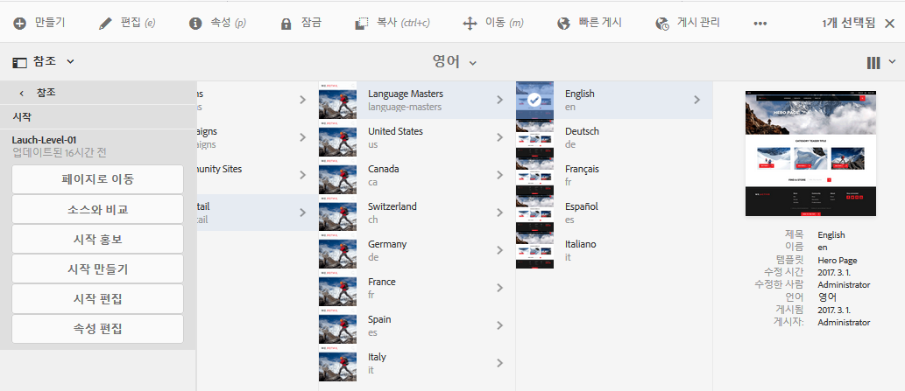
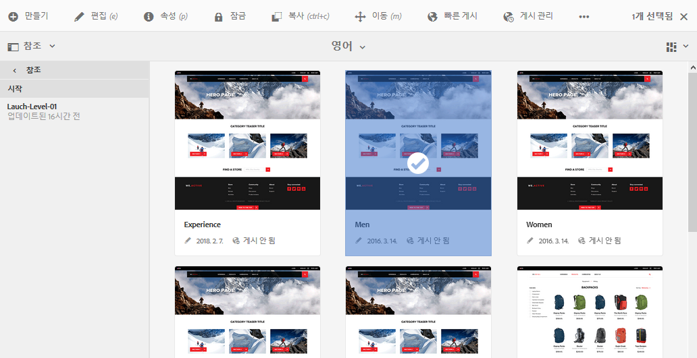

# 론치 편집{#editing-launches}

>[!CAUTION]
>
>AEM 6.4가 확장 지원이 종료되었으며 이 설명서는 더 이상 업데이트되지 않습니다. 자세한 내용은 [기술 지원 기간](https://helpx.adobe.com/kr/support/programs/eol-matrix.html). 지원되는 버전 찾기 [여기](https://experienceleague.adobe.com/docs/).

## 론치 페이지 편집 {#editing-launch-pages}

페이지(또는 페이지 세트)에 대한 론치가 만들어지면 페이지의 론치 카피에서 콘텐츠를 편집할 수 있습니다.

1. [참조의 론치(사이트 콘솔)](/help/sites-authoring/launches.md#launches-in-references-sites-console)에 액세스하여 사용 가능한 동작을 표시합니다.
1. 선택 **페이지로 이동합니다** 을 클릭하여 편집할 페이지를 엽니다.

### 라이브 카피에 따른 론치 페이지 편집 {#editing-launch-pages-subject-to-a-live-copy}

론치가 [live copy](/help/sites-administering/msm.md) 다음을 수행합니다.

* 구성 요소(컨텐츠 및/또는 속성)를 편집할 때 잠금 기호(작은 자물쇠)를 참조하십시오.
* 참조 **Live Copy** 탭 **페이지 속성**

라이브 카피는 *소스 분기에서* *론치 분기로* 콘텐츠를 동기화하여 소스에 적용된 변경 내용으로 론치를 최신 상태로 유지하는 데 사용됩니다.

표준 Live Copy를 편집할 수 있는 것과 동일한 방식으로 변경할 수 있습니다. 예:

* 닫힌 자물쇠를 클릭하면 이 동기화가 중단되고 론치에서 콘텐츠를 새로 업데이트할 수 있습니다. 잠금 해제되면(열려 있는 자물쇠) 소스 분기 내의 동일한 위치에서 수행한 변경 사항으로 변경 사항을 덮어쓰지 않습니다.
* 특정 페이지에 대한 상속을 **일시 중단**(및 **다시 시작**)합니다.

자세한 내용은 [Live Copy 콘텐츠 변경](/help/sites-administering/msm-livecopy.md#changing-live-copy-content)을 참조하십시오.

## 론치 페이지와 소스 페이지 비교 {#comparing-a-launch-page-to-its-source-page}

적용한 변경 내용을 추적하기 위해 **참조**&#x200B;에서 론치를 확인하고 론치 페이지를 소스 페이지와 비교할 수 있습니다.

1. 에서 **Sites** 콘솔, [론치의 소스 페이지로 이동하여 선택합니다](/help/sites-authoring/basic-handling.md#viewing-and-selecting-resources).
1. 를 엽니다. **[참조](/help/sites-authoring/basic-handling.md#references)** 패널 및 선택 **론치**.
1. 특정 론치를 선택한 다음 **소스와 비교**:

   

1. 두 페이지(론치와 소스)가 나란히 열립니다.

   이 기능 사용에 대한 자세한 내용은 [페이지 비교](/help/sites-authoring/page-diff.md).

## 사용된 소스 페이지 변경 {#changing-the-source-pages-used}

언제든지 론치용 소스 페이지의 범위에 페이지를 추가하거나 이 범위에서 페이지를 제거할 수 있습니다.

1. 다음 중 하나에서 론치에 액세스하여 선택합니다.

   * a [론치 콘솔](/help/sites-authoring/launches.md#the-launches-console):

      * **편집**&#x200B;을 선택합니다.
   * [참조(사이트 콘솔)](/help/sites-authoring/launches.md#launches-in-references-sites-console) 사용 가능한 작업을 표시하려면 다음을 수행하십시오.

      * **론치 편집**&#x200B;을 선택하십시오.

   소스 페이지가 표시됩니다.

1. 필요한 변경 내용을 적용한 다음 **저장**&#x200B;을 사용하여 확인합니다.

   >[!NOTE]
   >
   >페이지를 론치에 추가하려면 페이지가 공통 언어 루트 아래에 있어야 합니다. 즉, 단일 사이트 내에 있습니다.

## Launch 구성 편집 {#editing-a-launch-configuration}

언제든지 론치의 속성을 편집할 수 있습니다.

1. 다음 중 하나에서 론치에 액세스하여 선택합니다.

   * a [론치 콘솔](/help/sites-authoring/launches.md#the-launches-console):

      * 선택 **속성**.
   * [참조(사이트 콘솔)](/help/sites-authoring/launches.md#launches-in-references-sites-console) 사용 가능한 작업을 표시하려면 다음을 수행하십시오.

      * **속성 편집**&#x200B;을 선택하십시오.

   세부 사항이 표시됩니다.

1. 필요한 변경 내용을 적용한 다음 **저장**&#x200B;을 사용하여 확인합니다.

   See [Launches - the Order of Events](/help/sites-authoring/launches.md#launches-the-order-of-events) for information about the purpose and interaction of the **Launch Date** and **Production Ready** fields.

## 페이지의 론치 상태 살펴보기 {#discovering-the-launch-status-of-a-page}

참조 탭에서 특정 론치를 선택하면 상태가 표시됩니다(참조 [참조의 론치(사이트 콘솔)](/help/sites-authoring/launches.md#launches-in-references-sites-console)).

