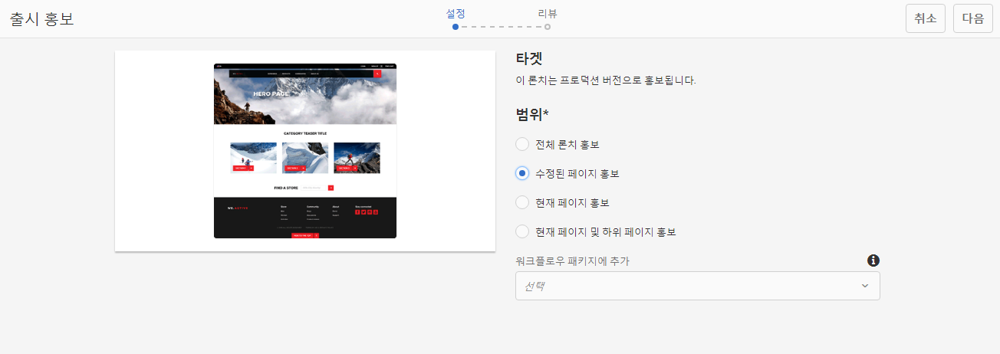
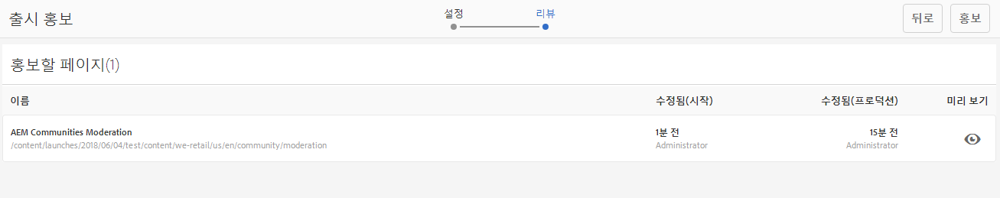
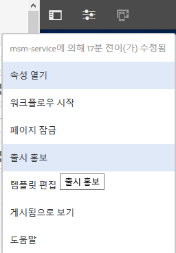
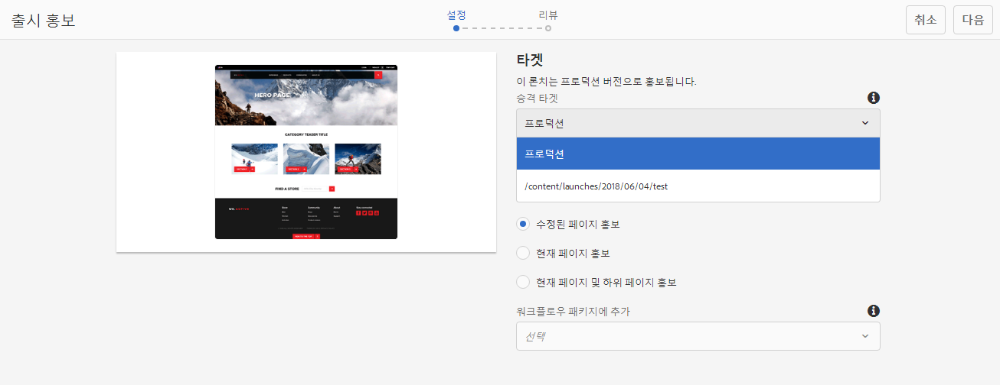
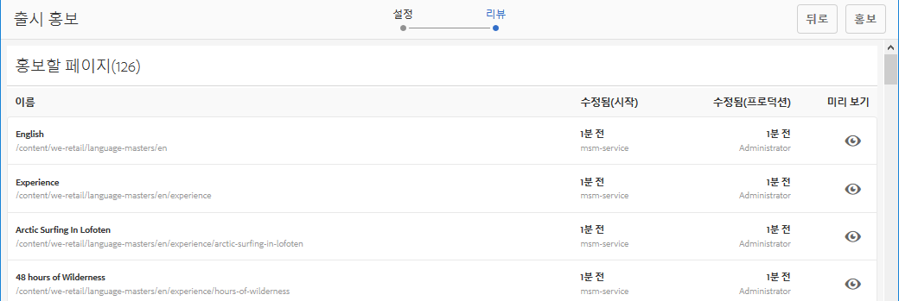
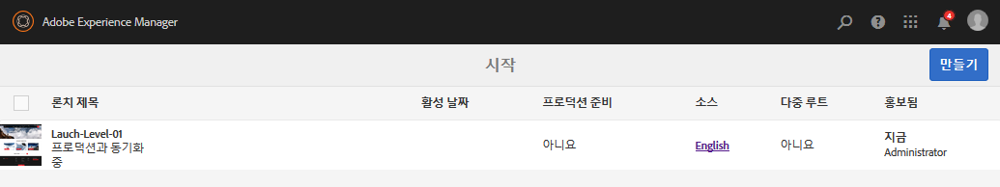
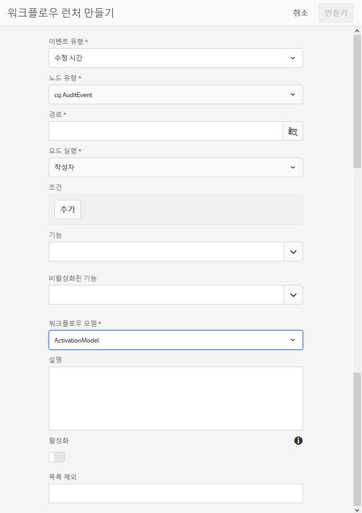

# 론치 홍보{#promoting-launches}

>[!CAUTION]
>
>AEM 6.4가 확장 지원이 종료되었으며 이 설명서는 더 이상 업데이트되지 않습니다. 자세한 내용은 [기술 지원 기간](https://helpx.adobe.com/kr/support/programs/eol-matrix.html). 지원되는 버전 찾기 [여기](https://experienceleague.adobe.com/docs/).

게시 전에 콘텐츠를 소스(프로덕션)로 다시 이동하려면 론치 페이지를 홍보해야 합니다. 론치 페이지가 홍보되면 해당 소스 페이지가 홍보된 페이지의 콘텐츠로 바뀝니다. 론치 페이지를 승격할 때 다음 옵션을 사용할 수 있습니다.

* 현재 페이지만 홍보할지 아니면 전체 론치를 홍보할지 여부.
* 현재 페이지의 하위 페이지를 홍보할지 여부.
* 전체 론치를 홍보할지 아니면 변경된 페이지만 홍보할지 여부.

>[!NOTE]
>
>론치 페이지를 대상(**프로덕션**)를 활성화하면 됩니다. **프로덕션** 페이지를 엔티티로(프로세스를 더 빠르게 만들기). 페이지를 작업 흐름 패키지에 추가하고, 페이지 패키지를 활성화하는 작업 흐름용 페이로드로 사용합니다. 론치를 승격하려면 먼저 작업 흐름 패키지를 만들어야 합니다. [AEM 워크플로를 사용하여 홍보된 페이지 처리](#processing-promoted-pages-using-aem-workflow)를 참조하십시오.

>[!CAUTION]
>
>단일 론치를 동시에 홍보할 수 없습니다. 즉, 동일한 론치에 대해 두 가지 홍보 작업을 동시에 수행하면 로그에 충돌 오류와 함께 `Launch could not be promoted`라는 오류가 표시됩니다.

>[!CAUTION]
>
>론치를 홍보할 때 *수정됨* 페이지, 소스 및 론치 분기 모두의 수정 사항이 고려됩니다.

## 론치 페이지 홍보 {#promoting-launch-pages}

>[!NOTE]
>
>여기서는 론치 수준이 한 개뿐인 경우 론치 페이지를 홍보하는 수동 작업을 다룹니다. 다음을 참조하십시오.
>
>* [중첩 론치 홍보](#promoting-a-nested-launch) 구조에 둘 이상의 론치가 있는 경우.
>* [론치 - 이벤트 순서](/help/sites-authoring/launches.md#launches-the-order-of-events) 자동 홍보 및 게시에 대한 자세한 내용을 확인하십시오.
>

다음 중 하나에서 론치를 승격할 수 있습니다 **Sites** 콘솔 또는 **론치** 콘솔:

1. 열기:

   * a **Sites** 콘솔:

      1. [참조 레일](/help/sites-authoring/author-environment-tools.md#references)을 연 다음 [선택 모드](/help/sites-authoring/basic-handling.md)를 사용하여 필요한 소스 페이지를 선택합니다. 순서는 중요하지 않으므로 필요한 소스 페이지를 선택한 다음 참조 레일을 열 수도 있습니다. 모든 참조가 표시됩니다.

      1. 선택 **론치** (예: 론치 (1))를 사용하여 특정 론치 목록을 표시할 수 있습니다.
      1. 사용 가능한 작업을 표시하려면 특정 론치를 선택합니다.
      1. **론치 홍보**&#x200B;를 선택하여 마법사를 엽니다.
   * a **론치** 콘솔:

      1. 론치를 선택합니다(축소판을 탭/클릭).
      1. 선택 **홍보**.

1. 첫 번째 단계에서 다음을 지정할 수 있습니다.

   * **전체 론치 홍보**
   * **수정된 페이지 홍보**
   * **현재 페이지 홍보**
   * **현재 페이지 및 하위 페이지 홍보**

   예를 들어 수정된 페이지만 홍보하도록 선택하는 경우:

   

   >[!NOTE]
   >
   >여기서는 단일 론치를 다룹니다. 론치가 중첩된 경우에는 다음을 참조하십시오 [중첩 론치 홍보](#promoting-a-nested-launch).

1. 선택 **다음** 계속 진행합니다.
1. 홍보할 페이지를 검토할 수 있으며, 이것은 선택한 페이지 범위에 따라 다릅니다.

   

1. 선택 **홍보**.

## 편집 시 론치 페이지 홍보 {#promoting-launch-pages-when-editing}

론치 페이지를 편집할 때 **론치 홍보** 다음 위치에서 작업을 사용할 수도 있습니다. **페이지 정보**. 이 작업을 수행하면 필요한 정보를 수집하기 위한 마법사가 열립니다.

>[!NOTE]
>
>단일 및 [중첩 론치](#promoting-a-nested-launch).

## 중첩 론치 홍보 {#promoting-a-nested-launch}

중첩 론치를 만든 후에는 루트 소스(프로덕션)를 비롯한 모든 소스에 다시 홍보할 수 있습니다.

1. 과 함께 [중첩 론치 만들기](/help/sites-authoring/launches-creating.md#creating-a-nested-launch)로 이동하고 **론치** 콘솔 또는 **참조** 레일.
1. **론치 홍보**&#x200B;를 선택하여 마법사를 엽니다.

1. 다음과 같은 필수 세부 정보를 입력합니다.

   * **승격 타겟**

      어떤 소스로도 홍보할 수 있습니다.

   * **범위**
여기서는 전체 론치를 홍보할지, 실제로 편집된 페이지만 홍보할지 여부를 선택할 수 있습니다. 후자인 경우 하위 페이지를 포함/제외하도록 선택할 수 있습니다. 기본 구성은 현재 페이지에 대한 페이지 변경 사항만 승격하는 것입니다.

      * **전체 론치 홍보**
      * **수정된 페이지 홍보**
      * **현재 페이지 홍보**
      * **현재 페이지 및 하위 페이지 홍보**

   

1. **다음**&#x200B;을 선택합니다.
1. **홍보**&#x200B;를 선택하기 전에 홍보 세부 정보를 검토하십시오.

   

   >[!NOTE]
   >
   >나열된 페이지는 **범위** 정의된 페이지와 실제로 편집된 페이지일 수 있습니다.

1. 변경 사항이 홍보되고 **론치** 콘솔:

   

## AEM 워크플로를 사용하여 홍보된 페이지 처리 {#processing-promoted-pages-using-aem-workflow}

워크플로우 모델을 사용하여 판촉된 론치 페이지의 일괄 처리를 수행할 수 있습니다.

1. 워크플로우 패키지를 만듭니다.
1. 작성자가 Launch 페이지를 승격하면 워크플로우 패키지에 저장합니다.
1. 패키지를 페이로드로 사용하여 워크플로우 모델을 시작합니다.

페이지가 홍보될 때 워크플로우를 자동으로 시작하려면 [워크플로우 런처 구성](/help/sites-administering/workflows-starting.md#workflows-launchers) 패키지 노드의 경우

예를 들어 작성자가 론치 페이지를 승격하면 페이지 활성화 요청을 자동으로 생성할 수 있습니다. 패키지 노드가 수정될 때 Request Activation 워크플로우를 시작하도록 워크플로우 런처를 구성합니다.

