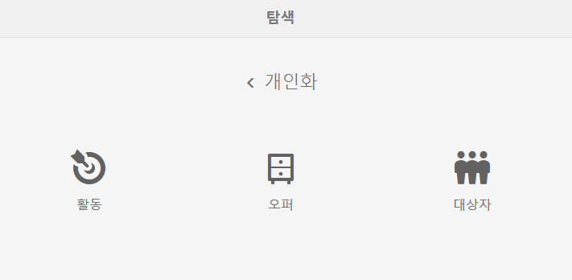

# 대상자 관리{#managing-audiences}

>[!CAUTION]
>
>AEM 6.4가 확장 지원이 종료되었으며 이 설명서는 더 이상 업데이트되지 않습니다. 자세한 내용은 [기술 지원 기간](https://helpx.adobe.com/kr/support/programs/eol-matrix.html). 지원되는 버전 찾기 [여기](https://experienceleague.adobe.com/docs/).

대상자 콘솔을 사용하면 Adobe Target 계정용 대상자를 생성, 구성 및 관리하거나 ContextHub 또는 Client Context용 세그먼트를 관리할 수 있습니다.

* 대상 추가 - Adobe Target 대상 또는 ContextHub 세그먼트 중 하나.
* 대상자 관리.

라고 하는 대상 *세그먼트* ContextHub 및 Client Context에서 는 특정 기준에 정의된 방문자 클래스로, 타깃팅된 활동을 보는 사용자를 결정합니다. 활동을 타겟팅할 때 타겟팅 프로세스에서 바로 대상을 선택하거나 대상 콘솔에서 새 대상을 만들 수 있습니다.

대상 콘솔에서 대상은 브랜드별로 구성됩니다.

대상자는 [타겟팅된 콘텐츠를 작성](/help/sites-authoring/content-targeting-touch.md)하는 타겟팅 모드에서 사용할 수 있으며, 이 모드에서는 대상자를 만들 수도 있습니다(하지만 대상자 콘솔에서 Adobe Target 대상자를 만들어야 함). 타겟팅 모드에서 만드는 대상은 대상 콘솔에 표시됩니다.

대상은 정의된 대상 종류를 설명하는 레이블로 표시됩니다.

* CH - ContextHub 세그먼트
* CC - Client Context 세그먼트
* AT - Adobe Target 대상

## 대상자 콘솔에서 ContextHub 세그먼트 만들기 {#creating-a-contexthub-segment-in-the-audiences-console}

대상자 콘솔에서 또는 타겟팅 프로세스 중에 ContextHub 세그먼트를 만들 수 있습니다.

대상자 콘솔에서 ContextHub 세그먼트를 만들려면 다음 작업을 수행하십시오.

1. 탐색 콘솔에서 **개인화**&#x200B;를 클릭하거나 탭합니다. **대상자**&#x200B;를 클릭하거나 탭합니다.
1. **ContextHub 세그먼트 만들기**&#x200B;를 탭하거나 클릭합니다.

   

1. **새 ContextHub 세그먼트** 대화 상자에서 제목을 입력하고 증폭을 조정하고 **만들기**&#x200B;를 클릭합니다. 새 ContextHub 세그먼트가 대상 목록에 나타납니다.

   >[!NOTE]
   >
   >**수정됨**&#x200B;을 탭하거나 클릭하여 수정된 목록을 정렬하면 새로 만들어진 대상자를 내림차순으로 정렬하여 볼 수 있습니다.

ContextHub을 사용하여 세그먼트를 만드는 방법에 대한 자세히 알려면 [ContextHub을 사용한 세그멘테이션 구성](/help/sites-administering/segmentation.md) 설명서를 참조하십시오.

## Audience Console을 사용하여 Adobe Target 대상자 만들기 {#creating-an-adobe-target-audience-using-the-audience-console}

대상 콘솔을 사용하여 AEM에서 직접 Adobe Target 대상을 만들 수 있습니다.

대상은 타겟 활동에 포함된 사용자를 결정하는 규칙으로 정의됩니다. 대상 정의는 여러 규칙을 포함할 수 있으며 각 규칙은 여러 개의 매개변수를 포함할 수 있습니다.

두 개 이상의 규칙을 사용하는 경우 이러한 규칙은 부울 연산자 AND로 결합됩니다. 즉, 잠재적 대상 멤버는 활동에 포함할 정의된 모든 조건을 충족해야 합니다. 예를 들어 &#39;OS 규칙 AND 브라우저 규칙&#39;을 정의하는 경우 정의된 OS와(AND) 정의된 브라우저를 모두 사용하는 방문자만 활동에 포함됩니다.

>[!NOTE]
>
>If you do not see **Create Target Audience** in the **Create** menu, you do not have the necessary permissions to create an audience. 대상자를 만들 수 있으려면 **/etc/segmentation** 아래에 쓰기 권한이 있어야 합니다. content-authors 그룹에는 기본적으로 쓰기 권한이 있습니다.

Adobe Target 대상자를 만들려면 다음 작업을 수행하십시오.

1. 탐색 콘솔에서 **개인화**&#x200B;를 클릭하거나 탭합니다. **대상자**&#x200B;를 클릭하거나 탭합니다.

   

1. 대상자 콘솔에서 **만들기**&#x200B;와 **타겟 대상자 만들기**&#x200B;를 차례로 탭하거나 클릭합니다.

   

1. 에서 **Adobe Target 구성** 대화 상자에서 target 구성을 선택하고 탭하거나 클릭합니다 **확인**.
1. 규칙#1 영역에서 속성 유형을 탭하거나 클릭하고 사용 가능한 필드에 속성 정보를 입력합니다. 완료되면 속성 오른쪽에 있는 확인 표시를 선택하여 저장합니다. 자세한 내용은 [속성 및 해당 옵션](#attributes-and-their-options) 를 참조하십시오.
1. Click **Add Rule** to add another rule. Enter as many rules as needed. Rules are combined with the boolean operator AND, which means that the audience must meet all the requirements of each rule to be eligible for an activity.
1. **다음**&#x200B;을 탭하거나 클릭합니다.
1. 대상자의 이름을 입력하고 을(를) 탭하거나 클릭합니다 **저장**.
1. **저장**&#x200B;을 탭하거나 클릭합니다. 대상이 대상 목록에 나열됩니다.

### 속성 및 해당 옵션 {#attributes-and-their-options}

다음 각 속성에 대해 타겟팅 규칙을 만들 수 있습니다.

| **특성** | **설명** | **추가 정보** |
|---|---|---|
| **모바일** | 모바일 디바이스, 디바이스 유형, 디바이스 공급업체, 화면 차원(픽셀) 등의 매개변수를 기반으로 하는 Target 모바일 디바이스입니다. | Adobe Target에서 [모바일 설명서](https://experienceleague.adobe.com/docs/target/using/audiences/create-audiences/categories-audiences/mobile.html)를 참조하십시오. |
| **사용자 정의** | 사용자 정의 매개변수는 mbox 매개변수입니다. 임의의 mbox 매개변수를 mbox에 전달하거나 targetPageParams 함수를 사용하는 경우 이러한 매개변수는 대상자에서 사용할 수 있도록 여기에 표시됩니다. | Adobe Target에서 [사용자 정의 매개변수 설명서](https://experienceleague.adobe.com/docs/target/using/audiences/create-audiences/categories-audiences/custom-parameters.html)를 참조하십시오. |
| **OS** | 특정 운영 체제를 사용하는 방문자를 타겟팅할 수 있습니다. | Linux, Macintosh 또는 Windows를 사용하는 사용자를 타겟팅합니다. |
| **사이트 페이지** | 특정 페이지에 있거나 특정 mbox 매개변수를 가진 방문자를 타겟팅합니다. | Adobe Target에서 [사이트 페이지 설명서](https://experienceleague.adobe.com/docs/target/using/audiences/create-audiences/categories-audiences/site-pages.html)를 참조하십시오. |
| **브라우저** | 페이지를 방문할 때 특정 브라우저나 특정 브라우저 선택 사항을 사용하는 사용자를 타깃팅할 수 있습니다. | Adobe Target에서 [브라우저 옵션 설명서](https://experienceleague.adobe.com/docs/target/using/audiences/create-audiences/categories-audiences/browser.html)를 참조하십시오. |
| **방문자 프로필** | 특정 프로필 매개변수를 충족하는 Target 방문자입니다. | Adobe Target에서 [방문자 프로필 설명서](https://experienceleague.adobe.com/docs/target/using/audiences/visitor-profiles/visitor-profile.html)를 참조하십시오. |
| **트래픽 소스** | 사이트 방문 시 사용한 검색 엔진 또는 랜딩 페이지에 따라 방문자를 타겟팅합니다. | Adobe Target에서 [트래픽 소스 설명서](https://experienceleague.adobe.com/docs/target/using/audiences/create-audiences/categories-audiences/traffic-sources.html)를 참조하십시오. |

## 대상자 콘솔에서 대상자 수정 {#modifying-an-audience-in-the-audiences-console}

>[!NOTE]
>
>편집 중인 동일한 AEM 인스턴스에서 만들어진 Adobe Target 대상만 편집할 수 있습니다. 다른 AEM 환경에서 만들어진 Target 대상은 편집할 수 없습니다.

대상자 콘솔에서 모든 ContextHub 또는 Client Context 대상자를 편집할 수 있습니다. Adobe Target 대상을 편집할 수 있지만 AEM에서 만들어진 대상만 편집할 수 있습니다.

1. 탐색 콘솔에서 **개인화**&#x200B;를 클릭하거나 탭합니다. **대상자**&#x200B;를 클릭하거나 탭합니다.
1. 편집할 ContextHub 또는 Client Context 세그먼트 옆에 있는 아이콘을 탭하거나 클릭하고 탭하거나 클릭합니다 **편집**.
1. 세그먼트 편집기에서 편집을 수행합니다. 자세한 내용은 [Client Context](/help/sites-administering/campaign-segmentation.md) 또는 [ContextHub](/help/sites-administering/contexthub-config.md) 설명서.
