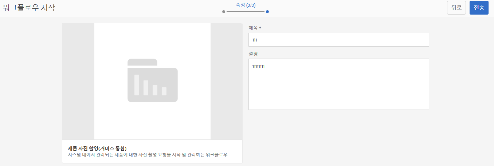
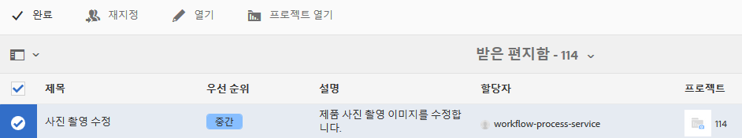

# 크리에이티브 프로젝트 및 PIM 통합{#creative-project-and-pim-integration}

>[!CAUTION]
>
>AEM 6.4가 확장 지원이 종료되었으며 이 설명서는 더 이상 업데이트되지 않습니다. 자세한 내용은 [기술 지원 기간](https://helpx.adobe.com/kr/support/programs/eol-matrix.html). 지원되는 버전 찾기 [여기](https://experienceleague.adobe.com/docs/).

마케터 또는 크리에이티브 전문가인 경우 AEM(Adobe Experience Manager)의 크리에이티브 프로젝트 도구를 사용하여 조직 내에서 eCommerce 관련 제품 사진 및 관련 크리에이티브 프로세스를 관리할 수 있습니다.

특히, 크리에이티브 프로젝트를 사용하여 사진 촬영 워크플로우에서 다음 작업을 간소화할 수 있습니다.

* 사진 촬영 요청 생성
* 사진 촬영 업로드
* 공동 사진 촬영
* 승인된 자산 패키징

>[!NOTE]
>
>자세한 내용은 [프로젝트 사용자 역할 을 참조하십시오](/help/sites-authoring/projects.md#user-roles-in-a-project) 사용자 역할 및 워크플로우를 특정 유형의 사용자에게 할당할 때

## 제품 사진 촬영 워크플로우 탐색  {#exploring-product-photo-shoot-workflows}

크리에이티브 프로젝트는 다양한 프로젝트 요구 사항을 충족하는 다양한 프로젝트 템플릿을 제공합니다. **제품 사진 촬영 프로젝트 **템플릿을 즉시 사용할 수 있습니다. 이 템플릿에는 제품 사진 촬영 요청을 시작 및 관리할 수 있는 사진 촬영 워크플로우가 포함되어 있습니다. 또한 적절한 검토 및 승인 프로세스를 통해 제품에 대한 디지털 이미지를 획득할 수 있는 일련의 작업도 포함되어 있습니다.

템플릿에는 다음 워크플로우가 포함되어 있습니다.

* **제품 사진 촬영(커머스 통합) 워크플로우**: 이 워크플로우는 PIM(제품 정보 관리) 시스템과의 커머스 통합을 활용하여 선택한 제품(계층 구조)에 대한 촬영 목록을 자동으로 생성합니다. 워크플로우가 완료된 후 자산 메타데이터의 일부로 제품 데이터를 볼 수 있습니다.
* **제품 사진 촬영 워크플로우**: 이 워크플로우에서는 전자 상거래 통합에 의존하지 않고 촬영 목록을 제공할 수 있습니다. 업로드된 이미지를 프로젝트 자산 폴더의 CSV 파일에 매핑합니다.

>[!NOTE]
>
>제품 사진 촬영 워크플로우의 촬영 목록 업로드 작업에 업로드되는 CSV 파일에는 shotlist.csv 파일 이름이 있어야 합니다.

## 제품 사진 촬영 프로젝트 만들기 {#create-a-product-photo-shoot-project}

1. 에서 **프로젝트** 콘솔, 탭/클릭 **만들기** 그런 다음 **프로젝트 만들기** 참조하십시오.

   

1. 에서 **프로젝트 만들기** 페이지에서 사진 촬영 프로젝트 템플릿을 선택하고 탭/클릭합니다 **다음**.

   

1. 제목, 설명 및 기한을 포함하여 프로젝트 세부 사항을 입력합니다. 사용자를 추가하고 다양한 역할을 지정합니다. 프로젝트에 대한 축소판을 추가할 수도 있습니다.

   

1. **만들기**&#x200B;를 탭/클릭합니다. 프로젝트가 작성되었음을 알리는 확인 메시지가 표시됩니다.
1. 탭/클릭 **완료** 로 돌아가기 **프로젝트** 콘솔. 또는 탭/클릭합니다 **열기** 사진 촬영 프로젝트 내의 자산을 보려면

## 제품 사진 촬영 프로젝트에서 작업 시작 {#starting-work-in-a-product-photo-shoot-project}

사진 촬영 요청을 시작하려면 프로젝트를 탭하거나 클릭한 다음 탭/클릭합니다 **작업 추가** 프로젝트 세부 사항 페이지 내에서 워크플로우를 시작할 수 있습니다.


제품 사진 촬영 프로젝트에는 다음과 같은 기본 제공 워크플로우가 포함되어 있습니다.

* 제품 사진 촬영(커머스 통합) 워크플로우
* 제품 사진 촬영 워크플로우

제품 사진 촬영(커머스 통합) 워크플로우를 사용하여 이미지 자산을 AEM의 제품에 매핑합니다. 이 워크플로우는 커머스 통합을 활용하여 승인된 이미지를 해당 위치의 기존 제품 데이터에 연결합니다 */etc/commerce*.

제품 사진 촬영(커머스 통합) 워크플로우에는 다음 작업이 포함됩니다.

* 촬영 목록 만들기
* 사진 촬영 업로드
* 사진 촬영 수정
* 검토 및 승인
* 프로덕션 작업으로 이동

제품 정보를 AEM에서 사용할 수 없는 경우, 제품 사진 촬영 워크플로우를 사용하여 CSV 파일에 업로드한 세부 정보를 기반으로 이미지 자산을 제품에 매핑합니다. CSV 파일에는 제품 ID, 카테고리 및 설명과 같은 기본 제품 정보가 포함되어야 합니다. 워크플로우는 제품에 대해 승인된 자산을 가져옵니다.

이 워크플로우에는 다음 작업이 포함됩니다.

* 촬영 목록 업로드
* 사진 촬영 업로드
* 사진 촬영 수정
* 검토 및 승인
* 프로덕션 작업으로 이동

워크플로우 구성 옵션을 사용하여 이 워크플로우를 사용자 지정할 수 있습니다.

두 워크플로우 모두 제품을 승인된 자산과 연결하는 단계를 포함합니다. 각 워크플로우에는 다음 단계가 포함됩니다.

* 워크플로우 구성: 워크플로우를 사용자 지정하는 옵션에 대해 설명합니다
* 프로젝트 워크플로우 시작: 제품 사진 촬영을 시작하는 방법을 설명합니다.
* 워크플로우 작업 세부 정보: 워크플로우에서 사용할 수 있는 작업의 세부 사항을 제공합니다

## 프로젝트 진행 상태 추적 {#tracking-project-progress}

프로젝트 내에서 활성/완료된 작업을 모니터링하여 프로젝트의 진행 상태를 추적할 수 있습니다.

프로젝트의 진행 상태를 모니터링하려면 다음을 사용하십시오.

* **작업 카드**

* **작업 목록**

작업 카드는 프로젝트의 전반적인 진행 상태를 나타냅니다. 프로젝트에 관련 작업이 있는 경우에만 프로젝트 세부 사항 페이지에 표시됩니다. 작업 카드는 완료된 작업 수에 따라 프로젝트의 현재 완료 상태를 표시합니다. 향후 작업은 포함되지 않습니다.

작업 카드는 다음 세부 정보를 제공합니다.

* 활성 작업의 비율
* 완료된 작업의 비율


작업 목록은 프로젝트의 현재 활성 워크플로우 작업에 대한 자세한 정보를 제공합니다. 목록을 표시하려면 작업 카드를 탭/클릭합니다. 작업 목록에는 시작 날짜, 기한, 할당자, 우선 순위 및 작업 상태와 같은 메타데이터도 표시됩니다.


## 워크플로 구성 {#workflow-configuration}

이 작업에는 역할에 따라 사용자에게 워크플로우 단계를 할당하는 작업이 포함됩니다.

를 구성하려면 **제품 사진 촬영** 워크플로우:

1. 다음으로 이동 **도구** > **워크플로우**&#x200B;를 클릭한 다음 **모델** 타일을 선택하여 열기 **워크플로우 모델** 페이지.
1. 을(를) 선택합니다 **제품 사진 촬영** 워크플로우 및 탭 **편집** 아이콘을 클릭하여 편집 모드로 엽니다.

   

1. 에서 **제품 사진 촬영 워크플로우** 페이지에서 프로젝트 작업을 엽니다. 예를 들어 **촬영 목록 업로드** 작업.

   

1. 을(를) 클릭합니다. **작업** 탭을 사용하여 다음을 구성합니다.

   * 작업의 이름
   * 작업을 받는 기본 사용자(역할)
   * 사용자의 작업 목록에 표시되는 작업의 기본 우선 순위
   * 할당자가 작업을 열 때 표시할 작업 설명
   * 작업의 기한(작업이 시작된 시간을 기준으로 계산됨)

1. 클릭 **확인** 구성 설정을 저장하려면 을 클릭합니다.

   마찬가지로, **제품 사진 촬영** 워크플로우:

   * 사진 촬영 업로드
   * 제품 사진 촬영 수정
   * 사진 촬영 리뷰
   * 프로덕션으로 이동

   유사한 절차를 수행하여 **제품 사진 촬영(커머스 통합) 워크플로우**.

이 섹션에서는 제품 정보 관리를 크리에이티브 프로젝트와 통합하는 방법을 설명합니다.

## 프로젝트 워크플로우 시작 {#starting-a-project-workflow}

1. 제품 사진 촬영 프로젝트로 이동한 후 **작업 추가** 아이콘 사용 **워크플로우** 카드.
1. 을(를) 선택합니다 **제품 사진 촬영(커머스 통합)** 제품 사진 촬영(커머스 통합) 워크플로우를 시작하는 워크플로우 카드 /etc/commerce에서 제품 정보를 사용할 수 없는 경우 **제품 사진 촬영** 워크플로우 및 제품 사진 촬영 워크플로우를 시작합니다.

   

1. 탭/클릭 **다음** 프로젝트에서 워크플로우를 시작하려면 다음을 수행하십시오.
1. 다음 페이지에서 워크플로우 세부 사항을 입력합니다.

   

   클릭 **제출** 사진 촬영 워크플로우를 시작하려면 사진 촬영 프로젝트에 대한 프로젝트 세부 사항 페이지가 표시됩니다.

   

### 워크플로우 작업 세부 사항 {#workflow-tasks-details}

사진 촬영 워크플로우에는 몇 가지 작업이 포함됩니다. 각 작업은 작업에 대해 정의된 구성에 따라 사용자 그룹에 할당됩니다.

#### 촬영 목록 만들기 작업 {#create-shot-list-task}

다음 **촬영 목록 만들기** 작업을 사용하면 프로젝트 소유자가 이미지가 필요한 제품을 선택할 수 있습니다. 사용자가 선택한 옵션에 따라, 기본 제품 정보가 포함된 CSV 파일이 생성됩니다.

1. 프로젝트 폴더에서 의 줄임표를 탭/클릭합니다 [작업 카드](#tracking-project-progress) 워크플로우에서 작업 항목을 보려면

   

1. 을(를) 선택합니다 **촬영 목록 만들기** 작업을 수행한 다음 탭/클릭합니다 **열기** 아이콘 을 클릭하여 제품에서 사용할 수 있습니다.

   

1. 작업 세부 사항을 검토하고 **촬영 목록 만들기** 버튼을 클릭합니다.

   

1. 연결된 이미지 없이 제품 데이터가 있는 제품을 선택합니다.

   

1. 을 탭/클릭합니다. **촬영 목록에 추가** 아이콘을 클릭하여 모든 그러한 제품 목록을 포함하는 CSV 파일을 만듭니다. 선택한 제품에 대해 촬영 목록이 생성되었음을 확인하는 메시지가 표시됩니다. 클릭 **닫기** 을 클릭하여 워크플로우를 완료합니다.
1. 촬영 목록을 만들면 **촬영 목록 보기** 링크가 나타납니다. 촬영 목록에 제품을 더 추가하려면 탭/클릭합니다 **촬영 목록에 추가**. 이 경우 데이터가 처음에 생성된 촬영 목록에 추가됩니다.

   

1. 탭/클릭 **촬영 목록 보기** 새 촬영 목록을 보려면

   

   기존 데이터를 편집하거나 새 데이터를 추가하려면 탭/클릭합니다 **편집** 를 클릭합니다. **Product ** 및 **설명** 필드를 편집할 수 있습니다.

   

   파일을 업데이트한 후 탭/클릭합니다 **저장** 도구 모음에서 파일을 저장합니다.

1. 제품을 추가한 후 **완료** **촬영 목록 만들기 **작업 세부 사항 페이지의 아이콘을 클릭하여 작업을 완료로 표시합니다. 선택적 주석을 추가할 수 있습니다.

   작업이 완료되면 프로젝트 내에서 다음 변경 사항이 적용됩니다.

   * 제품 계층에 해당하는 자산은 워크플로우 제목과 같은 이름의 폴더에 만들어집니다.
   * 자산의 메타데이터는 사진사가 이미지를 제공하기 전에도 자산 콘솔을 사용하여 편집할 수 있습니다.
   * 사진사가 제공하는 이미지를 저장하는 사진 촬영 폴더가 만들어집니다. 사진 촬영 폴더에는 촬영 목록의 각 제품 항목에 대한 하위 폴더가 포함되어 있습니다.

   커머스 통합이 없는 제품 사진 촬영 워크플로우의 경우 촬영 목록 업로드가 첫 번째 작업입니다. 탭/클릭 **촬영 목록 업로드** 업로드하려면 **shotlist.csv** 파일. CSV 파일에는 제품 ID가 포함되어야 합니다. 다른 필드는 선택 사항입니다. 이를 사용하여 자산을 제품에 매핑할 수 있습니다.

### 촬영 목록 업로드 작업 {#upload-shot-list-task}

이 작업은 제품 사진 촬영 워크플로우의 일부입니다. AEM에서 제품 정보를 사용할 수 없는 경우 이 작업을 수행합니다. 이 경우, 이미지 자산이 필요한 CSV 파일로 제품 목록을 업로드합니다. CSV 파일의 세부 사항을 기반으로 이미지 자산을 제품에 매핑합니다.

를 사용하십시오 **촬영 목록 보기** 링크를 클릭하여 샘플 CSV 파일을 다운로드합니다. 샘플 파일을 검토하여 CSV 파일의 일반적인 내용을 알아보십시오.

제품 목록 또는 CSV 파일에는 다음과 같은 필드가 포함될 수 있습니다 **카테고리, 제품, Id, 설명**, 및 **경로**. 다음 **Id** 필드는 필수 항목이며 제품 ID를 포함합니다. 다른 필드는 선택 사항입니다.

제품은 특정 카테고리에 속할 수 있습니다. 제품 카테고리는 아래 CSV에 나열될 수 있습니다. **카테고리** 열. 다음 **제품** 필드에는 제품 이름이 포함되어 있습니다. 에서 **설명** 필드에서는 사진사의 제품 설명이나 지침을 입력합니다.

>[!NOTE]
>
>업로드할 이미지의 이름은 &quot;**&lt;productid>_&quot;** 여기서 제품 ID는 **Id** 의 필드 *shotlist.csv* 파일. 예를 들어 **Id 397122**&#x200B;로 지정하는 경우 이름이 있는 파일을 업로드할 수 있습니다 **397122_highcontrast.jpg**, **397122_lowlight.png**&#x200B;등

1. 프로젝트 폴더에서 의 줄임표를 탭/클릭합니다 [작업 카드](#tracking-project-progress) 을 클릭하여 워크플로우의 작업 목록을 확인합니다.
1. 을(를) 선택합니다 **촬영 목록 업로드** 작업을 수행한 다음 탭/클릭합니다 **열기** 아이콘 을 클릭하여 제품에서 사용할 수 있습니다.

   

1. 작업 세부 사항을 검토하고 **촬영 목록 업로드** 버튼을 클릭합니다.

   

1. 을 탭/클릭합니다. **촬영 목록 업로드** html 파일 이름을 shotlist.csv로 CSV 파일로 업로드하는 단추를 클릭합니다. 워크플로우는 이 파일을 다음 작업에 대한 제품 데이터를 추출하는 데 사용할 소스로 인식합니다.
1. 제품 정보가 포함된 CSV 파일을 적절한 형식으로 업로드합니다. CSV 파일이 업로드된 후 **업로드된 자산 보기 **링크가 카드 아래에 나타납니다.

   

   을(를) 클릭합니다. **완료** 아이콘을 클릭하여 작업을 완료합니다.

1. 을 탭/클릭합니다. **완료** 아이콘을 클릭하여 작업을 완료합니다.

### 사진 촬영 업로드 작업 {#upload-photo-shoot-task}

편집자인 경우, **shotlist.csv** 이전 작업에서 만들거나 업로드된 파일입니다.

업로드할 이미지의 이름은 **&quot;&lt;productid>_&quot;** 여기서 제품 ID는 **Id** 의 필드 **shotlist.csv** 파일. 예를 들어 **ID 397122** 촬영 목록에서 이름이 있는 파일을 업로드할 수 있습니다 **397122_highcontrast.jpg**, **397122_lowlight.png**&#x200B;등

이미지를 직접 업로드하거나 이미지가 포함된 ZIP 파일을 업로드할 수 있습니다. 해당 이름에 따라 이미지는 **사진 촬영** 폴더를 입력합니다.

1. 프로젝트 폴더 아래에 있는 [작업 카드](#tracking-project-progress) 워크플로우에서 작업 항목을 보려면
1. 을(를) 선택합니다 **사진 촬영 업로드** 작업을 수행한 다음 탭/클릭합니다 **열기** 아이콘 을 클릭하여 제품에서 사용할 수 있습니다.

   

1. **사진 촬영 업로드 **를 탭/클릭하고 사진 촬영 이미지를 업로드합니다.
1. 을 탭/클릭합니다. **완료** 아이콘을 클릭하여 작업을 완료합니다.

### 사진 촬영 수정 작업 {#retouch-photo-shoot-task}

편집 권한이 있는 경우 사진 촬영 수정 작업을 수행하여 사진 촬영 폴더에 업로드된 이미지를 편집합니다.

1. 프로젝트 폴더 아래에 있는 [작업 카드](#tracking-project-progress) 워크플로우에서 작업 항목을 보려면
1. 을(를) 선택합니다 **사진 촬영 수정** 작업을 수행한 다음 탭/클릭합니다 **열기** 아이콘 을 클릭하여 제품에서 사용할 수 있습니다.

   

1. 을 탭/클릭합니다. **업로드된 자산 보기** 링크 위치 **사진 촬영 수정** 페이지에 업로드된 이미지를 찾습니다.

   

   필요한 경우 Adobe Creative Cloud 애플리케이션을 사용하여 이미지를 편집합니다.

   

1. 을 탭/클릭합니다. **완료** 아이콘을 클릭하여 작업을 완료합니다.

### 작업 검토 및 승인 {#review-and-approve-task}

이 작업에서는 사진사가 업로드한 사진 촬영 이미지를 검토하고 이미지를 사용 승인 상태로 표시합니다.

1. 프로젝트 폴더 아래에 있는 [작업 카드](#tracking-project-progress) 워크플로우에서 작업 항목을 보려면
1. 을(를) 선택합니다 **검토 및 승인** 작업을 수행한 다음 탭/클릭합니다 **열기** 아이콘 을 클릭하여 제품에서 사용할 수 있습니다.

   

1. 에서 **검토 및 승인** 페이지에서 검토 작업을 역할(예: 검토자)에 지정한 다음 **검토 **를 탭/클릭하여 업로드된 제품 이미지 검토를 시작합니다.

   

1. 제품 이미지를 선택하고 도구 모음에서 승인 아이콘을 탭/클릭하여 승인됨으로 표시합니다.

   

   이미지를 승인하면 승인된 배너가 표시됩니다.

   >[!NOTE]
   일부 제품은 이미지 없이 보관할 수 있습니다. 나중에 작업을 다시 방문하여 완료한 후 완료 상태로 표시할 수 있습니다.

1. 탭/클릭 **완료**. 승인된 이미지는 작성된 빈 자산에 연결됩니다.

자산 UI를 사용하여 프로젝트 자산으로 이동하고 승인된 이미지를 확인할 수 있습니다.

다음 수준을 탭/클릭하여 제품 데이터 계층에 따라 제품을 봅니다.

크리에이티브 프로젝트는 승인된 자산을 참조된 제품과 연관시킵니다. 자산 메타데이터는 AEM 자산 메타데이터 섹션에 표시되는 자산 속성 아래의 **제품 데이터 ** 탭에 있는 제품 참조 및 기본 정보로 업데이트됩니다.

>[!NOTE]
제품 사진 촬영 워크플로우(커머스 통합 제외)에서 승인된 이미지는 제품과 관련이 없습니다.

### 프로덕션 작업으로 이동 {#move-to-production-task}

이 작업은 승인된 자산을 프로덕션 준비 폴더로 이동하여 사용할 수 있도록 합니다.

1. 프로젝트 폴더 아래에 있는 [작업 카드](#tracking-project-progress) 워크플로우에서 작업 항목을 보려면
1. 을(를) 선택합니다 **프로덕션으로 이동** 작업을 수행한 다음 탭/클릭합니다 **열기** 아이콘 을 클릭하여 제품에서 사용할 수 있습니다.

   

1. 사진 촬영을 위해 승인된 자산을 프로덕션 준비 폴더로 이동하기 전에 보려면 **승인된 자산 보기** 에서 프로젝트 축소판 아래에 연결합니다. **프로덕션으로 이동** 작업 페이지.

   

1. 에서 프로덕션 준비 폴더의 경로를 입력합니다 **이동 위치** 필드.

   

   탭/클릭 **프로덕션으로 이동**. 확인 메시지를 닫습니다. 자산은 지정된 경로로 이동되며, 폴더 계층 구조를 기준으로 각 제품에 대해 승인된 자산에 대한 스핀 세트가 자동으로 생성됩니다.

1. 을 탭/클릭합니다. **완료** 아이콘 을 클릭하여 제품에서 사용할 수 있습니다. 마지막 단계가 완료로 표시되면 워크플로우가 완료됩니다.

## DAM 자산 메타데이터 보기 {#viewing-dam-asset-metadata}

승인하면 자산이 해당 제품에 연결됩니다. 다음 [속성 페이지](/help/assets/managing-assets-touch-ui.md#editing-properties) 이제 승인된 자산 중 하나에는 추가 항목이 있습니다 **제품 데이터** (연결된 제품 정보) 탭을 클릭합니다. 이 탭에는 자산을 연결하는 제품 세부 사항, SKU 번호 및 기타 제품 관련 세부 사항이 표시됩니다. 을 탭/클릭합니다. **편집** 아이콘을 사용하여 자산 속성을 업데이트합니다. 제품 관련 정보는 읽기 전용으로 유지됩니다.

표시되는 링크를 탭/클릭하여 자산이 연결된 제품 콘솔의 각 제품 세부 사항 페이지로 이동합니다.

## 프로젝트 사진 촬영 워크플로우 사용자 정의 {#customizing-the-project-photo-shoot-workflows}

요구 사항에 따라 프로젝트 사진 촬영 워크플로우를 사용자 지정할 수 있습니다. 이 작업은 프로젝트 내에서 변수 값을 설정하기 위해 수행하는 선택적 역할 기반 작업입니다. 나중에 구성된 값을 사용하여 결정을 내릴 수 있습니다.

1. AEM 로고를 클릭/탭한 다음, **도구** > **워크플로우** > **모델** 워크플로우 모델 페이지를 엽니다.
1. 을(를) 선택합니다 **제품 사진 촬영(커머스 통합)** 워크플로우 또는 **제품 사진 촬영** 워크플로우 및 클릭/탭하기 **편집** 도구 모음에서 편집 모드에서 워크플로우를 엽니다.
1. 를 엽니다. **프로젝트** 사이드 킥의 작업 및 **역할 기반 프로젝트 작업 만들기** 단계로 이동합니다.

   

1. 를 엽니다. **역할 기반 작업** 단계.
1. 에서 **작업** 탭에서 작업 이름을 입력합니다. **작업** 목록. 역할에 작업을 할당하고, 기본 우선 순위를 설정하고, 설명을 제공하고, 작업 만기 시간을 지정할 수도 있습니다.

   

1. 에서 **라우팅** 탭에서 작업에 대한 작업을 지정합니다. 여러 작업을 추가하려면 **항목 추가** 링크를 탭/클릭합니다.

   

1. 옵션을 추가한 후 **확인** 를 눌러 단계에 변경 사항을 추가합니다.

   >[!NOTE]
   탭/클릭 **확인** 은 워크플로우에 변경 사항을 저장하지 않습니다. 워크플로우에 변경 사항을 저장하려면 을 탭/클릭합니다 **저장**.

1. 를 엽니다. **워크플로우** 사이드 킥에서 작업 및 추가 **이동** 작업.
1. 를 엽니다. **이동** 작업 및 탭/클릭 **프로세스** 탭.
1. 에서 다음 코드를 지정합니다. **스크립트** 상자:

```
   function check() {

   if (workflowData.getMetaDataMap().get("lastTaskAction","") == "Reject All") {

   return true

   }

   // set copywriter user in metadata

   var previousId = workflowData.getMetaDataMap().get("lastTaskCompletedBy", "");

   workflowData.getMetaDataMap().put("copywriter", previousId);

   return false;

   }
```

>[!NOTE]
워크플로우 단계의 스크립팅에 대한 자세한 내용은 [OR 분할에 대한 규칙 정의](/help/sites-developing/workflows-models.md).


1. 탭/클릭 **확인**.

1. 탭/클릭 **저장** 워크플로우 저장

   

1. 이제 새 프로젝트 소유자 수락 작업이 [프로덕션으로 이동 작업](#move-to-production-task) 가 완료되어 소유자에게 지정됩니다.

   소유자 역할의 사용자는 작업을 완료하고 주석 팝업의 목록에서 작업(워크플로우 단계 구성에 추가된 작업 목록)을 선택할 수 있습니다.

   

   적절한 옵션을 선택하고 을(를) 클릭합니다 **완료** 를 **이동 단계** 을 입력합니다.

>[!NOTE]
서버를 시작하면 프로젝트 작업 목록 서블릿은 아래에 정의된 작업 유형과 URL 간의 매핑을 캐시합니다 `/libs/cq/core/content/projects/tasktypes`. 그런 다음 일반적인 오버레이를 수행하고 아래 배치하여 사용자 지정 작업 유형을 추가할 수 있습니다 `/apps/cq/core/content/projects/tasktypes`.
