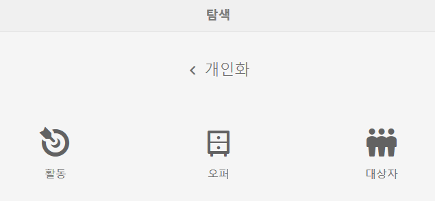
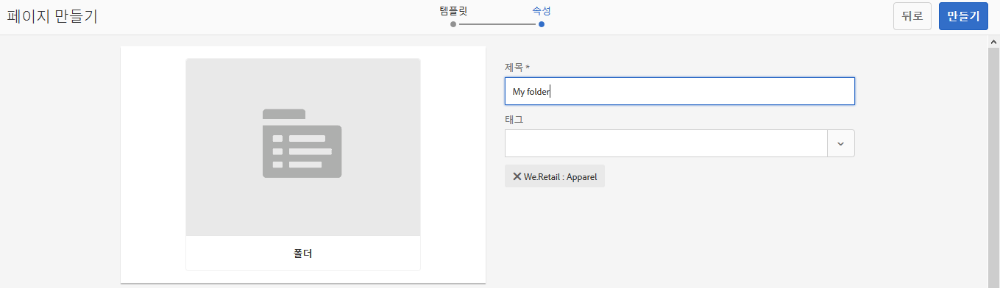
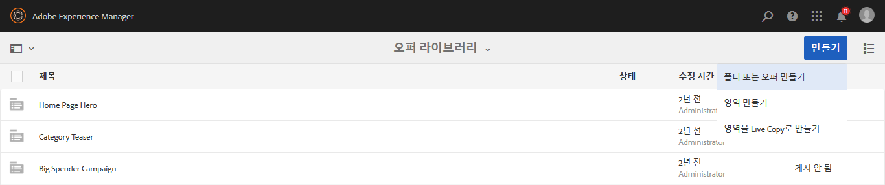
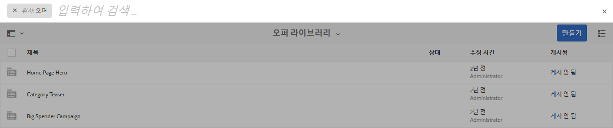

# 오퍼 생성 및 관리{#creating-and-managing-offers}

>[!CAUTION]
>
>AEM 6.4가 확장 지원이 종료되었으며 이 설명서는 더 이상 업데이트되지 않습니다. 자세한 내용은 [기술 지원 기간](https://helpx.adobe.com/kr/support/programs/eol-matrix.html). 지원되는 버전 찾기 [여기](https://experienceleague.adobe.com/docs/).

오퍼 콘솔을 사용하여 수행할 수 있는 오퍼를 생성하십시오 [활동 경험에서 사용](/help/sites-authoring/content-targeting-touch.md). 여러 경험에 동일한 오퍼가 필요한 경우 오퍼 콘솔에서 오퍼를 생성하면 시간이 절약됩니다.

* 라이브러리에서 오퍼를 한 번 만들고 브랜드 활동의 여러 경험에서 사용합니다.
* 라이브러리에서 오퍼를 변경하고 변경 사항은 오퍼를 사용하는 모든 경험에 영향을 줍니다.

오퍼 콘솔은 브랜드별로 오퍼를 구성합니다. 각 브랜드에는 브랜드의 경험에서 사용할 수 있는 오퍼 라이브러리가 포함되어 있습니다. 폴더를 사용하여 각 라이브러리에서 오퍼를 구성할 중요한 구조를 정의합니다. 논리 폴더 구조를 사용하면 찾아보기를 통해 오퍼를 쉽게 찾을 수 있습니다. 태깅 및 검색 도구도 작성자가 오퍼를 찾을 수 있도록 합니다.

## 오퍼 콘솔을 사용하여 브랜드 추가 {#add-a-brand-using-the-offers-console}

오퍼가 연결된 브랜드를 만듭니다. 폴더 및 오퍼를 만들 수 있는 오퍼 라이브러리에 액세스하려면 오퍼 콘솔에서 브랜드를 여십시오.

오퍼 콘솔을 사용하여 브랜드를 만들면 다음과 같은 사이트에 표시됩니다. [활동 콘솔](/help/sites-authoring/activitylib.md) 브랜드에 대한 활동을 추가하고 관리할 수 있는 위치입니다.

1. 탐색 콘솔에서 **개인화** > **오퍼**&#x200B;를 클릭하거나 탭합니다.

   

1. **만들기**&#x200B;를 클릭하거나 탭한 다음 브랜드&#x200B;****&#x200B;만들기를 클릭하거나 탭합니다.
1. 브랜드 템플릿을 선택하고 을(를) 클릭하거나 탭합니다 **다음**.
1. 오퍼 및 활동 콘솔에 표시할 브랜드의 제목을 입력합니다. 원할 경우, 브랜드와 연결할 태그를 하나 이상 입력하거나 선택합니다.
1. **만들기**&#x200B;를 클릭하거나 탭합니다.

## 오퍼 라이브러리에 폴더 추가 {#add-a-folder-to-an-offer-library}

오퍼를 구성하고 저장할 폴더를 브랜드의 오퍼 라이브러리에 추가합니다. 브랜드 아래에 또는 다른 폴더 아래에 폴더를 만들 수 있습니다.

1. 오퍼 콘솔에서 폴더를 만들 위치를 엽니다. 예를 들어 브랜드를 열어 최상위 수준 폴더를 만들거나, 라이브러리에서 다른 폴더를 여십시오.
1. 클릭 또는 탭 **만들기** > **폴더 또는 오퍼 만들기**.

   

1. **폴더**&#x200B;를 선택하고 **다음**&#x200B;을 클릭합니다.
1. 오퍼 라이브러리에 표시할 폴더의 제목을 입력하고 태그를 입력하거나 선택합니다.

   

1. **만들기**&#x200B;를 클릭하거나 탭합니다.

## 오퍼 라이브러리에 오퍼 추가 {#add-an-offer-to-an-offer-library}

브랜드의 경험에 추가할 수 있도록 브랜드의 오퍼 라이브러리에 오퍼를 추가합니다. 오퍼를 추가할 때 제목을 제공합니다. 검색 가능성을 높이기 위해 오퍼를 하나 이상의 태그와 연결할 수도 있습니다.

오퍼를 만든 후에는 열어서 콘텐츠를 작성할 수 있습니다.

1. 오퍼 콘솔에서 오퍼를 만들 위치를 엽니다. 예를 들어 브랜드를 열어 최상위 수준 오퍼를 만들거나, 라이브러리에서 폴더를 여십시오.
1. 클릭 또는 탭 **만들기** > **폴더 또는 오퍼 만들기**.

   

1. 을(를) 선택합니다 **오퍼 페이지** 템플릿을 만든 다음 을(를) 클릭하거나 탭합니다 **다음**.
1. 오퍼에 사용할 제목을 입력하고 원할 경우 오퍼와 연결할 태그를 하나 이상 선택하거나 입력한 다음, 을 클릭하거나 탭합니다 **만들기**.
1. 확인 대화 상자에서 편집할 오퍼를 열려면 **페이지 열기**&#x200B;를 클릭하거나 탭합니다.

## 오퍼 편집 {#editing-an-offer}

오퍼를 열고 오퍼를 사용하는 경험에 표시할 콘텐츠를 편집하십시오. 경험에 사용되는 오퍼를 편집하면 변경 사항이 경험에 표시됩니다.

오퍼 라이브러리의 폴더 또는 검색 결과에서 오퍼를 열 수 있습니다. 오퍼를 사용하는 경험에서 오퍼를 열 수도 있습니다.

1. 오퍼 콘솔에서 오퍼 옆에 있는 아이콘을 탭하거나 클릭하고 클릭 또는 탭합니다 **편집**.
1. 오퍼에 구성 요소를 추가하고 구성 요소 콘텐츠를 평소대로 편집합니다.

## 오퍼 삭제 {#deleting-an-offer}

더 이상 필요하지 않은 오퍼를 삭제합니다. 경험에 사용되는 오퍼를 삭제하려고 하면 삭제를 확인하는 메시지가 표시됩니다. 확인하면 오퍼가 삭제되고 경험에서 제거됩니다.

오퍼 라이브러리의 폴더 콘텐츠나 검색 결과를 볼 때 오퍼를 삭제할 수 있습니다.

1. 오퍼 콘솔에서 오퍼 옆에 있는 아이콘을 탭하거나 클릭하고 클릭 또는 탭합니다 **삭제**.

   오퍼를 선택하고 을 클릭하거나 탭합니다 **삭제**.

1. 대화 상자가 표시되면 을 클릭하거나 탭합니다 **삭제** 를 클릭하여 삭제를 확인합니다.
1. 오퍼가 하나 이상의 경험에서 사용되는 경우 오퍼가 참조되었음을 나타내는 대화 상자가 표시됩니다.

   * 오퍼를 삭제하고 경험에서 제거하려면 을 클릭하거나 탭합니다 **강제 삭제**.
   * 오퍼를 유지하려면 을 클릭하거나 탭하십시오 **취소**.

## 오퍼 검색 {#searching-for-offers}

제목과 일치하는 키워드를 사용하여 모든 브랜드의 오퍼를 검색합니다.

검색 결과 옆에 현재 검색 기준이 나타납니다. 결과를 열을 기준으로 오름차순이나 내림차순으로 정렬할 수도 있습니다. 오퍼 라이브러리의 모든 폴더에서 검색을 수행할 수 있습니다. 검색 결과는 현재 폴더에 관계없이 동일합니다.

오퍼를 검색하려면 다음 작업을 수행하십시오.

1. 오퍼 콘솔의 맨 위에서 확대경 아이콘을 클릭하거나 탭합니다. 기본적으로 검색은 오퍼로 제한됩니다.
1. 오퍼를 검색할 키워드를 입력합니다. 결과에서 선택하십시오.
