# 프로젝트{#projects}

>[!CAUTION]
>
>AEM 6.4가 확장 지원이 종료되었으며 이 설명서는 더 이상 업데이트되지 않습니다. 자세한 내용은 [기술 지원 기간](https://helpx.adobe.com/kr/support/programs/eol-matrix.html). 지원되는 버전 찾기 [여기](https://experienceleague.adobe.com/docs/).

프로젝트를 사용하면 리소스를 하나의 엔티티로 그룹화할 수 있습니다. 공통되는 공유 환경을 사용하면 프로젝트 관리가 쉬워집니다. 프로젝트와 연결할 수 있는 리소스 유형은 AEM에서 타일이라고 합니다. 타일에는 프로젝트 및 팀 정보, 에셋, 워크플로 및 [프로젝트 타일](#project-tiles)에 설명된 세부 정보와 같은 기타 유형의 정보가 포함될 수 있습니다.

>[!CAUTION]
>
>프로젝트의 사용자가 프로젝트 만들기, 작업/워크플로우 만들기, 팀 보기 및 관리와 같은 프로젝트 기능을 사용할 때 다른 사용자/그룹을 보려면 해당 사용자에게는 **/home/users** 및 **/home/groups**. 를 구현하는 가장 쉬운 방법은 **projects-users** 그룹 읽기 액세스 권한 **/home/users** 및 **/home/groups**.

사용자라면 다음과 같은 작업을 수행할 수 있습니다.

* 프로젝트 만들기
* 콘텐츠 및 에셋 폴더를 프로젝트에 연결
* 프로젝트 삭제
* 프로젝트에서 콘텐츠 링크 제거

다음 추가 항목을 참조하십시오.

* [프로젝트 관리](/help/sites-authoring/touch-ui-managing-projects.md)
* [작업](/help/sites-authoring/task-content.md)
* [프로젝트 워크플로를 사용하여 작업](/help/sites-authoring/projects-with-workflows.md)
* [크리에이티브 프로젝트 및 PIM 통합](/help/sites-authoring/managing-product-information.md)

## 프로젝트 콘솔 {#projects-console}

프로젝트 콘솔은 AEM 내에서 프로젝트에 액세스하고 관리하는 곳입니다.

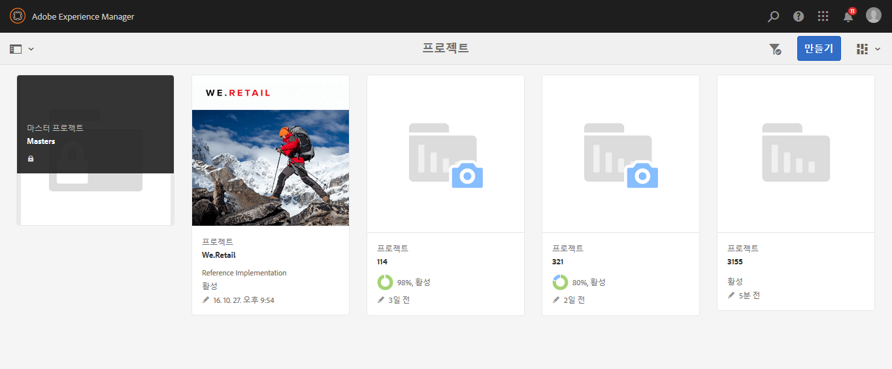

* 선택 **타임라인** 그런 다음 프로젝트를 클릭하여 타임라인을 봅니다.
* 클릭/탭 **선택** 선택 모드로 전환하려면 다음을 수행하십시오.
* 클릭 **만들기** 프로젝트를 추가하려면 다음을 수행하십시오.
* **활성 프로젝트 전환** 을 사용하면 모든 프로젝트와 활성 상태인 프로젝트만 간에 전환할 수 있습니다.
* **통계 보기 표시** 작업 완료와 관련된 프로젝트 통계를 볼 수 있습니다.

## 프로젝트 타일 {#project-tiles}

프로젝트를 사용하면 서로 다른 유형의 정보를 프로젝트와 연결할 수 있습니다. 이를 **타일**&#x200B;이라고 합니다. 각 타일과 타일에 포함된 정보 종류는 이 섹션에 설명되어 있습니다.

다음 타일을 프로젝트와 연결할 수 있습니다. 각 내용은 다음에 나오는 섹션에서 설명합니다.

* 에셋 및 에셋 컬렉션
* 경험
* 링크
* 프로젝트 정보
* 팀
* 랜딩 페이지
* 이메일
* 워크플로
* 론치
* 작업

### 에셋 {#assets}

**에셋** 타일에서는 특정 프로젝트에 사용하는 모든 에셋을 수집할 수 있습니다.

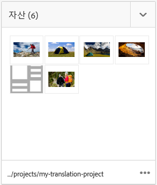

타일에서 바로 에셋을 업로드할 수 있습니다. 또한 Dynamic Media 추가 기능이 있는 경우 이미지 세트, 스핀 세트 또는 혼합 미디어 세트를 만들 수 있습니다.

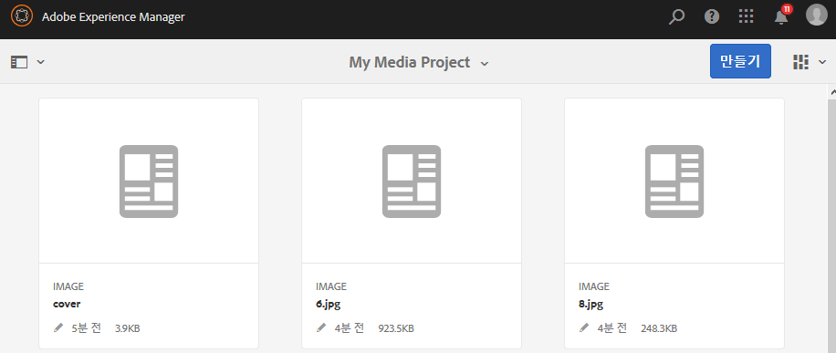

### 에셋 컬렉션 {#asset-collections}

에셋과 유사하게 [에셋 컬렉션](/help/assets/managing-collections-touch-ui.md)도 프로젝트에 바로 추가할 수 있습니다. [에셋]에서 컬렉션을 정의합니다.

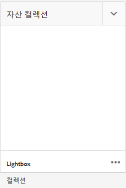

**컬렉션 추가**&#x200B;를 클릭하고 목록에서 적절한 컬렉션을 선택하여 추가합니다.

### 경험 {#experiences}

다음 **경험** 타일 을 통해 프로젝트에 모바일 앱, 웹 사이트 또는 게시를 추가할 수 있습니다.

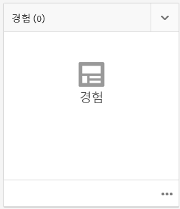

아이콘은 표시되는 경험의 종류(웹 사이트, 모바일 애플리케이션 또는 발행물)를 나타냅니다. Add experiences by clicking the + sign or clicking **Add Experience** and selecting the type of experience.

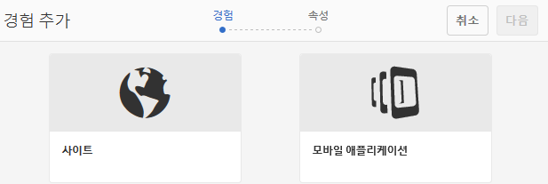

썸네일 경로를 선택하고, 해당하는 경우에는 경험의 썸네일을 변경합니다. 경험은 **경험** 타일에서 함께 그룹화됩니다.

### 링크 {#links}

링크 타일을 사용하면 외부 링크를 프로젝트와 연결할 수 있습니다.

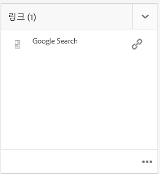

링크 이름을 알아채기 쉬운 이름으로 지정할 수도 있고 썸네일을 변경할 수도 있습니다.

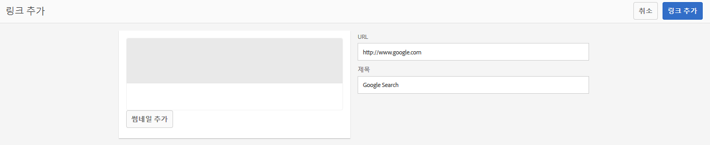

### 프로젝트 정보 {#project-info}

프로젝트 정보 타일은 설명, 프로젝트 상태(비활성 또는 활성), 기한 및 구성원을 포함하여 프로젝트에 대한 일반 정보를 제공합니다. 또한 기본 프로젝트 페이지에 표시되는 프로젝트 축소판을 추가할 수 있습니다.

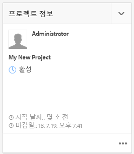

팀원은 팀 타일뿐만 아니라 이 타일에서도 할당 및 삭제되거나 자신의 역할을 변경할 수 있습니다.

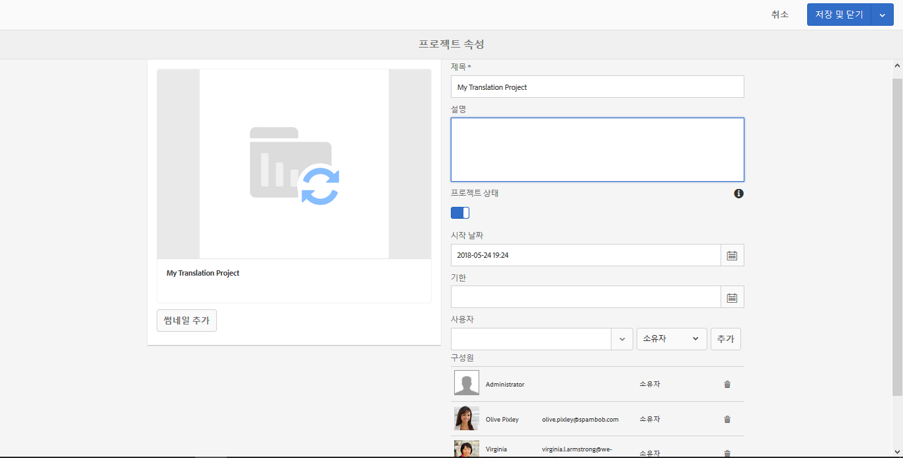

### 번역 작업 {#translation-job}

번역 작업 타일은 번역을 시작하는 곳이며 번역 상태가 표시되는 곳이기도 합니다. 번역을 설정하려면 다음을 참조하십시오 [번역 프로젝트 만들기](/help/assets/translation-projects.md).

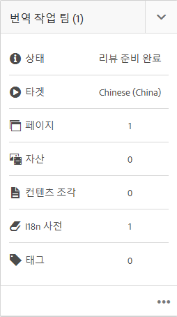

번역 워크플로의 에셋을 보려면 **번역 작업** 카드 하단의 생략 부호를 클릭합니다. 번역 작업 목록에는 에셋 메타데이터와 태그에 대한 항목도 표시됩니다. 이 항목들은 에셋의 메타데이터와 태그도 번역됨을 나타냅니다.

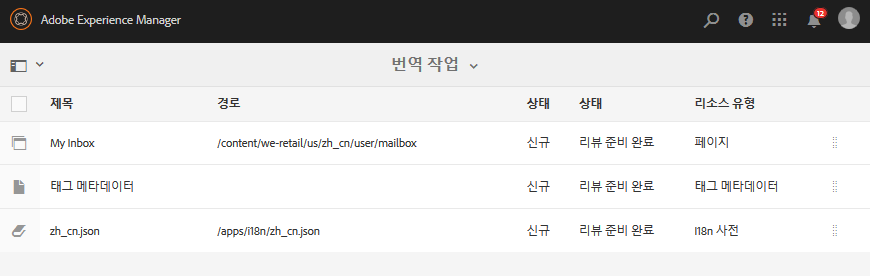

### 팀 {#team}

이 타일에서 프로젝트 팀의 구성원을 지정할 수 있습니다. 편집 시에는 팀원의 이름을 입력하고 사용자 역할을 지정할 수 있습니다.

팀에서 팀원을 추가하고 삭제할 수 있습니다. 또한 팀원에게 할당된 [사용자 역할](#user-roles-in-a-project)을 편집할 수도 있습니다.

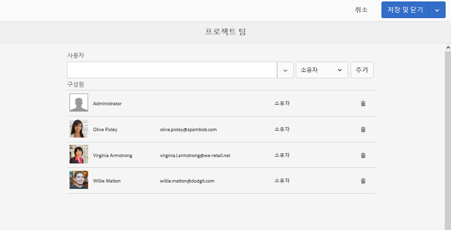

### 랜딩 페이지 {#landing-pages}

다음 **랜딩** 페이지 타일을 사용하면 새 랜딩 페이지를 요청할 수 있습니다.

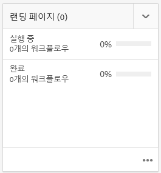

이 워크플로우는에 설명되어 있습니다. [랜딩 페이지 워크플로우 만들기](/help/sites-authoring/projects-with-workflows.md#request-landing-page-workflow).

### 이메일 {#emails}

다음 **이메일** 타일은 이메일 요청을 관리하는 데 도움이 됩니다. 이메일 요청 워크플로우를 시작합니다.

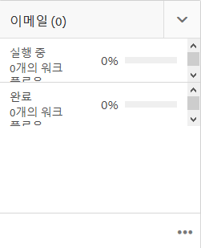

자세한 내용은 [이메일 요청 워크플로우.](/help/sites-authoring/projects-with-workflows.md#request-email-workflow)

### 워크플로 {#workflows}

특정 워크플로를 따르도록 프로젝트를 지정할 수 있습니다. 실행 중인 워크플로가 있는 경우 워크플로 상태가 [프로젝트]의 **워크플로** 타일에 표시됩니다.

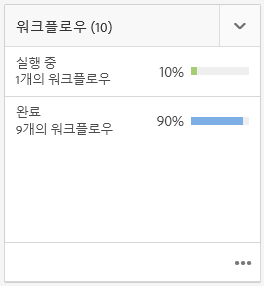

특정 워크플로를 따르도록 프로젝트를 지정할 수 있습니다. 선택하는 프로젝트에 따라 다른 워크플로를 사용할 수 있습니다.

이에 대해서는 [프로젝트 워크플로 작업](/help/sites-authoring/projects-with-workflows.md)에 설명되어 있습니다.

### 론치 {#launches}

론치 타일에는 [론치 요청 워크플로](/help/sites-authoring/projects-with-workflows.md)에서 요청한 론치가 표시됩니다.

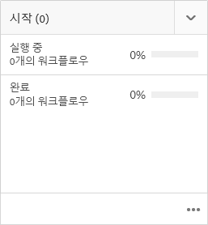

### 작업 {#tasks}

작업을 사용하면 워크플로를 포함하여 프로젝트 관련 작업의 상태를 모니터링할 수 있습니다. 작업은 [작업](/help/sites-authoring/task-content.md)에 자세히 설명되어 있습니다.

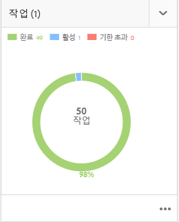

## 프로젝트 템플릿 {#project-templates}

AEM은 다음과 같이 특별한 세 개의 템플릿과 함께 제공됩니다.

* 간단한 프로젝트 - 다른 범주에 맞지 않는 프로젝트에 대한 참조 샘플입니다(다목적 캐치). 여기에는 세 개의 기본 역할(소유자, 편집자 및 관찰자)과 네 개의 워크플로(프로젝트 승인, 론치 요청, 랜딩 페이지 요청 및 이메일 요청)가 포함됩니다.
* 미디어 프로젝트 - 미디어 관련 활동에 대한 참조 샘플 프로젝트입니다. 여기에는 몇 가지의 미디어 관련 프로젝트 역할(사진 작가, 편집자, 카피라이터, 디자이너, 소유자 및 관찰자)이 포함됩니다. 또한 미디어 컨텐츠와 관련된 두 가지 워크플로우인 사본 요청(텍스트 요청 및 검토용)과 제품 사진 촬영(제품 관련 사진 관리용)도 포함되어 있습니다
* [제품 사진 촬영 프로젝트](/help/sites-authoring/managing-product-information.md) - eCommerce 관련 제품 사진을 관리하기 위한 참조 샘플입니다. 여기에는 사진사, 편집자, 사진 수정자, 소유자, 제작 감독, 소셜 미디어 마케터, 마케팅 관리자, 리뷰어 및 옵저버 역할이 포함됩니다.
* [번역 프로젝트](/help/sites-administering/translation.md) - 번역 관련 활동 관리에 대한 참조 샘플 프로젝트입니다. 여기에는 세 개의 기본 역할(소유자, 편집자 및 관찰자)이 포함됩니다. 또한 워크플로 사용자 인터페이스에서 액세스하는 두 개의 워크플로도 포함됩니다.

선택하는 템플릿에 따라, 특히 사용자 역할 및 워크플로와 관련하여 사용할 수 있는 선택 사항들이 다릅니다.

## 프로젝트의 사용자 역할 {#user-roles-in-a-project}

다른 사용자 역할은 프로젝트 템플릿에서 설정되며 다음의 두 가지 주요 이유로 사용됩니다.

1. 권한 사용자 역할은 나열된 세 가지 범주 중 하나에 속합니다. 관찰자, 편집자, 소유자. 예를 들어 사진 작가나 카피라이터는 편집자와 동일한 권한을 갖습니다. 권한은 사용자가 프로젝트의 콘텐츠에 수행할 수 있는 작업을 결정합니다.
1. 워크플로 워크플로는 프로젝트에서 작업을 지정받을 사용자를 결정합니다. 작업은 프로젝트 역할과 연결할 수 있습니다. 예를 들어 작업을 [사진사]에게 지정할 수 있으므로 사진사 역할을 하는 모든 팀원이 작업을 받게 됩니다.

모든 프로젝트는 보안 및 제어 권한을 관리할 수 있도록 다음과 같은 기본 역할을 지원합니다.

<table> 
 <tbody> 
  <tr> 
   <td>
<strong>역할</strong>
 </td> 
   <td>
<strong>설명</strong>
 </td> 
   <td>
<strong>권한</strong>
 </td> 
   <td>
<strong>그룹 멤버십</strong>
 </td> 
  </tr> 
  <tr> 
   <td>
관찰자
 </td> 
   <td>
이 역할의 사용자는 프로젝트 상태를 포함하여 프로젝트 세부 사항을 볼 수 있습니다.
 </td> 
   <td>
프로젝트에 대한 읽기 전용 권한
 </td> 
   <td>
workflow-users 그룹
 </td> 
  </tr> 
  <tr> 
   <td>
편집기
 </td> 
   <td>
이 역할의 사용자는 프로젝트 콘텐츠를 업로드하고 편집할 수 있습니다.
 
 
 </td> 
   <td> 
    <ul> 
     <li>프로젝트, 관련 메타데이터 및 관련 자산에 대한 읽기 및 쓰기 액세스 권한.</li> 
     <li>촬영 목록 업로드, 사진 촬영, 자산 검토 및 승인 권한</li> 
     <li>/etc/commerce에 대한 쓰기 권한</li> 
     <li>특정 프로젝트에 대한 수정 권한 있음</li> 
    </ul> </td> 
   <td>
workflow-users 그룹
 </td> 
  </tr> 
  <tr> 
   <td>
소유자
 </td> 
   <td>
이 역할의 사용자는 프로젝트를 시작할 수 있습니다. 소유자는 프로젝트를 만들고 프로젝트에서 작업을 시작하며 승인된 자산을 프로덕션 폴더로 이동할 수도 있습니다. 그러나 프로젝트의 다른 모든 작업도 소유자가 보고 수행할 수 있습니다.
 </td> 
   <td> 
    <ul> 
     <li>/etc/commerce에 대한 쓰기 권한</li> 
    </ul> </td> 
   <td> 
    <ul> 
     <li>DAM-users 그룹(프로젝트를 만들 수 있음)</li> 
     <li>project-administrators 그룹(자산을 이동할 수 있음)</li> 
    </ul> </td> 
  </tr> 
 </tbody> 
</table>

크리에이티브 프로젝트의 경우 사진사와 같은 추가 역할도 제공됩니다. 이러한 역할을 사용하여 특정 프로젝트에 대한 사용자 지정 역할을 파생시킬 수 있습니다.

>[!NOTE]
>
>When you create the project and add users to the various roles, groups associated with the project are automatically created to manage associated permissions. For example, a project called Myproject would have three groups **Myproject Owners**, **Myproject Editors**, **Myproject Observers**. However, if the project is deleted, those groups are not automatically deleted. An administrator needs to manually delete the groups in **Tools** > **Security** > **Groups**.
