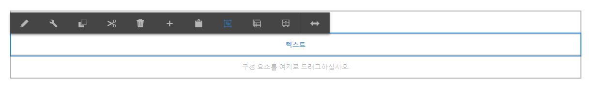
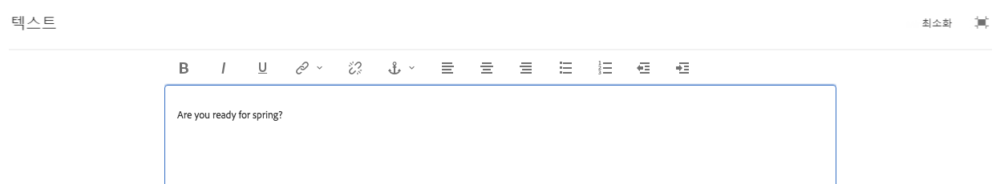
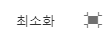

# 리치 텍스트 편집기를 사용하여 컨텐츠 {#using-the-rich-text-editor-to-author-content} 작성

리치 텍스트 편집기(RTE)는 AEM 페이지에서 텍스트를 작성하는 기본 빌딩 블록입니다. 텍스트, 텍스트 및 이미지, 테이블과 같은 많은 구성 요소는 RTE를 기반으로 합니다.

>[!NOTE]
>
>중첩된 목록을 RTE에 복사해도 예상대로 작동하지 않습니다. Microsoft Word에서 중첩된 목록을 복사할 때에는 RTE의 텍스트를 붙여 넣은 후에 목록을 수동으로 정리해야 합니다.

## 즉석 편집 {#in-place-editing}

탭/클릭하여 텍스트 기반 구성 요소를 선택하면 [구성 요소 도구 모음](../sites-authoring/editing-content.md#edit-configure-copy-cut-delete-paste)이 표시됩니다.

다시 탭/클릭하거나 처음에 구성 요소를 선택하고 느리게 두 번 탭/클릭하여 자체 도구 모음이 있는 즉석 편집 열기 여기에서 컨텐츠를 편집하고 기본적인 서식 변경을 수행할 수 있습니다.

이 도구 모음은 다음 옵션을 제공합니다.

* **형식**:굵게, 기울임체 및 밑줄 서식을 설정합니다.

* **목록**:글머리 기호 또는 번호 매기기 목록을 만들거나 들여쓰기를 설정합니다.

* **하이퍼링크**

* **연결 해제**

* **전체 화면**

* **닫기**

* **저장**

## 전체 화면 편집 {#full-screen-editing}

텍스트 기반 구성 요소의 경우 도구 모음에서 전체 화면 모드를 선택하면 리치 텍스트 편집기가 열리고 나머지 페이지 컨텐츠는 표시되지 않습니다.

전체 화면 모드에서는 관리자가 구성한 리치 텍스트 편집기의 모든 옵션이 표시됩니다. 이러한 인스턴스는 관리자 또는 AEM 개발자가 제공하는 구성](../sites-administering/rich-text-editor.md)에 따라 AEM 인스턴스 [에 따라 다를 수 있습니다. 옵션이 누락된 경우 관리자에게 이를 사용할 수 있도록 요청하십시오.

리치 텍스트 편집기 추가 옵션은 다음과 같습니다.

* **앵커**: 나중에 연결/참조할 수 있는 텍스트에 앵커를 생성합니다.
* **왼쪽으로 텍스트 정렬**
* **텍스트를 가운데로**
* **오른쪽으로 텍스트 정렬**

전체 화면 모드를 닫으려면 최소화 아이콘을 클릭합니다.

