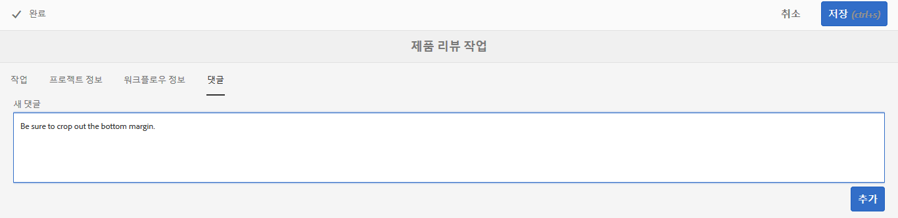

# 작업{#working-with-tasks}

>[!CAUTION]
>
>AEM 6.4가 확장 지원이 종료되었으며 이 설명서는 더 이상 업데이트되지 않습니다. 자세한 내용은 [기술 지원 기간](https://helpx.adobe.com/kr/support/programs/eol-matrix.html). 지원되는 버전 찾기 [여기](https://experienceleague.adobe.com/docs/).

작업은 콘텐츠에 수행할 작업 항목을 나타냅니다. 작업이 할당되면 할당된 작업은 Workflow 받은 편지함에 나타납니다. 작업 항목에는 유형 열의 작업 값이 있습니다.

작업은 워크플로 작업을 포함하여 현재 작업의 완료 수준을 판별하는 데에도 사용됩니다.

## 프로젝트 진행 상태 추적 {#tracking-project-progress}

프로젝트 진행 상황을 추적하려면 **작업** 타일. 프로젝트 진행 상태는 다음 방법으로 결정할 수 있습니다.

* **Task Tile:** An overall progress of the project is depicted in the Task Tile available on the project details page.

* **Task List:** When clicking the Task tile, a list of tasks is displayed. This list has detailed information about all the tasks related to the project.

두 목록에는 모두 **작업** 타일에서 직접 생성하는 작업뿐만 아니라 워크플로 작업도 표시합니다.

### 작업 타일 {#task-tile}

프로젝트에 관련 작업이 있으면 프로젝트 내에 작업 타일이 표시됩니다. 작업 타일은 프로젝트의 현재 상태를 보여 줍니다. 이 타일은 워크플로 내의 기존 작업을 기반으로 하며 이후에 워크플로가 진행될 때 생성되는 작업은 포함하지 않습니다. 작업 타일에는 다음 정보가 표시됩니다.

* 완료된 작업의 비율
* 활성 작업의 비율
* 지연된 작업의 비율

### 프로젝트에서 작업 보기 또는 수정 {#viewing-or-modifying-the-tasks-in-a-project}

진행 추적 외에 프로젝트에 대한 자세한 정보를 보거나 수정할 수도 있습니다.

#### 작업 목록 {#task-list}

프로젝트와 관련된 작업 목록을 표시하려면 작업 타일에서 줄임표(...)를 클릭하십시오. 작업은 상위 워크플로로 나눠집니다. 기한, 할당자, 우선 순위 및 상태와 같은 메타데이터와 함께 작업 세부 사항이 표시됩니다.

#### 작업 세부 정보 {#task-details}

특정 작업에 대한 자세한 내용은 작업 목록에서 작업을 탭/클릭하고 **작업 세부 사항** 엽니다.

### 작업 주석 보기 및 수정 {#viewing-and-modifying-task-comments}

작업 세부 정보에서 주석을 편집하거나 추가할 수 있습니다. 또한 프로젝트의 모든 주석이 [주석] 영역에 표시됩니다.

### 작업 추가 {#adding-tasks}

프로젝트에 새 작업을 추가할 수 있습니다. 그런 다음 이러한 작업이 작업 타일에 나타나고 알림 받은 편지함에서 사용할 수 있어 작업을 수행할 수 있습니다.

작업을 추가하려면 다음 작업을 수행하십시오.

1. In the project, in the **Tasks** tile, tap/click the + icon. The **Add Task** window opens.
1. 작업에 대한 정보를 입력합니다. 작업의 제목과 지정된 그룹은 필수입니다. 콘텐츠 경로, 설명, 작업 우선 순위 및 기한과 같은 추가 정보는 선택 사항입니다. 또한 **고급** 탭에서는 URL의 이름을 지정하는 데 사용되는 작업 이름을 입력합니다.

   

1. **만들기**&#x200B;를 탭/클릭합니다.

## 받은 편지함에서 작업 {#working-with-tasks-in-the-inbox}

작업에 액세스하는 또 다른 방법은 받은 편지함에서 가져오는 것입니다. 받은 편지함에서 콘텐츠를 열어 필요한 변경 사항을 구현할 수 있습니다. 작업이 완료되면 작업 상태를 [완료]로 설정합니다. 작업이 사용자가 속한 사용자 그룹에 할당되면 받은 편지함에도 표시됩니다. 이 경우 그룹의 모든 구성원이 작업을 수행하고 작업을 완료할 수 있습니다.

작업을 완료하려면 작업을 선택하고 **완료**. 작업에 정보를 추가한 다음 **완료**. 자세한 내용은 [받은 편지함](/help/sites-authoring/inbox.md) 추가 정보.

